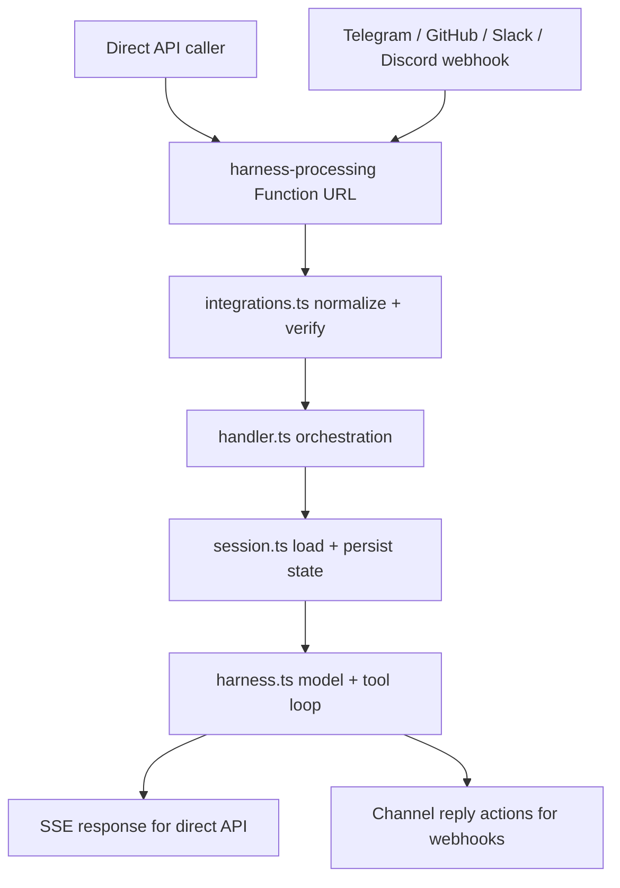
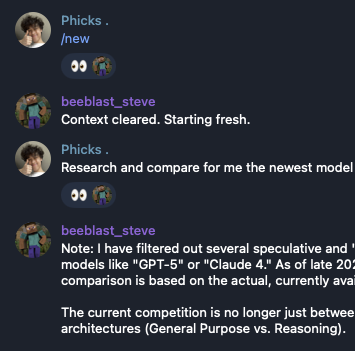
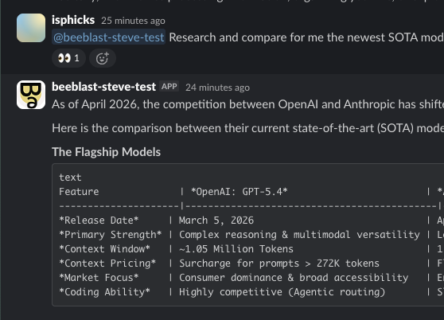

# filthy-panty

Experimental serverless AI chatbot and agent harness on AWS Lambda. The deployed path is one public Lambda Function URL that handles direct API traffic and optional Telegram, GitHub, Slack, and Discord webhooks.

The design goal is simple infrastructure for low-volume usage: Bun on Lambda, SST for infra, DynamoDB for conversation state and dedup, S3 for filesystem-backed tool state, and Vercel AI SDK for the agent loop.

## Architecture

One public Lambda is deployed:

- `harness-processing` runs in Lambda response streaming mode and is the only public entrypoint.



File ownership in the request path:

- [`functions/harness-processing/integrations.ts`](functions/harness-processing/integrations.ts): request normalization and channel routing
- [`functions/harness-processing/handler.ts`](functions/harness-processing/handler.ts): thin orchestration layer
- [`functions/harness-processing/session.ts`](functions/harness-processing/session.ts): conversation persistence and dedup support
- [`functions/harness-processing/harness.ts`](functions/harness-processing/harness.ts): model execution and inline tool calls
- [`functions/harness-processing/tools/index.ts`](functions/harness-processing/tools/index.ts): static tool registry so tool files are bundled
- [`functions/_shared/`](functions/_shared): code shared across channels or Lambdas

## Stack

- Runtime: Bun on Lambda `provided.al2023` with ARM64 binaries built by `scripts/build.ts`
- Infra: SST v4
- Model SDK: Vercel AI SDK `ai`
- Default provider setup: `@ai-sdk/google`
- Persistence: DynamoDB + S3
- Streaming: SSE for direct API callers only

## Examples

The bot can run both as a command-driven chat assistant and as a channel-native research bot.

Telegram example:
- `/new` clears the current conversation state and confirms the reset in-channel.
- A follow-up research request continues in the same chat thread with normal bot replies.



Discord example:
- An `@mention` can trigger a long-form research comparison reply.
- Tabular output is formatted to stay readable inside Discord's message UI.



## Quick Start

1. Install dependencies.

```bash
bun install
```

2. Copy local config.

```bash
cp .env.example .env
```

3. Keep `.env` for local SST config only. Use at least:

```bash
AWS_PROFILE=default
SST_STAGE=dev
```

Do not put deployed secrets in `.env`.

4. Set required SST secrets.

```bash
bunx sst secret set GoogleApiKey <value>
```

Optional:

```bash
bunx sst secret set TavilyApiKey <value>
```

If you want the public Function URL to accept direct API requests, also enable `ENABLE_DIRECT_API=true` and set:

```bash
bunx sst secret set DirectApiSecret <value>
```

Or bulk load:

```bash
cp secrets.env.example secrets.env
bunx sst secret load ./secrets.env
```

5. Run locally or deploy.

```bash
bun run dev
bun run check
bun run build
bun run deploy
```

## Direct API Request

The direct API is disabled by default. To use it, set `ENABLE_DIRECT_API=true`, configure `DirectApiSecret`, and send `Authorization: Bearer <DirectApiSecret>` with each request.

POST to the deployed `harness-processing` Function URL with Vercel AI SDK-style messages:

```json
{
  "eventId": "unique-id-for-dedup",
  "conversationKey": "conversation-identifier",
  "events": [
    {
      "role": "user",
      "content": [
        { "type": "text", "text": "Hello" }
      ]
    }
  ]
}
```

- `eventId` is used for deduplication.
- `conversationKey` selects the persisted direct conversation. The service stores direct API conversations under an internal `api:` namespace so they do not collide with webhook-backed threads.
- `events` may contain `user` messages and one-off `system` messages only.

Direct API callers can also inject `system` events:

```json
{
  "eventId": "unique-id-for-dedup",
  "conversationKey": "conversation-identifier",
  "events": [
    {
      "role": "system",
      "content": "The next answer should be terse.",
      "persist": false
    },
    {
      "role": "user",
      "content": [
        { "type": "text", "text": "What is the capital of France?" }
      ]
    }
  ]
}
```

`system` events are supported only on the direct API path and must use `persist: false`. The direct API rejects caller-supplied `assistant`, `tool`, and persisted `system` events.

## Configuration

`sst.config.ts` is the source of truth for infra names, tags, regions, secrets, and integration flags.

Use `.env` for local SST inputs and non-secret toggles:

- `AWS_PROFILE`
- `SST_STAGE`
- `ENABLE_DIRECT_API`
- `ENABLE_TELEGRAM_INTEGRATION`
- `ENABLE_GITHUB_INTEGRATION`
- `ENABLE_SLACK_INTEGRATION`
- `ENABLE_DISCORD_INTEGRATION`
- `GITHUB_ALLOWED_REPOS`
- `SLACK_ALLOWED_CHANNEL_IDS`
- `DISCORD_ALLOWED_GUILD_IDS`
- `DISCORD_APPLICATION_ID`
- `DISCORD_SYNC_GUILD_ID`

Use SST secrets for runtime secrets and tokens. See [`secrets.env.example`](secrets.env.example).

Important repo conventions:

- Stage is `dev` for non-production work. Do not invent a `phicks` stage.
- Extra channel integrations are opt-in.
- GitHub, Slack, and Discord allow-lists must be explicitly configured outside `dev` when those integrations are enabled.
- The system prompt is bundled at build time by `scripts/system-prompt.ts`.

If Discord is enabled, sync slash commands with:

```bash
bun run discord:sync
```

## Extension Points

Add a tool:

- Create `functions/harness-processing/tools/<name>.tool.ts`
- Export a default tool factory
- Put the tool logic inside `execute`
- Register the factory in [`functions/harness-processing/tools/index.ts`](functions/harness-processing/tools/index.ts)

Add a channel:

- Implement `ChannelAdapter` in `functions/_shared/<channel>-channel.ts`
- Wire normalization and routing into [`functions/harness-processing/integrations.ts`](functions/harness-processing/integrations.ts)
- Keep reply formatting and send logic inside that channel module

Add a command:

- Add a new entry to the `commands` array in [`functions/_shared/commands.ts`](functions/_shared/commands.ts)
- Use the channel-agnostic `ChannelActions` interface from shared code

## Deploy and CI

- `bun run deploy` runs `bun run build` first, then `sst deploy`
- GitHub Actions runs deploys automatically on push and pull request
- Use `gh run list` and `gh run view` to inspect pipeline status
