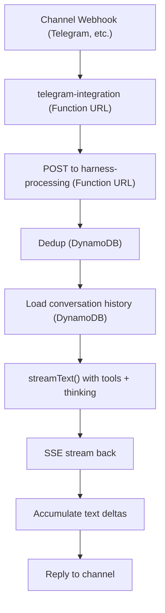

# filthy-panty

Experimental serverless AI agent orchestrator using AWS Lambda as the core runtime layer. Inspired by Anthropic and Pnzu server architectures but stripped down for small team deployment.

It has some quirks, but the goal is cost-optimized (maybe free when usage under free-tier limits) for low usage rather than burning through VPS bills.

## Architecture

Two Lambda functions behind Function URLs, deployed with SST:

- **telegram-integration** — Receives channel webhooks (currently Telegram), parses messages, dispatches commands, and calls the harness for AI processing. Drains the SSE stream and sends the final reply back to the channel.
- **harness-processing** — Streaming Function URL (`RESPONSE_STREAM` invoke mode). Runs the agentic loop: deduplication, DynamoDB conversation history, Vercel AI SDK `streamText` with Google AI (Gemini), tool calling, Google Search grounding, and extended thinking. Emits SSE events back to the caller.



## Request Format

POST to the harness-processing Function URL:

```json
{
  "eventId": "unique-id-for-dedup",
  "conversationKey": "conversation-identifier",
  "content": [
    { "type": "text", "text": "Hello" }
  ]
}
```

`content` follows the Vercel AI SDK `UserContent` type — accepts a plain string or an array of content parts (`text`, `image`, `file`) for multimodal input.

`eventId` prevents duplicate processing (e.g., webhook retries). `conversationKey` identifies which DynamoDB conversation to load/persist.

## Stack

- **Runtime:** Bun on Lambda `provided.al2023` (ARM64)
- **AI:** Vercel AI SDK v6 — any provider supported by the SDK works. Demo uses Gemma 4 31B IT via `@ai-sdk/google` (free tier)
- **Infra:** SST v4 for IaC, AWS serverless stack DynamoDB, Lambda, S3, all covered through free-tier.
- **Streaming:** Lambda Function URL response streaming with SSE

## Development

```bash
bun install
bun run dev        # SST dev mode
bun run build      # Compile all functions to ARM64 binaries
bun run deploy     # Build + deploy
bun run check      # Type-check
```

## Adding Things

- **New tool:** Create `functions/harness-processing/tools/<name>.tool.ts`, export a default tool factory that returns one or more AI SDK tools with their logic in `execute`, then import that factory in `functions/harness-processing/tools/index.ts`.
- **New channel:** Implement `ChannelAdapter` in `functions/_shared/<channel>-channel.ts` and register it in the `channels` array in `functions/telegram-integration/handler.ts`.
- **New command:** Add entry to `commands` array in `functions/_shared/commands.ts`.
