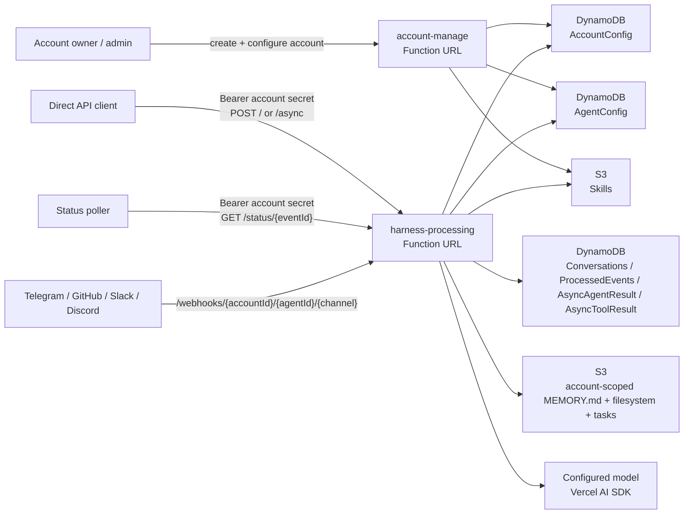

# filthy-panty

Current testing and demo URL:

- [harness processing endpoint](https://redactedharnessurlid.lambda-url.eu-central-1.on.aws/)
- [account management endpoint](https://redactedaccounturlid.lambda-url.eu-central-1.on.aws/)

Experimental serverless multi-account AI chatbot and agent harness on AWS Lambda.

The deployed architecture uses two public Lambda Function URLs:

- `account-manage`: creates accounts, rotates account API secrets, manages account-owned agents and skills, and deletes account-scoped runtime data when an account is deleted.
- `harness-processing`: handles account-authenticated direct API traffic, async work, status polling, and account-scoped Telegram, GitHub, Slack, and Discord webhooks.

The design goal is simple infrastructure for low-volume multi-tenant usage: Bun on Lambda, SST for infra, DynamoDB for account/agent/conversation/status state, S3 for workspace-backed memory/files/tasks and skill bundles, and the Vercel AI SDK for the agent loop. Agents can optionally dispatch subagents that run parallel one-shot tasks and inject results back into the parent conversation.

## Overview

- Runtime: Bun on Lambda `provided.al2023` with ARM64 binaries built by [`scripts/build.ts`](scripts/build.ts).
- Infra: SST v4.
- Model SDK: Vercel AI SDK `ai` with agent-configured Google, OpenAI, Bedrock, and Gateway providers.
- Persistence: DynamoDB + S3.
- Streaming: SSE for sync direct API callers only.
- Agent config: stored in DynamoDB with encrypted config payloads; account API secrets are hashed.
- Public entrypoints: `account-manage` and `harness-processing` Lambda Function URLs.

## Docs

- Core
  - [Getting Started](docs/getting-started.md)
  - [Architecture and Workflow](docs/architecture.md)
  - [Data Security](docs/data-security.md)
- Features
  - [Workspace](docs/workspace/index.md)
  - [Memory and Session](docs/workspace/memory-and-session.md)
  - [Tasks](docs/workspace/tasks.md)
  - [Storage](docs/workspace/storage.md)
  - [Sandbox](docs/workspace/sandbox/index.md)
  - [Lifecycle Webhook](docs/webhook.md)
  - [External Tool](docs/tools.md)
  - [Skills](docs/skills.md)
  - [Channels](docs/channels.md)
  - [Subagent](docs/sub-agents.md)
- Development
  - [Extending](docs/extending.md)
  - [Deployment](docs/deployment.md)
  - [CI/CD](docs/ci-cd.md)
- API Reference
  - [Overview](docs/api-reference.md)
  - [Direct API](docs/direct-api.md)
  - [Account Management](docs/account-management.md)

## Quick Start

See the [Getting Started guide](docs/getting-started.md) for a full walkthrough.
