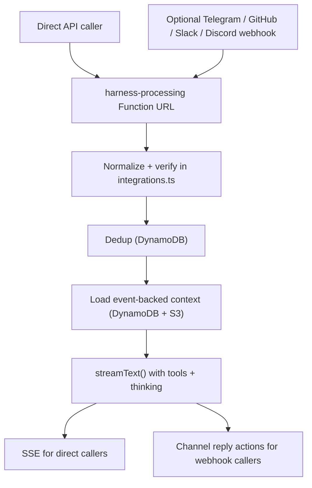

# filthy-panty

Experimental serverless AI agent orchestrator using AWS Lambda as the core runtime layer. Inspired by Anthropic and Pnzu server architectures but stripped down for small team deployment.

It has some quirks, but the goal is cost-optimized (maybe free when usage under free-tier limits) for low usage rather than burning through VPS bills.

## Architecture

One public Lambda Function URL, deployed with SST:

- **harness-processing** — Streaming Function URL (`RESPONSE_STREAM` invoke mode). Accepts direct API calls by default and supported channel webhooks when enabled, verifies and normalizes inbound requests in `functions/harness-processing/integrations.ts`, deduplicates events, loads event-backed conversation context from DynamoDB, runs the Vercel AI SDK `streamText` loop, and emits SSE only for direct API callers.



## Request Format

POST to the harness-processing Function URL with:

```json
{
  "eventId": "unique-id-for-dedup",
  "conversationKey": "conversation-identifier",
  "events": [
    {
      "role": "user",
      "content": [
        { "type": "text", "text": "Hello" }
      ]
    }
  ]
}
```

`events` is a list of Vercel AI SDK model messages. `eventId` prevents duplicate processing (e.g., webhook retries). `conversationKey` identifies which DynamoDB conversation to load/persist.

Direct API callers can send system-role injections too:

```json
{
  "eventId": "unique-id-for-dedup",
  "conversationKey": "conversation-identifier",
  "events": [
    {
      "role": "system",
      "content": "The next answer should be terse.",
      "persist": false
    },
    {
      "role": "user",
      "content": [
        { "type": "text", "text": "What is the capital of France?" }
      ]
    }
  ]
}
```

System-role events are supported only on the direct API path. Set `persist` to `false` for per-request injected context or `true` to store it in the DynamoDB event log for future turns.

## Stack

- **Runtime:** Bun on Lambda `provided.al2023` (ARM64)
- **AI:** Vercel AI SDK v6 — any provider supported by the SDK works. Demo uses Gemma 4 31B IT via `@ai-sdk/google` (free tier)
- **Infra:** SST v4 for IaC, AWS serverless stack DynamoDB, Lambda, S3, all covered through free-tier.
- **Streaming:** Lambda Function URL response streaming with SSE

## Development

```bash
bun install
bun run dev        # SST dev mode
bun run build      # Compile all functions to ARM64 binaries
bun run deploy     # Build + deploy
bun run check      # Type-check
bun run discord:sync  # Sync Discord slash commands
```

## Configuration

Most runtime environment variables in this project are injected by SST in `sst.config.ts`, not read from a root `.env` file at runtime.

### Injected By SST

The `harness-processing` Lambda gets these values from the `environment` block in `sst.config.ts`:

- `GOOGLE_API_KEY`
- `GOOGLE_MODEL_ID`
- `CONVERSATIONS_TABLE_NAME`
- `PROCESSED_EVENTS_TABLE_NAME`
- `SLIDING_CONTEXT_WINDOW`
- `MAX_AGENT_ITERATIONS`
- `TELEGRAM_BOT_TOKEN` when `ENABLE_TELEGRAM_INTEGRATION=true`
- `TELEGRAM_WEBHOOK_SECRET` when `ENABLE_TELEGRAM_INTEGRATION=true`
- `ALLOWED_CHAT_IDS` when `ENABLE_TELEGRAM_INTEGRATION=true`
- `TELEGRAM_REACTION_EMOJI` when `ENABLE_TELEGRAM_INTEGRATION=true`
- `GITHUB_WEBHOOK_SECRET` when `ENABLE_GITHUB_INTEGRATION=true`
- `GITHUB_APP_ID` when `ENABLE_GITHUB_INTEGRATION=true`
- `GITHUB_PRIVATE_KEY` when `ENABLE_GITHUB_INTEGRATION=true`
- `GITHUB_ALLOWED_REPOS` when `ENABLE_GITHUB_INTEGRATION=true`
- `SLACK_BOT_TOKEN` when `ENABLE_SLACK_INTEGRATION=true`
- `SLACK_SIGNING_SECRET` when `ENABLE_SLACK_INTEGRATION=true`
- `SLACK_ALLOWED_CHANNEL_IDS` when `ENABLE_SLACK_INTEGRATION=true`
- `DISCORD_BOT_TOKEN` when `ENABLE_DISCORD_INTEGRATION=true`
- `DISCORD_PUBLIC_KEY` when `ENABLE_DISCORD_INTEGRATION=true`
- `DISCORD_ALLOWED_GUILD_IDS` when `ENABLE_DISCORD_INTEGRATION=true`
- `TAVILY_API_KEY`
- `FILESYSTEM_BUCKET_NAME`

In addition, `AWS_REGION` is provided by the Lambda runtime in AWS. The repo currently deploys to `eu-central-1` in `sst.config.ts`.

The system prompt is bundled from `SYSTEM.md` at build time and is not injected as a Lambda environment variable.

### What Goes In `.env`

For normal SST usage, keep `.env` limited to local CLI settings such as:

- `AWS_PROFILE`
- `SST_STAGE`
- `ENABLE_TELEGRAM_INTEGRATION`
- `ENABLE_GITHUB_INTEGRATION`
- `ENABLE_SLACK_INTEGRATION`
- `ENABLE_DISCORD_INTEGRATION`
- `GITHUB_ALLOWED_REPOS`
- `SLACK_ALLOWED_CHANNEL_IDS`
- `DISCORD_ALLOWED_GUILD_IDS`
- `DISCORD_APPLICATION_ID`
- `DISCORD_SYNC_GUILD_ID` for immediate guild-scoped Discord command updates in development

Use `.env.example` as the template for that local file.

Do not put deployed API keys, webhook secrets, or bot tokens in `.env`.

### Set SST Secrets

This repo defines these SST secrets in `sst.config.ts`:

- `GoogleApiKey`
- `TavilyApiKey`
- `TelegramBotToken` when `ENABLE_TELEGRAM_INTEGRATION=true`
- `TelegramWebhookSecret` when `ENABLE_TELEGRAM_INTEGRATION=true`
- `AllowedChatIds` when `ENABLE_TELEGRAM_INTEGRATION=true`
- `GitHubWebhookSecret`
- `GitHubAppId`
- `GitHubPrivateKey`
- `SlackBotToken`
- `SlackSigningSecret`
- `DiscordBotToken`
- `DiscordPublicKey`

Set them one by one with the SST CLI:

```bash
bunx sst secret set GoogleApiKey <value>
bunx sst secret set TavilyApiKey <value>
bunx sst secret set GitHubWebhookSecret <value>
bunx sst secret set GitHubAppId <value>
bunx sst secret set GitHubPrivateKey < private-key.pem
bunx sst secret set SlackBotToken <value>
bunx sst secret set SlackSigningSecret <value>
bunx sst secret set DiscordBotToken <value>
bunx sst secret set DiscordPublicKey <value>
```

When Telegram is enabled, also set:

```bash
bunx sst secret set TelegramBotToken <value>
bunx sst secret set TelegramWebhookSecret <value>
bunx sst secret set AllowedChatIds <comma-separated-chat-ids>
```

SST secrets are stage-specific. If you are not running `sst dev`, run `sst deploy` after setting them so the deployed app picks up the new values.

### Integration Flags And Allow Lists

The extra integrations are opt-in in `sst.config.ts`. Set these in your local `.env` before `sst dev` or `sst deploy`:

- `ENABLE_GITHUB_INTEGRATION=true`
- `ENABLE_SLACK_INTEGRATION=true`
- `ENABLE_DISCORD_INTEGRATION=true`
- `ENABLE_TELEGRAM_INTEGRATION=true`

Optional allow lists are read from the SST config environment and default to `open`:

- `GITHUB_ALLOWED_REPOS`
- `SLACK_ALLOWED_CHANNEL_IDS`
- `DISCORD_ALLOWED_GUILD_IDS`

### Discord Slash Commands

Discord slash commands stay on the existing Interactions Endpoint URL path handled by `harness-processing`.

For setup:

1. Enable Discord integration in `.env` with `ENABLE_DISCORD_INTEGRATION=true`.
2. Add `DISCORD_APPLICATION_ID` to `.env`.
3. Optional for development: set `DISCORD_SYNC_GUILD_ID` to sync commands to a specific guild for immediate updates.
4. Deploy the app with `bun run deploy`.
5. In the Discord Developer Portal, point the Interactions Endpoint URL at the deployed `harnessProcessingUrl`.
6. Run `bun run discord:sync` to register the slash commands.

The sync script registers `/help`, `/new`, and `/ask`. Commands are registered for guild and bot-DM contexts with guild install as the default installation context. When `DISCORD_SYNC_GUILD_ID` is set, the sync targets that guild; otherwise it overwrites global commands. The script reads `DISCORD_APPLICATION_ID` and `DISCORD_SYNC_GUILD_ID` from local `.env`, and uses `DISCORD_BOT_TOKEN` from the current shell or the local SST secret store.

### Bulk Load Secrets

If you prefer a dotenv-style file for secrets, copy `secrets.env.example` to `secrets.env`, fill in your values, and load them with:

```bash
bunx sst secret load ./secrets.env
```

The SST CLI supports loading a dotenv-formatted file this way.

### GitHub Actions Deploy Config

The deploy workflow reads GitHub repository variables for non-secret config:

- `AWS_REGION`
- `AWS_ROLE_ARN`
- `SST_STAGE`
- `ENABLE_TELEGRAM_INTEGRATION`
- `ENABLE_GITHUB_INTEGRATION`
- `ENABLE_SLACK_INTEGRATION`
- `ENABLE_DISCORD_INTEGRATION`
- `GITHUB_ALLOWED_REPOS`
- `SLACK_ALLOWED_CHANNEL_IDS`
- `DISCORD_ALLOWED_GUILD_IDS`
- `DISCORD_APPLICATION_ID` when `ENABLE_DISCORD_INTEGRATION=true`
- `DISCORD_SYNC_GUILD_ID` optional for immediate guild-scoped Discord command updates

It reads GitHub repository secrets for SST secret values, using the `SST_SECRET_` prefix expected by SST in CI:

- `SST_SECRET_GoogleApiKey`
- `SST_SECRET_TavilyApiKey`
- `SST_SECRET_TelegramBotToken` only when `ENABLE_TELEGRAM_INTEGRATION=true`
- `SST_SECRET_TelegramWebhookSecret` only when `ENABLE_TELEGRAM_INTEGRATION=true`
- `SST_SECRET_AllowedChatIds` only when `ENABLE_TELEGRAM_INTEGRATION=true`
- `SST_SECRET_GitHubWebhookSecret` only when `ENABLE_GITHUB_INTEGRATION=true`
- `SST_SECRET_GitHubAppId` only when `ENABLE_GITHUB_INTEGRATION=true`
- `SST_SECRET_GitHubPrivateKey` only when `ENABLE_GITHUB_INTEGRATION=true`
- `SST_SECRET_SlackBotToken` only when `ENABLE_SLACK_INTEGRATION=true`
- `SST_SECRET_SlackSigningSecret` only when `ENABLE_SLACK_INTEGRATION=true`
- `SST_SECRET_DiscordBotToken` only when `ENABLE_DISCORD_INTEGRATION=true`
- `SST_SECRET_DiscordPublicKey` only when `ENABLE_DISCORD_INTEGRATION=true`

If `ENABLE_DISCORD_INTEGRATION=true`, the deploy workflow also runs `bun run discord:sync` after `sst deploy`. Set `DISCORD_APPLICATION_ID` as a repository variable, and optionally set `DISCORD_SYNC_GUILD_ID` when you want the workflow to overwrite guild-scoped commands instead of global commands.

If `ENABLE_TELEGRAM_INTEGRATION=false`, the deploy workflow skips Telegram webhook sync and no Telegram GitHub secrets are required.

## Adding Things

- **New tool:** Create `functions/harness-processing/tools/<name>.tool.ts`, export a default tool factory that returns one or more AI SDK tools with their logic in `execute`, then import that factory in `functions/harness-processing/tools/index.ts`.
- **New channel:** Implement `ChannelAdapter` in `functions/_shared/<channel>-channel.ts` and wire it into `functions/harness-processing/integrations.ts`.
- **New command:** Add entry to `commands` array in `functions/_shared/commands.ts`.
