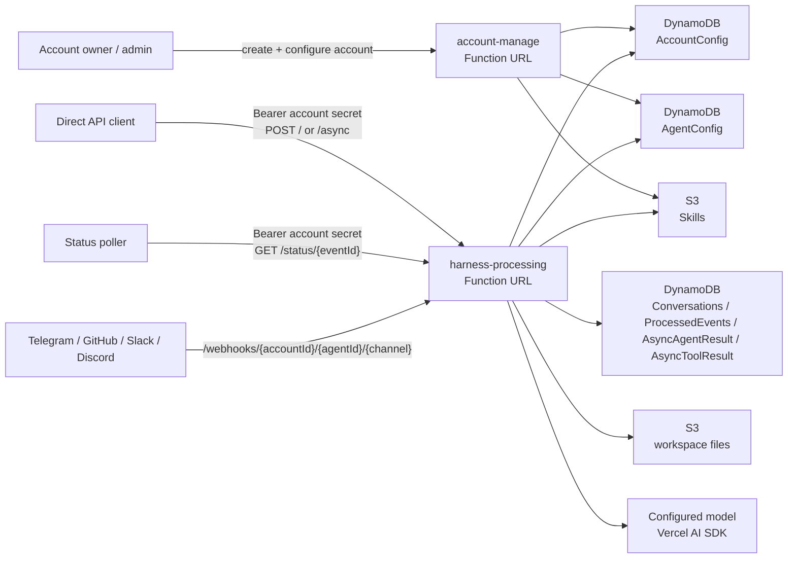

# filthy-panty

[](LICENSE.md)
[](https://bun.sh/)
[](https://sst.dev/)
[](https://sdk.vercel.ai/)
[](#contributing)

> An open, experimental serverless multi-account AI chatbot and agent harness on AWS Lambda — now a Bun-workspaces monorepo that also hosts the dashboard, the shared Convex backend, the docs site, the CLI/SDK, and demos.

`filthy-panty` is the reference implementation behind [BeeBlast](https://github.com/beeblastco) — a low-overhead, multi-tenant agent platform designed to let small teams ship production-grade AI agents without standing up Kubernetes, queues, or bespoke streaming infrastructure. The core app runs on Bun + AWS Lambda, persists state in DynamoDB and S3, and streams responses via SSE through Lambda Function URLs.

If you want to self-host a multi-agent backend, integrate AI into Telegram/Discord/Slack/GitHub, or learn how to build an agent harness on top of the Vercel AI SDK — this repo is for you.

---

## Features

- **Serverless by default** — two Lambda Function URLs, no API Gateway, no always-on containers.
- **Multi-tenant accounts** — each account has its own encrypted config, hashed API secret, and isolated runtime data.
- **Bring-your-own model** — Google, OpenAI, Bedrock, Vercel AI Gateway, and custom providers configured per account.
- **Multi-channel integrations** — Telegram, Discord, Slack, GitHub, Facebook Messenger (Pancake), and Zalo out of the box.
- **Workspaces & sandboxes** — S3-backed workspace files plus pluggable execution sandboxes (Lambda, E2B, Daytona, Kubernetes, Vercel).
- **Skills system** — account-scoped instruction bundles loaded on demand during a turn.
- **Subagents** — dispatch parallel one-shot child agents and inject their results back into the parent conversation.
- **Streaming-first** — SSE for sync direct API callers and a NATS JetStream path for WebSocket gateways.
- **Async + cron** — long-running requests, status polling, and EventBridge-scheduled jobs.

---

## Architecture

The deployed system exposes two public Lambda Function URLs (plus a testing-only `mock-webhook-subscribe` URL):

- `account-manage` — account creation, secret rotation, and CRUD for account-owned agents, skills, sandboxes, and workspaces.
- `harness-processing` — streams agent responses, runs the model/tool loop, and serves account-scoped channel webhooks.



For the full architecture deep-dive — including account routing, the harness loop, subagent dispatch, and the NATS streaming gateway — see [`apps/docs/docs/architecture.md`](apps/docs/docs/architecture.md).

---

## Tech Stack

| Layer | Choice |
| --- | --- |
| Runtime | Bun on Lambda `provided.al2023` (ARM64 binaries) |
| Infra-as-code | [SST v4](https://sst.dev/) on Pulumi |
| Model SDK | [Vercel AI SDK](https://sdk.vercel.ai/) (`ai` package) |
| Providers | Google, OpenAI, Bedrock, Vercel AI Gateway, custom |
| Persistence | DynamoDB (config + conversations; the production stage stores config domains in Convex) + S3 (files + skills) |
| Streaming | SSE via Lambda Function URL (`RESPONSE_STREAM` invoke mode); NATS JetStream for WebSocket fan-out |
| Docs | Docusaurus |

---

## Quick Start

### Prerequisites

- [Bun](https://bun.sh/) `>= 1.3`
- An AWS account with credentials configured (`AWS_PROFILE`)
- [SST](https://sst.dev/) — installed automatically via `bun install`

### 1. Clone & install

```bash
git clone https://github.com/beeblastco/filthy-panty.git
cd filthy-panty
bun install
cp apps/core/.env.example apps/core/.env
```

### 2. Set SST secrets

```bash
cd apps/core
bunx sst secret set AdminAccountSecret <long-random-value>
bunx sst secret set AccountConfigEncryptionSecret <long-random-value>
```

### 3. Deploy

```bash
bun run deploy   # from the repo root (fans out to apps/core)
```

Note the two Function URLs from the deploy output (`accountServiceUrl`, `agentServiceUrl`), then follow [`apps/docs/docs/getting-started.md`](apps/docs/docs/getting-started.md) to create your first account and agent.

### Run the demos

The [`demos/`](demos/) directory has runnable scripts for every major feature — streaming, async, tool approval, subagents, skills, sandboxes, multi-workspace setups, and more. Each script creates a temporary account, runs a smoke test, and cleans up. They consume the [`filthy-panty` SDK package](packages/filthy-panty/).

```bash
bun demos/stream.ts        # SSE with tools
bun demos/async.ts         # Async with polling
bun demos/subagent.ts      # Subagent dispatch
bun demos/skills.ts        # Skill CRUD
```

---

## Documentation

Full documentation lives in [`apps/docs/docs/`](apps/docs/docs/) and is published via Docusaurus.

- **Core** — [Getting Started](apps/docs/docs/getting-started.md) · [Architecture](apps/docs/docs/architecture.md) · [Data Security](apps/docs/docs/data-security.md)
- **Features** — [Workspace](apps/docs/docs/workspace/index.md) · [Sandbox](apps/docs/docs/workspace/sandbox/index.md) · [Skills](apps/docs/docs/skills.md) · [Tools](apps/docs/docs/tools.md) · [Channels](apps/docs/docs/channels/index.md) · [Subagents](apps/docs/docs/sub-agents.md) · [Webhooks](apps/docs/docs/webhook.md) · [Cron Jobs](apps/docs/docs/cron-jobs.md)
- **Development** — [Extending](apps/docs/docs/extending.md) · [Deployment](apps/docs/docs/deployment.md) · [CI/CD](apps/docs/docs/ci-cd.md)
- **API Reference** — [OpenAPI spec](apps/docs/docs/api-reference/openapi.yaml) (served interactively on the docs site)

Preview the docs locally:

```bash
bun run docs
```

---

## Project Layout

```text
apps/
  core/                   # SST app — the serverless agent harness
    functions/
      account-manage/     # Account + agent + skill CRUD Lambda
      harness-processing/ # Streaming agent loop + channel webhooks Lambda
        tools/            # Built-in tools (googleSearch, tavily, etc.)
        integrations.ts   # Request normalization + channel routing
        harness.ts        # Model/tool execution loop
        session.ts        # Conversation state + prompt assembly
      _shared/            # Code shared between Lambdas (runtime, channels, accounts)
    scripts/              # Build, deploy, and operational scripts
    tests/                # Unit tests for the core app
    sst.config.ts         # Single source of truth for infra
  dashboard/              # Next.js dashboard (BeeBlast SaaS frontend)
  docs/                   # Docusaurus documentation site
packages/
  convex/                 # Shared Convex backend (schema + functions, deployed with the dashboard)
  filthy-panty/           # CLI + TypeScript SDK package
demos/                    # Runnable demo scripts using the SDK
```

A more detailed map (with the routing contract between each module) lives in [`AGENTS.md`](AGENTS.md).

---

## Contributing

Contributions are very welcome! Whether you want to fix a bug, add a new channel, build a new tool, or improve the docs — open an issue first so we can align on the approach, then send a PR.

### Development workflow

```bash
bun install              # install all workspaces (root only)
bun run check            # typecheck core, convex, SDK, and demos
bun run test             # core unit tests (max-concurrency 1)
bun run build            # build all Lambda binaries
```

CI runs `check`, `test`, and `build` on every PR via [`.github/workflows/ci.yaml`](.github/workflows/ci.yaml). Pushes to `dev` deploy the `dev` stage and pushes to `main` deploy the `production` stage; PR branches never deploy.

### Conventions

- Bun + TypeScript, ESM, no transpile step. Bun workspaces with the isolated linker — declare every dependency a package imports.
- File header comments use a block-docstring style — see [`AGENTS.md`](AGENTS.md) for the full style guide.
- Channel-specific logic belongs in `apps/core/functions/_shared/<channel>-channel.ts`; commands belong in `apps/core/functions/_shared/commands.ts`.
- Shared code only goes in `functions/_shared/` when it's actually shared between Lambdas.
- Don't deploy to anyone else's stage — `dev` is the default.

### Reporting issues

- **Bugs / feature requests** — open a [GitHub issue](https://github.com/beeblastco/filthy-panty/issues).
- **Security vulnerabilities** — please email the maintainers privately rather than filing a public issue.

---

## Roadmap

Active plans live under [`apps/docs/docs/plans/`](apps/docs/docs/plans/). Recent and upcoming work includes:

- BeeBlast CLI and TypeScript SDK
- Expanded provider matrix (more first-class AI Gateway recipes)

Contributions to any of these are very welcome.

---

## Community

- [GitHub Discussions](https://github.com/beeblastco/filthy-panty/discussions) — questions, ideas, show-and-tell
- [Discord](https://discord.gg/beeblast) — chat with maintainers and other contributors
- [Issues](https://github.com/beeblastco/filthy-panty/issues) — bugs and feature requests

---

## License

[MIT](LICENSE.md) © beeblastco

This project is free for both personal and commercial use. If you build something cool on top of it, we'd love to hear about it.
