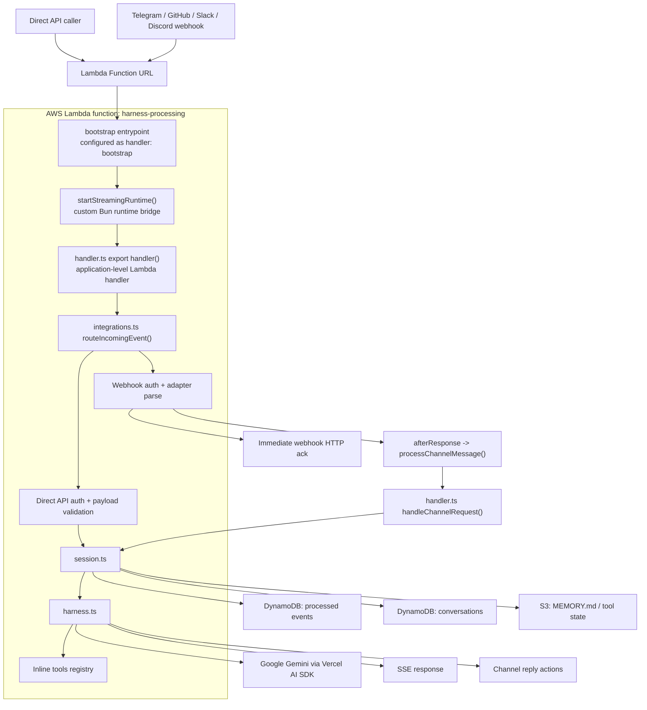

# filthy-panty

Experimental serverless AI chatbot and agent harness on AWS Lambda. The deployed path is one public Lambda Function URL that handles direct API traffic and optional Telegram, GitHub, Slack, and Discord webhooks.

The design goal is simple infrastructure for low-volume usage: Bun on Lambda, SST for infra, DynamoDB for conversation state and dedup, S3 for filesystem-backed tool state, and Vercel AI SDK for the agent loop.

## Architecture

One public Lambda is deployed:

- `harness-processing` runs in Lambda response streaming mode and is the only public entrypoint.



Request path ownership:

- [`functions/harness-processing/bootstrap.ts`](functions/harness-processing/bootstrap.ts): minimal Bun runtime entrypoint
- [`functions/_shared/runtime.ts`](functions/_shared/runtime.ts): custom Lambda Runtime API bridge with response streaming
- [`functions/harness-processing/integrations.ts`](functions/harness-processing/integrations.ts): request normalization, channel detection, auth checks, and direct API parsing
- [`functions/harness-processing/handler.ts`](functions/harness-processing/handler.ts): thin orchestration for SSE, commands, leases, and reply flow
- [`functions/harness-processing/session.ts`](functions/harness-processing/session.ts): event deduplication, conversation persistence, prompt context, and memory loading
- [`functions/harness-processing/harness.ts`](functions/harness-processing/harness.ts): model execution loop and inline tool orchestration
- [`functions/harness-processing/tools/index.ts`](functions/harness-processing/tools/index.ts): static tool registry so tool files are bundled
- [`functions/_shared/`](functions/_shared/): shared channel adapters, auth helpers, logging, env, and runtime code

### Handler boundary

- AWS invokes `bootstrap`, not `handler.ts`, because SST config sets `handler: "bootstrap"` in [`sst.config.ts`](sst.config.ts).
- [`bootstrap.ts`](functions/harness-processing/bootstrap.ts) starts [`startStreamingRuntime()`](functions/_shared/runtime.ts), which then calls the exported [`handler()`](functions/harness-processing/handler.ts).

### Storage and runtime boundaries

- `Conversations` DynamoDB table stores normalized model messages by `conversationKey`.
- `ProcessedEvents` DynamoDB table stores dedup markers and short-lived conversation lease records.
- The S3 filesystem bucket stores `MEMORY.md` and filesystem-backed tool state under per-conversation namespaces.
- Tool execution is inline in `harness-processing`; there is no secondary worker Lambda or queue-based tool runner in the deployed path.
- The direct API and webhook traffic share the same Lambda, but use separate `conversationKey` prefixes and routing/auth paths.

## Stack

- Runtime: Bun on Lambda `provided.al2023` with ARM64 binaries built by `scripts/build.ts`
- Infra: SST v4
- Model SDK: Vercel AI SDK `ai`
- Default provider setup: `@ai-sdk/google`
- Persistence: DynamoDB + S3
- Streaming: SSE for direct API callers only

## Security Controls

Ingress and state isolation are enforced in code instead of by separate edge services:

- [`functions/harness-processing/integrations.ts`](functions/harness-processing/integrations.ts) disables the direct API unless `ENABLE_DIRECT_API=true`, requires `Authorization: Bearer <DirectApiSecret>`, reserves internal/channel key prefixes, and only accepts `user` plus non-persisted `system` direct events.
- [`functions/_shared/telegram-channel.ts`](functions/_shared/telegram-channel.ts) and [`functions/_shared/telegram.ts`](functions/_shared/telegram.ts) verify the Telegram webhook secret and enforce `ALLOWED_CHAT_IDS`.
- [`functions/_shared/github-channel.ts`](functions/_shared/github-channel.ts) verifies `x-hub-signature-256` and optionally restricts ingress with `GITHUB_ALLOWED_REPOS`.
- [`functions/_shared/slack-channel.ts`](functions/_shared/slack-channel.ts) verifies the Slack HMAC signature, rejects requests outside a 5-minute replay window, and optionally restricts ingress with `SLACK_ALLOWED_CHANNEL_IDS`.
- [`functions/_shared/discord-channel.ts`](functions/_shared/discord-channel.ts) and [`functions/_shared/discord-signature.ts`](functions/_shared/discord-signature.ts) verify Discord Ed25519 signatures, reject stale signed requests outside a 5-minute replay window, deny Discord DMs, and optionally restrict guild ingress with `DISCORD_ALLOWED_GUILD_IDS`.
- [`functions/harness-processing/session.ts`](functions/harness-processing/session.ts) uses DynamoDB conditional writes for idempotent event claims and short-lived conversation leases so concurrent webhook deliveries do not execute the same turn twice.
- [`functions/harness-processing/filesystem-namespace.ts`](functions/harness-processing/filesystem-namespace.ts) derives collision-resistant hashed filesystem namespaces and lease keys from the full conversation key.

## Examples

The bot can run both as a command-driven chat assistant and as a channel-native research bot.

## Quick Start

### 1. Install dependencies

```bash
bun install
```

### 2. Copy local config

```bash
cp .env.example .env
```

### 3. Keep `.env` for local SST config only. Use at least these values

```bash
AWS_PROFILE=default
SST_STAGE=dev
```

Do not put deployed secrets in `.env`.

### 4. Set required SST secrets

```bash
bunx sst secret set GoogleApiKey <value>
```

Optional:

```bash
bunx sst secret set TavilyApiKey <value>
```

If you want the public Function URL to accept direct API requests, also enable `ENABLE_DIRECT_API=true` and set:

```bash
bunx sst secret set DirectApiSecret <value>
```

Or bulk load:

```bash
cp secrets.env.example secrets.env
bunx sst secret load ./secrets.env
```

### 5. Run locally or deploy

```bash
bun run dev
bun run check
bun run build
bun run deploy
```

## Direct API Request

The direct API is disabled by default. To use it, set `ENABLE_DIRECT_API=true`, configure `DirectApiSecret`, and send `Authorization: Bearer <DirectApiSecret>` with each request.

POST to the deployed `harness-processing` Function URL with Vercel AI SDK-style messages:

```json
{
  "eventId": "unique-id-for-dedup",
  "conversationKey": "conversation-identifier",
  "events": [
    {
      "role": "user",
      "content": [
        { "type": "text", "text": "Hello" }
      ]
    }
  ]
}
```

- `eventId` is used for deduplication.
- `conversationKey` selects the persisted direct conversation. The service stores direct API conversations under an internal `api:` namespace so they do not collide with webhook-backed threads.
- `events` may contain `user` messages and one-off `system` messages only.

Direct API callers can also inject `system` events:

```json
{
  "eventId": "unique-id-for-dedup",
  "conversationKey": "conversation-identifier",
  "events": [
    {
      "role": "system",
      "content": "The next answer should be terse.",
      "persist": false
    },
    {
      "role": "user",
      "content": [
        { "type": "text", "text": "What is the capital of France?" }
      ]
    }
  ]
}
```

`system` events are supported only on the direct API path and must use `persist: false`. The direct API rejects caller-supplied `assistant`, `tool`, and persisted `system` events.

## Configuration

`sst.config.ts` is the source of truth for infra names, tags, regions, secrets, and integration flags.

Use `.env` for local SST inputs and non-secret toggles:

- `AWS_PROFILE`
- `SST_STAGE`
- `ENABLE_DIRECT_API`
- `ENABLE_TELEGRAM_INTEGRATION`
- `ENABLE_GITHUB_INTEGRATION`
- `ENABLE_SLACK_INTEGRATION`
- `ENABLE_DISCORD_INTEGRATION`
- All other variables can be setup, see [`.env.example`](.env.example).

Use SST secrets for runtime secrets and tokens. See [`secrets.env.example`](secrets.env.example).

Allow-list semantics:

- In `dev`, you may omit the variable or set it to `open` for intentionally unrestricted local testing.
- Outside `dev`, configure an explicit comma-separated list whenever the integration is enabled.
- Set the value to `closed` to deny all resources until explicit IDs or names are configured.

Important repo conventions:

- Extra channel integrations are opt-in.
- GitHub, Slack, and Discord allow-lists must be explicitly configured outside `dev` when those integrations are enabled.
- The system prompt is bundled at build time by `scripts/system-prompt.ts`.

If Discord is enabled, sync slash commands with:

```bash
bun run discord:sync
```

## Extension Points

Add a tool:

- Create `functions/harness-processing/tools/<name>.tool.ts`
- Export a default tool factory
- Put the tool logic inside `execute`
- Register the factory in [`functions/harness-processing/tools/index.ts`](functions/harness-processing/tools/index.ts)

Add a channel:

- Implement `ChannelAdapter` in `functions/_shared/<channel>-channel.ts`
- Wire normalization and routing into [`functions/harness-processing/integrations.ts`](functions/harness-processing/integrations.ts)
- Keep reply formatting and send logic inside that channel module

Add a command:

- Add a new entry to the `commands` array in [`functions/_shared/commands.ts`](functions/_shared/commands.ts)
- Use the channel-agnostic `ChannelActions` interface from shared code

## Deploy and CI

- `bun run deploy` runs `bun run build` first, then `sst deploy`
- GitHub Actions runs CI on pull requests and non-`main` pushes, and deploys on pushes to `main`
- `bun run test` runs the direct API unit tests locally
- `scripts/manual/direct-api-*.ts` are opt-in live probes for a deployed Function URL; they are not part of CI
- Use `gh run list` and `gh run view` to inspect pipeline status
