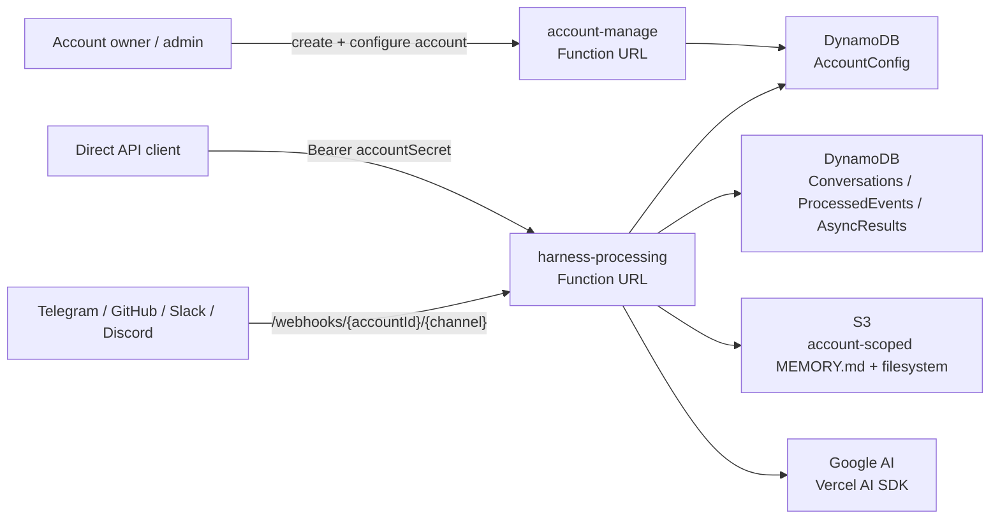

# filthy-panty

Experimental serverless multi-account AI chatbot and agent harness on AWS Lambda.

The deployed architecture uses two public Lambda Function URLs:

- `account-manage`: creates accounts, rotates account API secrets, and manages account metadata/configuration.
- `harness-processing`: handles account-authenticated direct API traffic, async work, status polling, and account-scoped Telegram, GitHub, Slack, and Discord webhooks.

The design goal is simple infrastructure for low-volume multi-tenant usage: Bun on Lambda, SST for infra, DynamoDB for account/conversation/status state, S3 for filesystem-backed tool state, and the Vercel AI SDK for the agent loop.

## Overview

- Runtime: Bun on Lambda `provided.al2023` with ARM64 binaries built by [`scripts/build.ts`](scripts/build.ts).
- Infra: SST v4.
- Model SDK: Vercel AI SDK `ai` with `@ai-sdk/google`.
- Persistence: DynamoDB + S3.
- Streaming: SSE for sync direct API callers only.
- Account config: stored in DynamoDB with encrypted config payloads and hashed account API secrets.
- Public entrypoints: `account-manage` and `harness-processing` Lambda Function URLs.



## Docs

- [Architecture and workflows](docs/architecture.md)
- [Account management](docs/account-management.md)
- [Memory and session](docs/memory-and-session.md)
- [Data security](docs/data-security.md)
- [Direct API](docs/direct-api.md)
- [Operations](docs/operations.md)
- [Extending](docs/extending.md)

## Quick Start

```bash
bun install
cp .env.example .env
bunx sst secret set GoogleApiKey <value>
bunx sst secret set TavilyApiKey <value>
bunx sst secret set AdminAccountSecret <long-random-value>
bunx sst secret set AccountConfigEncryptionSecret <long-random-value>
bun run check
bun run build
bun run deploy
```

After deploy, create an account through the `accountManageUrl` output. The response returns an `accountSecret` once. Use that secret as `Authorization: Bearer <accountSecret>` for direct API calls and account self-management.

## Common Commands

```bash
bun run dev
bun run check
bun run test
bun run build
bun run deploy
```

Discord slash command syncing is still a manual utility:

```bash
bun run discord:sync
```

## Main Code Paths

- [`functions/_shared/accounts.ts`](functions/_shared/accounts.ts): account records, bearer auth, encrypted config storage, account secret hashing, and public redaction.
- [`functions/account-manage/handler.ts`](functions/account-manage/handler.ts): account CRUD, account secret rotation, and account metadata/config updates.
- [`functions/harness-processing/integrations.ts`](functions/harness-processing/integrations.ts): account auth, direct API parsing, account webhook routing, and channel normalization.
- [`functions/harness-processing/handler.ts`](functions/harness-processing/handler.ts): SSE, async self-invocation, commands, leases, and reply orchestration.
- [`functions/harness-processing/session.ts`](functions/harness-processing/session.ts): conversation persistence, deduplication, leases, prompt context, and account-scoped memory loading.
- [`functions/harness-processing/status.ts`](functions/harness-processing/status.ts): async direct API status storage for `/status/{eventId}` polling.
- [`functions/harness-processing/harness.ts`](functions/harness-processing/harness.ts): model execution loop and inline tool orchestration.
- [`functions/harness-processing/tools/index.ts`](functions/harness-processing/tools/index.ts): static inline tool registry.
