# Architecture and Workflows

The deployed system is a multi-account serverless agent harness. Accounts are managed by `account-manage`; runtime traffic is handled by `harness-processing`.

## Monorepo Layout

The repository is a Bun-workspaces monorepo. The core SST app is self-contained under `apps/core/` so it can later be swapped for a Rust/cloud-native runtime without touching the other workspaces.

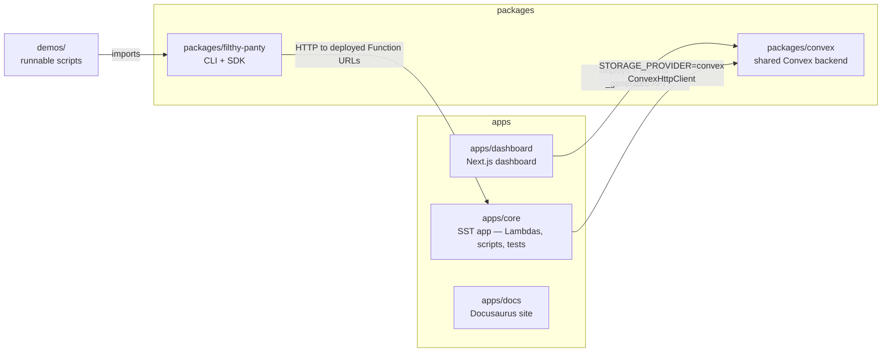

All file paths below are relative to `apps/core/`.

## Runtime Layer

Both Lambdas use the Bun custom runtime and `startStreamingRuntime()` from `functions/_shared/runtime.ts`.

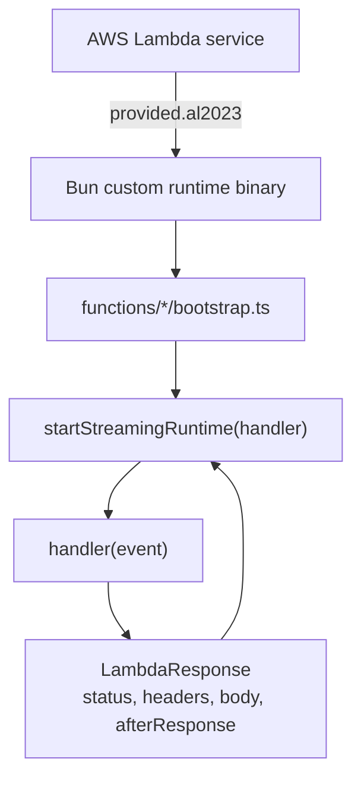

Runtime boundary:

- SST points Lambda `handler` to `bootstrap`.
- The runtime passes the full Function URL event envelope into each handler.
- `afterResponse` lets channel webhooks acknowledge quickly, then continue work after the HTTP response.

## High-Level Architecture

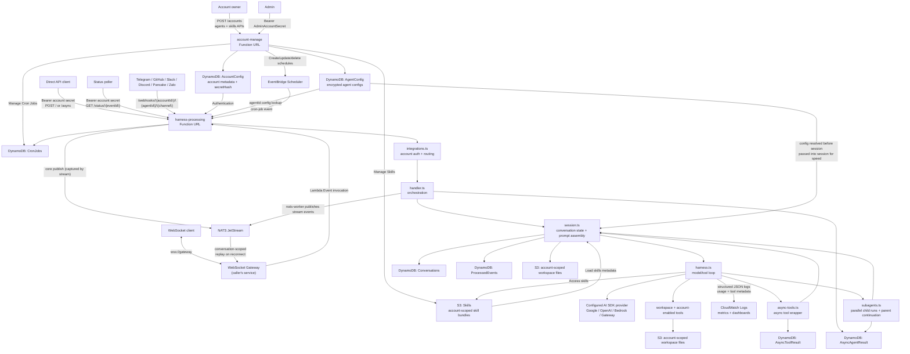

## Account Routing

Every runtime request resolves an account and an account-owned agent before agent work begins.

The diagrams show the logical ownership of runtime config. In code, `integrations.ts` resolves the account once, loads the selected agent, then passes the runtime config into `handler.ts` and `session.ts` to avoid extra lookups during the turn. The runtime projection keeps model, tool, workspace, and skills config, but strips channel credentials before the agent loop.

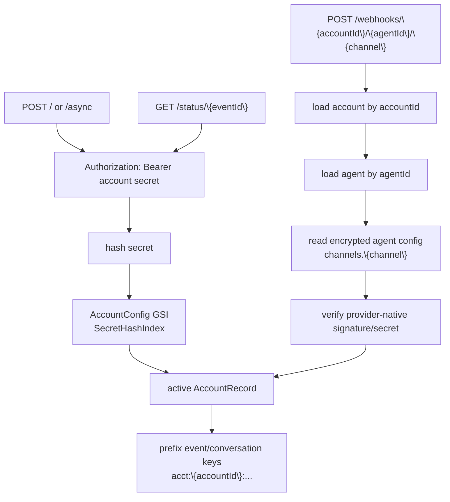

A third auth path exists for trusted platform services: when `SERVICE_AUTH_SECRET` is configured, a request bearing that secret plus an `X-Account-Id` header acts on behalf of that account without knowing its account secret. It is used by the dashboard backend for server-side calls.

Root provider webhooks are not accepted. Provider webhook URLs must include the `accountId`, `agentId`, and channel name.

## Account Management

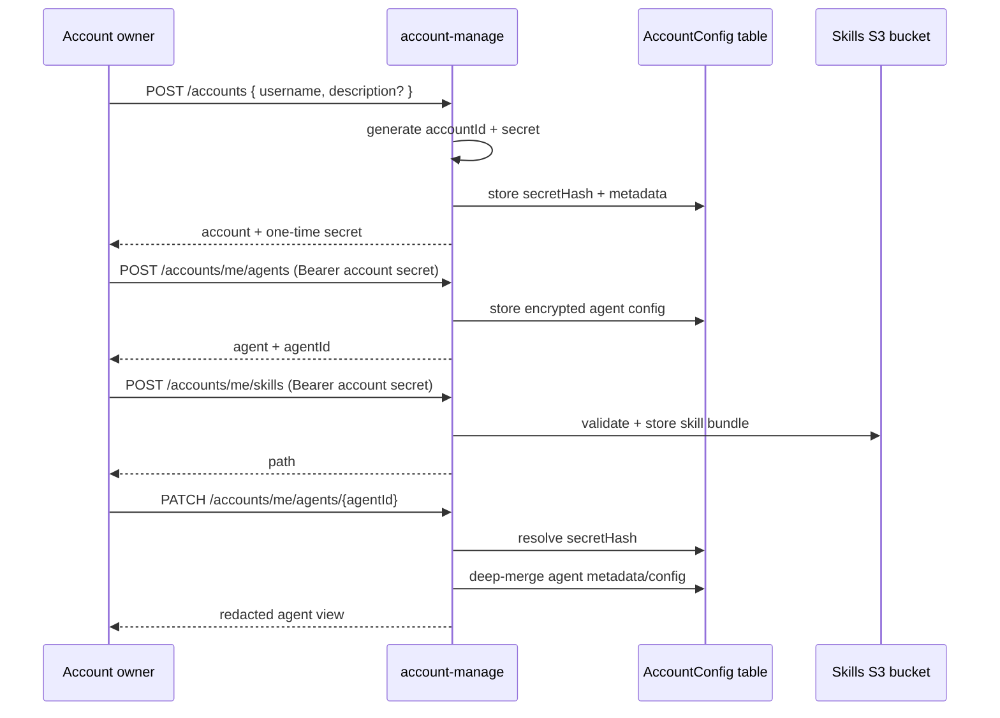

Provider secrets are not returned in normal account responses. Secret-like fields are redacted as `********`; sending that value back in a patch preserves the existing stored secret.

Deleting an account runs account-scoped cleanup before removing the account record. The cleanup deletes runtime rows whose keys are prefixed with `acct:{accountId}:` and removes the current account filesystem namespaces from S3.

## Direct and Async API

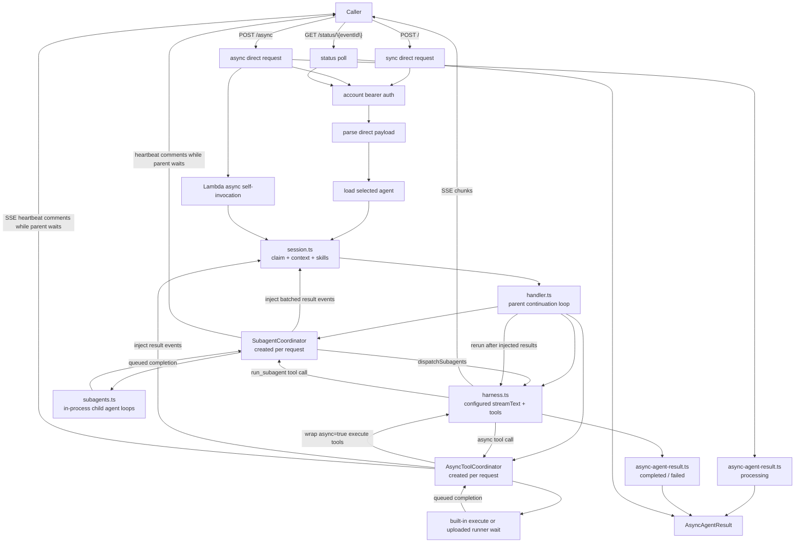

The async path starts inside `harness-processing`: `POST /async` creates `AsyncAgentResult`, returns a status URL, and starts an internal Lambda Event invocation. Subagents and built-in async tools run inside that Lambda. Uploaded custom tools always execute in Kubernetes; uploaded async tools are waited on for SSE, but `/async`, channel, and NATS turns launch them as detached sandbox work that completes through `/sandbox-jobs/{resultId}/complete`.

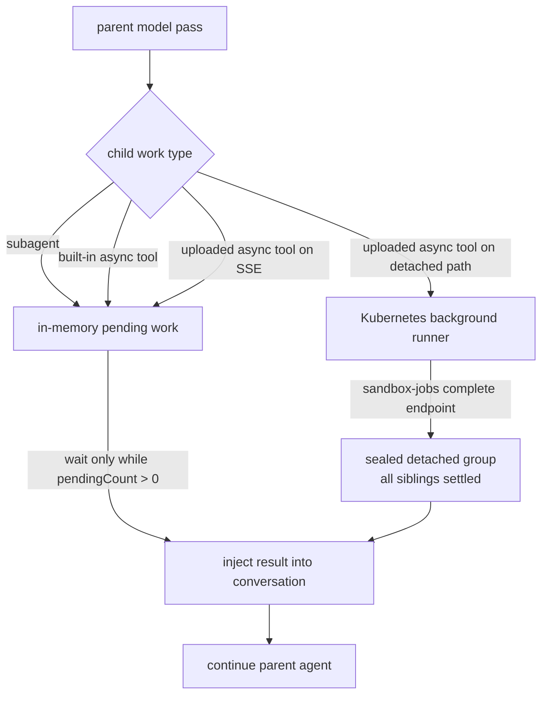

Direct sync and async POST access is controlled by `ENABLE_DIRECT_API`. Deploys inject it explicitly and default it to `false` — set `ENABLE_DIRECT_API=true` to open `POST /` and `POST /async`. When disabled, channel webhooks and internal worker invocations remain available. Account-authenticated async tool completions arrive at `POST /async-tools/{resultId}/complete`; sandbox jobs use the token-authenticated `POST /sandbox-jobs/{resultId}/complete` instead.

## Cron Jobs

Cron jobs are included in the default stack as a small scheduled-agent add-on, not a workflow DSL. `account-manage` owns cron job create, update, delete, and list operations: it stores the account-scoped cron job in DynamoDB and creates, updates, or deletes the matching EventBridge Scheduler schedule. EventBridge Scheduler wakes `harness-processing` with `{ kind: "cron-job", accountId, cronJobId }`, and the harness starts the configured agent asynchronously.

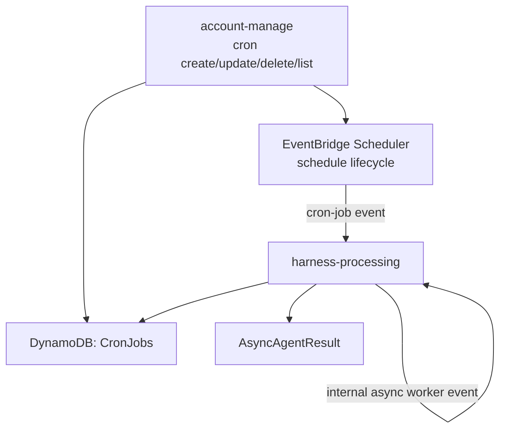

Developers who need custom chaining, cleanup, polling, or external workflow behavior can deploy their own scheduled worker and call the existing direct or async API.

## Channel Webhooks

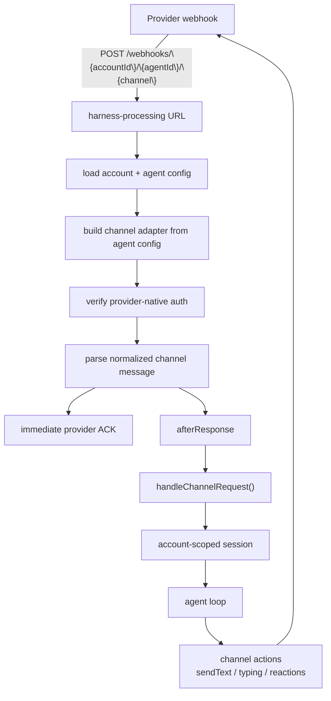

Customers talk to the provider bot/app owned by the account. They never receive an account secret.

## WebSocket Gateway (durable NATS JetStream)

Streaming responses are published to a **durable, conversation-scoped JetStream
stream**. The platform owns the durable stream and a documented replay contract;
the gateway that relays to a browser is the **caller's application** (this is a
PaaS — we provide the connection, not the client). Because the stream is keyed by
conversation (not connection), a client that drops can reconnect with a fresh
socket and **replay** events it missed — including a background job's result that
landed after the original connection closed.

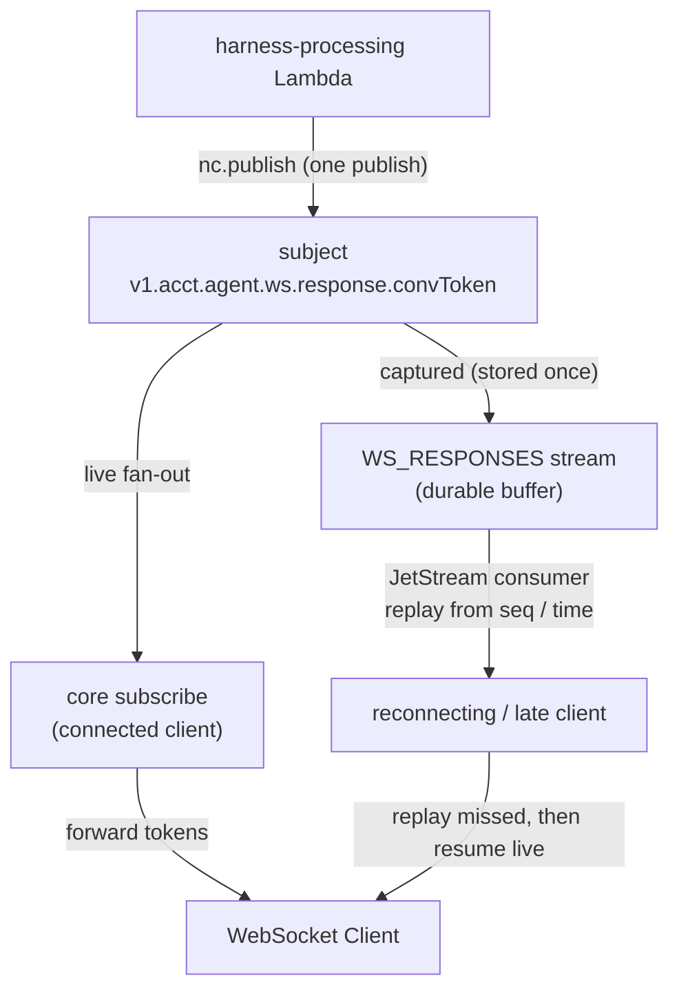

The gateway (the **caller's** service) owns client auth, the subscription, and
the `nats-worker` Lambda invocation. Lambda does **one core publish** per chunk;
the bound `WS_RESPONSES` stream captures that same message for replay.

NATS subject patterns:

| Subject | Direction | Purpose |
| --------- | ----------- | --------- |
| `v1.{accountId}.{agentId}.ws.response.{convToken}` | Lambda → Gateway | Vercel AI SDK stream events (`step-start`, `text`, `tool-call`, `finish`, `error`, …) |

`convToken = base64url(publicConversationKey)` — a single NATS-safe token.

**One publish, two read paths — and not double storage.** A core publish is
fanned out live to any core subscriber on the subject *and* captured once by the
stream. **Core publish stores nothing itself** — the stream is the only stored
copy, so this is not duplicated storage. The platform exposes both read paths and
lets the application choose how to switch:

- **Connected →** `subscribeConversationLive` (core `subscribe`) — lowest latency.
- **Dropped mid-stream → reconnect & resume:** `readConversationStream`
  (JetStream consumer) from `startSequence` (last `JsMsg.seq`) or `startTime`,
  catch up the missed events, then continue live. This is JetStream's **only**
  job — resuming a turn that is *still streaming*.
- **Reconnect after the turn finished →** there is nothing to resume: the buffer
  was purged at persist time, so read the completed turn from the conversation DB.

Switching policy is the consuming app's call — the platform only guarantees a
monotonic cursor (`JsMsg.seq` for stream readers; the envelope `sequence`/`eventId`
for core subscribers) so a core→stream switch dedupes with a trivial `seq` check.

Notes:

- **Speed:** core publish is fire-and-forget (no per-token PubAck round-trip), a
  shared `TextEncoder`, and the subject precomputed once per publisher — so token
  publishing stays on the fast path.
- **Transport (by URL scheme):** `connectNats` in `nats.ts` selects the client
  from `NATS_URL`: `wss://`/`ws://` → WebSocket (`nats.ws`) for out-of-cluster
  callers like Lambda (the cluster exposes only a `wss://` ingress externally);
  `nats://`/`tls://` → core TCP (`nats`) for in-cluster callers on the internal
  network (lower latency; core `4222` is not exposed externally). Moving a service
  in-cluster is then a `NATS_URL` change, not a code change. `NATS_TOKEN` carries
  the token-auth credential (omit for an unauthenticated server).
- **No duplicates:** a single read path never sees a message twice; each publish
  also carries a `Nats-Msg-Id` (`eventId:sequence`) so the stream's
  `duplicate_window` (~2 min) collapses any publish retry.
- **Storage (kept minimal):** the stream is an **in-flight resume buffer**, not
  the source of truth — the conversation history DB is. So it holds as little as
  possible:
  - **Purge on persist:** when a turn finishes and is saved to the DB, the server
    (`LiveNatsPublisher.purge`, right after the terminal `done`) deletes that
    conversation from the stream — a later reconnect reads the saved turn from the
    DB, so keeping the buffer would be pointless. The detached async continuation
    re-enters the same path, so it purges when *it* finishes.
  - **Short backstop `max_age` (~3 min):** only for turns that never persist
    cleanly (e.g. an error/crash before the purge); they expire instead of piling up.
  - Other knobs in `nats.ts`: `RESPONSE_STREAM_STORAGE` (`File` default; `Memory`
    is faster/cheaper but lost on restart) and `max_msgs_per_subject`. The
    retention knobs are mutable, so `ensureResponseStream` syncs them onto the
    existing stream on update. HA `replicas: 3` multiplies storage by 3.
- `connectionId` is now only a routing/label field on event headers — it no
  longer scopes the subject, so overlapping turns on one conversation share a
  stream (group per turn with `headers.eventId`).
- Background jobs launched over a WebSocket turn publish their result to the same
  conversation stream, so they survive the socket and replay on reconnect.
- `ENABLE_WEBSOCKET=true` and `NATS_URL` are required for `nats-worker`
  invocations (plus `NATS_TOKEN` for a token-auth server). When WebSocket is
  disabled, the direct API stays SSE-only and NATS config is ignored.

> **Infra (lives in the infra repo, applied via CI/CD):** the cluster NATS runs
> JetStream with a **WebSocket listener + Traefik ingress** at `wss://nats.beeblast.co`
> (token auth via the `nats-auth` secret) and a file-backed JetStream PVC — so the
> Lambda connects over `wss://` today. For production durability, enable JetStream
> **clustering** (`replicas: 3`, which multiplies storage by 3). Core `4222` stays
> cluster-internal for future in-cluster callers (see the Transport note above).

## Deferred delivery & resume (background jobs)

A detached sandbox job outlives the Lambda that launched it, so its result has to
be delivered in a *later* invocation and routed back to wherever the turn came
from. The mechanism is a small **delivery descriptor carried on the Session and
persisted with the job**, so no live connection state needs to survive — only an
identifier the next invocation can rebuild from.

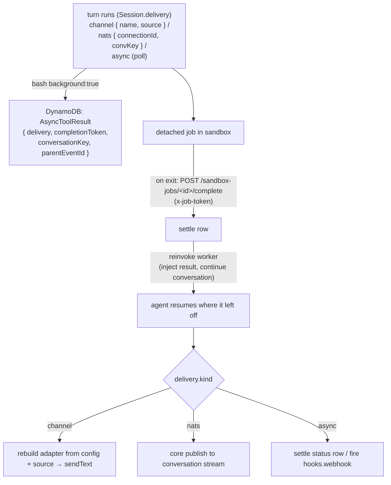

- **What's saved, and why it's safe.** `Session.delivery` (an `AsyncToolDelivery`)
  describes the origin: a chat channel (`{channelName, source}` — the routing
  payload only, *never* credentials), a WebSocket conversation, or plain async.
  `bash background:true` copies it onto the `AsyncToolResult` row in DynamoDB
  alongside the per-job `completionToken`. No account secret is stored or enters
  the sandbox; channel credentials are re-fetched (decrypted) from the agent
  config at delivery time.
- **Reinvoke & continue.** When the job POSTs its completion (authenticated by the
  per-job token), the harness settles the row and reuses the existing async-tool
  continuation path: it rebuilds the turn from `parentEventId`/`conversationKey`,
  injects the job result, and runs the agent loop so it **continues where it left
  off**. This is the same settle→continue pipeline used by detached uploaded async
  tools; background jobs add only the `delivery` routing on top.
- **Deliver to origin.** After the loop, the follow-up is pushed to the recorded
  origin: a channel `sendText`, a durable JetStream publish (replayed on
  reconnect), or a status-row settle. See `bash.tool.ts`, `handler.ts`
  (`continueAfterAsyncToolSettlement`, `pushReplyToChannel`), and `integrations.ts`
  (`sendChannelReply`).

## Sandbox & Workspace Boundaries

**Sandbox** (compute) and **workspace** (persistent S3 files) are independent,
account-scoped records, referenced from agent config by id (`sandbox`, `workspaces`). The
handler resolves those references (`resolveAgentRuntime`) before the agent loop. A
sandbox can be attached agent-wide (`config.sandbox`) or per workspace
(`workspaces[].sandbox`, overriding the agent-level one). Each workspace's *effective*
sandbox decides its tools: `read`/`write`/`edit`/`glob`/`grep`/`bash` when present, or
read-only `read`/`glob` when absent (via a read-only mount by default, or direct S3 with the
`sandbox: null` opt-out); `bash` is also exposed stateless when there is no workspace. Each tool's `permissionMode` (`edit`/`ask`/`bypass`)
is resolved per call from the selected workspace.

Every sandbox-backed tool compiles to a single `run` against the provider (`lambda`/`e2b`/
`daytona`/`kubernetes`/`vercel`). The lambda provider deploys the same image as four functions
(workspace mount × network slot) and auto-selects one per run. A workspace's namespace is
derived from `accountId:workspaceId`, so agents that reference the same `workspaceId` share
files — including across the sandbox-backed and read-only S3 paths. A workspace with no
sandbox still serves `MEMORY.md` via the S3 API. `workspace.harness.enabled=false`
suppresses only the MEMORY/TASKS guidance.

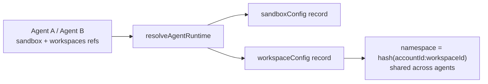

See [Workspace & Sandbox](workspace/index.md) for the full model.

## Model and Tool Configuration

Agents control model selection, channel credentials, optional skills, subagents, and tool access through encrypted agent config. `harness.ts` resolves `config.model`; `tools/index.ts` exposes the sandbox tools from a referenced `sandbox` (+ `workspaces`), subagent dispatch from `config.subagent`, search/research tools from `config.tools`, and `load_skill` when `config.skills.enabled` is true and `config.skills.allowed` has paths. See the [API Reference](/api-reference) for the complete `AgentConfig` schema.

## Storage Boundaries

- `AccountConfig`: account metadata and account secret hash.
- `AgentConfig`: account-owned encrypted runtime config payloads.
- `SandboxConfig` / `WorkspaceConfig`: account-scoped sandbox and workspace records referenced from agent config by id.
- `AccountTool`: uploaded custom tool records (bundles live in the ToolBundles S3 bucket).
- `CronJobs`: scheduled agent runs managed by `account-manage`.
- `Conversations`: normalized model messages by account-scoped `conversationKey`.
- `ProcessedEvents`: dedup markers and short-lived conversation lease records.
- `AsyncAgentResult`: async direct API and subagent state for `/status/{eventId}` polling.
- `AsyncToolResult`: async tool call state, same-table detached group rows for callback fan-in, delivery metadata for non-SSE continuations, and structured outputs for parent result injection.
- `AccountSignupRateLimit`: TTL rows throttling public account creation per source IP.
- `PersistentSandboxInstance`: reserved sandbox instances for persistent e2b/daytona/vercel providers.
- S3 workspace bucket: workspace files (namespaced by `accountId:workspaceId`) and staged skill bundles.
- S3 skills bucket: account-scoped skill bundles under `<accountId>/<skill-name>`.
- S3 tool-bundles bucket: uploaded custom tool bundles.

On the production stage the config domains (accounts, agents, sandboxes, workspaces, tools, cron jobs) are stored in Convex instead of DynamoDB; runtime tables (conversations, dedup, async results) stay in DynamoDB on every stage.

Built-in tool execution is inline in `harness-processing`. Uploaded custom tools execute in Kubernetes. `async: true` only changes the lifecycle: built-in async stays in the current Lambda, uploaded async waits on SSE, and uploaded async detaches automatically on `/async`, channel, and NATS turns. Subagents are in-process child agent loops; they do not require child Lambda workers.
