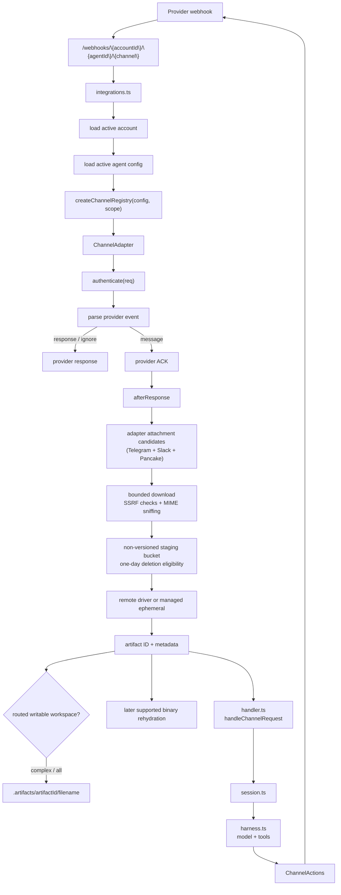
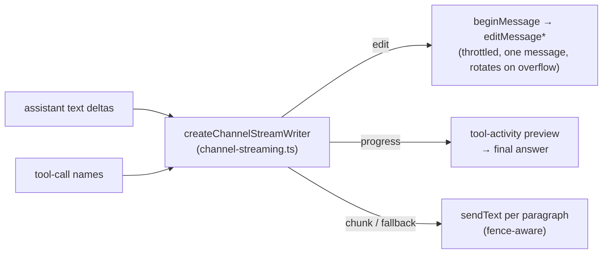

# Channels Reference

Channels are communication integrations such as Telegram, GitHub, Slack, Discord, Pancake, and Zalo. They translate provider webhooks into the shared agent input shape, then send replies through a channel-specific `ChannelActions` implementation.

Customers interact with the provider bot, app, or webhook. They do not receive account secrets. The webhook URL always includes the account, agent, and channel:

```bash
{AGENT_SERVICE_URL}/webhooks/{accountId}/{agentId}/{channel}
```

## Runtime Flow



Webhook handling is split deliberately:

- [`functions/harness-processing/integrations.ts`](https://github.com/beeblastco/filthy-panty/blob/dev/apps/core/functions/harness-processing/integrations.ts) owns routing, account/agent lookup, adapter selection, provider ACKs, and normalized channel events.
- [`functions/harness-processing/handler.ts`](https://github.com/beeblastco/filthy-panty/blob/dev/apps/core/functions/harness-processing/handler.ts) owns session setup, command dispatch, agent execution, and final reply handling.
- [`functions/_shared/channels.ts`](https://github.com/beeblastco/filthy-panty/blob/dev/apps/core/functions/_shared/channels.ts) owns the shared channel contracts.
- `functions/_shared/<channel>-channel.ts` owns provider-specific authentication, parsing, formatting, and reply API calls.

---

## Supported Channels

| Channel | Adapter | Required config | Documentation |
| --- | --- | --- | --- |
| `telegram` | [`functions/_shared/telegram-channel.ts`](https://github.com/beeblastco/filthy-panty/blob/dev/apps/core/functions/_shared/telegram-channel.ts) | `botToken`, `webhookSecret`, `allowedChatIds` | [Telegram Details](telegram.md) |
| `github` | [`functions/_shared/github-channel.ts`](https://github.com/beeblastco/filthy-panty/blob/dev/apps/core/functions/_shared/github-channel.ts) | `webhookSecret`, `appId`, `privateKey` | [GitHub Details](github.md) |
| `slack` | [`functions/_shared/slack-channel.ts`](https://github.com/beeblastco/filthy-panty/blob/dev/apps/core/functions/_shared/slack-channel.ts) | `botToken`, `signingSecret` | [Slack Details](slack.md) |
| `discord` | [`functions/_shared/discord-channel.ts`](https://github.com/beeblastco/filthy-panty/blob/dev/apps/core/functions/_shared/discord-channel.ts) | `botToken`, `publicKey` | [Discord Details](discord.md) |
| `pancake` | [`functions/_shared/pancake-channel.ts`](https://github.com/beeblastco/filthy-panty/blob/dev/apps/core/functions/_shared/pancake-channel.ts) | `pageId`, `pageAccessToken`, `webhookSecret` | [Pancake Details](pancake.md) |
| `zalo` | [`functions/_shared/zalo-channel.ts`](https://github.com/beeblastco/filthy-panty/blob/dev/apps/core/functions/_shared/zalo-channel.ts) | `botToken`, `webhookSecret`, `allowedUserIds` | [Zalo Details](zalo.md) |

---

## Code-First Configuration

The CLI SDK exposes one constructor per provider. Attach the resulting definitions to one agent; an agent may receive from multiple channel types, while one channel definition cannot be shared by multiple agents.

```ts
import { defineAgent, defineGitHubChannel, defineSlackChannel, env } from "filthy-panty";

export const github = defineGitHubChannel({
  appId: env.GITHUB_APP_ID,
  privateKey: env.GITHUB_PRIVATE_KEY,
  webhookSecret: env.GITHUB_WEBHOOK_SECRET,
  allowedRepos: ["owner/repo"],
});

export const slack = defineSlackChannel({
  botToken: env.SLACK_BOT_TOKEN,
  signingSecret: env.SLACK_SIGNING_SECRET,
  streaming: { mode: "edit" },
});

export const support = defineAgent({
  name: "support",
  config: { channels: [github, slack] },
});
```

`filthy-panty dev` lowers the list to the runtime's keyed `config.channels` shape, syncs referenced environment values, generates `api.channels`, and prints each provider webhook URL. Code-first agent definitions must use channel constructors; keyed channel objects are rejected.

Runnable examples live under `packages/demos/channel-*`. Provider registration is explicit: Telegram, Zalo, and Discord demos include a `register` command; other providers use their administration console.

---

## Shared Channel Behavior

Every channel gets these behaviors from the shared pipeline, not from the adapter:

- **Bot commands** — a message starting with `/command` runs a command from [`functions/_shared/commands.ts`](https://github.com/beeblastco/filthy-panty/blob/dev/apps/core/functions/_shared/commands.ts) instead of the agent: `/new` (alias `/start`) clears the conversation context, `/help` lists commands, and Discord additionally exposes `/ask`. Commands only see the channel-agnostic `ChannelActions`.
- **Typing + reaction** — an accepted message immediately triggers a fire-and-forget typing indicator and a reaction (👀 on Slack/GitHub, configurable on Telegram, no-op on Discord/Pancake/Zalo).
- **Tool approval auto-deny** — tools configured with `needsApproval` are automatically denied on channel turns with the reason `Tool approval is only supported through the direct API.`
- **Error replies** — if processing fails, the channel receives `Error: <message>` as the reply.
- **Per-channel config scoping** — a webhook run only sees its own channel's config; other channels' credentials are stripped from the runtime agent config.
- **Deferred replies** — when a turn finishes in the background (detached async tools or sandbox jobs), the final result is pushed back into the originating chat once it settles.

## Attachments And Channel Actions

Attachments arrive through authenticated provider message events; there is no attachment command. Download happens after the provider ACK. The shared downloader accepts only adapter-approved HTTPS hosts, rejects private/reserved DNS results, validates redirects, bounds time and bytes, and checks file signatures. Provider download URLs and credentials are never persisted or sent to the model.

Validated bytes pass through a dedicated, non-versioned staging bucket. A configured remote artifact driver receives a five-minute transfer URL and returns an opaque reference; successful transfers delete staging immediately. Without a driver, staging provides managed ephemeral storage. Falling back to it after a configured driver fails requires explicit `fallback: "managed-ephemeral"`. Remaining objects become eligible for lifecycle deletion after one day; S3 lifecycle processing is asynchronous, so this is not an exact deletion deadline.

Conversation history stores the artifact ID and a filename/type/size/checksum descriptor, not bytes, signed URLs, or provider URLs. A successful optional working copy adds `workspace` and `workspacePath`. The current turn receives bytes only when `config.model.inputCapabilities` permits the MIME type; later turns can explicitly rehydrate the same supported binary from artifact storage. Compaction preserves descriptors, never bytes.

| Provider | Inbound media | Model-callable outbound actions |
| --- | --- | --- |
| Telegram | photo, document, video, animation, voice, audio from Bot API updates | reactions and native media sends |
| Slack | `file_share` files in allowed DM/app-mention events | reactions and external-upload media sends |
| Discord | not yet supported: the current adapter receives interactions, not Gateway message events | interaction follow-up media sends |
| Pancake | authenticated webhook photos and videos, including media-only messages | inbox photo/video upload through Pancake content IDs |
| GitHub | not supported; arbitrary Markdown links are not fetched | reactions only; GitHub has no native issue-attachment upload API |
| Zalo | not supported; official media hosts/codecs are not fixture-verified | none |

Configure model-initiated actions per agent under `config.channels.<channel>.actions`. Use only the fields implemented by that provider:

```ts
defineTelegramChannel({
  // credentials and allowlist omitted
  actions: { reactions: true, attachments: true },
  mediaMaxMb: 20,
});

defineDiscordChannel({
  // credentials and allowlist omitted
  actions: { attachments: true },
});

defineGitHubChannel({
  // credentials and allowlist omitted
  actions: { reactions: true },
});

definePancakeChannel({
  // credentials omitted
  actions: { attachments: true },
  mediaMaxMb: 20,
});
```

Inbound media is automatic when the adapter supports it and is independent of channel action policy. Artifact storage is authoritative. With one writable workspace, complex unsupported files may be copied automatically; multiple writable workspaces require `config.artifacts.workspace.name`, and read-only workspaces are skipped. `channel_message` can send a workspace file only when the active provider supports it.

`mediaMaxMb` applies to Telegram, Slack, and Pancake inbound media (20 MiB by default and maximum) as both a per-item and aggregate per-event memory budget. For Telegram it also matches the hosted Bot API download limit; for Slack and Pancake it is a platform safety ceiling, not a universal provider setting. A separate eight-item ceiling is a filthy-panty fan-out/memory guard, not a provider capability claim.

The AI SDK can download some URL parts automatically, but support varies by model and provider. The harness does not delegate authenticated or short-lived channel URLs to that behavior. Set `config.model.inputCapabilities.imageMediaTypes` and `fileMediaTypes` to exact MIME types or top-level wildcards; unsupported artifacts remain descriptor-only instead of failing the turn.

---

## Reply Streaming

By default a channel sends one final message per turn. Set `config.channels.<channel>.streaming.mode` to stream the assistant reply live as the model produces it:

| Mode | Behavior | Requirement |
| --- | --- | --- |
| `off` (default) | One final `sendText` | — |
| `edit` | Post a placeholder, then edit it in place on a ~1.2s throttle; final edit holds the complete reply | Channel implements `beginMessage`/`editMessage` (else falls back to `chunk`) |
| `progress` | Show a live preview of tool activity (`⏳ Working… • <tool>`) while the model runs, then swap the same message for the final answer | Same edit primitives as `edit` (else falls back to `chunk`) |
| `chunk` | Send each paragraph (blank-line boundary) as its own message as it completes; a fenced code block is never split mid-fence | Uses `sendText` — works on every channel |



The handler reads `text-delta` and `tool-call` parts from the agent's `fullStream`: `edit`/`chunk` consume the text and ignore tool calls; `progress` consumes tool calls and ignores the streamed text (the answer arrives whole at the end).

The driver ([`functions/_shared/channel-streaming.ts`](https://github.com/beeblastco/filthy-panty/blob/dev/apps/core/functions/_shared/channel-streaming.ts)) owns accumulation and throttling; channels only provide the `beginMessage`/`editMessage` primitives (and an optional `editMaxChars` cap) for edit/progress modes. Streaming is best-effort — a failed edit/send never aborts the turn, and a structured/object final response always sends as one message. When an edited reply outgrows the channel's `editMaxChars` budget (default ~3500 raw characters; Discord uses 1900, both safely below the provider caps of 4096/2000), the driver freezes the current message at a clean break and continues streaming in a new one (rotation), so long replies are not truncated. **Telegram**, **Slack** (`chat.postMessage`/`chat.update`), and **Discord** (interaction webhook edits) ship edit primitives; other channels stream via `chunk` until they add the two methods.

---

## Channel Contract

Each channel implements `ChannelAdapter` from [`functions/_shared/channels.ts`](https://github.com/beeblastco/filthy-panty/blob/dev/apps/core/functions/_shared/channels.ts):

| Method | Purpose |
| --- | --- |
| `name` | Stable URL segment and config key, such as `telegram` |
| `canHandle(req)` | Quick provider-shape check, usually based on headers |
| `authenticate(req)` | Provider-native signature or secret verification |
| `parse(req)` | Converts the webhook into `message`, `ignore`, or direct `response` |
| `actions(msg)` | Returns reply, typing, and reaction actions scoped to the inbound message |

`parse()` returns one of three outcomes:

| Result | Meaning |
| --- | --- |
| `message` | Continue into the agent loop after sending `ack` or a default `200` |
| `ignore` | Stop without running the agent, usually for unsupported events |
| `response` | Return a provider-specific response immediately, such as a challenge reply |

The normalized `InboundMessage` contains:

- `eventId`: provider delivery/message ID used for deduplication
- `conversationKey`: provider thread/chat/channel key used for persisted conversation state
- `channelName`: adapter name
- `content`: Vercel AI SDK `UserContent`
- `source`: provider metadata needed for commands, replies, or diagnostics

`integrations.ts` scopes `eventId` and `conversationKey` with `accountId` and `agentId` before the session sees them.

---

## Add a Channel

1. Add config types to [`functions/_shared/storage/agent-config.ts`](https://github.com/beeblastco/filthy-panty/blob/dev/apps/core/functions/_shared/storage/agent-config.ts).
2. Validate the new `config.channels.<channel>` fields in `normalizeChannelsConfig()`.
3. Create `functions/_shared/<channel>-channel.ts`.
4. Implement `ChannelAdapter`.
5. Keep provider-specific reply formatting and send logic inside the channel module.
6. Import the channel factory in [`functions/harness-processing/integrations.ts`](https://github.com/beeblastco/filthy-panty/blob/dev/apps/core/functions/harness-processing/integrations.ts).
7. Add `create<Channel>ChannelFromConfig()` and include it in `createChannelRegistry()`.
8. Document the webhook URL as `/webhooks/{accountId}/{agentId}/{channel}`.
9. Update the SDK constructor, [API Reference](/api-reference), and focused tests/examples when the public config changes.

Do not hardcode channel-specific behavior in commands, shared handlers, or the core agent loop. Commands receive only the channel-agnostic `ChannelActions` interface.

---

## Adapter Skeleton

```ts
/**
 * Example channel adapter implemented as a ChannelAdapter.
 * Keep Example auth, message normalization, and reply actions here.
 */

import type { ChannelAdapter, ChannelParseResult } from "./channels.ts";

export function createExampleChannel(
  token: string,
  webhookSecret: string,
): ChannelAdapter {
  return {
    name: "example",

    canHandle(req) {
      return "x-example-delivery" in req.headers;
    },

    authenticate(req) {
      return req.headers["x-example-secret"] === webhookSecret;
    },

    parse(req): ChannelParseResult {
      const body = JSON.parse(req.body) as {
        id: string;
        threadId: string;
        text?: string;
      };

      if (!body.text) {
        return { kind: "ignore", response: { statusCode: 200 } };
      }

      return {
        kind: "message",
        ack: { statusCode: 200 },
        message: {
          eventId: body.id,
          conversationKey: body.threadId,
          channelName: "example",
          content: [{ type: "text", text: body.text }],
          source: body as Record<string, unknown>,
        },
      };
    },

    actions(msg) {
      return {
        sendText: async (text) => {
          await fetch("https://api.example.com/messages", {
            method: "POST",
            headers: {
              "Authorization": `Bearer ${token}`,
              "Content-Type": "application/json",
            },
            body: JSON.stringify({
              threadId: msg.conversationKey,
              text,
            }),
          });
        },
        sendTyping: async () => {},
        reactToMessage: async () => {},
      };
    },
  };
}
```

---

## Channel Rules

- Verify provider signatures or webhook secrets before parsing user-controlled payloads deeply.
- Return a provider ACK quickly; long-running model work should happen in `afterResponse`.
- Use stable provider IDs for `eventId` so duplicate deliveries are deduped.
- Use thread/chat/channel IDs for `conversationKey` so follow-up messages preserve context.
- Put provider-specific Markdown or HTML formatting in the channel module.
- Keep `ChannelActions` methods resilient; failed typing or reaction calls should not fail the whole turn.
- Keep approval-dependent tools off channel-only agents unless a direct API client will resume the approval flow.
