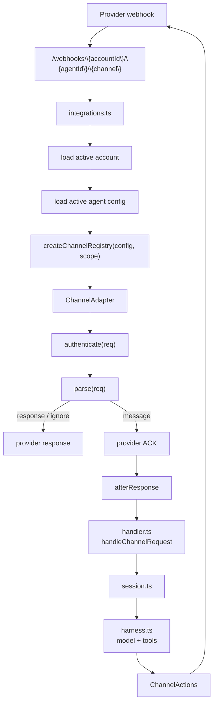
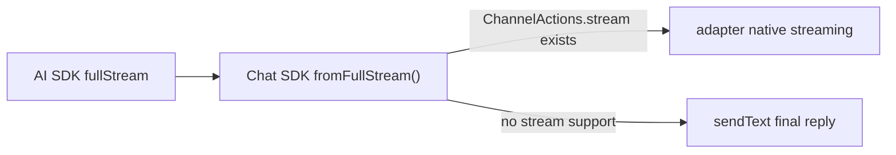

# Channels Reference

Channels are communication integrations such as Telegram, GitHub, Slack, Discord, Pancake, and Zalo. They translate provider webhooks into the shared agent input shape, then send replies through a channel-specific `ChannelActions` implementation.

Slack, Telegram, Discord, and GitHub are built on the Chat SDK adapter packages:

- [`@chat-adapter/slack`](https://www.npmjs.com/package/@chat-adapter/slack)
- [`@chat-adapter/telegram`](https://www.npmjs.com/package/@chat-adapter/telegram)
- [`@chat-adapter/discord`](https://www.npmjs.com/package/@chat-adapter/discord)
- [`@chat-adapter/github`](https://www.npmjs.com/package/@chat-adapter/github)

Use the Chat SDK docs for provider capability details: [Platform Adapters](https://chat-sdk.dev/docs/platform-adapters), [Markdown](https://chat-sdk.dev/docs/api/markdown), [Streaming](https://chat-sdk.dev/docs/streaming), and [Slash Commands](https://chat-sdk.dev/docs/slash-commands). Pancake and Zalo are Broods-native adapters because Chat SDK does not provide those providers.

Customers interact with the provider bot, app, or webhook. They do not receive account secrets. The webhook URL always includes the account, agent, and channel:

```bash
{AGENT_SERVICE_URL}/webhooks/{accountId}/{agentId}/{channel}
```

## Runtime Flow



Webhook handling is split deliberately:

- [`functions/harness-processing/integrations.ts`](https://github.com/beeblastco/broods/blob/dev/apps/core/functions/harness-processing/integrations.ts) owns routing, account/agent lookup, adapter selection, provider ACKs, and normalized channel events.
- [`functions/harness-processing/handler.ts`](https://github.com/beeblastco/broods/blob/dev/apps/core/functions/harness-processing/handler.ts) owns session setup, command dispatch, agent execution, and final reply handling.
- [`functions/_shared/channels.ts`](https://github.com/beeblastco/broods/blob/dev/apps/core/functions/_shared/channels.ts) owns the shared channel contracts.
- `functions/_shared/<channel>-channel.ts` owns provider-specific authentication, parsing, formatting, and reply API calls.

---

## Supported Channels

| Channel | Runtime adapter | Chat SDK package | Required config | Documentation |
| --- | --- | --- | --- | --- |
| `telegram` | [`functions/_shared/telegram-channel.ts`](https://github.com/beeblastco/broods/blob/dev/apps/core/functions/_shared/telegram-channel.ts) | [`@chat-adapter/telegram`](https://www.npmjs.com/package/@chat-adapter/telegram) | `botToken`, `webhookSecret`, `allowedChatIds` | [Telegram Details](telegram.md) |
| `github` | [`functions/_shared/github-channel.ts`](https://github.com/beeblastco/broods/blob/dev/apps/core/functions/_shared/github-channel.ts) | [`@chat-adapter/github`](https://www.npmjs.com/package/@chat-adapter/github) | `webhookSecret`, `appId`, `privateKey` | [GitHub Details](github.md) |
| `slack` | [`functions/_shared/slack-channel.ts`](https://github.com/beeblastco/broods/blob/dev/apps/core/functions/_shared/slack-channel.ts) | [`@chat-adapter/slack`](https://www.npmjs.com/package/@chat-adapter/slack) | `botToken`, `signingSecret` | [Slack Details](slack.md) |
| `discord` | [`functions/_shared/discord-channel.ts`](https://github.com/beeblastco/broods/blob/dev/apps/core/functions/_shared/discord-channel.ts) | [`@chat-adapter/discord`](https://www.npmjs.com/package/@chat-adapter/discord) | `botToken`, `publicKey` | [Discord Details](discord.md) |
| `pancake` | [`functions/_shared/pancake-channel.ts`](https://github.com/beeblastco/broods/blob/dev/apps/core/functions/_shared/pancake-channel.ts) | Broods-native | `pageId`, `pageAccessToken`, `webhookSecret` | [Pancake Details](pancake.md) |
| `zalo` | [`functions/_shared/zalo-channel.ts`](https://github.com/beeblastco/broods/blob/dev/apps/core/functions/_shared/zalo-channel.ts) | Broods-native | `botToken`, `webhookSecret`, `allowedUserIds` | [Zalo Details](zalo.md) |

---

## Code-First Configuration

The CLI SDK exposes one constructor per provider. Attach the resulting definitions to one agent; an agent may receive from multiple channel types, while one channel definition cannot be shared by multiple agents.

```ts
import { defineAgent, defineGitHubChannel, defineSlackChannel, env } from "broods";

export const github = defineGitHubChannel({
  appId: env.GITHUB_APP_ID,
  privateKey: env.GITHUB_PRIVATE_KEY,
  webhookSecret: env.GITHUB_WEBHOOK_SECRET,
  allowedRepos: ["owner/repo"],
});

export const slack = defineSlackChannel({
  botToken: env.SLACK_BOT_TOKEN,
  signingSecret: env.SLACK_SIGNING_SECRET,
});

export const support = defineAgent({
  name: "support",
  config: { channels: [github, slack] },
});
```

`broods dev` lowers the list to the runtime's keyed `config.channels` shape, syncs referenced environment values, generates `api.channels`, and prints each provider webhook URL. Code-first agent definitions must use channel constructors; keyed channel objects are rejected.

Runnable examples live under `packages/demos/channel-*`. Provider registration is explicit: Telegram, Zalo, and Discord demos include a `register` command; other providers use their administration console.

---

## Shared Channel Behavior

Every channel gets these behaviors from the shared pipeline, not from the adapter:

- **Bot commands** — command-capable channels (Slack, Discord, and Telegram) route supported `/command` input through [`functions/_shared/commands.ts`](https://github.com/beeblastco/broods/blob/dev/apps/core/functions/_shared/commands.ts) instead of the agent: `/new` and `/clear` clear the conversation context, and `/help` lists commands. GitHub, Pancake, and Zalo treat slash-looking message text as agent input.
- **Typing + reaction** — an accepted message immediately triggers a fire-and-forget typing indicator and a reaction where the channel supports it. Telegram and Slack reaction emoji are configurable; GitHub uses 👀; Pancake/Zalo are no-op.
- **Tool approval auto-deny** — tools configured with `needsApproval` are automatically denied on channel turns with the reason `Tool approval is only supported through the direct API.`
- **Error replies** — if processing fails, the channel receives `Error: <message>` as the reply.
- **Per-channel config scoping** — a webhook run only sees its own channel's config; other channels' credentials are stripped from the runtime agent config.
- **Deferred replies** — when a turn finishes in the background (detached async tools or sandbox jobs), the final result is pushed back into the originating chat once it settles.

---

## Reply Streaming

Channel replies use Chat SDK adapter streaming by default when the channel adapter exposes `stream()`. Slack uses Chat SDK's native Slack streaming API, Telegram private chats use Chat SDK rich draft previews before persisting the final response, and GitHub uses Chat SDK's buffered Markdown comment streaming. Discord uses Chat SDK's final-message adapter methods because its adapter does not expose native streaming yet. Channels without SDK streaming support send one final `sendText` reply.



The provider adapter owns the streaming method and fallback behavior.

Channel markdown formatting is delegated to the Chat SDK adapters for Slack, Telegram, Discord, and GitHub, including Slack response-url text conversion and Telegram MarkdownV2 rendering. See Chat SDK [Markdown](https://chat-sdk.dev/docs/api/markdown) for the cross-platform formatting model. Pancake and Zalo keep their provider-specific text handling because Chat SDK does not cover those providers.

---

## Channel Contract

Each channel implements `ChannelAdapter` from [`functions/_shared/channels.ts`](https://github.com/beeblastco/broods/blob/dev/apps/core/functions/_shared/channels.ts):

| Method | Purpose |
| --- | --- |
| `name` | Stable URL segment and config key, such as `telegram` |
| `canHandle(req)` | Quick provider-shape check, usually based on headers |
| `authenticate(req)` | Provider-native signature or secret verification |
| `parse(req)` | Converts the webhook into `message`, `ignore`, or direct `response` |
| `actions(msg)` | Returns reply, typing, and reaction actions scoped to the inbound message |

`parse()` returns one of three outcomes:

| Result | Meaning |
| --- | --- |
| `message` | Continue into the agent loop after sending `ack` or a default `200` |
| `ignore` | Stop without running the agent, usually for unsupported events |
| `response` | Return a provider-specific response immediately, such as a challenge reply |

The normalized `InboundMessage` contains:

- `eventId`: provider delivery/message ID used for deduplication
- `conversationKey`: provider thread/chat/channel key used for persisted conversation state
- `channelName`: adapter name
- `content`: Vercel AI SDK `UserContent`
- `source`: provider metadata needed for commands, replies, or diagnostics

`integrations.ts` scopes `eventId` and `conversationKey` with `accountId` and `agentId` before the session sees them.

---

## Add a Channel

1. Add config types to [`functions/_shared/storage/agent-config.ts`](https://github.com/beeblastco/broods/blob/dev/apps/core/functions/_shared/storage/agent-config.ts).
2. Validate the new `config.channels.<channel>` fields in `normalizeChannelsConfig()`.
3. Create `functions/_shared/<channel>-channel.ts`.
4. Implement `ChannelAdapter`.
5. Use a Chat SDK adapter when the provider is supported; keep provider-specific reply formatting and send logic inside the channel module only for unsupported providers or Broods-specific event normalization.
6. Import the channel factory in [`functions/harness-processing/integrations.ts`](https://github.com/beeblastco/broods/blob/dev/apps/core/functions/harness-processing/integrations.ts).
7. Add `create<Channel>ChannelFromConfig()` and include it in `createChannelRegistry()`.
8. Document the webhook URL as `/webhooks/{accountId}/{agentId}/{channel}`.
9. Update the SDK constructor, [API Reference](/api-reference), and focused tests/examples when the public config changes.

Do not hardcode channel-specific behavior in commands, shared handlers, or the core agent loop. Commands receive only the channel-agnostic `ChannelActions` interface.

---

## Adapter Skeleton

```ts
/**
 * Example channel adapter implemented as a ChannelAdapter.
 * Keep Example auth, message normalization, and reply actions here.
 */

import type { ChannelAdapter, ChannelParseResult } from "./channels.ts";

export function createExampleChannel(
  token: string,
  webhookSecret: string,
): ChannelAdapter {
  return {
    name: "example",

    canHandle(req) {
      return "x-example-delivery" in req.headers;
    },

    authenticate(req) {
      return req.headers["x-example-secret"] === webhookSecret;
    },

    parse(req): ChannelParseResult {
      const body = JSON.parse(req.body) as {
        id: string;
        threadId: string;
        text?: string;
      };

      if (!body.text) {
        return { kind: "ignore", response: { statusCode: 200 } };
      }

      return {
        kind: "message",
        ack: { statusCode: 200 },
        message: {
          eventId: body.id,
          conversationKey: body.threadId,
          channelName: "example",
          content: [{ type: "text", text: body.text }],
          source: body as Record<string, unknown>,
        },
      };
    },

    actions(msg) {
      return {
        sendText: async (text) => {
          await fetch("https://api.example.com/messages", {
            method: "POST",
            headers: {
              "Authorization": `Bearer ${token}`,
              "Content-Type": "application/json",
            },
            body: JSON.stringify({
              threadId: msg.conversationKey,
              text,
            }),
          });
        },
        sendTyping: async () => {},
        reactToMessage: async () => {},
      };
    },
  };
}
```

---

## Channel Rules

- Verify provider signatures or webhook secrets before parsing user-controlled payloads deeply.
- Return a provider ACK quickly; long-running model work should happen in `afterResponse`.
- Use stable provider IDs for `eventId` so duplicate deliveries are deduped.
- Use thread/chat/channel IDs for `conversationKey` so follow-up messages preserve context.
- Put provider-specific Markdown or HTML formatting in the channel module.
- Keep `ChannelActions` methods resilient; failed typing or reaction calls should not fail the whole turn.
- Keep approval-dependent tools off channel-only agents unless a direct API client will resume the approval flow.
