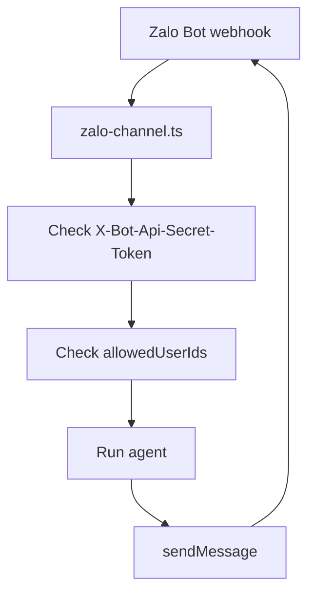

# Zalo

Zalo integration allows your agent to answer direct text messages through the official Zalo Bot API.

## Configuration

```json
{
  "channels": {
    "zalo": {
      "botToken": "your-zalo-bot-token",
      "webhookSecret": "your-webhook-secret",
      "allowedUserIds": ["123456789"]
    }
  }
}
```

- `botToken` (Required): Bot token from Zalo Bot Platform.
- `webhookSecret` (Required): Secret sent by Zalo in `X-Bot-Api-Secret-Token`. Must be 8 to 256 characters.
- `allowedUserIds` (Required): Zalo user IDs allowed to trigger the agent.

## Webhook

Register the agent-scoped webhook URL with Zalo:

```bash
curl "https://bot-api.zaloplatforms.com/bot<YOUR_ZALO_BOT_TOKEN>/setWebhook" \
  -H "Content-Type: application/json" \
  -d '{
    "url": "'"$AGENT_SERVICE_URL"'/webhooks/<ACCOUNT_ID>/<AGENT_ID>/zalo",
    "secret_token": "YOUR_WEBHOOK_SECRET"
  }'
```

## Supported Behavior



- Direct text messages are supported.
- Outbound replies are split into 2000-character chunks for the Zalo Bot API text limit.
- Typing indicators use `sendChatAction`.
- Group messages, media, stickers, unsupported message types, bot-originated messages, and unknown senders are ignored.
- Reactions are not supported by the official Zalo Bot API adapter.
- Model-initiated attachment sends are not supported, so Zalo has no `actions` or `mediaMaxMb` configuration.
