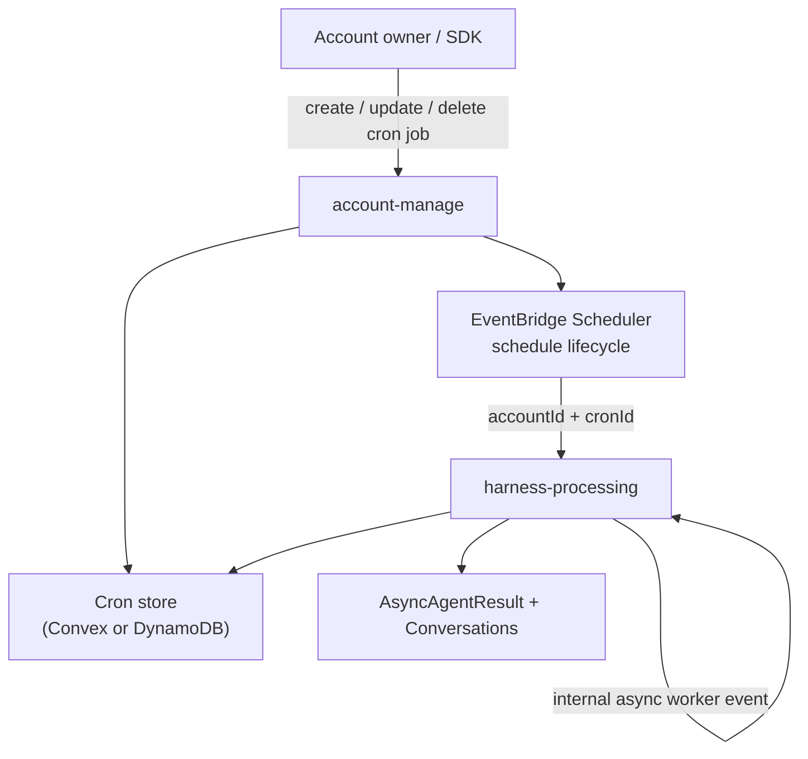

# Cron Jobs

Cron jobs start account agents on a schedule. They are included in the default infrastructure as a small add-on surface on top of the existing account and harness services.



## Model

Cron jobs store the selected agent and the run payload directly. The payload mirrors the agent run input: provide a single `input` string (wrapped into one user message) or a full `events` model-message list — exactly one of the two. The stored canonical form is always `events`.

```json
{
  "agentId": "agent_maintainer",
  "conversationKey": "cron:daily-maintenance",
  "input": "Run daily maintenance."
}
```

This keeps the add-on small. Developers who need custom workflow code can deploy their own Lambda, worker, or scheduler and call the existing direct/async API.

## Account API

Create:

```bash
curl -X POST "$ACCOUNT_SERVICE_URL/accounts/me/crons" \
  -H "Authorization: Bearer $ACCOUNT_SECRET" \
  -H "Content-Type: application/json" \
  -d '{
    "name": "Daily maintenance",
    "agentId": "agent_maintainer",
    "conversationKey": "cron:daily-maintenance",
    "input": "Run daily maintenance.",
    "scheduleExpression": "cron(0 8 * * ? *)",
    "timezone": "Europe/Amsterdam"
  }'
```

Supported schedule expressions are AWS EventBridge Scheduler expressions: `cron(...)`, `rate(...)`, and `at(...)`. The cron form is `cron(minutes hours day-of-month month day-of-week year)` — one of day-of-month / day-of-week must be `?`.

| Cadence | Expression |
| --- | --- |
| Every hour | `rate(1 hour)` |
| Every Monday 09:00 | `cron(0 9 ? * MON *)` |
| 1st of each month 08:00 | `cron(0 8 1 * ? *)` |
| Yearly, Jan 1 09:00 | `cron(0 9 1 1 ? *)` |
| Once, at a fixed time | `at(2027-01-01T09:00:00)` |

`timezone` maps to EventBridge Scheduler `ScheduleExpressionTimezone`. When omitted, schedules are evaluated in UTC. Use an IANA timezone such as `Europe/Amsterdam` when account owners expect local wall-clock time. This only controls schedule evaluation; it is not injected into the agent prompt.

Pause a job:

```bash
curl -X PATCH "$ACCOUNT_SERVICE_URL/accounts/me/crons/$CRON_ID" \
  -H "Authorization: Bearer $ACCOUNT_SECRET" \
  -H "Content-Type: application/json" \
  -d '{ "status": "paused" }'
```

Delete a job:

```bash
curl -X DELETE "$ACCOUNT_SERVICE_URL/accounts/me/crons/$CRON_ID" \
  -H "Authorization: Bearer $ACCOUNT_SECRET"
```

List jobs with `GET /accounts/me/crons` or fetch one with `GET /accounts/me/crons/{cronId}`. Responses include the run state: `status`, `lastInvokedAt`, `lastStatus`, and `lastError`. Paused jobs are skipped at invoke time.

## SDK and dynamic creation

Cron jobs are not limited to declarative `defineCron` resources synced by `bun run dev` — clients can create, update, and delete them at runtime through the SDK, which calls the same account API (so EventBridge Scheduler stays in sync):

```ts
import { FilthyPantyClient } from "filthy-panty";
import { api } from "./filthypanty/_generated/api";

const client = new FilthyPantyClient();

await client.createCron({
  name: "Weekly digest",
  agent: api.agents.support,
  input: "Summarize this week's tickets.",
  scheduleExpression: "cron(0 9 ? * MON *)",
  timezone: "Europe/Amsterdam",
});
```

Pass `events: [...]` instead of `input` for multimodal or multi-message payloads.
