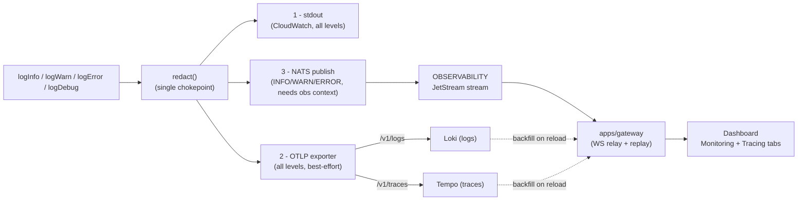
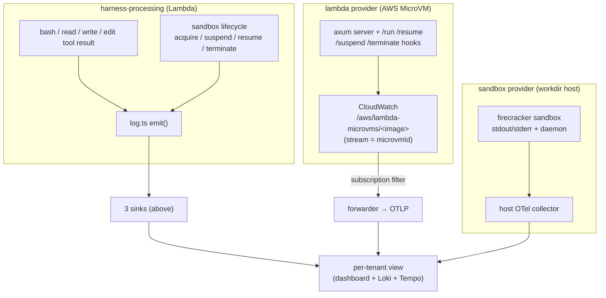

# Observability

Every log line and trace span the platform emits flows through **one redaction
chokepoint** and fans out to three sinks. This page describes that pipeline and how
**sandbox** activity (agent exec output, MicroVM runtime, and the workdir host) joins
it so the dashboard, Loki, and Tempo all see a single correlated stream per tenant.

## The three sinks

`functions/_shared/log.ts` `emit()` is the single place every line is redacted, then
written to:



- **stdout** — always, unmodified; the CloudWatch fallback and the source for metric
  filters (see [Runtime Telemetry](operations.md#runtime-telemetry)).
- **OTLP** — best-effort to `OTEL_EXPORTER_OTLP_ENDPOINT` (`/v1/logs`, `/v1/traces`),
  landing in **Loki** and **Tempo** as the long-term store.
- **NATS** — INFO/WARN/ERROR only, and only when an *observability context* is set
  (project + environment + endpoint id). This is the live path the dashboard tails.

A failure in any one sink never blocks the others, and never throws into the agent path.

## Tenant scoping

Logs and spans carry the same tenant attributes so a span, its logs, and the live
dashboard stream all correlate:

`account_id` · `project` · `environment` · `endpoint_id` · `agent_id` · `conversation_key` · `trace_id`

NATS subjects encode the routable subset (`functions/_shared/nats.ts`):

```
v1.<accountId>.<project>.<base64url(environment)>.{logs|traces}.<endpointId>
```

The durable **`OBSERVABILITY`** JetStream stream binds `v1.*.*.*.logs.>` and
`v1.*.*.*.traces.>`. Unlike the `WS_RESPONSES` resume buffer, it is **not** purged on
persist — it is the recent-history buffer (file-backed, ~2 h window) the gateway
replays on connect before tailing live. Loki/Tempo own everything older. See
[WebSocket Gateway](architecture.md#websocket-gateway-durable-nats-jetstream) for the
stream mechanics.

## Sandbox observability

A sandbox run produces logs in three places. The goal of this phase is that **all
three reach the same per-tenant view** with no change to the executor code.



**1 — In-band (already live, no executor work).** When the agent runs a tool inside a
sandbox, the result is logged through `log.ts` from within the harness process, where
the observability context is already set. Sandbox **lifecycle** events
(`microvm-executor.ts` / `workdir-executor.ts` / `daytona-executor.ts` calling
`logWarn`/`logInfo`) flow the same way. So exec output and lifecycle already appear on
the dashboard and in Loki/Tempo under the originating `endpointId` — correlated with
the model step that triggered them by `trace_id`. **No change to the executors is
required for this path.**

**2 — MicroVM runtime (CloudWatch → Loki/Tempo).** The MicroVM's own logs — build
hooks, the four lifecycle hooks, and the axum exec server — go to CloudWatch at
`/aws/lambda-microvms/<image>` with the stream keyed by `microvmId` (the execution role
already grants `logs:*` on `/aws/lambda-microvms/*`). A **CloudWatch subscription
filter** forwards these to a small forwarder that re-emits them as OTLP into the same
Loki/Tempo, tagged with `microvmId` so they join the sandbox instance that owns them.

**3 — workdir host (OTel collector → Loki/Tempo).** The self-hosted workdir node runs
an OTel collector (or promtail) that ships each Firecracker sandbox's stdout/stderr and
the daemon log into the same Loki/Tempo, tagged with the workdir sandbox id.

Both out-of-band paths (2 and 3) are **infra**, not core code — they are deploy-gated
follow-ups (see below).

## Security

- **One redaction chokepoint.** `log.ts` redacts by key name (deny exact/prefix/suffix
  lists) and scrubs every emitted string against the run's known secret values before
  any sink sees it. The same redaction applies to all three sinks.
- **Scoped credentials never enter a log.** The short-lived STS mount creds delivered
  to a sandbox are not logged by the harness; the out-of-band forwarders (paths 2 and 3)
  **must** apply the same redaction before shipping to Loki, since sandbox stdout is
  untrusted.
- The NATS sink skips any task without a deployment-scoped context (channel/cron paths),
  so it never publishes to a malformed subject; stdout + OTLP still capture those lines.

## Deploy-gated follow-ups (infra repo)

These complete paths 2 and 3 and live in the `infra` repo, not core:

- A **CloudWatch subscription filter** on `/aws/lambda-microvms/*` plus a forwarder that
  redacts and re-emits as OTLP to the cluster Loki/Tempo.
- The **workdir host OTel collector** config that ships sandbox + daemon logs into the
  same Loki/Tempo (set up once per workdir node).

Until they land, MicroVM/workdir *infrastructure* logs are still available at their
source (CloudWatch, the workdir host); the **agent-visible** exec and lifecycle activity
already reaches the dashboard via path 1.
