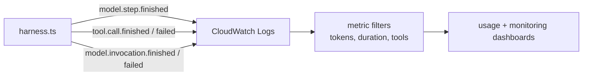

# Operations

## Configuration

`sst.config.ts` is the source of truth for infra names, tags, region, Lambda resources, DynamoDB tables, S3 bucket, and SST secrets.

Use `apps/core/.env` for local SST inputs only:

- `AWS_PROFILE`
- `SST_STAGE`
- `AWS_ACCOUNT_ID`, `PROJECT_NAME`, `PROJECT_OWNER_EMAIL` - Required by `sst.config.ts`; no in-source defaults.
- `ENABLE_DIRECT_API` - Deploys as `false` unless set to `true`; enables direct sync and async POST access to `harness-processing`.
- `ENABLE_WEBSOCKET` - Set to `true` to enable WebSocket gateway worker invocations.
- `NATS_URL` - Required when `ENABLE_WEBSOCKET=true`; ignored by the deployed Lambda when WebSocket is disabled. The transport is chosen by scheme: `wss://`/`ws://` (WebSocket, e.g. `wss://nats.beeblast.co` from the out-of-cluster Lambda) or `nats://`/`tls://` (core TCP, for future in-cluster callers).
- `NATS_TOKEN` - Token-auth credential for the NATS server; optional (omit for an unauthenticated server).
- `FILTHY_PANTY_WEBSOCKET_URL` - Optional SDK/demo override for WebSocket clients using a non-default or self-hosted gateway. The hosted SDK default is `app.beeblast.co`.

Runtime secrets are SST secrets. Generate your own secret and set

```bash
bunx sst secret set AdminAccountSecret <long-random-value>
bunx sst secret set AccountConfigEncryptionSecret <long-random-value>
bunx sst secret set DaytonaApiKey <daytona-api-key>
```

- `AdminAccountSecret` - Authenticates admin account-management requests.
- `AccountConfigEncryptionSecret` - Encrypts agent config payloads in DynamoDB.
- `DaytonaApiKey` - Daytona sandbox provider key; required by the deploy (no fallback).
- `KubernetesSandboxKubeconfig` - Optional; enables the Kubernetes sandbox provider.

Treat `AdminAccountSecret` and `AccountConfigEncryptionSecret` as stable production secrets; rotating the encryption secret requires a re-encryption migration for existing agent configs.

Provider API keys are account-specific, not global SST secrets. Each account-owned agent configures its provider API key in `config.provider.<provider>.apiKey`. Similarly, tool API keys like Tavily are configured per agent in `config.tools.<tool>.apiKey`. This allows different users to use their own API keys.

Public account creation is throttled by `ACCOUNT_SIGNUP_RATE_LIMIT_PER_HOUR`, currently set to `5` in `sst.config.ts`.

WebSocket gateway support is application infrastructure, not agent configuration. `sst.config.ts` fails early when `ENABLE_WEBSOCKET=true` is set without `NATS_URL`. At runtime, `harness-processing` also rejects `nats-worker` invocations unless WebSocket is enabled and the NATS connection can be established.

## Local Setup

Install dependencies:

```bash
bun install
```

Copy local config:

```bash
cp apps/core/.env.example apps/core/.env
```

Keep `apps/core/.env` for local SST config only. Do not put deployed secrets in that file. Demo scripts read their own env from `packages/demos/<name>/.env`.

## Run, Build, and Deploy

```bash
bun run dev
bun run check
bun run build
bun run deploy
```

`bun run deploy` runs `bun run build` first, then `sst deploy`.

Deploy outputs include:

- `accountServiceUrl`
- `agentServiceUrl`
- `mockWebhookSubscribeUrl`
- DynamoDB table names (dev/community stages; `undefined` on production, which stores config domains in Convex)
- `filesystemBucketName`, `skillsBucketName`, `toolBundlesBucketName`
- sandbox Lambda function names and `cronScheduleGroupName`

## Post-Deploy Account Setup

Create an account:

```bash
curl -X POST "$ACCOUNT_SERVICE_URL/accounts" \
  -H "Content-Type: application/json" \
  -d '{
    "username": "company-a",
    "description": "Company A account"
  }'
```

Store the returned `secret`. Use it for:

- `account-manage` self-service calls.
- `harness-processing` direct API calls.
- `/async` and `/status/{eventId}` calls.

Create an agent with model, tool, channel, workspace, skills, and optional subagent configuration before sending runtime traffic. Configure provider webhooks with the returned `accountId` and `agentId`:

```text
{AGENT_SERVICE_URL}/webhooks/{accountId}/{agentId}/telegram
{AGENT_SERVICE_URL}/webhooks/{accountId}/{agentId}/github
{AGENT_SERVICE_URL}/webhooks/{accountId}/{agentId}/slack
{AGENT_SERVICE_URL}/webhooks/{accountId}/{agentId}/discord
{AGENT_SERVICE_URL}/webhooks/{accountId}/{agentId}/pancake
{AGENT_SERVICE_URL}/webhooks/{accountId}/{agentId}/zalo
```

Provider credentials for each channel, plus model/tool settings, live on agent config. Reference the [API Reference](/api-reference) for the supported config shape.

## Channel Setup

Declare channel agents with the CLI SDK and run `filthy-panty dev` or `filthy-panty deploy`. The CLI prints the agent-scoped webhook URL after synchronization. Provider registration remains an explicit operation documented by the matching `packages/demos/channel-*` package; infrastructure deployment does not provision demo channel accounts.

## Live Probes

Example scripts use these environment variables:

```bash
export AGENT_SERVICE_URL=<agentServiceUrl>
export ACCOUNT_SERVICE_URL=<accountServiceUrl>
export ACCOUNT_GOOGLE_API_KEY=<googleApiKey>
export ACCOUNT_TAVILY_API_KEY=<tavilyApiKey>
```

Each script creates a temporary account through `ACCOUNT_SERVICE_URL/accounts`, runs the probe with the returned account secret, then deletes the test account through `DELETE /accounts/me` in a cleanup step.

Confirm the harness URL is live:

```bash
curl "$AGENT_SERVICE_URL"
```

Expected response:

```json
{
  "status": "ok",
  "method": "POST"
}
```

Run:

```bash
# Account management (Create, Update, Delete)
cd packages/demos/account && bun index.ts

# Stream SSE with tools
cd packages/demos/stream && bun index.ts

# Async endpoint with polling
cd packages/demos/async && bun index.ts
```

## CI

- GitHub Actions runs CI on pull requests and pushes; deploys run on pushes to `dev` (stage `dev`) and `main` (stage `production`). Docs-only changes are skipped.
- See [CI/CD](ci-cd.md) for the required repository secrets and variables.

## Runtime Telemetry

`harness-processing` writes compact JSON log lines for metric-bearing model and tool events so CloudWatch Logs Insights, metric filters, and dashboards can graph model usage without parsing SSE payloads.



Common fields:

- `eventType` - stable metric key, for example `model.step.finished` or `tool.call.finished`
- `accountId`, `agentId`, `conversationKey`, `eventId`
- `modelProvider`, `modelId`, `stepNumber`, `durationMs`
- `model.step.finished` carries per-model-call `durationMs`, the AI SDK `usage`, response ID/model/timestamp, provider metadata, warning counts, and tool call/result counts
- `model.invocation.finished` and `model.invocation.failed` carry final turn status, whole-run `durationMs`, AI SDK total token `usage`, step count, tool call count, `toolsUsed`, per-tool `toolUsage`, and compact `toolCalls` summaries
- `toolName`, `toolCallId`, and `durationMs` for tool events

Prompts, full tool inputs, tool outputs, request bodies, response bodies, and response headers are not logged by default. This keeps the CloudWatch stream useful for usage visualization while avoiding high-volume or sensitive payloads.
