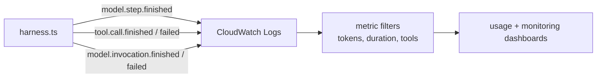

# Operations

This page covers both the **managed service** (`gateway.broods.app`) and **self-hosted** operations. Most day-to-day tasks use the CLI; self-hosted operators also manage SST infrastructure.

## CLI Commands

The `broods` CLI is the primary interface for both paths.

### Development

```bash
broods dev              # watch + sync Development + live-tail logs
broods dev --once       # sync once and exit (no watch, no logs)
broods diff             # show local vs remote diff
```

### Deployment

```bash
broods deploy           # sync Production
broods deploy --prune   # delete undeclared remote resources
broods deploy --rotate-key  # mint a fresh runtime API key
```

### Environment Variables

```bash
broods env set OPENAI_API_KEY    # store encrypted secret
broods env get OPENAI_API_KEY    # reveal value (audited)
broods env list                  # list names (values hidden)
broods env rm OPENAI_API_KEY     # remove variable
```

### Observability

```bash
broods stream           # live-tail project logs
broods logs --limit 100 # backfill + live-tail
broods logs --errors    # WARN+ only
```

### Agents

```bash
broods agent list       # list agents (name, public/private, model, deploy status)
broods agent get my-agent  # show resolved config
broods run my-agent "Hello"  # one-off run with pretty streaming
```

### Global Options

| Flag | Description |
| --- | --- |
| `--dashboard-url <url>` | Override dashboard URL |
| `--project <name>` | Override project name |
| `--env <name>` | Override target environment |

## Self-Hosted Configuration

For self-hosted deployments, `sst.config.ts` is the source of truth for infra names, tags, region, Lambda resources, DynamoDB tables, S3 bucket, and SST secrets.

Use `apps/core/.env` for local SST inputs only:

- `AWS_PROFILE`
- `SST_STAGE`
- `AWS_ACCOUNT_ID`, `PROJECT_NAME`, `PROJECT_OWNER_EMAIL` - Required by `sst.config.ts`; no in-source defaults.
- `ENABLE_DIRECT_API` - Deploys as `false` unless set to `true`; enables direct sync and async POST access to `harness-processing`.
- `ENABLE_WEBSOCKET` - Set to `true` to enable WebSocket gateway worker invocations.
- `NATS_URL` - Required when `ENABLE_WEBSOCKET=true`; ignored by the deployed Lambda when WebSocket is disabled. The transport is chosen by scheme: `wss://`/`ws://` (WebSocket, e.g. `wss://nats.beeblast.co` from the out-of-cluster Lambda) or `nats://`/`tls://` (core TCP, for future in-cluster callers).
- `NATS_TOKEN` - Token-auth credential for the NATS server; optional (omit for an unauthenticated server).
- `BROODS_WEBSOCKET_URL` - Optional SDK/demo override for WebSocket clients using a non-default or self-hosted gateway. The hosted SDK default is `gateway.broods.app`.

Runtime secrets are SST secrets. Generate your own secret and set

```bash
bunx sst secret set AdminAccountSecret <long-random-value>
bunx sst secret set AccountConfigEncryptionSecret <long-random-value>
bunx sst secret set DaytonaApiKey <daytona-api-key>
```

- `AdminAccountSecret` - Authenticates admin account-management requests.
- `AccountConfigEncryptionSecret` - Encrypts agent config payloads in DynamoDB.
- `DaytonaApiKey` - Daytona sandbox provider key; required by the deploy (no fallback).

Treat `AdminAccountSecret` and `AccountConfigEncryptionSecret` as stable production secrets; rotating the encryption secret requires a re-encryption migration for existing agent configs.

Provider API keys are account-specific, not global SST secrets. Each account-owned agent configures its provider API key in `config.provider.<provider>.apiKey`. Similarly, tool API keys like Tavily are configured per agent in `config.tools.<tool>.apiKey`. This allows different users to use their own API keys.

Public account creation is throttled by `ACCOUNT_SIGNUP_RATE_LIMIT_PER_HOUR`, currently set to `5` in `sst.config.ts`.

WebSocket gateway support is application infrastructure, not agent configuration. `sst.config.ts` fails early when `ENABLE_WEBSOCKET=true` is set without `NATS_URL`. At runtime, `harness-processing` also rejects `nats-worker` invocations unless WebSocket is enabled and the NATS connection can be established.

## Local Setup

Install dependencies:

```bash
bun install
```

Copy local config:

```bash
cp apps/core/.env.example apps/core/.env
```

Keep `apps/core/.env` for local SST config only. Do not put deployed secrets in that file. Demo scripts read their own env from `packages/demos/<name>/.env`.

## Run, Build, and Deploy

```bash
bun run dev
bun run check
bun run build
bun run deploy
```

`bun run deploy` runs `bun run build` first, then `sst deploy`.

Deploy outputs include:

- `accountServiceUrl`
- `agentServiceUrl`
- DynamoDB table names (dev/community stages; `undefined` on production, which stores config domains in Convex)
- `filesystemBucketName`, `skillsBucketName`, `toolBundlesBucketName`
- sandbox Lambda function names and `cronScheduleGroupName`

## Post-Deploy Account Setup (Self-Hosted)

When self-hosting, the CLI still handles tenant configuration. After `broods deploy` syncs your resources, the CLI prints the agent-scoped webhook URLs. Register them with your channel providers (see the [Channels overview](channels/index.md)).

If you need to create an account manually (e.g. for automated testing), use the admin `AdminAccountSecret`:

```bash
curl -X POST "$ACCOUNT_SERVICE_URL/accounts" \
  -H "Authorization: Bearer $ADMIN_ACCOUNT_SECRET" \
  -H "Content-Type: application/json" \
  -d '{"username": "company-a"}'
```

For day-to-day development, prefer the CLI-managed flow described in [Getting Started](getting-started.md).

## Channel Setup

Declare channel agents with the CLI SDK and run `broods dev` or `broods deploy`. The CLI prints the agent-scoped webhook URL after synchronization. Provider registration remains an explicit operation documented by the matching `packages/demos/channel-*` package; infrastructure deployment does not provision demo channel accounts.

## Public Access & Agent Commands

The public runtime endpoint (HTTP/SSE and WebSocket, authenticated with the environment runtime key) is **off by default** for each agent — secured. An agent only answers public-key requests when its config opts in:

```ts
export const myAgent = defineAgent({
  name: "my-agent",
  config: {
    // …model, provider, sandbox…
    publicAccess: true, // expose the public SSE/WebSocket endpoint
  },
});
```

When `publicAccess` is not set, a public-key request for that agent is refused with HTTP `403` (`{"error": "...", "code": "public_access_disabled"}`). Internal callers (account/admin secret), channel webhooks, and cron runs are never gated by this flag, so a private agent stays reachable through an internal endpoint or a channel webhook. The dashboard's agent **Public API** panel shows the toggle and hides the endpoint URLs while access is off.

The environment runtime key is encrypted at rest and recoverable by the owning user. The dashboard loads it automatically for Monitoring and Tracing, while `broods login` or `broods deploy` writes it to `BROODS_API_KEY` in `.env.local`. Dashboard and CLI sessions reuse the stored key without rotating it.

Logs and traces are published once to NATS and captured by a durable `OBSERVABILITY` JetStream stream (bound to the `*.logs.>` / `*.traces.>` subjects). See [Observability](observability.md) for the full pipeline, including how sandbox (MicroVM + workdir) logs route into the same per-tenant view. On (re)connect the gateway replays the recent window from that stream and then tails live, so the dashboard shows full-fidelity recent activity even for a run that happened while no tab was open — JetStream replay, not the slower/lossier core subscribe it replaced. Loki (logs) and Tempo (traces) remain the long-term store for history older than the replay window; the refresh control reloads from them. Because Tempo truncates large attributes on ingest, the dashboard prefers the richer/terminal copy of a span when the same span arrives from both sources, so a reload never downgrades a payload.

Tracing shows active and completed tasks with a started-time column, model input, reasoning, response, tool calls, tool input, and the tool output returned to the model. Each model step is decomposed into **time to first token** (queue/prefill wait), **streaming** (model token generation only), and **tool wait** (tool execution, also shown as the child tool spans) — streaming never folds in tool-execution time, so a slow tool can't be mistaken for slow generation. Channel webhooks and account-management operations resolve the same environment scope as direct agent calls, while dashboard configuration mutations emit scoped service audit events through the account-management service.

> Bringing your own custom domain to replace the generated endpoint URL is tracked as a future enhancement.

Inspect and test agents from the CLI:

```bash
broods agent list            # name, public/private, model, deploy status
broods agent get <name>      # model, sandbox, workspaces, tools, channels, webhook
broods run <name> "<prompt>" # one-off run; pretty-streams thinking, tool calls, results over SSE
```

`run` reaches the agent over the public endpoint, so it needs `publicAccess: true`; otherwise it reports the secured-by-default `403` with guidance to enable it.

For quick health checks, you can also run a one-off probe:

```bash
broods run my-agent "ping"
```

Or verify the harness URL directly:

## Live Probes

Example scripts use these environment variables:

```bash
export AGENT_SERVICE_URL=<agentServiceUrl>
export ACCOUNT_SERVICE_URL=<accountServiceUrl>
export ACCOUNT_GOOGLE_API_KEY=<googleApiKey>
export ACCOUNT_TAVILY_API_KEY=<tavilyApiKey>
```

Each script creates a temporary account through `ACCOUNT_SERVICE_URL/accounts`, runs the probe with the returned account secret, then deletes the test account through `DELETE /accounts/me` in a cleanup step.

Confirm the harness URL is live:

```bash
curl "$AGENT_SERVICE_URL"
```

Expected response:

```json
{
  "status": "ok",
  "method": "POST"
}
```

Run:

```bash
# Account management (Create, Update, Delete)
cd packages/demos/account && bun index.ts

# Stream SSE with tools
cd packages/demos/stream && bun index.ts

# Async endpoint with polling
cd packages/demos/async && bun index.ts
```

## CI

- GitHub Actions runs CI on pull requests and pushes; deploys run on pushes to `dev` (stage `dev`) and `main` (stage `production`). Docs-only changes are skipped.
- See [CI/CD](ci-cd.md) for the required repository secrets and variables.

## Runtime Telemetry

`harness-processing` writes compact JSON log lines for metric-bearing model and tool events so CloudWatch Logs Insights, metric filters, and dashboards can graph model usage without parsing SSE payloads.



Common fields:

- `eventType` - stable metric key, for example `model.step.finished` or `tool.call.finished`
- `accountId`, `agentId`, `conversationKey`, `eventId`
- `modelProvider`, `modelId`, `stepNumber`, `durationMs`
- `model.step.finished` carries per-model-call `durationMs`, the AI SDK `usage`, response ID/model/timestamp, provider metadata, warning counts, and tool call/result counts
- `model.invocation.finished` and `model.invocation.failed` carry final turn status, whole-run `durationMs`, AI SDK total token `usage`, step count, tool call count, `toolsUsed`, per-tool `toolUsage`, and compact `toolCalls` summaries
- `toolName`, `toolCallId`, and `durationMs` for tool events

Prompts, full tool inputs, tool outputs, request bodies, response bodies, and response headers are not logged by default. This keeps the CloudWatch stream useful for usage visualization while avoiding high-volume or sensitive payloads.
