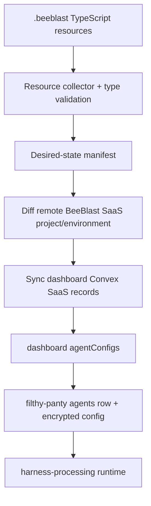
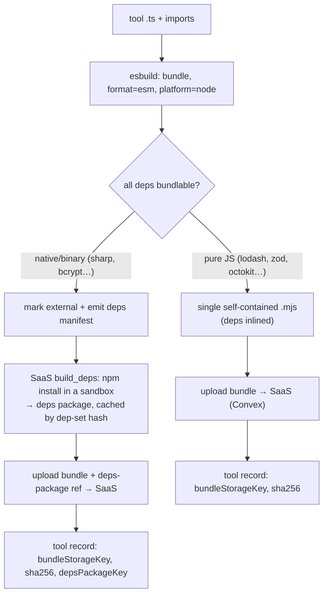

# BeeBlast CLI and TypeScript SDK Plan

> Status: planning. This document captures the selected direction for a Convex-like
> `beeblast` npm package that lets application teams define BeeBlast agents and
> account resources as TypeScript code.

## Goal

Build a TypeScript npm package named `beeblast` that provides both:

- a CLI (`npx beeblast ...`) for account/resource management and deployment
- an SDK for typed runtime invocation and resource definition

The CLI is an IaC workflow for BeeBlast agents. Users add a `.beeblast/` folder
inside their application repository, write normal TypeScript resource definitions,
and let the CLI sync those definitions to the BeeBlast SaaS project/environment
backed by Convex.

This product workflow is SaaS-first. It should align with `apps/dashboard` and
its Convex schema/functions, because CLI changes are applied directly to the
production SaaS control plane. DynamoDB-backed account-management paths in
`filthy-panty` are for the community open-source/self-hosted runtime and should
not drive the primary CLI architecture.

## Product Shape

`npx beeblast init` creates the minimal project shell:

```text
.beeblast/
  beeblast.config.ts
  generated/
    client.ts
    ids.ts
    types.ts
  .gitignore
  README.md
```

Users are not required to use fixed folders or filenames. The CLI scans
`.beeblast/**/*.ts`, excluding `.beeblast/generated/**`, loads exported resources,
and builds a desired-state manifest.

Example layout:

```text
.beeblast/
  beeblast.config.ts
  support.ts
  internal/coding-agent.ts
  cron/nightly.ts
  tools/github.ts
  generated/
```

Example resource code:

```ts
import { defineAgent, defineCronJob, defineWorkspace, env } from "beeblast";

export const docs = defineWorkspace("docs", {
  storage: { provider: "s3" },
  harness: { enabled: true },
});

export const support = defineAgent("support", {
  description: "Customer support agent",
  provider: {
    openai: { apiKey: env("OPENAI_API_KEY") },
  },
  model: {
    provider: "openai",
    modelId: "gpt-5-mini",
    temperature: 0.2,
  },
  agent: {
    system: "Answer customer support questions from the docs.",
    maxTurn: 20,
  },
  workspaces: [{ name: "docs", workspace: docs }],
  tools: {
    googleSearch: { enabled: true },
  },
});

export const nightlySummary = defineCronJob("nightly-summary", {
  schedule: "cron(0 9 * * ? *)",
  agent: support,
  prompt: "Summarize yesterday's unresolved support topics.",
});
```

## Type Strategy

The public CLI/SDK contract should inherit from the current `filthy-panty` API,
not from a parallel hand-written schema.

Primary public contract source of truth:

- `docs/api-reference/openapi.yaml`
- the Convex SaaS resource model in `packages/convex/`
- `packages/convex/model/agentConfigCodec.ts`
- current runtime-compatible config semantics from `functions/_shared/storage/accounts.ts`

The SDK should generate public API types from OpenAPI, then layer ergonomic
resource helpers on top. Helpers can be nicer than raw JSON, but must compile to
the same agent config shape that the SaaS sync layer writes into the
`filthy-panty` harness runtime.

```ts
type CreateAgentPayload = {
  name: string;
  description?: string;
  config: AgentConfig;
};
```

Strictness happens in three places:

1. TypeScript compile time through exported OpenAPI-derived types and resource
   helper generics.
2. Local runtime validation before sync using the same rules as the account API
   normalizers.
3. Convex/SaaS validation as the product authority, with the harness runtime
   validation as the final compatibility check.

## Convex-Like Resource API

Expose resource definition functions that feel close to Convex code-first APIs:

```ts
import {
  defineAgent,
  defineBeeBlast,
  defineCronJob,
  defineSandbox,
  defineWorkspace,
  env,
} from "beeblast";
```

Resource names are stable local identifiers. Remote IDs are generated after sync
and written to `.beeblast/generated/ids.ts`.

```ts
export const sandbox = defineSandbox("code-runner", {
  provider: "lambda",
  permissionMode: "ask",
  runtimes: ["bash", "node"],
});

export const workspace = defineWorkspace("repo", {
  storage: { provider: "s3" },
  harness: { enabled: true },
});

export const coder = defineAgent("coder", {
  provider: {
    openai: { apiKey: env("OPENAI_API_KEY") },
  },
  model: {
    provider: "openai",
    modelId: "gpt-5-mini",
  },
  agent: {
    system: "You are a coding assistant.",
  },
  sandbox,
  workspaces: [{ name: "repo", workspace }],
});
```

Secrets must not be committed. `env("OPENAI_API_KEY")` is a typed placeholder
that is resolved by the CLI against BeeBlast SaaS encrypted environment
variables or local development environment values.

## Config

`.beeblast/beeblast.config.ts` maps the local project to BeeBlast SaaS project
and environment targets.

```ts
import { defineBeeBlast } from "beeblast";

export default defineBeeBlast({
  project: "my-app",
  environments: {
    dev: "development",
    deploy: "production",
  },
});
```

Default command behavior:

- `beeblast dev` syncs to the configured development environment.
- `beeblast deploy` syncs to the configured production/deploy environment.
- `--env <name>` overrides the target environment.

## CLI Commands

MVP commands:

```bash
npx beeblast init
npx beeblast login
npx beeblast dev
npx beeblast diff
npx beeblast deploy
npx beeblast run <agent> <prompt>
npx beeblast env set <name>
npx beeblast logs
```

Follow-up commands:

```bash
npx beeblast pull
npx beeblast destroy <resource>
npx beeblast agents list
npx beeblast workspaces list
npx beeblast sandboxes list
npx beeblast cron-jobs list
```

Behavior:

- `dev` watches `.beeblast/`, debounces changes, validates locally, diffs
  against the remote environment, syncs non-destructive changes, and regenerates
  types.
- `deploy` applies the desired manifest to the deploy environment.
- `diff` shows local desired state vs remote state.
- `destroy` removes explicit resources after confirmation.
- `deploy --prune` can remove remote resources no longer declared locally.
- `dev` should not auto-delete resources; it should report orphaned resources
  and ask users to prune/destroy explicitly.

## SaaS Sync Path

The CLI deploys into the BeeBlast SaaS project/environment model first. Existing
SaaS sync code then bridges agent configs into the harness runtime.



This should align with the current `dashboard` model:

- projects
- environments
- `agentConfigs`
- `agentDeployments`
- skills
- cron jobs
- logs
- account provisioning

The CLI must prefer SaaS/Convex APIs for project-level orchestration. Direct
`filthy-panty` account-management API calls remain useful for lower-level SDK
operations, compatibility tests, and the community open-source/self-hosted path,
but they are not the source of truth for the hosted BeeBlast product.

## SaaS vs Community Runtime

BeeBlast has two related but distinct surfaces:

- **Hosted SaaS product:** `apps/dashboard` + Convex. This is the primary target
  for `beeblast dev`, `beeblast deploy`, generated IDs, project/environment
  management, logs, deployment history, billing-aware features, and production
  resource state.
- **Community/self-hosted runtime:** this `filthy-panty` repo's direct
  account-management and harness APIs, including DynamoDB-backed storage. This
  remains useful for open-source deployments and runtime compatibility, but the
  CLI should not be architected around DynamoDB tables or direct Dynamo-specific
  storage details.

The CLI may still use OpenAPI/runtime types from `filthy-panty` to guarantee
that SaaS-authored agents remain compatible with the harness, but product
resource lifecycle should be defined against Convex SaaS concepts.

## Generated Files

After every successful `dev` sync, `deploy`, or explicit codegen:

```text
.beeblast/generated/
  api.ts
  client.ts
  ids.ts
  resources.ts
  types.ts
```

Examples:

```ts
// .beeblast/generated/ids.ts
export const agents = {
  support: "agent_...",
} as const;

export const workspaces = {
  docs: "ws_...",
} as const;
```

```ts
// app code
import { beeblast } from "./.beeblast/generated/client";

await beeblast.agents.support.run({
  conversationKey: "user_123",
  input: "Help me reset my password",
});
```

Recommendation: commit generated IDs/types when the app imports them. Ignore
temporary caches, compiled manifests, and local credentials.

## Package Boundary

Yes, the first implementation should live in this codebase so it can share the
runtime-compatible types, OpenAPI contract, and tests with `filthy-panty`.
The package should still be structured as a clean npm package boundary rather
than mixed into Lambda code.

Start with one package:

```text
packages/beeblast/
  package.json
  src/
    cli/
    client/
    config/
    generated-openapi/
    resources/
    sync/
  tests/
```

Initial exports:

- resource helpers: `defineAgent`, `defineWorkspace`, `defineSandbox`,
  `defineCronJob`, `defineBeeBlast`, `env`
- client: `BeeBlastClient`
- OpenAPI-derived request/response types
- resource manifest types

Later, split package boundaries only if needed:

- `beeblast` as the public CLI + SDK
- `@beeblast/core` for shared internals
- `@beeblast/openapi` for generated public API types

Root workspace updates:

- add `packages/beeblast/package.json`
- update the root `package.json` workspace/build/test scripts if needed
- keep Lambda deployment scripts (`bun run build`, `bun run deploy`) separate
  from npm package publishing
- keep generated OpenAPI type output deterministic and checked by CI

The package should not import Lambda handlers or storage provider internals.
Shared public contracts can move into a small shared module only when both the
Lambda runtime and CLI need them. Avoid coupling the CLI to DynamoDB-specific
implementation details.

## NPM Package and Release

Publish target:

- package name: `beeblast`
- binary: `beeblast`
- install/run path: `npm install beeblast` or `npx beeblast`
- module format: ESM
- runtime target: current maintained Node.js LTS, with Bun support where easy

`packages/beeblast/package.json` should include:

```json
{
  "name": "beeblast",
  "type": "module",
  "bin": {
    "beeblast": "./dist/cli/index.js"
  },
  "exports": {
    ".": {
      "types": "./dist/index.d.ts",
      "import": "./dist/index.js"
    }
  },
  "files": [
    "dist",
    "README.md",
    "LICENSE.md"
  ]
}
```

Build outputs:

- `dist/index.js`
- `dist/index.d.ts`
- `dist/cli/index.js` with a Node shebang
- generated OpenAPI types bundled into `dist`

Recommended release flow:

1. CI checks package build, typecheck, tests, and package contents.
2. Version bump is explicit through changesets or a release script.
3. GitHub Actions publishes to npm on tagged releases or GitHub Releases.
4. Publish uses npm provenance/trusted publishing if available.

Add CI/CD workflow:

```text
.github/workflows/npm-publish.yml
```

Responsibilities:

- run root checks that protect shared contracts
- run `packages/beeblast` tests
- build the package
- run `npm pack --dry-run` or equivalent package inspection
- publish only on release tags such as `beeblast-v*` or a manual release
  workflow dispatch

The npm publish workflow must not run `bun run deploy` and must not deploy SST
infrastructure.

## Tool Code: Bundling and npm Dependencies

Account tools are user-authored TypeScript that runs in the BeeBlast sandbox. The
CLI owns the bundling step (exactly like Convex's CLI), so the runtime only ever
receives runnable code and never has to guess intent from a raw uploaded string.

### Authoring

Tools live alongside other resources, e.g. `.beeblast/tools/github.ts`, and import
npm packages normally:

```ts
import { defineTool } from "beeblast";
import { Octokit } from "@octokit/rest"; // ordinary npm import

export const githubIssue = defineTool("github_issue", {
  description: "Open a GitHub issue.",
  input: { type: "object", properties: { repo: { type: "string" }, title: { type: "string" } } },
  async execute(ctx, input) {
    const gh = new Octokit({ auth: ctx.config.token });
    return await gh.issues.create({ /* ... */ });
  },
});
```

### What the CLI does on `dev` / `deploy`



1. The CLI runs **esbuild** on the tool source (`format: esm`, `platform: node`,
   `target` = the sandbox runtime's Node version) into one bundle.
2. **Pure-JS dependencies are inlined** into that single file — the common case for
   almost all tools. No deps package, no server build. This directly answers the
   "what happens when a user imports an npm dep" question: *import `lodash` → the CLI
   inlines it → the runtime gets one self-contained file → it just runs.* (This is
   also why the runtime can keep inlining small bundles into the exec payload.)
3. **Native/binary modules** (`sharp`, `bcrypt`, anything shipping `.node` addons or
   making `require`-time fs/arch assumptions) cannot be inlined. esbuild marks them
   `external` and the CLI emits a deps manifest (the external subset of
   `package.json` plus lockfile pins).

### Deps packages (only when a tool has native deps — the Convex model)

When external deps exist, the CLI hands the manifest to the SaaS, which runs a
**`build_deps` job** (mirrors Convex): an isolated `npm install` whose output is a
zipped `node_modules` **package cached by a hash of the resolved dep set**, built
once and reused by every tool/version sharing those deps. The tool record then
references the deps-package key. At runtime the sandbox worker loads the bundle and,
if a deps package is referenced, fetches + unpacks it so `import "sharp"` resolves.

### Why this must be CLI-driven (vs. server-side or self-hosted)

Dependency classification (bundle vs external), lockfile pinning, and triggering the
server build are only knowable at author/build time — the same reason Convex couples
it to its CLI. The community/self-hosted `filthy-panty` path keeps the current
contract unchanged: **upload a self-contained single-file bundle** (no CLI, no native
deps); a bare unbundled `import` simply fails at runtime with a clear error.

### Phasing

- **v1 — single-file bundles only.** CLI esbuilds and inlines pure-JS deps; native
  deps produce a clear CLI error with guidance. Covers ~all tools, **no server build
  pipeline required**.
- **v2 — deps packages.** Add the SaaS `build_deps` job + deps-package cache + worker
  loading, *only* when native modules are a real product requirement.

> Execution-runtime note: bundling/storage is SaaS/CLI-owned, but tool **execution**
> stays in the BeeBlast sandbox (a warm resident Node worker per reserved sandbox),
> not in Convex actions — Convex actions are trusted deploy-time functions and cannot
> safely run arbitrary per-account code. See the runtime cold-start work in
> `docs/workspace/sandbox/`.

## Test Strategy

Implementation should include tests from the first package commit. Minimum test
coverage by area:

- **OpenAPI type generation:** generated types are deterministic and include
  `AgentConfig`, direct API request/status types, cron job types, sandbox types,
  and workspace types.
- **Resource DSL:** `defineAgent`, `defineWorkspace`, `defineSandbox`,
  `defineCronJob`, `defineBeeBlast`, and `env` produce the expected manifest
  objects.
- **Type-level tests:** valid resource definitions compile; invalid provider,
  model, workspace binding, or cron definitions fail type checks.
- **Manifest compiler:** scans arbitrary `.beeblast/**/*.ts`, ignores
  `.beeblast/generated/**`, catches duplicate names, catches broken references,
  and preserves stable resource identity.
- **Diff engine:** reports create/update/delete/orphaned resources without
  mutating remote state.
- **Dev watcher:** debounces file changes and performs non-destructive sync.
- **Generated files:** writes stable `generated/ids.ts`, `generated/client.ts`,
  `generated/types.ts`, and `generated/resources.ts`.
- **CLI commands:** `init`, `diff`, `deploy --dry-run`, `run`, and `env set`
  have command-level tests with mocked SaaS APIs.
- **SaaS sync client:** mocks Convex/SaaS API calls and verifies the payload
  shape sent for projects, environments, agent configs, skills, cron jobs, and
  variables.
- **Runtime client:** tests SSE parsing, async job submission, status polling,
  and error handling against mocked HTTP responses.

Suggested test tooling:

- use `bun test` for runtime/unit tests to match the repo
- use `tsc --noEmit` or a type-test tool for compile-time assertions
- use fixture projects under `packages/beeblast/tests/fixtures/`
- use mocked network clients; do not hit production SaaS in unit tests

Root scripts should eventually include package checks, for example:

```json
{
  "scripts": {
    "test": "bun test --max-concurrency=1",
    "test:beeblast": "bun test packages/beeblast/tests",
    "check:beeblast": "bunx tsc -p packages/beeblast/tsconfig.json --noEmit",
    "build:beeblast": "bun run --cwd packages/beeblast build"
  }
}
```

CI acceptance for implementation:

- root tests stay green
- `check:beeblast` passes
- `test:beeblast` passes
- `build:beeblast` produces npm-ready `dist`
- package dry-run includes only expected files
- no SST deploy happens during npm CI

## Implementation Phases

### Phase 1: Public Type Contract

- Generate TypeScript types from `docs/api-reference/openapi.yaml`.
- Export API request/response types from `beeblast`.
- Add type tests that verify `defineAgent(...).toCreatePayload()` satisfies the
  OpenAPI-derived create-agent payload type.
- Reuse current `AgentConfig` semantics and validation rules.
- Add initial package build, package typecheck, and npm dry-run checks.

### Phase 2: Project Shell and Manifest Compiler

- Implement `beeblast init`.
- Implement `.beeblast/**/*.ts` discovery.
- Load `beeblast.config.ts`.
- Collect exported resources into a normalized manifest.
- Validate resource references and duplicate names.
- Generate `.beeblast/generated/resources.ts` locally.
- Add fixture-based compiler and CLI tests.

### Phase 3: Account Login and SaaS Sync

- Add `beeblast login` against BeeBlast SaaS.
- Resolve org, project, and environment.
- Sync through SaaS/Convex APIs rather than DynamoDB/account-management storage
  internals.
- Implement non-destructive `diff`.
- Implement `dev` watch mode and type generation.
- Implement `deploy`.
- Add mocked SaaS sync tests and dry-run deployment tests.

### Phase 4: Runtime Client

- Implement `BeeBlastClient`.
- Implement typed direct API calls, SSE parsing, async jobs, and status polling.
- Generate `.beeblast/generated/client.ts` and `.beeblast/generated/ids.ts`.
- Add `beeblast run <agent> <prompt>`.
- Add runtime client tests for SSE, async status polling, and typed agent IDs.

### Phase 5: Destructive and Advanced Workflows

- Add explicit `destroy`.
- Add `deploy --prune`.
- Add `pull` from SaaS to local resource code/manifest.
- Add npm publish workflow once the package API is stable enough for external
  prereleases.

### Phase 6: Hosted Tool Bundling and Dependencies

See "Tool Code: Bundling and npm Dependencies" above for the full design.

- **v1 (single-file):** `beeblast dev`/`deploy` esbuilds each `defineTool` source,
  inlines pure-JS deps into one ESM bundle, computes sha256, and uploads it through
  the SaaS to the tool record (`bundleStorageKey`). Native deps fail fast with a
  clear CLI error. Add bundler tests (inlining, tree-shaking, deterministic output)
  and a clear "unbundlable native module" diagnostic.
- **v2 (deps packages):** add the SaaS-side `build_deps` job (sandboxed `npm
  install` → hashed, cached deps package), a `depsPackageKey` on the tool record,
  and runtime worker loading of the deps package. Gate on a real native-module need.

## Open Decisions

- Whether resource names are unique per project/environment globally or only per
  resource type.
- Whether `beeblast deploy` requires `--env production` until a deploy target is
  configured.
- Whether user-defined tools are external HTTP callbacks in v1 or hosted
  TypeScript code. (Leaning hosted TS via CLI esbuild bundling — see "Tool Code:
  Bundling and npm Dependencies".)
- Inline size threshold for shipping a tool bundle in the exec payload vs. fetching
  it (runtime currently inlines ≤64 KB; align the CLI's "warn if large" cutoff).
- Whether `build_deps` (v2) runs as a SaaS/Convex job, a dedicated sandbox pod, or
  a CI step — and which native modules are officially supported.
- Whether deps packages are mounted into the warm worker pod or fetched+unpacked
  per cold pod, and how they are cache-keyed (dep-set hash) and evicted.
- Whether SaaS exposes a dedicated CLI API or the CLI calls existing Convex
  functions/actions directly. The target must remain Convex/SaaS, not DynamoDB.
- How to represent deployment history and rollback in the SaaS model.
