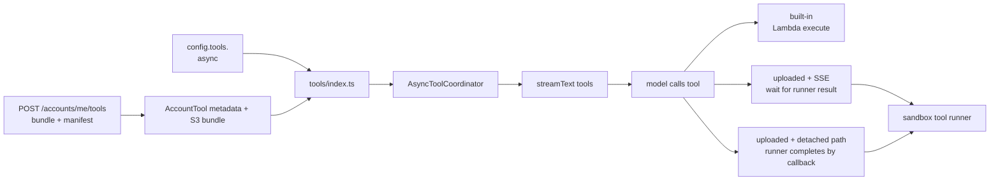
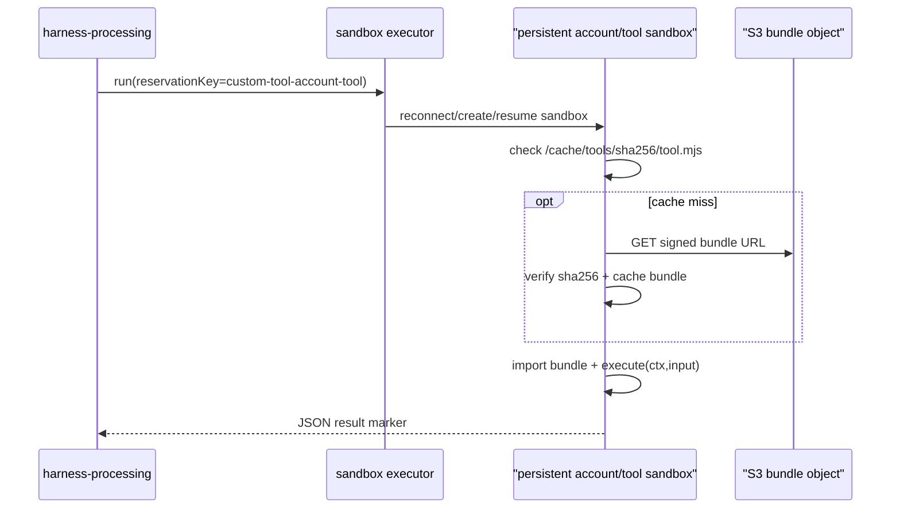
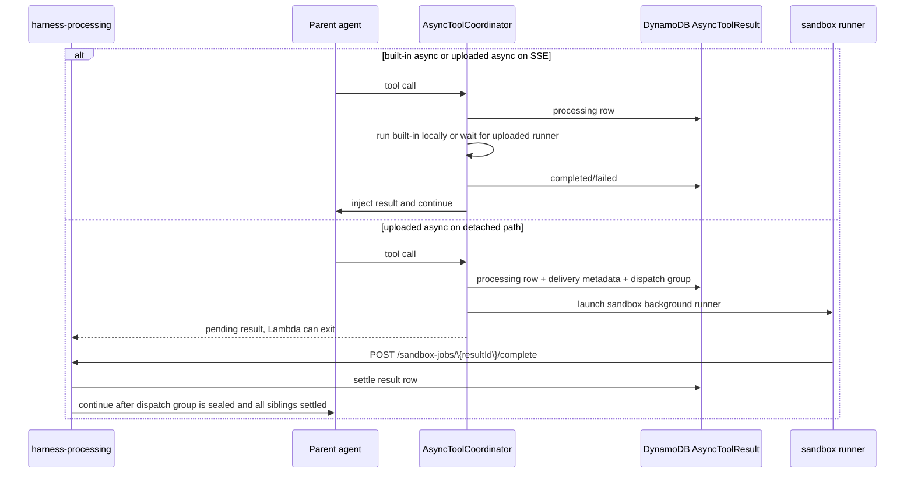

# External Tools

This guide covers agent-configured external tools: built-in tools such as Tavily/Google Search and account-uploaded custom tools. It does not cover the sandbox tools (`bash`, `read`, `write`, `edit`, `glob`, `grep` — see [Workspace & Sandbox](workspace/index.md)), `load_skill`, or `run_subagent`.

External tools are enabled per agent through `config.tools`. Built-in keys use their static name. Uploaded custom tools use their account-scoped `toolId` key, and the uploaded manifest supplies the model-facing name, description, and input schema. Uploaded tool code executes in a self-hosted `sandbox` (workdir Firecracker) runner, not inside `harness-processing`.



## Current Tools

| Tool | File | External dependency | Config key |
| --- | --- | --- | --- |
| `tavilySearch` | [`functions/harness-processing/tools/tavily.tool.ts`](https://github.com/beeblastco/broods/blob/dev/apps/core/functions/harness-processing/tools/tavily.tool.ts) | Tavily AI SDK search | `config.tools.tavilySearch` |
| `tavilyExtract` | [`functions/harness-processing/tools/tavily.tool.ts`](https://github.com/beeblastco/broods/blob/dev/apps/core/functions/harness-processing/tools/tavily.tool.ts) | Tavily AI SDK extract | `config.tools.tavilyExtract` |
| `googleSearch` | [`functions/harness-processing/tools/google-search.tool.ts`](https://github.com/beeblastco/broods/blob/dev/apps/core/functions/harness-processing/tools/google-search.tool.ts) | Google provider-defined tool | `config.tools.googleSearch` |
| `handoffs` | [`functions/harness-processing/tools/handoffs.tool.ts`](https://github.com/beeblastco/broods/blob/dev/apps/core/functions/harness-processing/tools/handoffs.tool.ts) | Pancake tags + Zalo staff ping | `config.tools.handoffs` (`pancake.scenarioTagIds.{order,pending}`, `zalo.{botToken,notifyUserIds}`) |
| `async_status` | [`functions/harness-processing/tools/async-status.tool.ts`](https://github.com/beeblastco/broods/blob/dev/apps/core/functions/harness-processing/tools/async-status.tool.ts) | — (auto-registered, see below) | — |
| Uploaded custom tool | S3 bundle + account tool metadata | sandbox tool runner | `config.tools.<toolId>` |

`async_status` is not configured directly: it is registered automatically whenever any `config.tools` entry has `async: true` or a workspace has a persistent sandbox. It is the model-facing polling surface for the async lifecycle described below (`statusId` + actions `status`/`logs`/`stop`).

Sandbox tools come from a referenced `sandbox` (+ `workspaces`) — see [Workspace & Sandbox](workspace/index.md). Skills use `config.skills`; see [Skills](skills.md). Subagents use `config.subagent`.

## Runtime Behavior

`functions/harness-processing/harness.ts` resolves the configured model and calls `createTools()` from [`functions/harness-processing/tools/index.ts`](https://github.com/beeblastco/broods/blob/dev/apps/core/functions/harness-processing/tools/index.ts).

Tool registry path:

1. `createTools()` rejects unknown `config.tools` names.
2. The sandbox tools come from a referenced `sandbox`: `bash` (stateless) when there is no workspace; per workspace, the full `read`/`write`/`edit`/`glob`/`grep`/`bash` set when it has an effective sandbox, or read-only `read`/`glob` when it has none (via a read-only mount by default, or direct S3 with the `sandbox: null` opt-out). Approvals follow that workspace's `permissionMode`.
3. `run_subagent` comes only from `config.subagent`.
4. `load_skill` comes from `config.skills`.
5. Built-in tools come from the static `toolFactories` map.
6. `tool_*` config keys load account-owned uploaded tool metadata and expose the uploaded model-facing tool name.
7. `needsApproval` is applied before tools are passed to `streamText()`.
8. Local `execute` tools with `async: true` are wrapped by `AsyncToolCoordinator`.

Built-in local tools execute during the current `harness-processing` request. Uploaded custom tools run in a persistent `sandbox` (workdir) runner keyed by account/tool. `harness-processing` creates a local sandbox executor client, but that does not mean a new sandbox is created for each call: `persistent: true` selects the reserved-sandbox path, and the stable account/tool `reservationKey` becomes the deterministic reserved-sandbox identity. Change the reservation key and the executor will address a different sandbox; keep it stable and it reconnects to the existing sandbox, creates it on first use, or resumes it after idle standby.

Runners get a network egress policy allowing the public internet only — host IPs, the node metadata service, and other private ranges are blocked, so uploaded tool code can call external APIs and the result callback but nothing on the private network.

Each call prefers the **resident worker**: a long-lived in-sandbox Node process serving HTTP over a unix socket (`/invoke` + `/health`), started on first use and reused across calls. The Lambda sends the tool input, merged config, the bundle (inlined base64 when ≤ 64 KB, otherwise a short-lived signed URL), bundle hash, and async metadata. The worker verifies the cached bundle under `/cache/tools/<sha256>` first, downloads only on cache miss, verifies the downloaded hash, imports the default export, calls `execute(ctx, input)`, and returns NDJSON frames. A short `exec` heredoc runner remains as fallback when the worker produces no frames. `$HOME/.cache/tools` and `/tmp/cache/tools` are fallback cache roots for images that do not expose `/cache/tools`.



### Resident Worker

The long-lived Node worker ([`custom-tool-worker.ts`](https://github.com/beeblastco/broods/blob/dev/apps/core/functions/harness-processing/tools/custom-tool-worker.ts)) is started inside the persistent sandbox on first use:

```text
harness-processing -> exec into sandbox -> warm worker (unix-socket HTTP) -> cached module -> execute(ctx,input)
```

It keeps loaded modules in process memory (keyed by bundle hash, so a tool update loads the new module), serves only over a local unix socket, and is health-checked before each invoke. If the worker yields no frames, the call falls back to the one-shot `exec` heredoc runner.

### Streaming partial output (sync)

A bundle whose `execute` is an async generator streams partial output. The resident worker returns NDJSON frames over the unix socket — one `chunk` frame per `yield`, then `end` (or a single `final` for a normal return, or `error` on throw) — and the executor surfaces them as an async iterable. The AI SDK turns each yield into a **preliminary tool result** on the sync SSE stream; the last yield is the final output the model sees. Auto-detected per call: a non-generator `execute` behaves exactly as before. Streaming is live only on the resident-worker path; the one-shot runner fallback drains the generator to its last value.

```ts
// uploaded bundle — yields stream as preliminary results, last yield is final
export default {
  async *execute(ctx, input) {
    yield { type: "text", value: "working…" };
    yield { type: "text", value: "done: " + input.q };
  },
};
```

```text
worker NDJSON:  {"t":"chunk",...}  {"t":"chunk",...}  {"t":"end"}
SSE fullStream: tool-result(preliminary) … tool-result(preliminary) … tool-result(final)
```

When `config.tools.<name>.async` is `true`, the platform chooses the lifecycle from the tool type and request path:

| Tool type | Request path | Tool code runs in | Lambda waits? | Result completion | Model continuation |
| --- | --- | --- | --- | --- | --- |
| Built-in sync | all paths | `harness-processing` Lambda | Yes | tool `execute()` return value | same active agent loop |
| Built-in async | all paths | `harness-processing` Lambda | Yes | tool `execute()` return value | same active agent loop injects result |
| Uploaded sync | all paths | sandbox runner | Yes | runner returns final result | same active agent loop |
| Uploaded async | SSE | sandbox runner | Yes | runner returns final result | same SSE Lambda injects result and streams final answer |
| Uploaded async | `/async`, channel, NATS | sandbox background runner | No | token-authenticated completion endpoint | new continuation Lambda injects result |

SSE is the only path that must wait for uploaded async tools. The open SSE response belongs to the current Lambda invocation, so a later callback cannot write to that response without a separate broker/reconnect protocol. Detached paths already have a polling, channel, or NATS delivery target, so uploaded async tools are launched as sandbox background work and complete through the existing settle-and-continue pipeline.



Detached uploaded async tools complete through a token-authenticated callback generated by the platform:

```http
POST /sandbox-jobs/{resultId}/complete
x-job-token: <per-result-token>
```

```json
{
  "status": "completed",
  "response": { "answer": "done" }
}
```

or:

```json
{
  "status": "failed",
  "error": "External job failed"
}
```

The uploaded tool does not need account secrets for platform completion. On detached paths, `ctx.asyncTool.completePath` points at the token-authenticated completion route and `ctx.asyncTool.completionToken` carries the per-result token. The platform runner posts the final `execute()` result itself. If a future tool needs to hand completion to a separate external service without waiting, add an explicit defer contract first; do not reintroduce a public lifecycle switch.

Detached uploaded async completion path:

1. The wrapper creates one `AsyncToolResult` row for each async tool call.
2. For detached uploaded async, the wrapper also registers the `resultId` in a dispatch-group item in the same `AsyncToolResult` table.
3. The sandbox runner launches the uploaded tool as background work and returns the pending result to the model.
4. The runner calls `POST /sandbox-jobs/{resultId}/complete` when it finishes. It does not write DynamoDB directly.
5. The completion handler settles that `AsyncToolResult` row.
6. When the parent model pass has registered all detached calls, the group is sealed.
7. The parent continues only after the sealed group has every sibling row completed or failed.
8. Direct async completions re-drive the async worker. NATS completions invoke `nats-worker` with stored connection metadata.

Notes:

- The continuation loop waits only for in-memory pending work: built-in async and uploaded async on SSE. Detached uploaded async does not add pending work.
- The original `/async` status row is settled through `asyncResultEventId`; the internal continuation uses a separate event id for dedupe.
- Current fan-in is DynamoDB, but it is not a separate table. The dispatch group is an item in the existing `AsyncToolResult` table.
- Future: when NATS uses JetStream, missed WebSocket stream chunks can be replayed from persisted stream/consumer state. Until then, NATS continuation reaches the client only while the gateway/client remains subscribed.

> Warning: Provider-defined tools without local `execute`, such as Google Search, cannot use this wrapper. If `async: true` is configured for one of those tools, the runtime logs a warning and leaves the tool in its normal provider-defined behavior.

For sync direct API callers, approval requests are streamed as SSE and persisted in the conversation. The caller resumes the turn by sending a direct API `tool-approval-response`. Channel webhooks cannot complete approval; the handler denies channel approval requests with a channel-visible error.

> TODO: Add channel webhook support for completing tool approval requests when channel-safe approval UX is available.

## Code-First Configuration

Use `config.tools` inside `defineAgent` for built-in tools:

```ts title="broods/index.ts"
import { defineAgent, env } from "broods";

export const myAgent = defineAgent({
  name: "my-agent",
  config: {
    provider: { openai: { apiKey: env.OPENAI_API_KEY } },
    model: { provider: "openai", modelId: "gpt-5.5" },
    tools: {
      tavilySearch: {
        enabled: true,
        apiKey: env.TAVILY_API_KEY,
        searchDepth: "advanced",
        maxResults: 5,
      },
      tavilyExtract: { enabled: true, apiKey: env.TAVILY_API_KEY },
      googleSearch: { enabled: true },
    },
  },
});
```

For uploaded custom tools, use `defineTool` and reference it by name in the agent config:

```ts title="broods/index.ts"
import { defineAgent, defineTool, env } from "broods";

export const analyze = defineTool({
  name: "analyze",
  config: {
    path: "tools/analyze.ts",
    description: "Analyze structured data.",
    inputSchema: {
      type: "object",
      properties: { data: { type: "array" } },
      required: ["data"],
    },
  },
});

export const myAgent = defineAgent({
  name: "my-agent",
  config: {
    tools: {
      [analyze.name]: {
        enabled: true,
        async: true,
        needsApproval: false,
      },
    },
  },
});
```

The CLI bundles the tool source into ESM, hashes it, and uploads it on sync. Agent references are rewritten to the deployed tool ID automatically.

Omitting a tool disables it. Setting `enabled: false` also disables it. Set `needsApproval: true` when the tool should require the AI SDK approval flow before execution.
Set `async: true` when a local `execute` tool may take long enough that the parent agent should keep working while the result is produced.
For uploaded tools, `config` is merged over the upload-time `defaultConfig` and passed to `ctx.config`. Uploaded tool code always runs in the `sandbox` provider; the platform decides whether to wait or detach from the request path.

See [`packages/demos/tool-custom-async-sse`](https://github.com/beeblastco/broods/tree/dev/packages/demos/tool-custom-async-sse) for a runnable direct SSE example that uploads `test_async`, enables `config.tools.<toolId>.async`, and asks the agent to call the uploaded tool. [`packages/demos/tool-custom-stream`](https://github.com/beeblastco/broods/tree/dev/packages/demos/tool-custom-stream) covers the streaming variant. Uploaded tools continue to execute in the isolated `sandbox` worker, including when their agent is reached through a channel.

The full config field reference lives in the [API Reference](/api-reference) under `AgentConfig.tools`.

## Upload a Custom Tool

With the CLI, point `defineTool()` at a TypeScript or JavaScript entrypoint under `broods/`. The CLI bundles it as self-contained Node ESM, rejects source or output over 1 MB, hashes the compiled bundle, and uploads it through manifest sync. Agent references are rewritten to the deployed tool ID.

```ts title="broods/tools/my-tool.ts"
export default {
  name: "my_tool",
  description: "A custom tool that does something useful.",
  inputSchema: {
    type: "object",
    properties: { query: { type: "string" } },
    required: ["query"],
  },
  async execute(ctx, input) {
    return { type: "text", value: `Result for ${input.query}` };
  },
};
```

```ts title="broods/index.ts"
import { defineAgent, defineTool } from "broods";
import { api } from "./_generated/api";

export const myTool = defineTool({
  name: "my_tool",
  config: {
    path: "tools/my-tool.ts",
    description: "A custom tool.",
    inputSchema: {
      type: "object",
      properties: { query: { type: "string" } },
      required: ["query"],
    },
  },
});

export const myAgent = defineAgent({
  name: "my-agent",
  config: {
    tools: {
      [myTool.name]: { enabled: true, async: true },
    },
  },
});
```

The raw account-management API does not run a build step. When calling it directly, provide an already-bundled JavaScript module. See the [API Reference](/api-reference) `POST /accounts/me/tools` for the raw shape.

Tool management endpoints (raw API):

- `GET /accounts/me/tools`
- `GET /accounts/me/tools/{toolId}`
- `PATCH /accounts/me/tools/{toolId}`
- `DELETE /accounts/me/tools/{toolId}`

## Add a Built-In Tool

1. Create `functions/harness-processing/tools/<name>.tool.ts`.
2. Add the standard file header docstring.
3. Export a default tool factory, or named factories when one provider module exposes several tools.
4. Keep the model-facing schema and external service call in that tool file.
5. Import the factory in [`functions/harness-processing/tools/index.ts`](https://github.com/beeblastco/broods/blob/dev/apps/core/functions/harness-processing/tools/index.ts).
6. Add the factory to the static `toolFactories` map with the exact model-facing tool name.
7. Add config validation in [`functions/_shared/storage/agent-config.ts`](https://github.com/beeblastco/broods/blob/dev/apps/core/functions/_shared/storage/agent-config.ts) only for options the account can set.
8. Optionally set `config.tools.<name>.async: true` for slow local `execute` tools. Built-in async tools always run in the current Lambda; uploaded async tools are waited on for SSE and detached automatically for `/async`, channels, and NATS.
9. Update the [API Reference](/api-reference) `AgentConfig.tools` schema, and focused tests/examples when the public config shape changes.

Keep the factory small. It should read `context.config`, resolve any API key, return a `ToolSet`, and leave unrelated orchestration to `harness.ts`.

```ts
/**
 * Example external service tool for the harness agent.
 * Keep Example API access and model-facing schema here.
 */

import { tool, type ToolSet } from "ai";
import { z } from "zod";
import type { ToolContext } from "./index.ts";

export default function exampleLookupTool(context: ToolContext): ToolSet {
  const { enabled: _enabled, apiKey, ...options } = context.config;

  if (typeof apiKey !== "string") {
    throw new Error("config.tools.exampleLookup.apiKey is required.");
  }

  return {
    exampleLookup: tool({
      description: "Look up external Example records.",
      inputSchema: z.object({
        query: z.string().min(1),
      }),
      execute: async ({ query }) => {
        const response = await fetch("https://api.example.com/search", {
          method: "POST",
          headers: {
            "Authorization": `Bearer ${apiKey}`,
            "Content-Type": "application/json",
          },
          body: JSON.stringify({ query, ...options }),
        });

        if (!response.ok) {
          throw new Error(`Example lookup failed: ${response.status}`);
        }

        return response.json();
      },
    }),
  };
}
```

## Design Rules

- Keep external tool logic in `functions/harness-processing/tools/<name>.tool.ts`.
- Do not add a new Lambda, queue, or worker for ordinary built-in external-service tools.
- Use `async: true` only when the tool has a local `execute`; provider-defined tools without `execute` remain provider-managed.
- Do not expose request lifecycle choices in agent config; the platform chooses wait vs detached from tool type and request path.
- Do not put external tool config under `workspace`, `skills`, or `subagent`.
- Prefer provider or service SDK types over new custom interfaces when they already model the same options.
- Keep account-specific credentials in encrypted agent config when the account owns them.
- Use SST secrets only for service-wide fallback credentials, such as `TAVILY_API_KEY`.
- Return structured data from `execute` instead of pre-formatting prose for the model, use the `ToolSet` interface from vercel-ai sdk.
- Add approval support through `needsApproval`, not by asking inside the tool implementation. [Implement from vercel=ai sdk](https://ai-sdk.dev/docs/ai-sdk-core/tools-and-tool-calling#tool-execution-approval)
