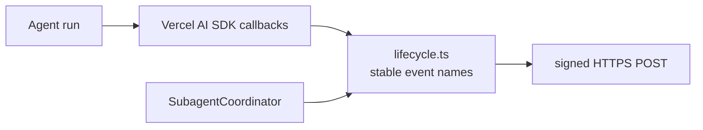

# Lifecycle Webhooks

Lifecycle webhooks publish agent runtime events to an HTTPS endpoint configured on the agent. They are different from channel provider webhooks under `/webhooks/{accountId}/{agentId}/{channel}`.



Check out the [webhook example](https://github.com/beeblastco/filthy-panty/tree/dev/packages/demos/webhook) for setup and usage. Lifecycle webhooks remain declarative HTTPS delivery; they do not upload or execute user hook code.

## Agent Config

Configure lifecycle delivery in the encrypted agent config:

```json
{
  "hooks": {
    "webhook": {
      "enabled": true,
      "url": "https://example.com/agent-events",
      "secret": "...",
      "events": [
        "agent.started",
        "tool.call.started",
        "tool.call.finished",
        "tool.result",
        "subagent.task.finished",
        "agent.finished",
        "agent.failed"
      ]
    }
  }
}
```

| Field | Type | Description |
| --- | --- | --- |
| `enabled` | boolean | Enables lifecycle webhook delivery |
| `url` | string | HTTPS endpoint that receives event JSON |
| `secret` | string | HMAC signing secret |
| `events` | string[] | Optional allow-list; omitted means all lifecycle events |

The `url` must be a public HTTPS endpoint — loopback, private (RFC 1918), link-local, and internal hostnames are rejected at config time and again at delivery, and delivery does not follow redirects.

## Events

| Event | Emitted when |
| --- | --- |
| `agent.started` | A model loop starts |
| `agent.step.finished` | A Vercel AI SDK step finishes |
| `agent.finished` | The agent produces a final response |
| `agent.failed` | The model loop or post-generation handling fails |
| `agent.approval.required` | A tool approval request pauses the turn |
| `tool.call.started` | A tool call starts |
| `tool.call.finished` | A tool call finishes or fails |
| `tool.result` | Tool results are available from a finished step |
| `subagent.task.started` | A subagent task is dispatched |
| `subagent.task.finished` | A subagent task completes or fails |

## Delivery

Each event is sent as JSON:

```json
{
  "type": "tool.call.finished",
  "timestamp": "2026-05-17T20:00:00.000Z",
  "accountId": "acct_...",
  "agentId": "agent_...",
  "eventId": "acct:...:api:...",
  "conversationKey": "acct:...:conversation:...",
  "payload": {
    "success": true
  }
}
```

The request is signed with:

```text
X-Webhook-Signature: sha256=<hmac-sha256(secret, raw-json-body)>
```

Delivery is best-effort. Failures are logged and do not fail the agent turn.
