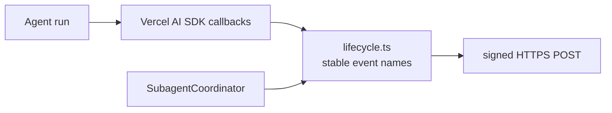

# Lifecycle Webhooks

Lifecycle webhooks publish agent runtime events to an HTTPS endpoint configured on the agent. They are different from channel provider webhooks under `/webhooks/{accountId}/{agentId}/{channel}`, and different again from [sandbox hooks](workspace/sandbox/hook.md): a lifecycle webhook is **declarative HTTPS delivery of event JSON to an external service**, whereas sandbox `onCreate`/`onResume` commands run *inside the sandbox*. Neither uploads or executes user hook code today — per-invocation user code hooks are tracked under [#63](https://github.com/beeblastco/broods/issues/63).



Check out the [webhook example](https://github.com/beeblastco/broods/tree/dev/packages/demos/webhook) for setup and usage. Lifecycle webhooks remain declarative HTTPS delivery; they do not upload or execute user hook code.

## Code-First Configuration

Configure lifecycle webhooks inside `defineAgent`. An agent can register **several** webhooks — `hooks.webhooks` is an array, so events can fan out to multiple services:

```ts title="broods/index.ts"
import { defineAgent, env } from "broods";

export const myAgent = defineAgent({
  name: "my-agent",
  config: {
    provider: { openai: { apiKey: env.OPENAI_API_KEY } },
    model: { provider: "openai", modelId: "gpt-5.5" },
    hooks: {
      webhooks: [
        {
          enabled: true,
          url: "https://example.com/agent-events",
          secret: env.WEBHOOK_SECRET,
          events: [
            "agent.started",
            "tool.call.started",
            "tool.call.finished",
            "tool.result",
            "subagent.task.finished",
            "agent.finished",
            "agent.failed",
          ],
        },
        {
          enabled: true,
          url: "https://audit.example.com/agent-events",
          secret: env.AUDIT_WEBHOOK_SECRET,
          events: ["agent.failed"],
        },
      ],
    },
  },
});
```

| Field | Type | Description |
| --- | --- | --- |
| `enabled` | boolean | Enables delivery for this webhook |
| `url` | string | HTTPS endpoint that receives event JSON |
| `secret` | string | HMAC signing secret |
| `events` | string[] | Optional allow-list; omitted means all lifecycle events |

Each entry is delivered independently: every enabled webhook whose `events` allow-list matches (or is omitted) receives the event. The `url` must be a public HTTPS endpoint — loopback, private (RFC 1918), link-local, and internal hostnames are rejected at config time and again at delivery, and delivery does not follow redirects.

Whether you configure webhooks in code (`config.hooks.webhooks`, with `url`/`secret` as `env.NAME` references) or in the dashboard, they are surfaced in the dashboard **Settings → Webhooks** tab. There you can add a webhook, toggle each one **active/inactive**, or remove it; the panel writes straight to `config.hooks.webhooks` (the config the harness delivers from) rather than a separate store. The CLI shows them via `broods agent get <name>`.

## Events

| Event | Emitted when |
| --- | --- |
| `agent.started` | A model loop starts |
| `agent.step.finished` | A Vercel AI SDK step finishes |
| `agent.finished` | The agent produces a final response |
| `agent.failed` | The model loop or post-generation handling fails |
| `agent.approval.required` | A tool approval request pauses the turn |
| `tool.call.started` | A tool call starts |
| `tool.call.finished` | A tool call finishes or fails |
| `tool.result` | Tool results are available from a finished step |
| `subagent.task.started` | A subagent task is dispatched |
| `subagent.task.finished` | A subagent task completes or fails |

## Delivery

Each event is sent as JSON:

```json
{
  "type": "tool.call.finished",
  "timestamp": "2026-05-17T20:00:00.000Z",
  "accountId": "acct_...",
  "agentId": "agent_...",
  "eventId": "acct:...:api:...",
  "conversationKey": "acct:...:conversation:...",
  "payload": {
    "success": true
  }
}
```

The request is signed with:

```text
X-Webhook-Signature: sha256=<hmac-sha256(secret, raw-json-body)>
```

Delivery is best-effort. Failures are logged and do not fail the agent turn.
