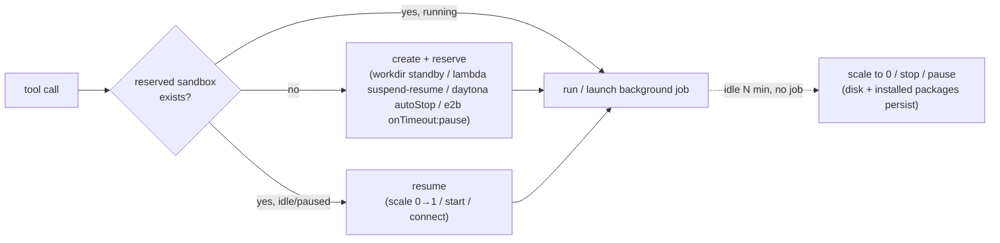
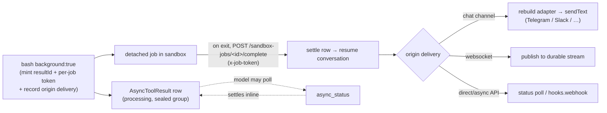
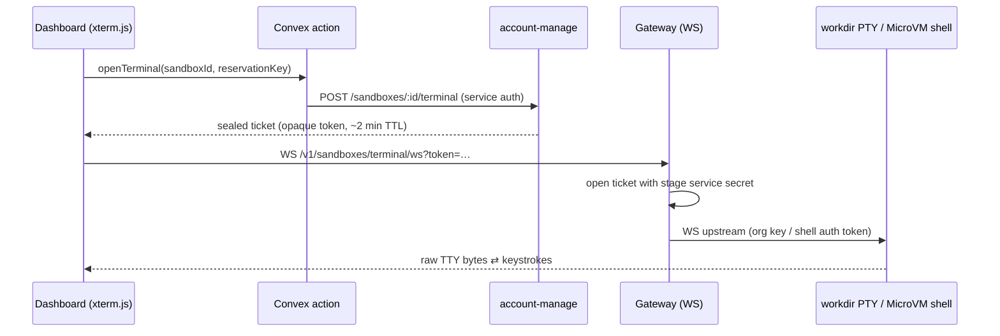

# Best Practice

Operational guidance for getting the most out of sandboxes: when to reserve a persistent
box, how to run long work without blocking the turn, and how idle scale-down and clean
teardown behave.

## Ephemeral vs reserved

By default every provider is **ephemeral per call** (create → run → destroy); only workspace
*files* persist (via the S3 mount). That is the right default for stateless tasks — it is
cheap and there is nothing to leak.

Reserve a persistent sandbox (`persistent: true`) when **installed packages, code, or
running processes need to survive across calls** — a cloud dev box where `pip`/`npm`/`uv`
installs and background jobs stay alive, scaling down on idle like Fargate. Reach for it for
iterative coding sessions and long-running work; avoid it for one-shot tasks.

## Reserved (persistent) sandboxes

Set `persistent: true` to **reserve a long-lived sandbox per workspace**. For `lambda` this
reserves a snapshot-resumable MicroVM (suspend/resume on idle, 8 h max lifetime).

```jsonc
{
  "config": {
    "provider": "sandbox",   // sandbox | lambda | daytona | e2b | vercel
    "network": { "mode": "allow-all" },
    "persistent": true,
    "permissionMode": "bypass",
    "lifecycle": {
      "idleTimeoutSeconds": 1800,   // scale down after 30 min idle (default 900)
      "maxLifetimeSeconds": 86400   // hard expiry backstop (optional)
    },
    "onCreate": ["python3 -m venv $HOME/.venv"],
    "onResume": ["test -x $HOME/.venv/bin/python"]
  }
}
```



How idle scale-down happens differs per provider: **sandbox** (workdir) uses native
pause/standby (auto-resumes on the next exec); **lambda** uses Firecracker snapshots (the
MicroVM is suspended to disk on idle and resumed on the next call, up to an 8-hour maximum
lifetime); **daytona** uses native `autoStopInterval` (filesystem persists); **e2b** uses
native `lifecycle.onTimeout: "pause"` (filesystem + memory snapshot persist); **vercel**
uses named persistent sandboxes and native `onCreate`/`onResume` callbacks. A reserved
sandbox is reconnected by id on the next call (`sandbox`/workdir reserves a deterministic
sandbox per workspace namespace; lambda/daytona/e2b/vercel store the id/name in a
`persistentSandboxInstance` table). Instance rows carry a 30-day TTL refreshed on every use,
and a concurrent first-create race is resolved by a conditional claim — the loser discards
its duplicate sandbox and reconnects to the winner's.

Setup commands (`onCreate`/`onResume`) only run on persistent configs — see
[Hooks → Setup commands](hook.md#setup-commands-oncreate--onresume).

**Clean delete (no leaks).** Deleting a workspace or account releases its reserved
sandboxes: `sandbox`/lambda/daytona/e2b/vercel are torn down explicitly and their instance
rows dropped. There is also a hard-lifetime backstop (`lifecycle.maxLifetimeSeconds`,
default 7 days) so nothing lingers indefinitely.

## Background jobs + `async_status`

Reserved sandboxes can run **detached background jobs** that outlive the request. `bash`
gains a `background: true` flag; it starts the work as a detached session in the sandbox and
returns a `statusId` immediately (the model-facing name for the internal `resultId`):

```text
bash  { command: "uv run train.py", background: true }   → statusId
async_status  { statusId }                  → running | completed (with logs) | failed
async_status  { statusId, action: "logs" }  → tail the job output
async_status  { statusId, action: "stop" }  → terminate the job
```

The `logs`/`stop` actions exist **only when the selected sandbox exposes live job
controls**. A plain async tool call has no live process to tail or kill, and E2B background
jobs use native launch plus callback delivery without the harness marker files used for log
tailing and stop. In those cases `async_status` is registered with `status` as its single
action. The description and action enum are built from that capability to keep the prompt
accurate.



**Auto-delivery.** When the job finishes it POSTs its result to the harness
`/sandbox-jobs/<resultId>/complete` endpoint, authenticated by a per-job token (not the
account key — no account secret ever enters the sandbox). The harness settles the row and
**resumes the conversation** with the result injected, so the model does not have to poll.
The follow-up is then delivered back to wherever the turn came from:

| Origin | Delivery |
| --- | --- |
| Chat channel (Telegram/Slack/Discord/Zalo/Pancake/GitHub) | pushed into the chat via the channel's `sendText` (rebuilt from the stored routing) |
| WebSocket | republished to the durable conversation stream (replays on reconnect) |
| Direct/async API | settled for `/status` polling; `config.hooks.webhook` also fires `agent.finished` |

Polling with `async_status` is still available to check progress or fetch a result sooner.
Discord delivers a delayed reply with the bot token (its interaction token expires ~15 min);
the bot must have **Send Messages** permission in the channel.

`async_status` is auto-registered whenever the agent has a workspace whose effective sandbox
is persistent, or any `config.tools` entry marked `async: true`, and only resolves a
`statusId` for its own conversation. An agent-level persistent sandbox without a workspace
runs ephemerally and does not register it. Jobs are tracked in the `AsyncToolResult` table.

**Ownership & limits.** `sandbox`, Daytona, and Vercel cap concurrent background jobs (10),
and a job that is killed when the sandbox is recreated/scaled-to-0 reports as `failed` (it
stamps the launching boot id, so a stale `.running` marker is never read as "running
forever"). The idle scale-down never pauses a sandbox while a job is still running.

> **Network note:** auto-delivery requires the sandbox to reach the harness Function URL —
> see [Networking → auto-delivery](networking.md#egress-and-background-job-auto-delivery).
> Without egress the job still runs and `async_status` polling still works; only the
> automatic push-back is skipped.

## Live terminal & real TTY runs

Two ways to get **real terminal behaviour** out of a sandbox:

**Agent side — `bash` with `pty: true`.** The bash tool accepts a `pty` flag that attaches
the command to a real pseudo-terminal inside the guest (util-linux `script`). Programs see
`isatty() = true` and a normal terminal line discipline, so TTY-gated CLIs, prompts, and
terminal UIs behave as they would in a real shell. It works on every provider (it is a
guest-side wrapper); note that stderr merges into stdout and lines end with CRLF, so keep
`pty` off for output you want byte-exact.

**Operator side — the dashboard Terminal tab.** For `sandbox` (workdir) and `lambda`
(AWS MicroVM) instances the dashboard's Sandbox → Instances detail panel has a live
interactive terminal — a real in-guest TTY streamed over WebSocket, not a command runner.
Connecting resumes a suspended instance. The third-party providers keep the bounded
command runner (30 s / 64 KiB per command).



The upstream URL and provider credential travel **inside the sealed (AES-256-GCM) ticket**,
so the browser only ever holds an opaque, short-lived token; the credential never leaves
the trusted tier (core mints, gateway opens). workdir tickets carry the org key as a
bearer `Authorization` header; MicroVM tickets carry a `CreateMicrovmShellAuthToken` JWE
in `X-aws-proxy-auth`, dialing the VM endpoint's native shell (`wss://<endpoint>`).

> **MicroVM note:** shell access requires the VM to have been launched with the
> AWS-managed `SHELL_INGRESS` network connector. Persistent (reserved) MicroVMs attach it
> automatically at `RunMicrovm`; connectors cannot be added to a live VM, so instances
> reserved before this feature must be terminated and re-reserved once to gain a terminal
> (the API answers `409` with that hint).

## Keep prompts portable

Tell the model to **use relative paths** (`analysis.json`, `src/index.ts`) — the harness
starts each `bash` command in the selected workspace directory and the file tools take
workspace-relative paths, so the model should not need provider-specific mount paths. Put
those implementation paths in docs and logs, not ordinary task prompts. See
[Core design → Model-facing workspace contract](index.md#model-facing-workspace-contract).

## Skill files

Skills load from the skills S3 bucket. With a workspace attached, `load_skill` stages the
bundle into the workspace namespace at `/.claude/skills/<name>` so the agent can read and
run it with `bash`. See [Skills](../../skills.md).
