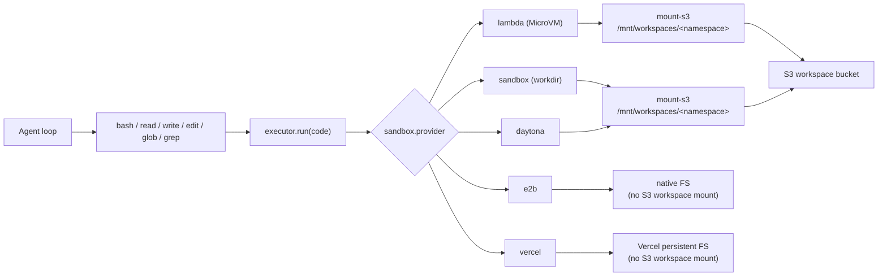

# Sandbox

The sandbox is a uniform Linux compute backend (real `bash` + `python3` + `node` on
PATH). It backs the Claude-Code-style tool set (`bash`, `read`, `write`, `edit`, `glob`,
`grep`). Every tool compiles down to a single `run` against the selected provider — there
is no per-runtime routing anymore.

This page is the conceptual overview. For task-focused guides see [Getting
Started](getting-started.md), [Snapshots & Sizes](snapshot.md),
[Networking](networking.md), [Security](security.md), [Hooks](hook.md), [Best
Practice](best-practice.md), and the per-provider [Integration](lambda.md) pages.

## Code-First Definition

Define sandboxes in `broods/index.ts` and reference them from agents:

```ts
import { defineSandbox, defineAgent, env } from "broods";

export const lambdaSandbox = defineSandbox({
  name: "lambda-sandbox",
  config: {
    provider: "lambda",
    network: { mode: "deny-all" },
    permissionMode: "ask",
    timeout: 60,
  },
});

export const persistentSandbox = defineSandbox({
  name: "persistent",
  config: {
    provider: "sandbox",
    network: { mode: "allow-all" },
    permissionMode: "bypass",
    persistent: true,
    lifecycle: { idleTimeoutSeconds: 1800 },
    options: { mountAwsS3Buckets: true },
  },
});

export const myAgent = defineAgent({
  name: "my-agent",
  config: {
    sandbox: lambdaSandbox,
    // ...
  },
});
```



## Config

A sandbox is a standalone, account-scoped record referenced from agent config by id
(see [Workspace & Sandbox](../index.md)).

```jsonc
// POST /accounts/me/sandboxes
{
  "name": "default",
  "config": {
    "provider": "lambda",          // sandbox | lambda | e2b | daytona | vercel
    "size": "small",               // tiny | xsmall | small | medium | large (see Snapshots & Sizes)
    "snapshot": "img_curated",     // prebuilt image/snapshot to boot from (see Snapshots & Sizes); omit for the provider default
    "network": { "mode": "allow-all" }, // allow-all | deny-all | restricted (see Networking)
    "permissionMode": "ask",       // edit | ask | bypass
    "runtimes": ["bash", "python", "node"], // advisory allow-list (best-effort)
    "timeout": 120,                // per-call seconds (default 30; max 600)
    "memoryLimit": 512,            // MB; validated (≤8192 for lambda MicroVM size) but informational — executors do not resize
    "outputLimitBytes": 65536,
    "envVars": { "FOO": "bar" }    // injected into every run (encrypted at rest)
  }
}
```

`onCreate` / `onResume` command hooks are also available, but only on persistent
configs — see [Hooks](hook.md) and [Best Practice → Reserved
sandboxes](best-practice.md#reserved-persistent-sandboxes).

`size` and `snapshot` control the compute footprint and base image — see [Snapshots &
Sizes](snapshot.md). `network` controls egress — see [Networking](networking.md).

> **Per-call limits are provider-aware.** A single blocking (synchronous) call is capped at
> the harness request budget (600 s) for every provider. Memory is operator-sized for the
> persistent providers (`sandbox`/`e2b`/`daytona`/`vercel`); for `lambda` it is the MicroVM
> size (capped at the 8 GB largest size). Detached background jobs are not bounded by the call
> timeout — they run inside the long-lived VM. Output is always truncated harness-side.

Provider-specific behavior lives in the [Integration](lambda.md) pages:

| Provider | Documentation |
| --- | --- |
| `lambda` | [Lambda Details](lambda.md) |
| `e2b` | [E2B Details](e2b.md) |
| `daytona` | [Daytona Details](daytona.md) |
| `vercel` | [Vercel Details](vercel.md) |

## Storage capability matrix

This table describes the current harness behavior. Some providers expose additional
native storage features in their own SDKs; those are called out in provider docs when they
are not yet wired into the shared workspace contract.

| Provider | Stateless bash | Shared S3 workspace mount | Persistent sandbox | Background jobs | Configurable storage limit |
| --- | --- | --- | --- | --- | --- |
| `sandbox` | yes | yes, through `mount-s3` (workspace `storage` or `options.mountAwsS3Buckets`) | yes, native pause/resume + standby | yes, with live status/logs/stop | provider/account limit outside sandbox config |
| `lambda` | yes | yes, through `mount-s3` (inside the MicroVM) | yes, snapshot suspend/resume (8 h max) | yes, in the persistent VM | S3 bucket/account limits outside sandbox config |
| `daytona` | yes | yes, through `mount-s3` when `options.mountAwsS3Buckets` is true | yes, native persistent sandbox | yes, with live status/logs/stop | provider/account limit outside sandbox config |
| `e2b` | yes | not wired; S3 workspaces are rejected | yes, native sandbox pause/resume | yes, native launch + callback delivery; no harness live logs/stop | E2B plan/template limit outside sandbox config |
| `vercel` | yes | not wired; S3 workspaces are rejected | yes, named persistent sandbox filesystem | yes, with live status/logs/stop | Vercel sandbox/drive limits outside sandbox config |

The shared S3 workspace mount is intentionally the cross-provider workspace model for
`sandbox`, `lambda`, and `daytona`. `e2b` and `vercel` provider-native storage is not
wired into Workspace yet, so attaching an S3 workspace to those providers is rejected.

## Model-facing workspace contract

All workspace-backed sandbox providers should feel like a normal Linux project checkout:

```bash
pwd                 # current workspace directory
ls                  # files in this workspace
python3 script.py   # run files directly
node app.js
```

The model should not need provider-specific paths. For `bash`, the harness starts each
command in the selected workspace directory, so examples should use relative paths
(`analysis.json`, `src/index.ts`). The dedicated file tools also take workspace-relative paths.

Provider implementation paths are still useful for debugging:

| Provider | Workspace-backed bash cwd | Underlying mount path |
| --- | --- | --- |
| `sandbox` | `/mnt/workspaces/<namespace>` by default | `mount-s3` at `options.workspaceRoot/<namespace>` |
| `lambda` | `/mnt/workspaces/<namespace>` | `mount-s3` (inside the MicroVM) at `/mnt/workspaces/<namespace>` |
| `daytona` | `/mnt/workspaces/<namespace>` by default | `mount-s3` at `options.workspaceRoot/<namespace>` |
| `e2b` | not supported for S3 workspaces | no shared S3 mount wired |
| `vercel` | not supported for S3 workspaces | no shared S3 mount wired |

Keep prompt text small: tell the model "use relative paths." Put provider-specific mount
paths in docs and logs, not ordinary task prompts.

## How agents use it

With a workspace attached, the file tools operate on the mount:

```text
write  notes/a.txt          # base64-piped, creates parent dirs
read   notes/a.txt          # numbered lines
edit   notes/a.txt          # exact unique string replacement
glob   **/*.py              # mtime-sorted matches
grep   TODO                 # ripgrep
bash   python3 notes/run.py # run programs directly
```

With no workspace, only `bash` is available and each call is a fresh container, so
write-and-run in one command:

```bash
cat <<'EOF' > /tmp/run.py
print("ok")
EOF
python3 /tmp/run.py
```

## Result shape

`bash` returns combined stdout+stderr as text. The lambda response carries
`{ ok, runtime, exit_code, timed_out, duration_ms, stdout, stderr }`; stdout/stderr are
truncated at 256 KB by the image and again at `outputLimitBytes` harness-side.

## Learn more

| Guide | Covers |
| --- | --- |
| [Getting Started](getting-started.md) | define a sandbox, attach a workspace, run code |
| [Snapshots & Sizes](snapshot.md) | image pinning, the size catalog, the snapshot status model |
| [Networking](networking.md) | egress modes and per-provider enforcement |
| [Security](security.md) | credential isolation and workspace scoping |
| [Hooks](hook.md) | setup commands and runtime lifecycle hooks |
| [Best Practice](best-practice.md) | persistent sandboxes, background jobs, idle tuning |
| [Integration](lambda.md) | Lambda · Daytona · E2B · Vercel specifics |
