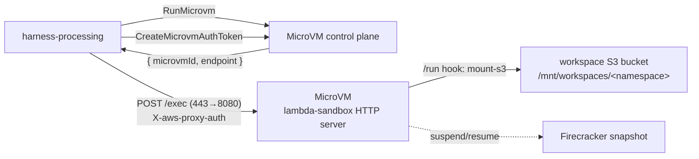

# Lambda (AWS Lambda MicroVM)

The default sandbox provider. Each agent **session runs in one AWS Lambda MicroVM** — a
Firecracker-isolated, snapshot-resumable VM that boots the **lambda-sandbox image as a
long-lived HTTP server**. Inside it are real `bash`, native `python3`, Node 22, `uv`, and
`ripgrep` on PATH — no emulated shell, no WASM Python. The old four-function (mount × network)
grid is gone: there is now a single uniform image and one VM per run.

## How it works



1. **`RunMicrovm`** starts a VM from the image and returns a unique HTTPS `endpoint` + `microvmId`.
2. The harness mints a short-lived JWE with **`CreateMicrovmAuthToken`** and POSTs the exec
   request to `https://<endpoint>/exec` with `X-aws-proxy-auth` + `X-aws-proxy-port: 8080`
   (the proxy maps external `443` → the image's `8080`). The exec request/response JSON is the
   same contract the image has always used — only the transport changed from Invoke to HTTP.
3. The image answers request-level errors with HTTP 200 + an `ok:false` body; `502/503/504`
   from the proxy mean "VM still restoring its snapshot" (1–10 s), so the first exec retries.

### Lifecycle hooks

The image implements HTTP lifecycle hooks on port `9000` under
`/aws/lambda-microvms/runtime/v1/<hook>`:

| Hook | When | What the image does |
| --- | --- | --- |
| `/ready`, `/validate` | image build | health/validation (return 200) |
| `/run` | per VM start | **mount-s3** the workspace from the `runHookPayload` (see below) |
| `/resume` | on resume from suspend | reconnect / refresh |
| `/suspend` | before snapshot | `sync(2)` flush |
| `/terminate` | on teardown | unmount + final `sync` |

## Image & build

The image is **built by AWS from an S3 zip** (Dockerfile + sources) via
`create-microvm-image` / `update-microvm-image` — it is **not** an ECR-image Lambda or a
custom runtime. Images are versioned (a build is a Firecracker snapshot of memory + disk).
The harness selects the image by ARN through `MICROVM_IMAGE_IDENTIFIER`. CI for the image
lives in the [`lambda-sandbox`](https://github.com/beeblastco/lambda-sanbdox) sibling repo.

The SST stack provisions the build prerequisites in the core region:

- `microvmArtifactsBucketName` — S3 bucket for the zipped image artifacts (`microvm-images/`).
- `microvmBuildRoleArn` — build role for `CreateMicrovmImage` / `UpdateMicrovmImage`.
- `microvmExecutionRoleArn` — runtime role for `RunMicrovm` + CloudWatch logs.

> Lambda MicroVM prerequisites are skipped in `ap-southeast-1` (feature not available there yet).

## Workspace mount

For a workspace-backed run the harness assumes a short-lived, **namespace-scoped** STS role
and delivers the credentials + bucket/prefix in the `runHookPayload` (≤16 KB). The image's
`/run` hook then runs `mount-s3` **inside the VM**, mounting the workspace at
`/mnt/workspaces/<namespace>` (rooted at the `<namespace>/` prefix). The harness's own broad
credentials never enter the VM — any code the agent runs can read that env, so only the
prefix-scoped session creds go in. This is the same scoped-credential model Daytona and the
`sandbox` provider use. Stateless (no-workspace) runs skip the mount and work in `/tmp`.

> **Mountpoint-for-S3 has no append/in-place edit** (`>>` or editing a file in place fails) —
> only whole-file create/overwrite. The `write`/`edit` tools rewrite whole files; agents should
> not append. Writes upload to S3 on close, and `/suspend` `sync`s before a snapshot.

> **Why `mount-s3` and not S3 Files?** AWS also offers **S3 Files** (`mount -t s3files` over a
> managed NFS mount target), which allows true in-place edits and keeps credentials out of the
> VM. We deliberately use **Mountpoint-for-S3** instead: it works over the default
> `INTERNET_EGRESS` (no VPC egress connector, and no **NAT gateway** to keep internet access
> alongside the mount), it avoids S3 Files' usage-based surcharges (per-GB cache + per-GB
> read/write + higher request rates), and it is the **same code path** the `sandbox` and
> `daytona` providers use, fed prefix-scoped 1-hour STS creds. S3 Files stays a future opt-in
> for write-heavy or strict-isolation sandboxes — see the
> [Security model](security.md) for how the scoped creds are contained.

### What the model sees

A workspace-backed run looks like a normal project directory — `bash` starts in the workspace
and file tools take relative paths:

```bash
pwd                 # current workspace directory
ls                  # files in this workspace
python3 script.py
```

Provider mount paths are implementation detail for debugging. Skill bundles are staged into
the workspace namespace at `/.claude/skills/<name>` by `load_skill` (S3 server-side copy).

## Persistent sandboxes (suspend / resume / snapshots)

Because a MicroVM is a snapshot-resumable VM, `lambda` supports **reserved persistent
sandboxes** like the other VM providers. Set `persistent: true` to reserve one MicroVM per
workspace: installed packages, code, and running jobs survive across calls.

- On idle the VM is **suspended** (a Firecracker snapshot of memory + disk); the next call
  **resumes** it — restore is ~1–10 s. The idle/expiry policy comes from `config.lifecycle`
  (`idleTimeoutSeconds` → `idlePolicy.maxIdleDurationSeconds`, `autoResumeEnabled`).
- The reservation is reconnected by `microvmId` through the shared instance-store (same as
  Daytona/E2B/Vercel), with a conditional claim resolving concurrent first-create races.
- **Hard cap:** a MicroVM lives at most **8 hours** (`maximumDurationInSeconds` ≤ 28800), so a
  reservation is recreated after that. `onCreate`/`onResume` hooks run on first create / each
  acquire.

> **Suspend snapshot ≠ a new image.** The suspend/resume snapshot is a Firecracker
> checkpoint of *that one instance*; AWS MicroVM has **no runtime API to promote a running
> VM into a new reusable image**. So the dashboard **Create snapshot** action is not offered
> for `lambda` (only the workdir `sandbox` provider supports it) — launch images are produced
> as versioned MicroVM image builds instead. See [Snapshots & Sizes](snapshot.md#capturing-a-snapshot-provider-support).

```jsonc
{
  "config": {
    "provider": "lambda",
    "network": { "mode": "allow-all" },
    "persistent": true,
    "lifecycle": { "idleTimeoutSeconds": 1800, "maxLifetimeSeconds": 28800 }
  }
}
```

## Background jobs

A persistent MicroVM also runs **detached background jobs** (`bash { background: true }` →
`statusId`, then `async_status`). The job is launched as a `setsid` session that POSTs its
result to the harness completion callback when it exits. Because the persistent VM is **not
terminated after the request**, the job keeps running — and it is snapshotted/restored with
the VM across suspend/resume (the boot id is unchanged, so a resumed job is still "running").
See [Best Practice → Background jobs](best-practice.md#background-jobs--async_status).

> Auto-delivery (the completion callback) needs egress to the harness Function URL — use
> `network.mode: "allow-all"` or allow the Function URL. Without egress the job still runs and
> `async_status` polling still works; only the automatic push-back is skipped.

## Config

```jsonc
// POST /accounts/me/sandboxes
{
  "name": "default",
  "config": {
    "provider": "lambda",
    "network": { "mode": "allow-all" },
    "permissionMode": "ask",
    "envVars": { "MY_API_BASE": "https://api.example.com" }
  }
}
```

Image identifier, roles, and sizes are service-managed; account sandbox config cannot override them.

## Environment variables

`config.envVars` is a flat object of string key/value pairs injected into every run:

| Runtime | How the value is read |
| --- | --- |
| Shell | `echo $MY_API_BASE` |
| Node | `process.env.MY_API_BASE` |
| Python | `os.environ["MY_API_BASE"]` |

- **The child env is `env_clear()`ed first** — the host's `process.env` (including AWS
  credentials) is never inherited. Only the keys you declare reach the run.
- Reserved runtime vars (`PATH`, `HOME`, `TMPDIR`, ...) are set by the image and win.
- Values must be strings. Sandbox config (and therefore `envVars`) is encrypted at rest.

## Runtimes

`bash`, `python3`, and `node` are all real binaries on PATH, so you can run programs directly:

```bash
python3 script.py        # native CPython, full stdlib
node app.js              # Node 22
uv run tool.py           # uv is available
```

`config.runtimes` is a **best-effort** allow-list: the bash tool rejects obvious disallowed
runtime invocations, but a general VM cannot make this a hard isolation boundary.

## Network

`network.mode` maps onto the MicroVM's egress:

| Mode | MicroVM egress |
| --- | --- |
| `allow-all` | default `INTERNET_EGRESS` (no connector) |
| `deny-all` / `restricted` | a customer-managed **VPC egress network connector** (provisioned in SST, ARN passed via `MICROVM_EGRESS_NETWORK_CONNECTOR_ARN`); domain allowlists are logged as unsupported. Without a connector the executor fails closed instead of launching with default internet egress. |

## Sizes & logging

MicroVM sizes range from **0.5 GB / 0.25 vCPU** up to **8 GB / 4 vCPU** (fixed disk per size);
the predefined size catalog is service-managed. Build logs stay in the service-managed
CloudWatch log groups. Runtime logs are configured at launch with
`MICROVM_LOG_GROUP_NAME` (defaulted by SST to `/broods/<stage>/microvms`, stream =
`microvmId`) so a single CloudWatch subscription can forward sandbox output into Loki
when the sandbox log bridge is deployed.

## Security

- child processes run with no AWS credentials (`env_clear()` first)
- the workspace mount is rooted at the run's `<namespace>/` prefix, scoped by the per-mount
  STS session policy; arbitrary `bash` is privileged workspace compute, not a hard
  cross-workspace filesystem boundary — dedicated file tools still reject path traversal
- internet access is gated by `network.mode` (egress connector for restricted/deny-all)
- each exec is authenticated by a short-lived (`≤15 min`) per-call JWE auth token scoped to
  port 8080
