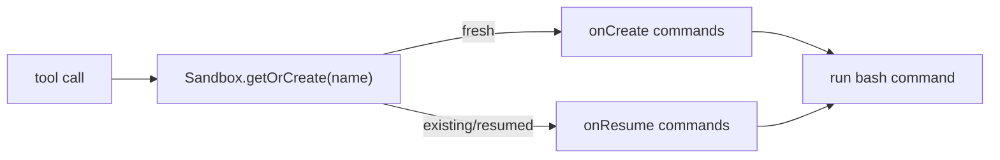

# Vercel

The `vercel` provider runs commands through [`@vercel/sandbox`](https://vercel.com/docs/sandbox).
The SDK is loaded lazily by the harness, and persistent sandboxes are named by the same
reservation key used by the other providers (`reservationKey ?? namespace`).

## Config

```jsonc
{
  "name": "vercel",
  "config": {
    "provider": "vercel",
    "persistent": true,
    "network": {
      "mode": "restricted",
      "allowDomains": ["api.example.com"],
      "allowCidrs": ["10.0.0.0/8"]
    },
    "permissionMode": "bypass",
    "onCreate": ["npm install"],
    "onResume": ["test -d node_modules"],
    "options": {
      "token": "vercel-token",
      "teamId": "team_xxx",
      "projectId": "prj_xxx",
      "runtime": "node24"
    }
  }
}
```

`options.token`, `options.teamId`, and `options.projectId` can be omitted when the harness
environment provides `VERCEL_TOKEN`, `VERCEL_TEAM_ID`, and `VERCEL_PROJECT_ID`. `runtime`
defaults to `node24`.

## Lifecycle

Vercel has native per-call lifecycle hooks, so the executor passes `onCreate` and `onResume`
to `Sandbox.getOrCreate()`/`Sandbox.get()` instead of emulating them with marker files.

Two semantic differences from the other persistent providers:

- **`onResume` timing**: on Vercel the hook fires only when a *stopped* sandbox actually
  resumes. E2B/Daytona/`sandbox` run `onResume` on every call (they cannot tell a fresh
  reconnect from a resume), so write hooks that are idempotent either way.
- **Idle timeout**: Vercel's `timeout` counts from sandbox start, not from last activity.
  The executor maps `lifecycle.idleTimeoutSeconds` onto it, so a persistent Vercel sandbox
  stops that many seconds after each wake — even mid-activity — and resumes on the next
  call. `lifecycle.maxLifetimeSeconds` is not enforced on Vercel.



## Network

Vercel enforces all three normalized modes natively:

| Mode | Vercel mapping |
| --- | --- |
| `allow-all` | `networkPolicy: "allow-all"` |
| `deny-all` | `networkPolicy: "deny-all"` |
| `restricted` | `networkPolicy.allow` for domains and `networkPolicy.subnets.allow` for CIDRs |

## Workspace Storage Caveat

Vercel persistent sandboxes have provider-native filesystem state, but they are not wired
to the shared S3 workspace bucket. Attaching an S3 workspace to a Vercel sandbox is
rejected, and `workspace.storage.provider: "vercel"` is also rejected until Vercel Drive
workspace storage is wired.

Vercel also provides Sandbox Drives as native persistent storage that can be mounted into
sandboxes. The current executor does not use Drives and does not expose Drive sizing or
mount configuration; it relies on the named persistent sandbox filesystem managed by
`@vercel/sandbox`.

Without a workspace, the Vercel provider works for `bash` (create → run → stop per call,
or named persistent sandbox when `persistent: true`). Workspace-backed file tools are
unavailable.

## Background Jobs

Persistent Vercel sandboxes support `bash` background jobs and `async_status` using the
harness job-control scripts also used by Daytona and the `sandbox` provider. Auto-delivery still needs egress to the harness
Function URL; with `deny-all` the job runs, but completion must be fetched by polling.

## Troubleshooting

| Symptom | Cause / fix |
| --- | --- |
| `Vercel Sandbox rejected the request (HTTP 403 / 401)` | The `VERCEL_TOKEN` is invalid/expired or doesn't have access to the configured team/project. Verify the token at vercel.com/account/tokens and that `VERCEL_TEAM_ID` / `VERCEL_PROJECT_ID` belong to a project the token can reach (a quick check: `GET https://api.vercel.com/v2/user` with the token should return your user, not `invalidToken`). |
