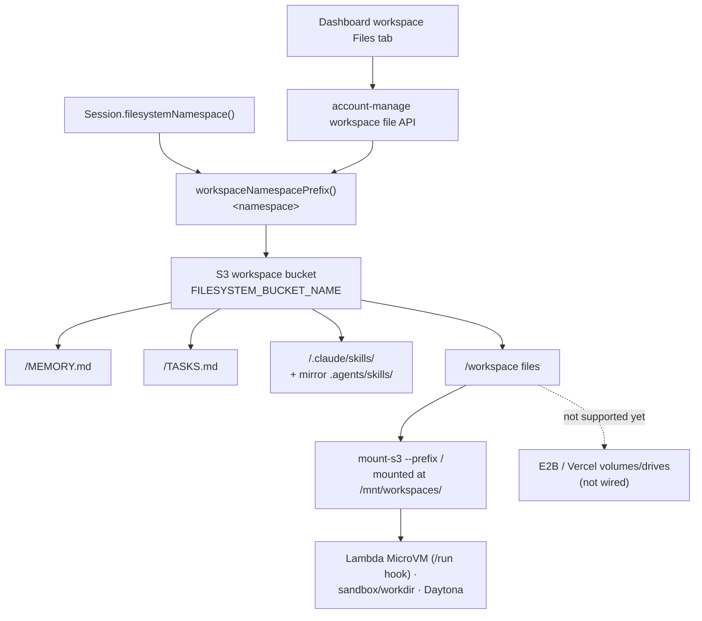
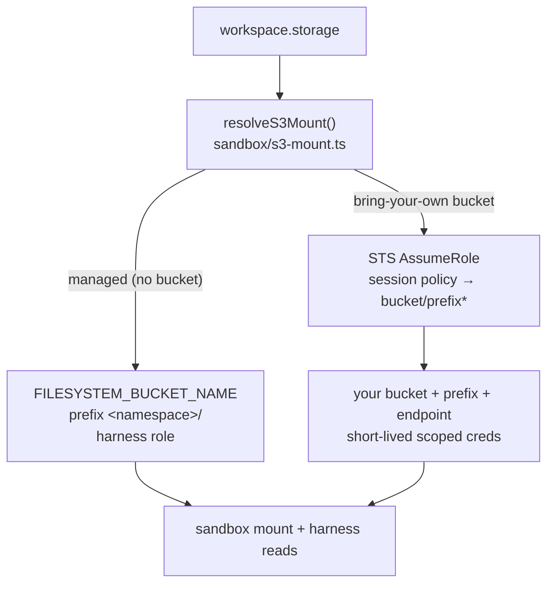

# Storage

Storage is the filesystem backing for Workspace. By default a workspace uses the
broods-managed S3 bucket (`{ "storage": { "provider": "s3" } }`), partitioned per
workspace under `<namespace>/`. A workspace can also point at a
**bring-your-own bucket** with its own credentials — see
[Bring-your-own bucket](#bring-your-own-bucket). Provider-native storage values such
as `vercel` are rejected until they are wired into the same workspace mount/read
contract.

`workspace.storage` declares the shared backing store used by:

- `MEMORY.md`, `TASKS.md`, and other developer-defined markdown files
- files read and written by the `bash` sandbox tool
- staged skill bundles under `.claude/skills/<skill-name>` and `.agents/skills/<skill-name>`
- mounted workspace paths used by the Lambda (MicroVM), `sandbox`/workdir, and Daytona sandbox providers — all via `mount-s3`

## Current Architecture

> **The workspace key layout is single-sourced — keep reads and mounts aligned.**
> A namespace's files live directly under `<namespace>/` in the managed bucket. The
> harness-side S3 reads/writes and the sandbox's own `mount-s3` mount must use the same
> layout, so both go through `workspaceNamespacePrefix()` in
> `functions/_shared/sandbox.ts` — change the layout there and both move together. The
> `<namespace>/` segment is also the tenant-isolation boundary the per-mount IAM session
> policy is scoped to.

Sandbox paths map to S3 keys through that layout: the bucket holds `<namespace>/...` and the mount exposes it at `/mnt/workspaces/<namespace>/...` by default.



Every S3-backed provider mounts the selected prefix at the workspace directory for the run with `mount-s3`. The Lambda MicroVM provider mounts inside the VM from its `/run` lifecycle hook; the `sandbox`/workdir and Daytona providers mount per run (`mountAwsS3Buckets: true`, or any workspace with `storage` for the `sandbox` provider). E2B and Vercel do not currently support S3 workspaces in this harness; attaching an S3 workspace to those sandboxes fails fast instead of silently using provider-native filesystem state.

The mount target + credentials are resolved one way for every S3 provider (`functions/harness-processing/sandbox/s3-mount.ts`): the managed bucket is partitioned by `<namespace>/`; a [bring-your-own bucket](#bring-your-own-bucket) uses its own bucket/prefix and short-lived assume-role credentials.

The dashboard workspace **Files** tab lists and mutates this same S3 namespace through
the authenticated account-management API. Uploads, renames, and deletes therefore
operate on the files the agent mounts; Convex file storage is used only for editable
skill-node bundles.

The panel uses a reactive, server-reconciled UX:

- the last confirmed file tree is cached in memory and browser `sessionStorage`, so
  reopening the workspace or reloading the page paints cached metadata immediately
- cached metadata is stale-while-revalidate: S3 remains authoritative and refreshes in
  the background; file contents and signed download URLs are never cached
- uploads appear immediately as pending rows, then become authoritative after S3 confirms them
- rename and delete update the tree optimistically, then reload S3; failures show an error and restore the server state
- while the workspace panel is visible, it lists S3 every five seconds
- returning focus to the window, restoring a hidden tab, or pressing **Refresh** triggers another listing
- overlapping list requests are deduplicated and older responses cannot overwrite newer optimistic changes

This polling detects direct S3 changes and files exported by an agent without requiring
the panel or page to be reopened. It cannot display an agent write before S3 Files has
exported that mount change to S3. Dashboard uploads are currently limited to 512 KiB
per file because their base64 payload crosses a Convex action; agents can create larger
files directly through the mounted workspace.
When a workspace panel first loads after this storage path was introduced, any
legacy canvas-node files are copied from Convex storage into S3 and the old records
are removed. Existing S3 paths win, preventing stale legacy content from overwriting
newer agent files or reappearing after deletion.

Top-level `<namespace>/` (i.e. `fs-<40 hex>/`) folders are the application workspace
roots: each namespace's files live directly under its own `fs-<40 hex>/` key.

Model-facing tools hide the provider path: `bash` starts in the selected workspace
directory, and file tools use workspace-relative paths. Prefer prompts like
`python3 script.py` or `read analysis.json`, not provider mount paths.

Skills are staged from the account skill bucket into `<namespace>/.claude/skills/<name>` (mirrored to `<namespace>/.agents/skills/<name>` for discovery) when `load_skill` runs. See [`skills.md`](../skills.md).

## Reading workspace files: S3 API vs the sandbox mount

There are two ways to reach the same workspace bytes, and they are **not** interchangeable because the mount syncs to the bucket asymmetrically:

- **bucket → mount** (a file the harness wrote with S3 `PutObject`/`CopyObject`): S3 Files detects and imports the object without remounting; allow for propagation delay.
- **mount → bucket** (a file the agent wrote through `bash`/NFS): visible through the mount immediately, but the S3 API does **not** list/return it for **~1–2 minutes** (AWS S3 Files writes back to the bucket asynchronously — measured: not visible at +0s/+45s, visible at +120s).

So pick the door by **who last wrote the file**, not by how much time has passed. There is no timer or "switch to the mount after writing" — each read site is wired to the correct door:

| Reading… | Last writer | Read via | Rationale |
| --- | --- | --- | --- |
| Agent-written workspace files (agent-created files, agent-edited `MEMORY.md`) | sandbox, through the mount | **Sandbox mount** — `bash`, `read`, `glob`, `grep` | the S3 API is stale for up to ~2 min, so it can miss very recent sandbox writes |
| Harness-written workspace files (`.stage.json` manifest, the staged copy `load_skill` wrote, sandbox artifact write-back) | harness, via S3 | **S3 API** (`functions/_shared/s3.ts`) | already in the bucket and instantly correct through both doors; no sandbox round-trip needed |
| Account skill bucket (the skill "origin") | harness, via S3 | **S3 API** | a separate bucket, never mounted |

The agent always reads through the mount (its `bash` tool *is* the mount), so it always sees its own writes instantly regardless of elapsed time. The S3-API-vs-mount decision only applies to **harness-side reads**.

Concretely, the model-facing workspace tools read sandbox-backed workspaces through the mounted sandbox path. Read-only workspaces read through a service-managed read-only mount by default (same fresh-read semantics); the `sandbox: null` opt-out instead reads directly from S3 under the same prefix (cheaper, but lagged — see [Lambda](sandbox/lambda.md)). Harness-side S3 reads (`MEMORY.md`, the read-only `read`/`glob` path) resolve the workspace's `storage`: the managed bucket is read directly on the harness role, and a [bring-your-own bucket](#bring-your-own-bucket) is read with the same prefix-scoped assume-role credentials the mount uses.

> **Known exception:** `Session.loadMemoryFile` reads `MEMORY.md` through the **S3 API** at the start of each turn. If the agent edited `MEMORY.md` less than ~2 min earlier in the same session, that read can be stale. This is accepted today because memory converges across turns and a sandbox round-trip on every turn is costly; route prompt-time memory reads through a sandbox-backed `read` call if freshness ever becomes a hard requirement.

## Bring-your-own bucket

By default a workspace lives in the broods-managed bucket. A workspace can instead
point `storage` at a bucket you own — any S3-compatible store (AWS S3, Cloudflare R2,
MinIO, Wasabi, Backblaze B2) selected with an `endpoint`:

```ts
storage: {
  provider: "s3",
  bucket: "acme-workspaces",
  region: "us-west-2",
  endpoint: "https://<account>.r2.cloudflarestorage.com", // omit for AWS S3
  prefix: "agents/",            // optional sub-path; default is the whole bucket
  auth: {
    type: "assumeRole",
    roleArn: "arn:aws:iam::111122223333:role/broods-mount",
    externalId: "<shared secret>", // confused-deputy guard for cross-account roles
  },
}
```

`endpoint` selects *where* the S3 API lives — every S3-compatible vendor stays
`provider: "s3"` and only changes the host. `provider` is reserved for a different
protocol (e.g. native Azure Blob / GCS), not a different S3 vendor.

Authentication (`storage.auth`) is **keyless** — no access keys are stored in the
workspace config (it is plaintext):

| `auth.type` | Credentials | Use |
| --- | --- | --- |
| `managed` (default) | broods-managed platform role | the managed bucket |
| `assumeRole` | your cross-account IAM role, assumed per run | a bucket in your own AWS account |

For `assumeRole` the harness calls STS `AssumeRole` and narrows the session with a
policy scoped to `bucket/prefix*`, so the short-lived credentials can only touch the
workspace's own prefix — never the harness's broad credentials, which any code the
agent runs could read. Provide an `externalId` when the role trusts broods
cross-account.



Both the sandbox **mount** and harness-side **reads** resolve this same target, so the
`bucket`/`prefix`/`region`/`endpoint` you set drive both and stay in sync the way
`<namespace>/` does for the managed bucket. The `sandbox`/workdir provider
mounts via `mount-s3` with the assumed credentials passed per-exec; Daytona injects
them into the run's environment. The Lambda MicroVM provider mounts the same way from
its `/run` lifecycle hook, fed the scoped credentials via the MicroVM `runHookPayload`.

> Static access keys for non-AWS stores (R2/MinIO tokens) are not stored yet — use
> `assumeRole` (AWS) or the managed bucket for now.

## Code-First Configuration

```ts
import { defineWorkspace } from "broods";

export const notes = defineWorkspace({
  name: "notes",
  config: {
    storage: { provider: "s3" },
    harness: { enabled: true },
  },
});
```

If `storage` is omitted, workspace config normalization fills in `{ "provider": "s3" }`.

## Future External Storage

S3-compatible object stores (Cloudflare R2, MinIO, Wasabi, B2) are already reachable through [bring-your-own bucket](#bring-your-own-bucket) by setting an `endpoint`. Additional work can add non-S3 providers such as Google Drive, native Google Cloud Storage, or Azure Blob behind a new `storage.provider`. Those providers should still connect through the sandbox mount model:

- keep one logical workspace namespace for memory notes, task notes, staged skills, and files
- mount or sync that namespace into `options.workspaceRoot`
- keep files visible to the sandbox runtime
- avoid provider-specific logic inside `session.ts` or the core agent loop

This keeps Workspace behavior consistent while allowing different storage backends underneath the sandbox mount.
