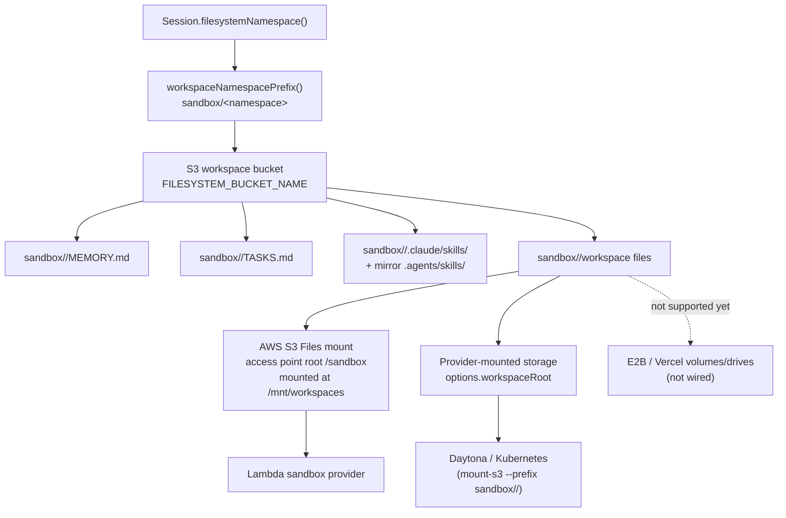

# Storage

Storage is the filesystem backing for Workspace. Workspace config accepts
`{ "storage": { "provider": "s3" } }` (default). Provider-native storage values
such as `vercel` are rejected until they are wired into the same workspace
mount/read contract.

`workspace.storage` declares the shared backing store used by:

- `MEMORY.md`, `TASKS.md`, and other developer-defined markdown files
- files read and written by the `bash` sandbox tool
- staged skill bundles under `.claude/skills/<skill-name>` and `.agents/skills/<skill-name>`
- mounted workspace paths used by the Lambda (S3 Files), Daytona, and Kubernetes (mount-s3) sandbox providers

Channel artifacts use the separate artifact pipeline described below. Artifact storage remains authoritative; a writable workspace may receive an optional working copy.

## Current Architecture

> **!WARNING**
> **The workspace mount key prefix is load-bearing — keep it in sync.**
> The Lambda S3 Files access point is rooted at a non-root sub-path `/sandbox`
> (`SandboxS3FilesAccessPoint.rootDirectories` in `sst.config.ts`). It **must** be a
> sub-path, not `/`: the access point's `creationPermissions` (777, uid/gid 1000) are
> only applied to a directory it *creates*. The bucket root already exists, so a root
> of `/` is **not writable** by the sandbox uid and `bash` writes fail (this was the
> bug fixed by git commit `2bdb34f`). Because of that sub-path, the mount stores every
> file under the `sandbox/` key prefix. Every harness-side S3 read/write of workspace
> files therefore applies the same prefix via `workspaceNamespacePrefix()`
> (`WORKSPACE_MOUNT_PREFIX` in `functions/_shared/sandbox.ts`). **If you change one,
> change the other.** When they drift, the harness and sandbox read/write two separate
> key trees and silently stop seeing each other's files — a freshly loaded skill can show
> an empty mount even though the harness copied the files.

Sandbox paths map to S3 keys through that prefix: the bucket holds `sandbox/<namespace>/...` and the mount exposes it at `/mnt/workspaces/<namespace>/...` by default.



The Lambda sandbox provider uses AWS S3 Files at `/mnt/workspaces`, backed by the same workspace bucket through an access point rooted at `/sandbox`. The uniform Lambda sandbox image writes directly through that mount. Daytona and Kubernetes mount only the selected `sandbox/<namespace>/` prefix at the workspace directory for the run (`mountAwsS3Buckets: true`). E2B and Vercel do not currently support S3 workspaces in this harness; attaching an S3 workspace to those sandboxes fails fast instead of silently using provider-native filesystem state.

Model-facing tools hide the provider path: `bash` starts in the selected workspace
directory, and file tools use workspace-relative paths. Prefer prompts like
`python3 script.py` or `read analysis.json`, not provider mount paths.

Skills are staged from the account skill bucket into `<namespace>/.claude/skills/<name>` (mirrored to `<namespace>/.agents/skills/<name>` for discovery) when `load_skill` runs. See [`skills.md`](../skills.md).

## Reading workspace files: S3 API vs the sandbox mount

There are two ways to reach the same workspace bytes, and they are **not** interchangeable because the mount syncs to the bucket asymmetrically:

- **bucket → mount** (a file the harness wrote with S3 `PutObject`/`CopyObject`): visible through the mount **immediately**.
- **mount → bucket** (a file the agent wrote through `bash`/NFS): visible through the mount immediately, but the S3 API does **not** list/return it for **~1–2 minutes** (AWS S3 Files writes back to the bucket asynchronously — measured: not visible at +0s/+45s, visible at +120s).

So pick the door by **who last wrote the file**, not by how much time has passed. There is no timer or "switch to the mount after writing" — each read site is wired to the correct door:

| Reading… | Last writer | Read via | Rationale |
| --- | --- | --- | --- |
| Agent-written workspace files (agent-created files, agent-edited `MEMORY.md`) | sandbox, through the mount | **Sandbox mount** — `bash`, `read`, `glob`, `grep` | the S3 API is stale for up to ~2 min, so it can miss very recent sandbox writes |
| Harness-written workspace files (`.stage.json` manifest, the staged copy `load_skill` wrote, sandbox artifact write-back) | harness, via S3 | **S3 API** (`functions/_shared/s3.ts`) | already in the bucket and instantly correct through both doors; no sandbox round-trip needed |
| Account skill bucket (the skill "origin") | harness, via S3 | **S3 API** | a separate bucket, never mounted |

The agent always reads through the mount (its `bash` tool *is* the mount), so it always sees its own writes instantly regardless of elapsed time. The S3-API-vs-mount decision only applies to **harness-side reads**.

Concretely, the model-facing workspace tools read sandbox-backed workspaces through the mounted sandbox path. Read-only workspaces read through a service-managed read-only mount by default (same fresh-read semantics); the `sandbox: null` opt-out instead reads directly from S3 under the same `sandbox/<namespace>/` prefix (cheaper, but lagged — see [Lambda](sandbox/lambda.md)).

> **Known exception:** `Session.loadMemoryFile` reads `MEMORY.md` through the **S3 API** at the start of each turn. If the agent edited `MEMORY.md` less than ~2 min earlier in the same session, that read can be stale. This is accepted today because memory converges across turns and a sandbox round-trip on every turn is costly; route prompt-time memory reads through a sandbox-backed `read` call if freshness ever becomes a hard requirement.

## Artifact Storage Is Separate

Core validates each provider download once, writes a short-lived transfer object, and commits it through the agent's artifact driver. It never redownloads a provider URL. After storage is ready, `materialize: "complex"` copies unsupported files and archives from artifact storage into `.artifacts/<artifactId>/<filename>` when exactly one writable workspace exists. With multiple writable workspaces, configure `artifacts.workspace.name`; read-only workspaces are never destinations. `all` copies every eligible artifact and `never` disables working copies. Materialization rechecks stored size and SHA-256 and writes non-executable files without extracting them.

The platform stores a tenant- and conversation-scoped artifact control record: artifact ID, normalized metadata, checksum, state, driver ID, and an opaque driver reference. Conversation history never stores file bytes, signed URLs, provider URLs, or staging keys. A successful working copy adds its workspace name and relative path to the persisted descriptor. The workspace copy follows workspace retention and is never used as the rehydration source of truth.

Current-turn native projection and later-turn `artifact.rehydrate` require explicit `model.inputCapabilities`. Rehydration resolves artifact storage again, verifies exact size and SHA-256, and supplies each requested artifact at most once within the shared invocation byte budget. AI SDK multimodal tool results remain experimental, so the selected provider/model must actually accept the declared MIME. ZIP extraction, OCR, conversion, and transcription are not automatic; future processors must enforce traversal, nesting, file-count, expanded-size, CPU, and output limits.

The code-first SDK supports `defineRemoteArtifactDriver()` for developer-hosted HTTPS lifecycle handlers. Remote `store` is wired for channel ingestion. Uploaded driver code is a future roadmap item and is rejected by the current config surface because the required hardened runner does not exist. An agent without a driver uses managed ephemeral staging; a configured driver falls back to it only when explicitly requested. Neither path is durable workspace storage.

Remote bytes are customer-owned data. Deleting a filthy-panty account removes core artifact metadata and managed staging objects, but does not call the remote driver to erase developer storage. Driver owners must implement their own end-customer retention and erasure flow. Keep a driver's name, endpoint, and reference interpretation compatible while historical artifacts should remain readable; changing or removing that binding makes those historical artifacts unavailable to the scoped read tool.

## Configuration

```json
{
  "name": "notes",
  "config": {
    "storage": { "provider": "s3" },
    "harness": { "enabled": true }
  }
}
```

If `storage` is omitted, workspace config normalization fills in `{ "provider": "s3" }`.

## Future External Storage

Additional work can add external workspace providers such as Google Drive, Google Cloud Storage, Cloudflare R2, or other mounted object stores. Those providers should still connect through the sandbox mount model:

- keep one logical workspace namespace for memory notes, task notes, staged skills, and files
- mount or sync that namespace into `options.workspaceRoot`
- keep files visible to the sandbox runtime
- avoid provider-specific logic inside `session.ts` or the core agent loop

This keeps Workspace behavior consistent while allowing different storage backends underneath the sandbox mount.
