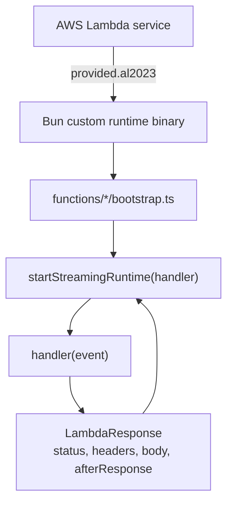
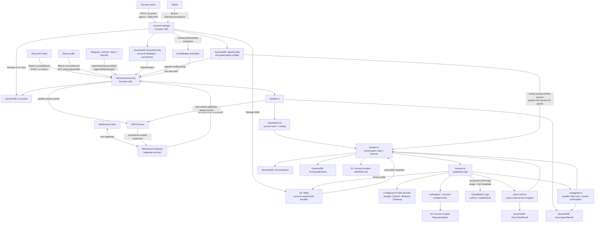
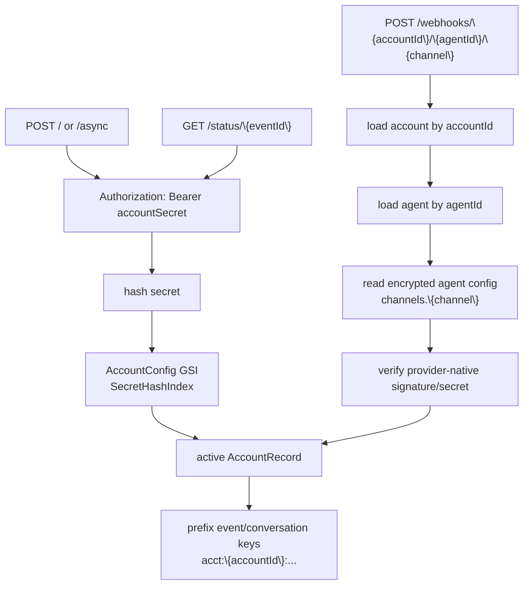
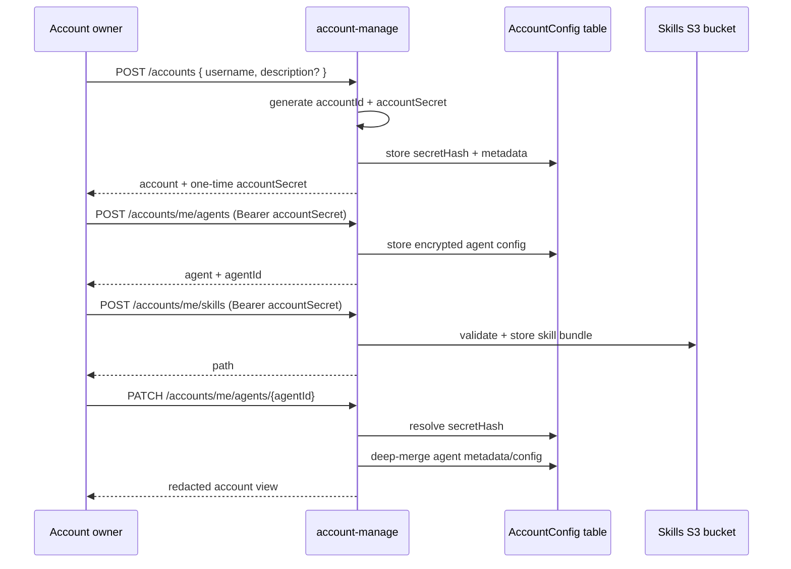
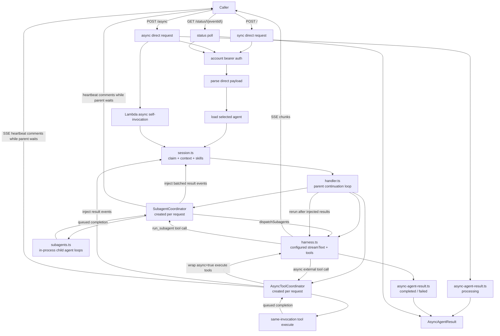
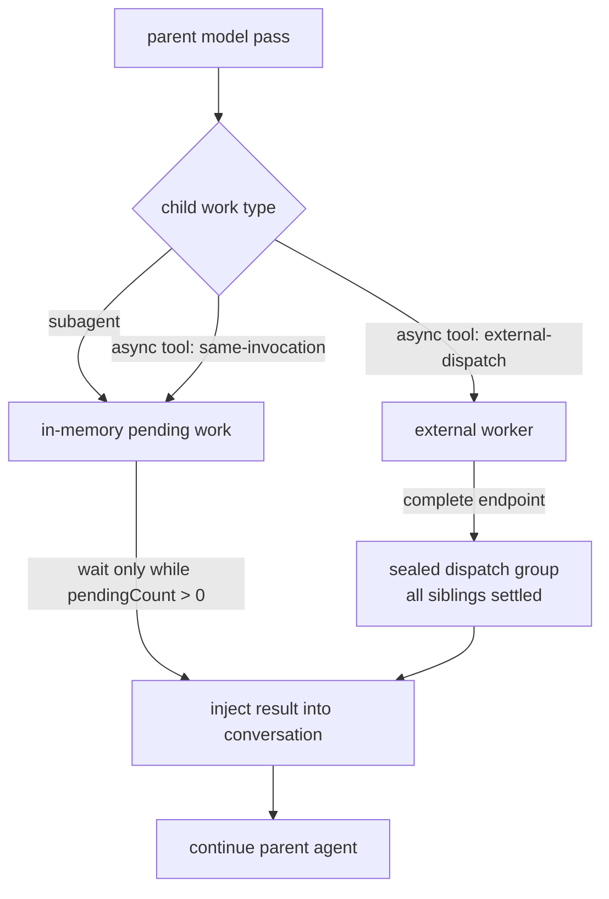
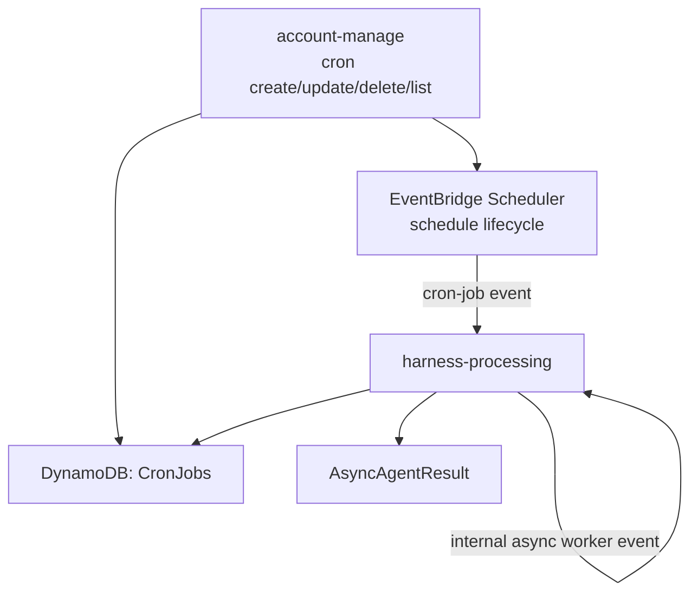
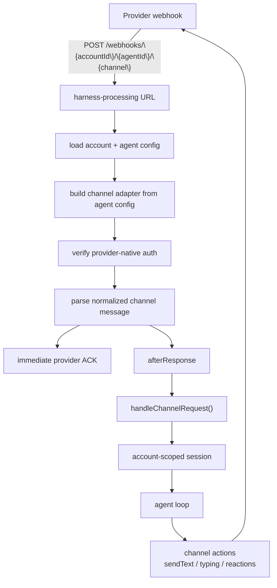
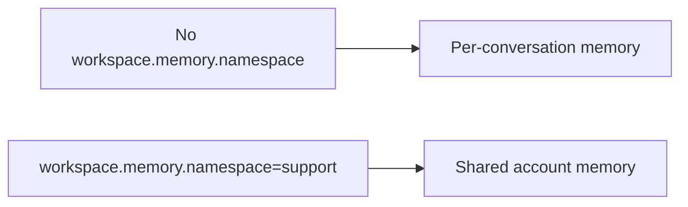

# Architecture and Workflows

The deployed system is a multi-account serverless agent harness. Accounts are managed by `account-manage`; runtime traffic is handled by `harness-processing`.

## Runtime Layer

Both Lambdas use the Bun custom runtime and `startStreamingRuntime()` from `functions/_shared/runtime.ts`.

Runtime boundary:

- SST points Lambda `handler` to `bootstrap`.
- The runtime passes the full Function URL event envelope into each handler.
- `afterResponse` lets channel webhooks acknowledge quickly, then continue work after the HTTP response.

## High-Level Architecture

## Account Routing

Every runtime request resolves an account and an account-owned agent before agent work begins.

The diagrams show the logical ownership of runtime config. In code, `integrations.ts` resolves the account once, loads the selected agent, then passes the runtime config into `handler.ts` and `session.ts` to avoid extra lookups during the turn. The runtime projection keeps model, tool, workspace, and skills config, but strips channel credentials before the agent loop.

Root provider webhooks are not accepted. Provider webhook URLs must include the `accountId`, `agentId`, and channel name.

## Account Management

Provider secrets are not returned in normal account responses. Secret-like fields are redacted as `********`; sending that value back in a patch preserves the existing stored secret.

Deleting an account runs account-scoped cleanup before removing the account record. The cleanup deletes runtime rows whose keys are prefixed with `acct:{accountId}:` and removes the current account filesystem namespaces from S3.

## Direct and Async API

The async path stays inside `harness-processing`: `POST /async` creates `AsyncAgentResult`, returns a status URL, and starts an internal Lambda Event invocation. Subagents and `same-invocation` async tools run inside that Lambda. `external-dispatch` async tools store delivery metadata and continue later through `/async-tools/{resultId}/complete`.

Direct sync and async POST access is controlled by `ENABLE_DIRECT_API`, which defaults to `true`. When disabled, `POST /` and `POST /async` are closed while channel webhooks and internal worker invocations remain available.

## Cron Jobs

Cron jobs are included in the default stack as a small scheduled-agent add-on, not a workflow DSL. `account-manage` owns cron job create, update, delete, and list operations: it stores the account-scoped cron job in DynamoDB and creates, updates, or deletes the matching EventBridge Scheduler schedule. EventBridge Scheduler wakes `harness-processing` with `{ kind: "cron-job", accountId, cronJobId }`, and the harness starts the configured agent asynchronously.

Developers who need custom chaining, cleanup, polling, or external workflow behavior can deploy their own scheduled worker and call the existing direct or async API.

## Channel Webhooks

Customers talk to the provider bot/app owned by the account. They never receive an account secret.

## WebSocket Gateway (NATS)

The WebSocket gateway owns client authentication, response-subject subscription, and Lambda Event invocation. Lambda publishes to a connection-scoped NATS subject; the gateway forwards those events to the client.

NATS subject patterns:

| Subject | Direction | Purpose |
| --------- | ----------- | --------- |
| `v1.{accountId}.{agentId}.ws.response.{connectionId}` | Lambda → Gateway | Vercel AI SDK stream events (`step-start`, `text`, `tool-call`, `finish`, `error`, etc.) |

Notes:

- Lambda can run multiple `nats-worker` invocations at the same time. Each invocation creates its own NATS connection and publisher, so draining one completed request does not close another request's publisher.
- Response subjects are connection-scoped. If one WebSocket connection allows overlapping turns, the gateway/client should use `headers.eventId` and `sequence` to group events per turn.
- External async tool completions publish back to the same response subject only while the gateway/client remains subscribed; core NATS does not replay missed WebSocket stream chunks.
- Future JetStream support can replay missed WebSocket stream chunks from persisted stream/consumer state.
- If strict conversation ordering is required, the gateway should serialize turns per `conversationKey`.
- `ENABLE_WEBSOCKET=true` and `NATS_URL` are required for `nats-worker` invocations. When WebSocket is disabled, the normal direct API remains SSE-only and NATS configuration is ignored.

This path currently uses core NATS. If JetStream is introduced later, replace best-effort publish/drain with explicit publish acknowledgement, durable consumer replay, duplicate, and backpressure handling.

## Memory and Filesystem Boundaries

Workspace state is account/agent-scoped and disabled unless the selected agent has `config.workspace.enabled` true. When enabled, it turns on workspace memory and tools; `workspace.memory.enabled`, `workspace.filesystem.enabled`, and `workspace.tasks.enabled` can disable those pieces individually. `workspace.sandbox.enabled` extends the filesystem tool with file-only `node <file.js|file.ts>` and `python <file.py>` execution through the configured sandbox provider. The default provider invokes private runtime Lambdas with AWS S3 Files mounted as the workspace filesystem; E2B and Daytona adapters use provider-native mounted workspaces behind the same executor contract. `workspace.needsApproval` requires approval for every enabled workspace tool. By default workspace state is per conversation; setting `config.workspace.memory.namespace` lets multiple conversations for the same agent share `MEMORY.md`, filesystem files, and task files.

See [Memory and Session](memory-and-session.md) for the full model.

## Model and Tool Configuration

Agents control model selection, channel credentials, optional skills, subagents, and tool access through encrypted agent config. `harness.ts` resolves `config.model`; `tools/index.ts` creates workspace tools from `config.workspace`, subagent dispatch from `config.subagent`, search/research tools from `config.tools`, and `load_skill` when `config.skills.enabled` is true and `config.skills.allowed` has paths. See the [API Reference](/api-reference) for the complete `AgentConfig` schema.

## Storage Boundaries

- `AccountConfig`: account metadata and account secret hash.
- `AgentConfig`: account-owned encrypted runtime config payloads.
- `Conversations`: normalized model messages by account-scoped `conversationKey`.
- `ProcessedEvents`: dedup markers and short-lived conversation lease records.
- `AsyncAgentResult`: async direct API and subagent state for `/status/{eventId}` polling.
- `AsyncToolResult`: async external tool call state, same-table dispatch-group rows for external fan-in, delivery metadata for non-SSE continuations, and structured outputs for parent result injection.
- S3 memory bucket: account/agent-scoped `MEMORY.md`, filesystem, and task state.
- S3 skills bucket: account-scoped skill bundles under `<accountId>/<skill-name>`.

Tool execution is inline unless an agent-configured local `execute` tool sets `async: true`. `execution` chooses `same-invocation` or `external-dispatch`; SSE supports only `same-invocation`, while `/async`, channels, and NATS support both. Subagents are in-process child agent loops; they do not require child Lambda workers.
