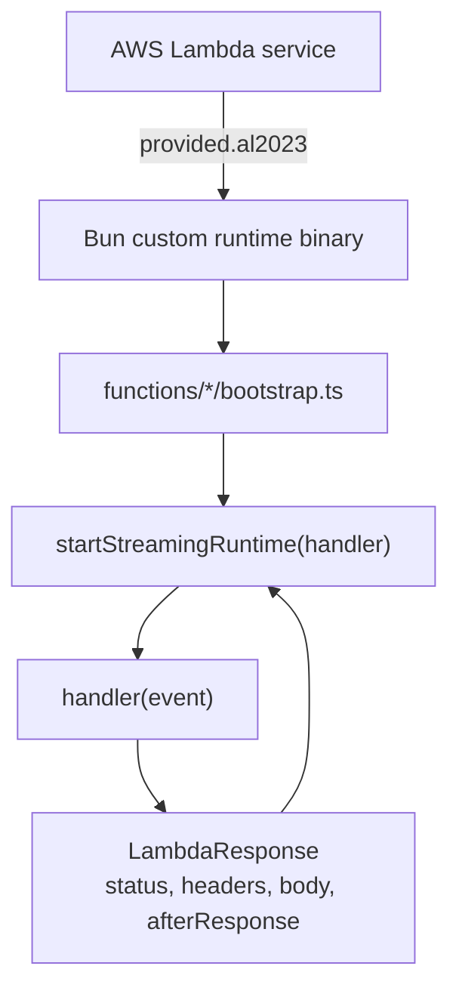
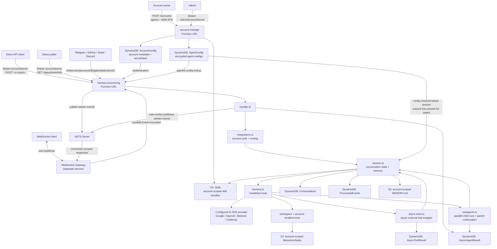
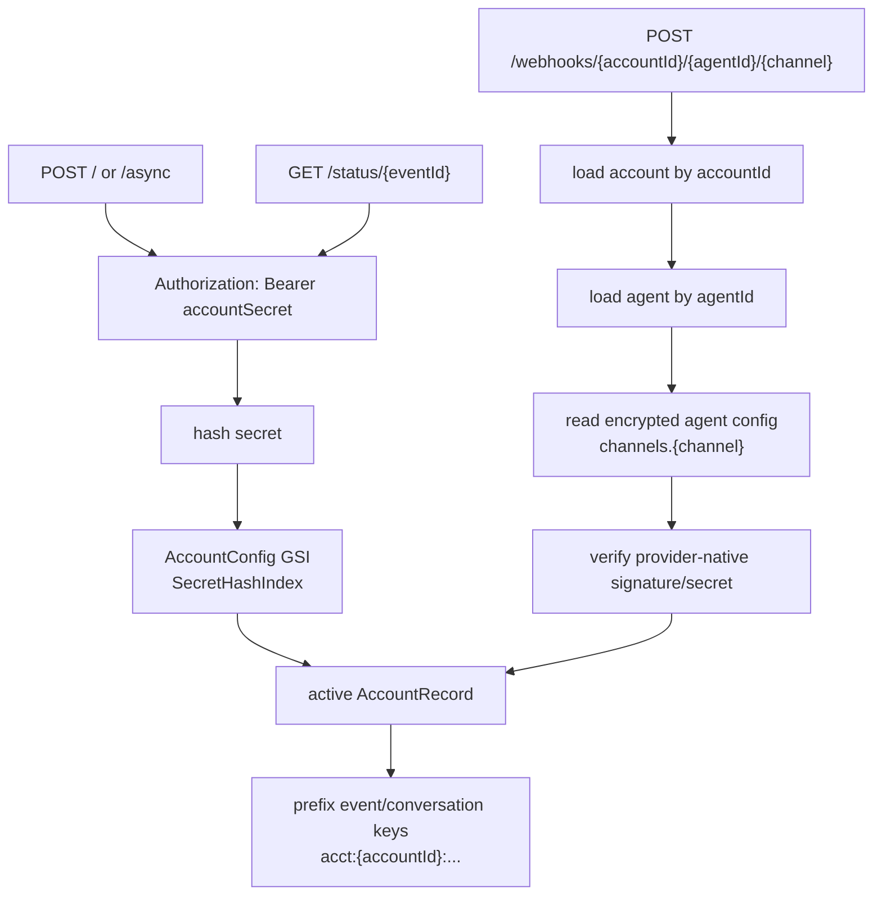
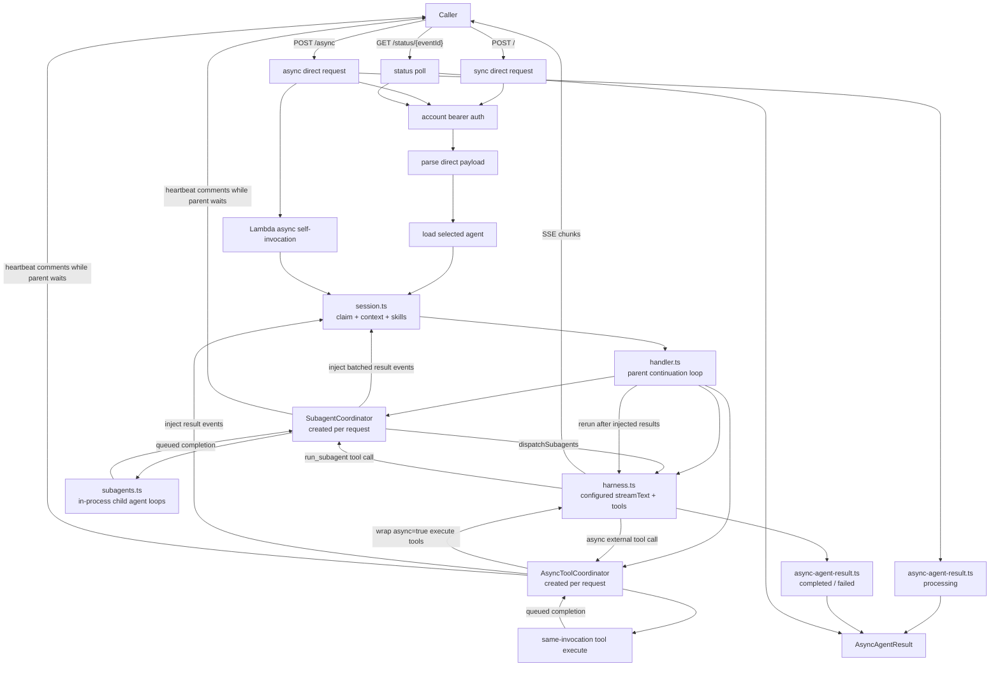
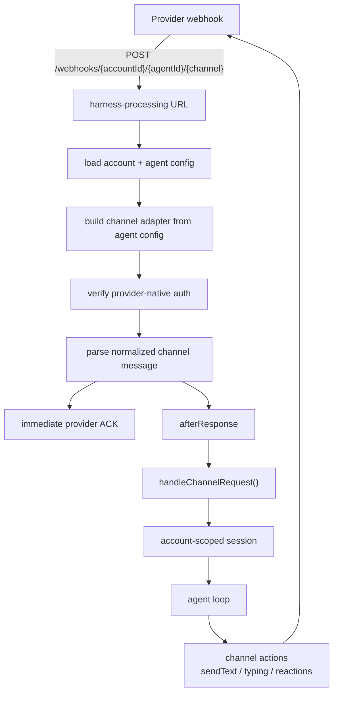
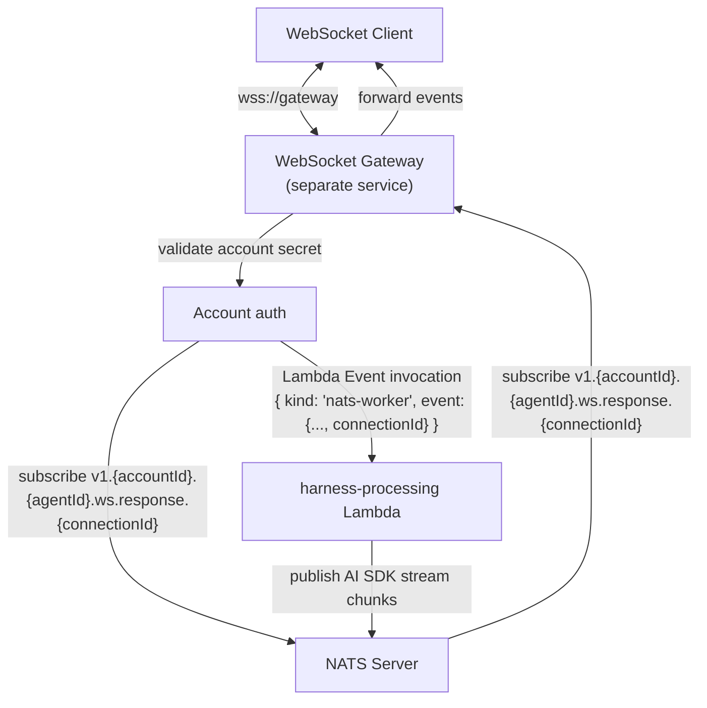
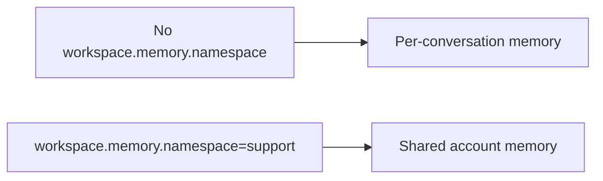

# Architecture and Workflows

The deployed system is a multi-account serverless agent harness. Accounts are managed by `account-manage`; runtime traffic is handled by `harness-processing`.

## Runtime Layer

Both Lambdas use the Bun custom runtime and `startStreamingRuntime()` from `functions/_shared/runtime.ts`.

Runtime boundary:

- SST points Lambda `handler` to `bootstrap`.
- The runtime passes the full Function URL event envelope into each handler.
- `afterResponse` lets channel webhooks acknowledge quickly, then continue work after the HTTP response.

## High-Level Architecture

## Account Routing

Every runtime request resolves an account and an account-owned agent before agent work begins.

The diagrams show the logical ownership of runtime config. In code, `integrations.ts` resolves the account once, loads the selected agent, then passes the runtime config into `handler.ts` and `session.ts` to avoid extra lookups during the turn. The runtime projection keeps model, tool, workspace, and skills config, but strips channel credentials before the agent loop.

Root provider webhooks are not accepted. Provider webhook URLs must include the `accountId`, `agentId`, and channel name.

## Account Management

Provider secrets are not returned in normal account responses. Secret-like fields are redacted as `********`; sending that value back in a patch preserves the existing stored secret.

Deleting an account runs account-scoped cleanup before removing the account record. The cleanup deletes runtime rows whose keys are prefixed with `acct:{accountId}:` and removes the current account filesystem namespaces from S3.

## Direct and Async API

The async path stays inside `harness-processing`: `POST /async` stores a processing record, returns a status URL, and starts an internal async Lambda self-invocation. The worker runs the same account-scoped agent turn and updates `AsyncAgentResult`. Subagent dispatch does not require a separate child Lambda for SSE continuation; child agent loops run concurrently inside the parent invocation, and their results are batched into parent conversation events before the parent loop runs again.
Async external tools with local `execute` functions also run concurrently inside the active parent invocation. Their status rows are persisted in `AsyncToolResult`, and completed results are injected into the same parent continuation loop.

Direct sync and async POST access is controlled by `ENABLE_DIRECT_API`, which defaults to `true`. When disabled, `POST /` and `POST /async` are closed while channel webhooks and internal worker invocations remain available.

## Channel Webhooks

Customers talk to the provider bot/app owned by the account. They never receive an account secret.

## WebSocket Gateway (NATS)

The WebSocket integration is additive to the existing SSE direct API and is enabled with application environment config: `ENABLE_WEBSOCKET=true` and `NATS_URL`. The WebSocket gateway owns client authentication, response-subject subscription, and Lambda Event invocation. It invokes `harness-processing` asynchronously with `{ kind: "nats-worker", event: { ...DirectInboundEvent, connectionId } }`, then can acknowledge the client because no HTTP stream is held open. The Lambda runs the account-scoped agent turn and publishes each Vercel AI SDK stream event to a connection-scoped NATS subject. The gateway forwards those events to the connected WebSocket client.

The gateway should subscribe to the response subject before invoking Lambda. A separate NATS-to-Lambda bridge is not required when the gateway can validate auth and has IAM permission to invoke `harness-processing` asynchronously. In that deployment, NATS is only the Lambda-to-gateway streaming path.

NATS subject patterns:

| Subject | Direction | Purpose |
| --------- | ----------- | --------- |
| `v1.{accountId}.{agentId}.ws.response.{connectionId}` | Lambda → Gateway | Vercel AI SDK stream events (`step-start`, `text`, `tool-call`, `finish`, `error`, etc.) |

Concurrency notes:

- Lambda can run multiple `nats-worker` invocations at the same time. Each invocation creates its own NATS connection and publisher, so draining one completed request does not close another request's publisher.
- Response subjects are connection-scoped. If one WebSocket connection allows overlapping turns, the gateway/client should use `headers.eventId` and `sequence` to group events per turn.
- If strict conversation ordering is required, the gateway should serialize turns per `conversationKey`.
- `ENABLE_WEBSOCKET=true` and `NATS_URL` are required for `nats-worker` invocations. When WebSocket is disabled, the normal direct API remains SSE-only and NATS configuration is ignored.

This path currently uses core NATS. Stream chunks are published without per-message acknowledgements, and the publisher drains the connection at the end of the Lambda invocation to send queued outbound messages before exit. If JetStream is introduced later, replace this with explicit publish acknowledgement, duplicate, and backpressure handling.

WebSocket enablement is application infrastructure configuration for the gateway and Lambda environment, not an agent config field. SST fails deployment configuration when `ENABLE_WEBSOCKET=true` is set without `NATS_URL`.

## Memory and Filesystem Boundaries

Workspace state is account/agent-scoped and disabled unless the selected agent has `config.workspace.enabled` true. When enabled, it turns on workspace memory and tools; `workspace.memory.enabled`, `workspace.filesystem.enabled`, and `workspace.tasks.enabled` can disable those pieces individually. `workspace.needsApproval` requires approval for every enabled workspace tool. By default workspace state is per conversation; setting `config.workspace.memory.namespace` lets multiple conversations for the same agent share `MEMORY.md`, filesystem files, and task files.

See [Memory and Session](memory-and-session.md) for the full model.

## Model and Tool Configuration

Agents control model selection, channel credentials, optional skills, subagents, and tool access through encrypted agent config. `harness.ts` resolves `config.model`; `tools/index.ts` creates workspace tools from `config.workspace`, subagent dispatch from `config.subagent`, search/research tools from `config.tools`, and `load_skill` when `config.skills.enabled` is true and `config.skills.allowed` has paths. See [Account management](account-management.md#agent-config) for the supported config shape.

## Code Ownership

- [`functions/_shared/accounts.ts`](../functions/_shared/accounts.ts): account records, account secret hashing, bearer auth, and account metadata storage.
- [`functions/_shared/agents.ts`](../functions/_shared/agents.ts): account-owned agent records and encrypted agent config storage.
- [`functions/_shared/runtime-keys.ts`](../functions/_shared/runtime-keys.ts): account-scoped runtime keys, direct API public key validation, leases, and filesystem namespaces.
- [`functions/_shared/skills.ts`](../functions/_shared/skills.ts): shared skill path, frontmatter, import URL validation, and S3 read/ownership primitives.
- [`functions/_shared/nats-events.ts`](../functions/_shared/nats-events.ts): NATS event types and subject patterns for WebSocket gateway integration.
- [`functions/_shared/nats.ts`](../functions/_shared/nats.ts): NATS publisher interface for connection-scoped WebSocket stream events.
- [`functions/account-manage/handler.ts`](../functions/account-manage/handler.ts): account CRUD and admin/self-management HTTP API.
- [`functions/account-manage/skills.ts`](../functions/account-manage/skills.ts): account skill CRUD, GitHub import handling, and S3 writes.
- [`functions/account-manage/cleanup.ts`](../functions/account-manage/cleanup.ts): account deletion cleanup for runtime rows and S3 namespaces.
- [`functions/harness-processing/integrations.ts`](../functions/harness-processing/integrations.ts): account auth, direct request parsing, account webhook routing, and channel normalization.
- [`functions/harness-processing/handler.ts`](../functions/harness-processing/handler.ts): SSE, async self-invocation, commands, leases, and reply flow.
- [`functions/harness-processing/session.ts`](../functions/harness-processing/session.ts): event deduplication, conversation persistence, system context, and account/agent-scoped memory loading.
- [`functions/harness-processing/skills.ts`](../functions/harness-processing/skills.ts): enabled skill metadata and `load_skill` prompt content loading.
- [`functions/harness-processing/async-agent-result.ts`](../functions/harness-processing/async-agent-result.ts): async direct API and subagent result persistence for polling.
- [`functions/harness-processing/async-tool-result.ts`](../functions/harness-processing/async-tool-result.ts): async external tool result persistence.
- [`functions/harness-processing/async-tools.ts`](../functions/harness-processing/async-tools.ts): async external tool dispatch, result injection, and parent continuation support.
- [`functions/harness-processing/subagents.ts`](../functions/harness-processing/subagents.ts): subagent dispatch, child model runs, status rows, and parent result injection.
- [`functions/harness-processing/harness.ts`](../functions/harness-processing/harness.ts): configured model execution loop and inline tool orchestration.
- [`functions/harness-processing/tools/index.ts`](../functions/harness-processing/tools/index.ts): static tool factory registry and account-configured tool selection.

## Storage Boundaries

- `AccountConfig`: account metadata and account secret hash.
- `AgentConfig`: account-owned encrypted runtime config payloads.
- `Conversations`: normalized model messages by account-scoped `conversationKey`.
- `ProcessedEvents`: dedup markers and short-lived conversation lease records.
- `AsyncAgentResult`: async direct API and subagent state for `/status/{eventId}` polling.
- `AsyncToolResult`: async external tool call state and structured outputs for parent result injection.
- S3 memory bucket: account/agent-scoped `MEMORY.md`, filesystem, and task state.
- S3 skills bucket: account-scoped skill bundles under `<accountId>/<skill-name>`.

Tool execution is inline in `harness-processing` unless an account-configured local `execute` tool sets `async: true`, in which case it is detached within the same invocation and resumed through parent result injection. Async direct API requests use Lambda async self-invocation to run the same harness code in the background. Subagents run as in-process child agent loops for the active parent invocation; status rows are persisted in `AsyncAgentResult`, but parent SSE continuation does not poll child Lambda workers.
