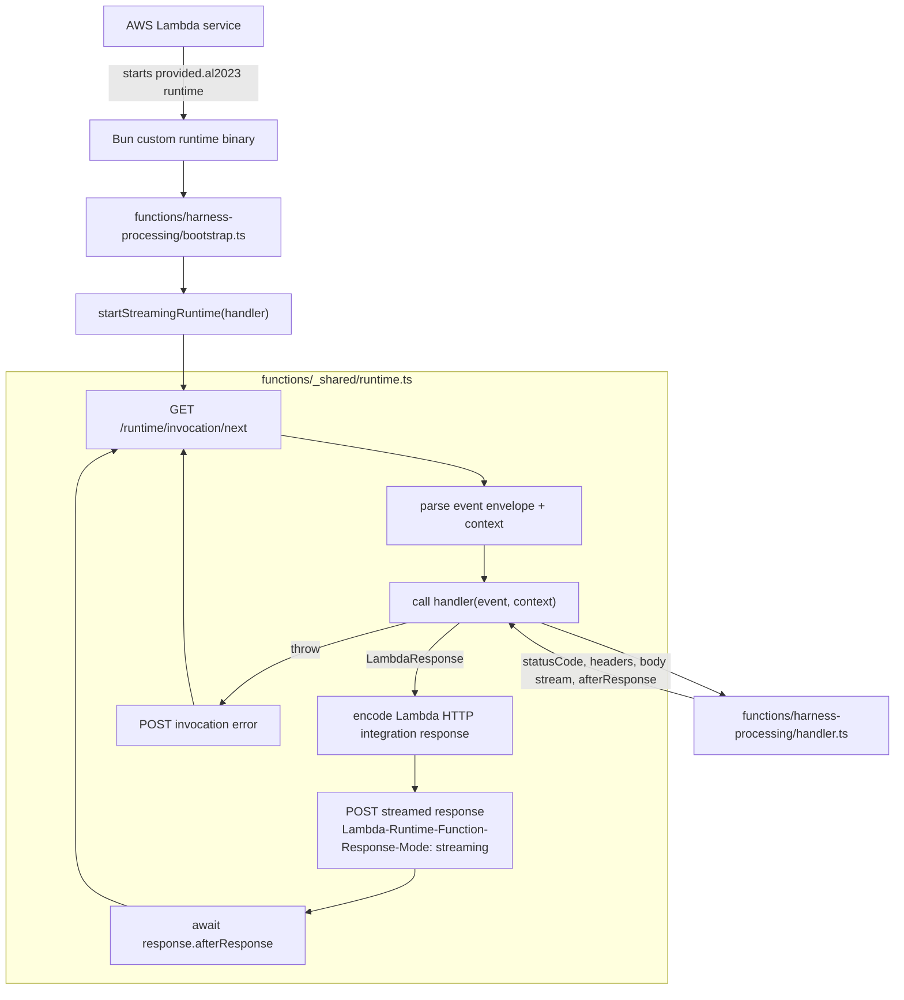
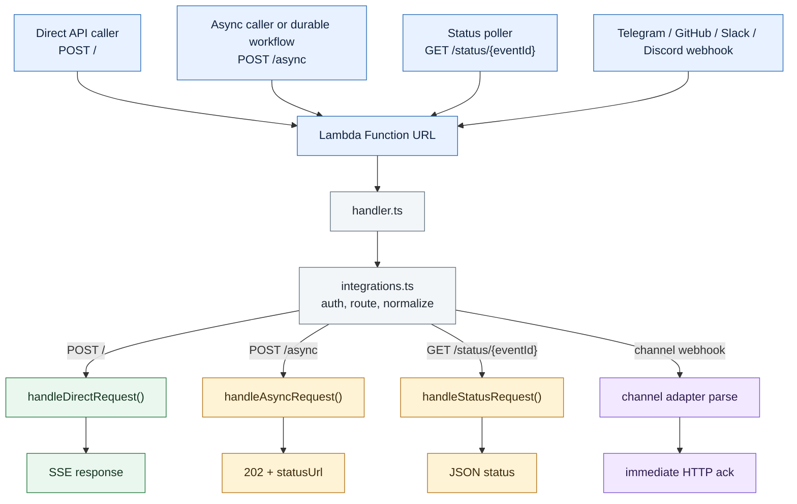
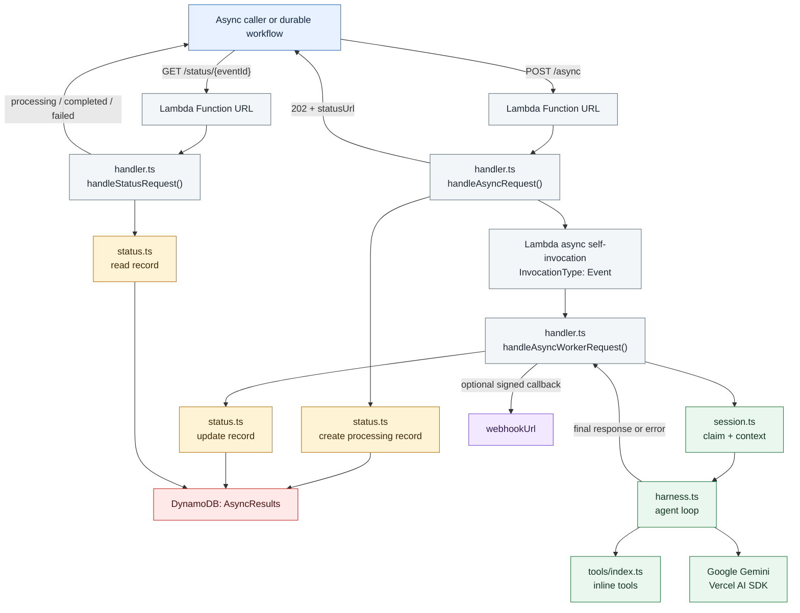
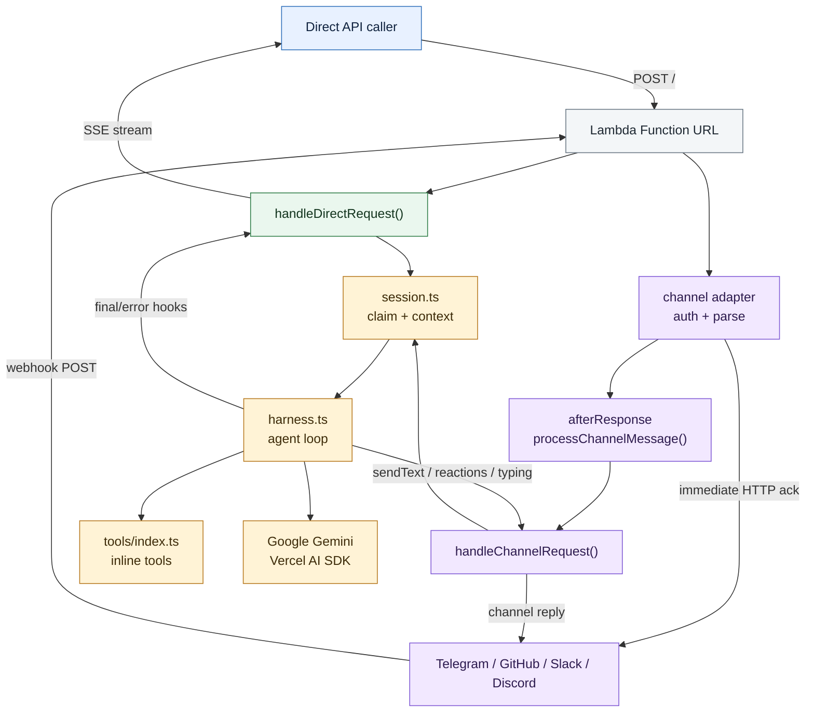
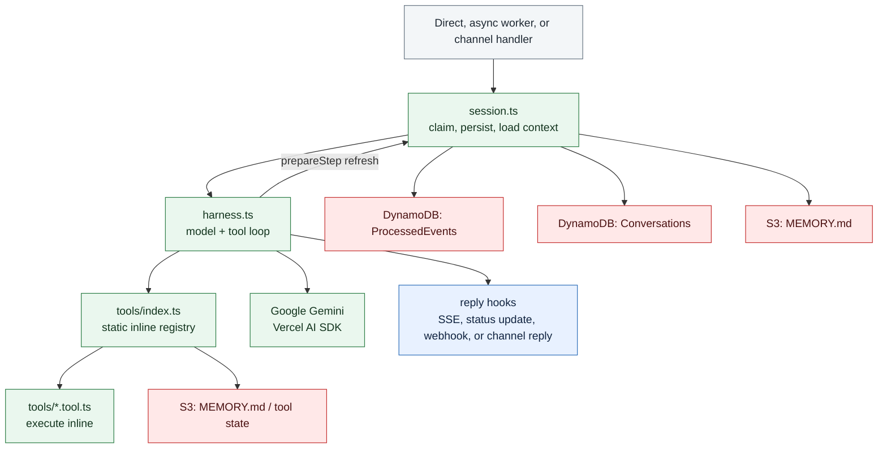
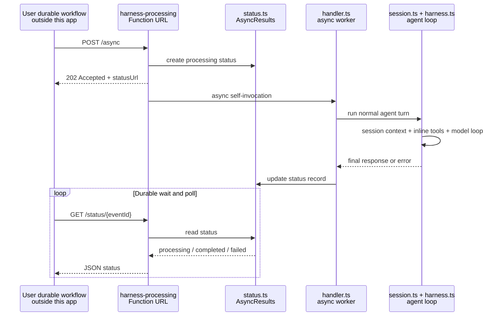

# Architecture and Workflows

The deployed path is one public Lambda Function URL backed by the `harness-processing` Lambda. That Lambda handles sync direct API requests, async direct API requests, status polling, and optional Telegram, GitHub, Slack, and Discord webhooks.

## Lambda Runtime Layer

This layer is the Lambda execution plumbing. It explains how AWS invokes the Bun binary and how the custom runtime turns Lambda Runtime API events into application handler calls.

Runtime boundary:

- AWS invokes `bootstrap`, not `handler.ts`, because SST config sets `handler: "bootstrap"` in [`sst.config.ts`](../sst.config.ts).
- [`bootstrap.ts`](../functions/harness-processing/bootstrap.ts) starts [`startStreamingRuntime()`](../functions/_shared/runtime.ts), then the runtime loop calls the exported [`handler()`](../functions/harness-processing/handler.ts) for each invocation.
- [`functions/_shared/runtime.ts`](../functions/_shared/runtime.ts) owns Lambda Runtime API polling, streaming HTTP response encoding, error reporting, and post-response work via `afterResponse`.
- The full Lambda Function URL event envelope is passed into `handler.ts`; routing is not synthesized by the runtime layer.

## Application Traffic Layer

This layer is the application behavior. It explains how direct API calls, async requests, status polling, and channel webhooks move through the single public Lambda.

### Entry Points

Everything enters through the same Lambda Function URL, then `integrations.ts` decides which handler path should own the request.

### Async Direct API

The caller receives `statusUrl` immediately, while the background worker runs the normal agent path and updates `status.ts`.

The async path stays inside `harness-processing`: `POST /async` stores a processing record, returns a status URL, and starts an internal async Lambda self-invocation. The worker then runs the normal agent turn through `session.ts`, `harness.ts`, and the inline tool registry, and writes the final status through `status.ts`.

### Direct SSE and Channel Webhooks

Direct API calls hold an SSE connection open. Channel webhooks are acknowledged quickly, then `afterResponse` runs the channel message through the same agent loop and sends the reply through channel actions.

### Agent and Storage Boundary

Every request type that needs the model eventually enters the same agent turn loop. `session.ts` owns persistence and context; `harness.ts` owns the model/tool loop.

## Durable Workflow Compatibility

The current deployed implementation uses Lambda async self-invocation for the background worker. There is no durable workflow Lambda in this deployed stack today.

The compatibility point is for a caller that already owns a separate Lambda durable workflow. That external workflow should delegate the expensive agent turn to this app's `POST /async` endpoint, then wait and poll `GET /status/{eventId}`. The durable workflow can checkpoint between polls, so it does not need to keep its own Lambda compute running while the agent loop, model calls, and inline tools execute inside `harness-processing`.

Important boundaries:

- The durable workflow is owned by the caller, not by this app.
- `POST /async` remains the delegation point and returns `202 Accepted` with `statusUrl`.
- The caller's durable workflow owns wait, retry, and polling behavior.
- `harness-processing` owns request normalization, session setup, and the actual agent/model/tool execution.
- The async worker runs the same agent path as other turns: `handler.ts -> session.ts -> harness.ts -> tools/index.ts`.
- `status.ts` is the status update layer for async direct API work. The worker updates that record when the agent finishes or fails; clients poll it through `/status/{eventId}`.
- Optional signed webhook callbacks can still be delivered by this app when `webhookUrl` and `X-Webhook-Secret` are provided.

Lambda durable functions are useful for longer caller-owned workflows because they support checkpoint and replay semantics through the Durable Execution SDK, including waits without holding the caller's workflow compute for the full wall-clock duration.

## Code Ownership

- [`functions/harness-processing/integrations.ts`](../functions/harness-processing/integrations.ts): request normalization, channel detection, auth checks, direct API parsing, and `/async` plus `/status/{eventId}` route detection.
- [`functions/harness-processing/handler.ts`](../functions/harness-processing/handler.ts): thin orchestration for SSE, async self-invocation, commands, leases, and reply flow.
- [`functions/harness-processing/session.ts`](../functions/harness-processing/session.ts): event deduplication, conversation persistence, prompt context, and memory loading.
- [`functions/harness-processing/status.ts`](../functions/harness-processing/status.ts): async direct API result persistence for polling.
- [`functions/harness-processing/harness.ts`](../functions/harness-processing/harness.ts): model execution loop and inline tool orchestration.
- [`functions/harness-processing/tools/index.ts`](../functions/harness-processing/tools/index.ts): static tool registry so tool files are bundled.
- [`functions/_shared/`](../functions/_shared/): shared channel adapters, auth helpers, logging, env, and runtime code.

## Storage and Behavior Boundaries

- `Conversations` DynamoDB table stores normalized model messages by `conversationKey`.
- `ProcessedEvents` DynamoDB table stores dedup markers and short-lived conversation lease records.
- `AsyncResults` DynamoDB table stores async direct API state and final results for `/status/{eventId}` polling.
- The S3 filesystem bucket stores `MEMORY.md` and filesystem-backed tool state under per-conversation namespaces.
- Tool execution is inline in `harness-processing`. Async direct API requests currently use Lambda async self-invocation to run the same harness code in the background.
- The async API contract is intentionally compatible with caller-owned Lambda durable workflows.
- Direct API and webhook traffic share the same Lambda, but use separate `conversationKey` prefixes and routing/auth paths.
