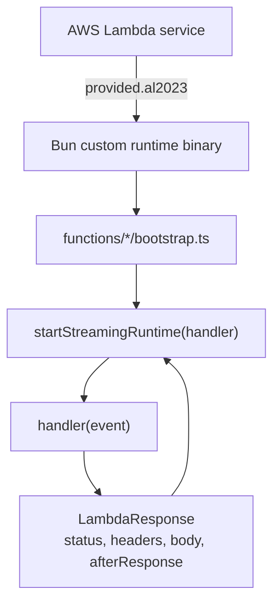
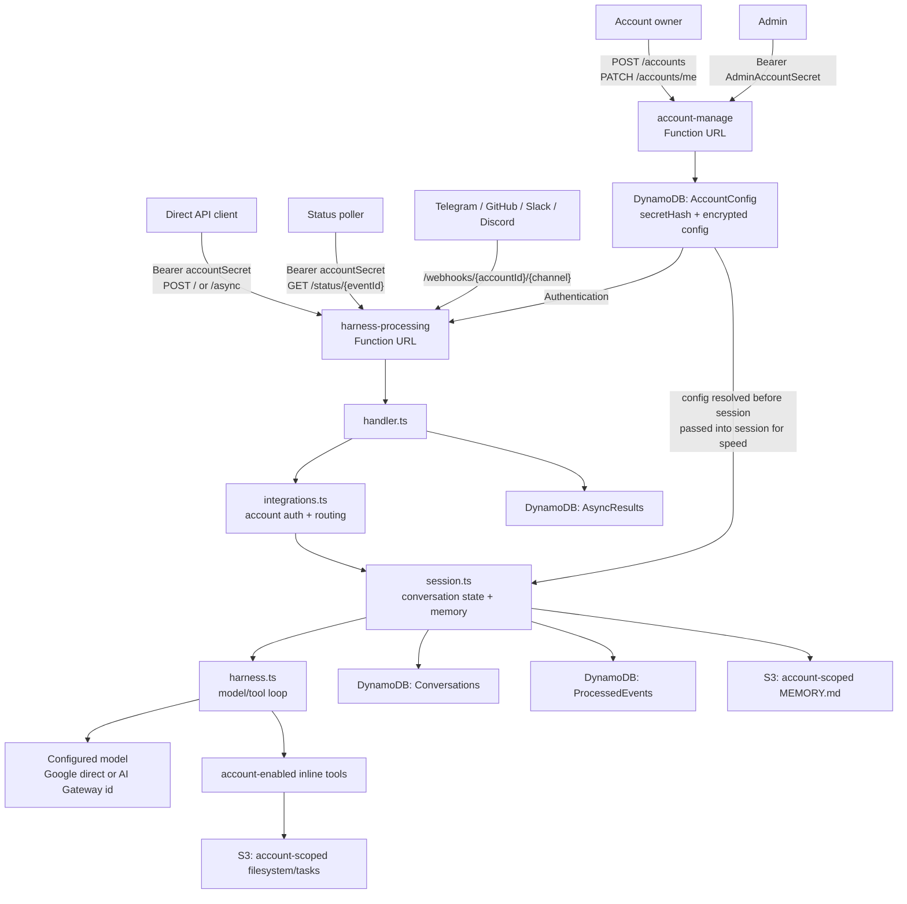
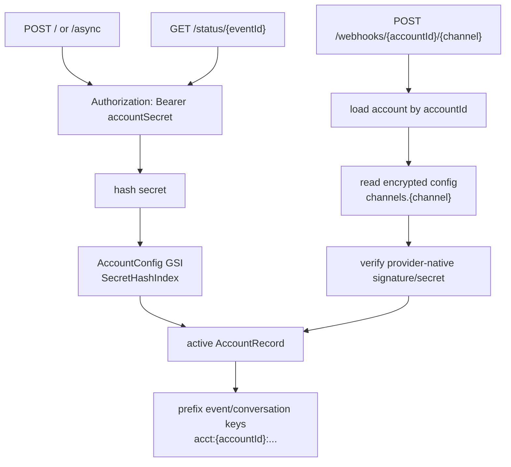
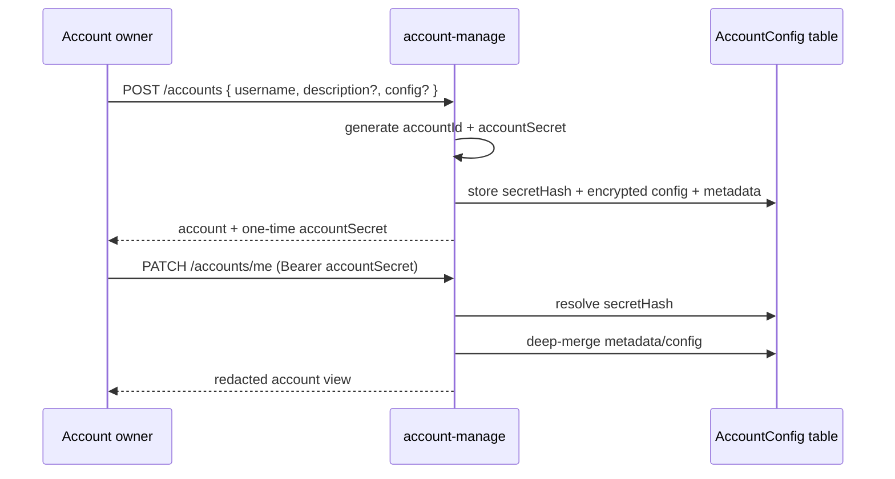
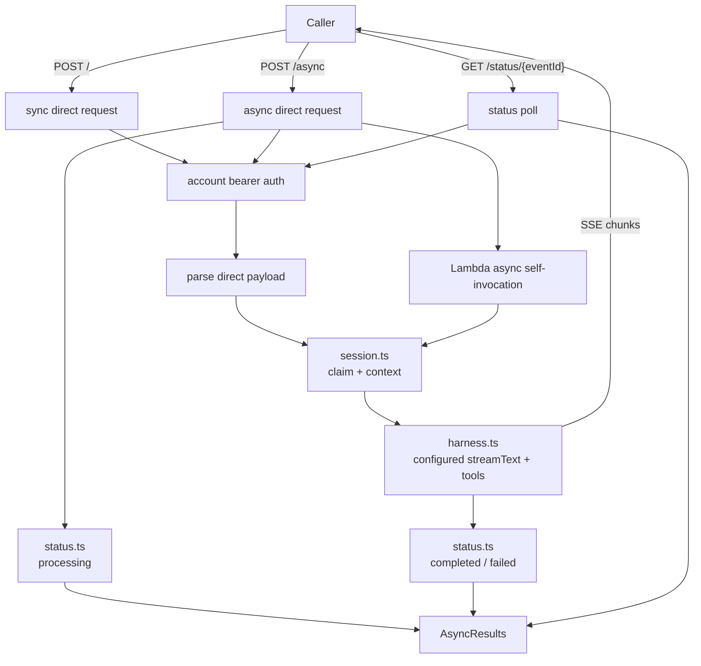
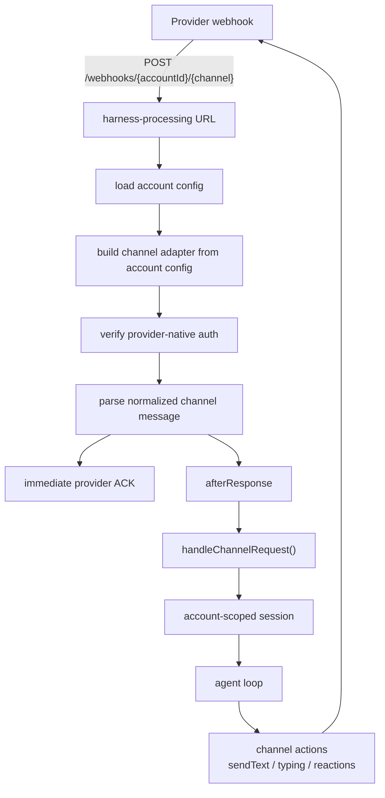
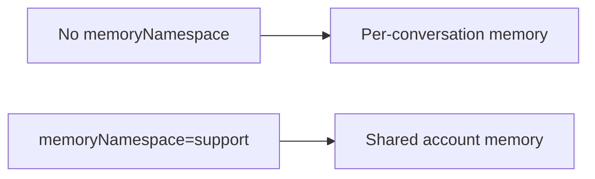

# Architecture and Workflows

The deployed system is a multi-account serverless agent harness. Accounts are managed by `account-manage`; runtime traffic is handled by `harness-processing`.

## Runtime Layer

Both Lambdas use the Bun custom runtime and `startStreamingRuntime()` from `functions/_shared/runtime.ts`.

Runtime boundary:

- SST points Lambda `handler` to `bootstrap`.
- The runtime passes the full Function URL event envelope into each handler.
- `afterResponse` lets channel webhooks acknowledge quickly, then continue work after the HTTP response.

## High-Level Architecture

## Account Routing

Every runtime request resolves an account before agent work begins.

The diagrams show the logical ownership of runtime config. In code, `integrations.ts` resolves and decrypts the account once, then passes the runtime config into `handler.ts` and `session.ts` to avoid extra lookups during the turn. The runtime projection keeps model and tool config, but strips channel credentials before the agent loop.

Root provider webhooks are not accepted. Provider webhook URLs must include the account id and channel name.

## Account Management

Provider secrets are not returned in normal account responses. Secret-like fields are redacted as `********`; sending that value back in a patch preserves the existing stored secret.

Deleting an account runs account-scoped cleanup before removing the account record. The cleanup deletes runtime rows whose keys are prefixed with `acct:{accountId}:` and removes the current account filesystem namespaces from S3.

## Direct and Async API

The async path stays inside `harness-processing`: `POST /async` stores a processing record, returns a status URL, and starts an internal async Lambda self-invocation. The worker runs the same account-scoped agent turn and updates `AsyncResults`.

## Channel Webhooks

Customers talk to the provider bot/app owned by the account. They never receive an account secret.

## Memory and Filesystem Boundaries

Memory and filesystem state is account-scoped. By default it is per conversation; setting `config.memoryNamespace` lets multiple conversations in the same account share `MEMORY.md`, filesystem files, and task files.

See [Memory and Session](memory-and-session.md) for the full model.

## Model and Tool Configuration

Accounts control model selection and tool access through encrypted account config. `harness.ts` resolves `config.model`, and `tools/index.ts` creates only the tools enabled under `config.tools`. See [Account management](account-management.md#account-config) for the supported config shape.

## Code Ownership

- [`functions/_shared/accounts.ts`](../functions/_shared/accounts.ts): account records, account secret hashing, bearer auth, encrypted config storage, config merge, and redaction.
- [`functions/account-manage/handler.ts`](../functions/account-manage/handler.ts): account CRUD and admin/self-management HTTP API.
- [`functions/harness-processing/integrations.ts`](../functions/harness-processing/integrations.ts): account auth, direct request parsing, account webhook routing, and channel normalization.
- [`functions/harness-processing/handler.ts`](../functions/harness-processing/handler.ts): SSE, async self-invocation, commands, leases, and reply flow.
- [`functions/harness-processing/session.ts`](../functions/harness-processing/session.ts): event deduplication, conversation persistence, prompt context, and account-scoped memory loading.
- [`functions/harness-processing/status.ts`](../functions/harness-processing/status.ts): async direct API result persistence for polling.
- [`functions/harness-processing/harness.ts`](../functions/harness-processing/harness.ts): configured model execution loop and inline tool orchestration.
- [`functions/harness-processing/tools/index.ts`](../functions/harness-processing/tools/index.ts): static tool factory registry and account-configured tool selection.

## Storage Boundaries

- `AccountConfig`: account metadata, account secret hash, and encrypted config payload.
- `Conversations`: normalized model messages by account-scoped `conversationKey`.
- `ProcessedEvents`: dedup markers and short-lived conversation lease records.
- `AsyncResults`: async direct API state and final results for `/status/{eventId}` polling.
- S3 memory bucket: account-scoped `MEMORY.md`, filesystem, and task state.

Tool execution is inline in `harness-processing`. Async direct API requests use Lambda async self-invocation to run the same harness code in the background.
