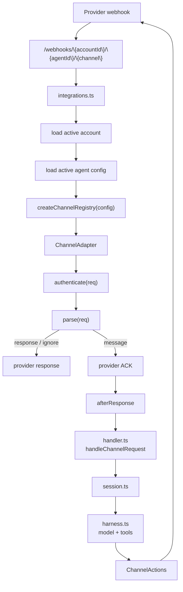

# Channels Reference

Channels are communication integrations such as Telegram, GitHub, Slack, Discord, and Pancake. They translate provider webhooks into the shared agent input shape, then send replies through a channel-specific `ChannelActions` implementation.

Customers interact with the provider bot, app, or webhook. They do not receive account secrets. The webhook URL always includes the account, agent, and channel:

```bash
{AGENT_SERVICE_URL}/webhooks/{accountId}/{agentId}/{channel}
```

## Runtime Flow



Webhook handling is split deliberately:

- [`functions/harness-processing/integrations.ts`](../../functions/harness-processing/integrations.ts) owns routing, account/agent lookup, adapter selection, provider ACKs, and normalized channel events.
- [`functions/harness-processing/handler.ts`](../../functions/harness-processing/handler.ts) owns session setup, command dispatch, agent execution, and final reply handling.
- [`functions/_shared/channels.ts`](../../functions/_shared/channels.ts) owns the shared channel contracts.
- `functions/_shared/<channel>-channel.ts` owns provider-specific authentication, parsing, formatting, and reply API calls.

---

## Supported Channels

| Channel | Adapter | Required config | Documentation |
| --- | --- | --- | --- |
| `telegram` | [`functions/_shared/telegram-channel.ts`](../../functions/_shared/telegram-channel.ts) | `botToken`, `webhookSecret`, `allowedChatIds` | [Telegram Details](telegram.md) |
| `github` | [`functions/_shared/github-channel.ts`](../../functions/_shared/github-channel.ts) | `webhookSecret`, `appId`, `privateKey` | [GitHub Details](github.md) |
| `slack` | [`functions/_shared/slack-channel.ts`](../../functions/_shared/slack-channel.ts) | `botToken`, `signingSecret` | [Slack Details](slack.md) |
| `discord` | [`functions/_shared/discord-channel.ts`](../../functions/_shared/discord-channel.ts) | `botToken`, `publicKey` | [Discord Details](discord.md) |
| `pancake` | [`functions/_shared/pancake-channel.ts`](../../functions/_shared/pancake-channel.ts) | `pageId`, `pageAccessToken` | [Pancake Details](pancake.md) |

---

## Channel Contract

Each channel implements `ChannelAdapter` from [`functions/_shared/channels.ts`](../../functions/_shared/channels.ts):

| Method | Purpose |
| --- | --- |
| `name` | Stable URL segment and config key, such as `telegram` |
| `canHandle(req)` | Quick provider-shape check, usually based on headers |
| `authenticate(req)` | Provider-native signature or secret verification |
| `parse(req)` | Converts the webhook into `message`, `ignore`, or direct `response` |
| `actions(msg)` | Returns reply, typing, and reaction actions scoped to the inbound message |

`parse()` returns one of three outcomes:

| Result | Meaning |
| --- | --- |
| `message` | Continue into the agent loop after sending `ack` or a default `200` |
| `ignore` | Stop without running the agent, usually for unsupported events |
| `response` | Return a provider-specific response immediately, such as a challenge reply |

The normalized `InboundMessage` contains:

- `eventId`: provider delivery/message ID used for deduplication
- `conversationKey`: provider thread/chat/channel key used for persisted conversation state
- `channelName`: adapter name
- `content`: Vercel AI SDK `UserContent`
- `source`: provider metadata needed for commands, replies, or diagnostics

`integrations.ts` scopes `eventId` and `conversationKey` with `accountId` and `agentId` before the session sees them.

---

## Add a Channel

1. Add config types to [`functions/_shared/accounts.ts`](../../functions/_shared/accounts.ts).
2. Validate the new `config.channels.<channel>` fields in `normalizeChannelsConfig()`.
3. Create `functions/_shared/<channel>-channel.ts`.
4. Implement `ChannelAdapter`.
5. Keep provider-specific reply formatting and send logic inside the channel module.
6. Import the channel factory in [`functions/harness-processing/integrations.ts`](../../functions/harness-processing/integrations.ts).
7. Add `create<Channel>ChannelFromConfig()` and include it in `createChannelRegistry()`.
8. Document the webhook URL as `/webhooks/{accountId}/{agentId}/{channel}`.
9. Update the [API Reference](/api-reference) `AgentConfig.channels` schema, [`examples/account.config.example.json`](../../examples/account.config.example.json), setup scripts, and focused tests/examples when the public config changes.

Do not hardcode channel-specific behavior in commands, shared handlers, or the core agent loop. Commands receive only the channel-agnostic `ChannelActions` interface.

---

## Adapter Skeleton

```ts
/**
 * Example channel adapter implemented as a ChannelAdapter.
 * Keep Example auth, message normalization, and reply actions here.
 */

import type { ChannelAdapter, ChannelParseResult } from "./channels.ts";

export function createExampleChannel(
  token: string,
  webhookSecret: string,
): ChannelAdapter {
  return {
    name: "example",

    canHandle(req) {
      return "x-example-delivery" in req.headers;
    },

    authenticate(req) {
      return req.headers["x-example-secret"] === webhookSecret;
    },

    parse(req): ChannelParseResult {
      const body = JSON.parse(req.body) as {
        id: string;
        threadId: string;
        text?: string;
      };

      if (!body.text) {
        return { kind: "ignore", response: { statusCode: 200 } };
      }

      return {
        kind: "message",
        ack: { statusCode: 200 },
        message: {
          eventId: body.id,
          conversationKey: body.threadId,
          channelName: "example",
          content: [{ type: "text", text: body.text }],
          source: body as Record<string, unknown>,
        },
      };
    },

    actions(msg) {
      return {
        sendText: async (text) => {
          await fetch("https://api.example.com/messages", {
            method: "POST",
            headers: {
              "Authorization": `Bearer ${token}`,
              "Content-Type": "application/json",
            },
            body: JSON.stringify({
              threadId: msg.conversationKey,
              text,
            }),
          });
        },
        sendTyping: async () => {},
        reactToMessage: async () => {},
      };
    },
  };
}
```

---

## Channel Rules

- Verify provider signatures or webhook secrets before parsing user-controlled payloads deeply.
- Return a provider ACK quickly; long-running model work should happen in `afterResponse`.
- Use stable provider IDs for `eventId` so duplicate deliveries are deduped.
- Use thread/chat/channel IDs for `conversationKey` so follow-up messages preserve context.
- Put provider-specific Markdown or HTML formatting in the channel module.
- Keep `ChannelActions` methods resilient; failed typing or reaction calls should not fail the whole turn.
- Keep approval-dependent tools off channel-only agents unless a direct API client will resume the approval flow.
