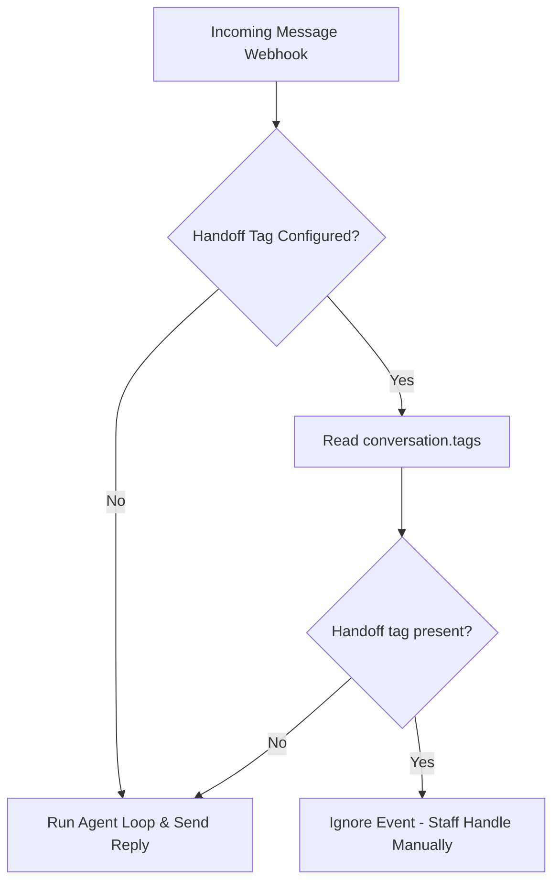

# Pancake

Pancake is an omni-channel customer service and inbox management platform. The Pancake channel adapter allows your agent to handle messages (`INBOX`) and post/page comments (`COMMENT`) directly from Pancake, and can skip conversations with a configured handoff tag so staff can take over in Pancake.

## Configuration

To enable the Pancake channel, configure your agent's settings as shown below:

```json
{
  "channels": {
    "pancake": {
      "pageId": "your-page-id",
      "pageAccessToken": "your-page-access-token",
      "senderId": "optional-staff-user-id",
      "options": {
        "handoff": {
          "tagId": "123"
        }
      }
    }
  }
}
```

### Configuration Fields

- `pageId` (Required): The unique ID of the Pancake page.
- `pageAccessToken` (Required): The access token generated within Pancake to authorize API calls.
- `senderId` (Optional): The ID of the staff/user in Pancake who sends the replies. If set, responses sent by the agent will appear as sent by this user.
- `options` (Optional):
  - `handoff` (Optional): Configuration for skipping conversations that staff should handle manually.
    - `tagId`: Pancake conversation tag ID that marks a conversation as human handoff.
    - `assigneeIds` (Optional): Staff IDs for handoff tooling. The adapter does not use this field for webhook gating.

---

## Human Handoff Tag

When human staff need to take over a conversation, add the configured handoff tag in Pancake. The adapter checks the tag IDs already included in the Pancake webhook payload.

### How it Works

When `options.handoff.tagId` is configured, every incoming message webhook checks `conversation.tags`:



1. **No handoff tag**: The agent operates normally and automatically handles responses.
2. **Handoff tag present**: The adapter ignores the event and returns `200 OK` to Pancake, bypassing the agent run entirely. This allows human operators to respond manually in the Pancake dashboard without interference from the agent.
3. **Return to auto mode**: Remove the handoff tag in Pancake. The next customer message can run the agent again.

To let the agent add or remove Pancake tags during a conversation, enable `config.tools.pancake_toggle_tag`. The tool defaults to the configured `options.handoff.tagId` when no tag ID is provided in the tool call.
