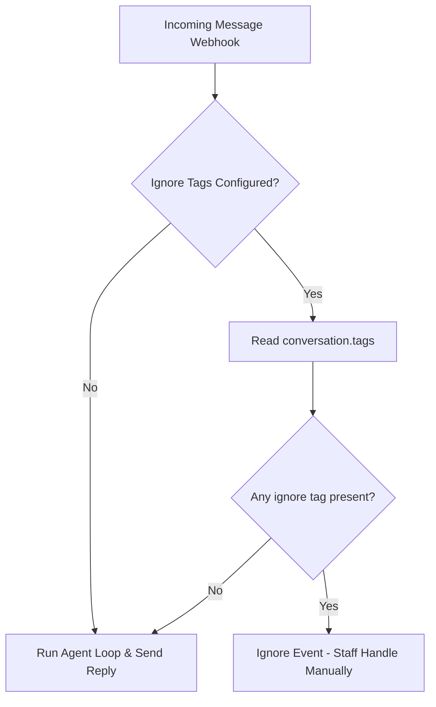

# Pancake

Pancake is an omni-channel customer service and inbox management platform. The Pancake channel adapter allows your agent to handle messages (`INBOX`) and post/page comments (`COMMENT`) directly from Pancake, and can skip conversations carrying any configured ignore tag so staff can take over in Pancake.

## Configuration

To enable the Pancake channel, configure your agent's settings as shown below:

```json
{
  "channels": {
    "pancake": {
      "pageId": "your-page-id",
      "pageAccessToken": "your-page-access-token",
      "webhookSecret": "a-long-random-value",
      "senderId": "optional-staff-user-id",
      "options": {
        "ignoreTagIds": ["123"]
      }
    }
  }
}
```

### Configuration Fields

- `pageId` (Required): The unique ID of the Pancake page.
- `pageAccessToken` (Required): The access token generated within Pancake to authorize API calls.
- `webhookSecret` (Required): A random value you generate. Pancake does not sign its webhooks, so the secret rides on the webhook URL instead and every request is checked against it.
- `senderId` (Optional): The ID of the staff/user in Pancake who sends the replies. If set, responses sent by the agent will appear as sent by this user.
- `options` (Optional):
  - `ignoreTagIds` (Optional): Array of Pancake conversation tag IDs that mark a conversation as human handoff. When any of these tags is present, the webhook event is ignored.

Register the webhook URL in Pancake with the secret as a query parameter — requests without a matching `secret` are rejected with `401`:

```text
https://<agent-service-url>/webhooks/<accountId>/<agentId>/pancake?secret=<webhookSecret>
```

---

## Human Handoff Tags

When human staff need to take over a conversation, add one of the configured ignore tags in Pancake. The adapter checks the tag IDs already included in the Pancake webhook payload.

### How it Works

When `options.ignoreTagIds` is configured, every incoming message webhook checks `conversation.tags`:



1. **No ignore tag**: The agent operates normally and automatically handles responses.
2. **Ignore tag present**: The adapter ignores the event and returns `200 OK` to Pancake, bypassing the agent run entirely. This allows human operators to respond manually in the Pancake dashboard without interference from the agent.
3. **Return to auto mode**: Remove the tag in Pancake. The next customer message can run the agent again.
