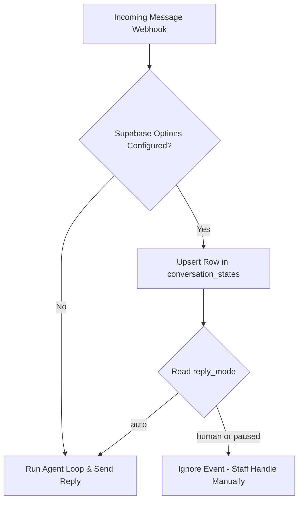

# Pancake

Pancake is an omni-channel customer service and inbox management platform. The Pancake channel adapter allows your agent to handle messages (`INBOX`) and post/page comments (`COMMENT`) directly from Pancake, and supports a toggle-mode feature to allow manual interference/override by humans.

## Configuration

To enable the Pancake channel, configure your agent's settings as shown below:

```json
{
  "channels": {
    "pancake": {
      "pageId": "your-page-id",
      "pageAccessToken": "your-page-access-token",
      "senderId": "optional-staff-user-id",
      "options": {
        "supabase": {
          "url": "https://your-project.supabase.co",
          "serviceRoleKey": "your-supabase-service-role-key"
        }
      }
    }
  }
}
```

### Configuration Fields

- `pageId` (Required): The unique ID of the Pancake page.
- `pageAccessToken` (Required): The access token generated within Pancake to authorize API calls.
- `senderId` (Optional): The ID of the staff/user in Pancake who sends the replies. If set, responses sent by the agent will appear as sent by this user.
- `options` (Optional):
  - `supabase` (Optional): Configuration for checking human interference state.
    - `url`: The base URL of your Supabase project (e.g., `https://xxxxxx.supabase.co`).
    - `serviceRoleKey`: The secret service role JWT key used to manage conversation states.

---

## Interfere by Human / Toggle Mode

When human staff need to take over a conversation, Pancake can check the conversation's active state in an external database (Supabase) to toggle between AI-agent automation and manual human intervention.

### How it Works

When `options.supabase` is configured, every incoming message webhook executes a pre-flight check in your Supabase database:



1. **State Persistence & Check**: The adapter runs an `UPSERT` against your Supabase `conversation_states` table using the scoped `conversation_key` as a unique identifier. This row maintains the current active `reply_mode`.
2. **Toggle Modes**:
   - **`auto`**: The agent operates normally and automatically handles responses.
   - **`human` or `paused`**: The adapter ignores the event and returns a `200 OK` to Pancake, bypassing the agent run entirely. This allows human operators to respond manually in the Pancake dashboard without interference from the agent.
