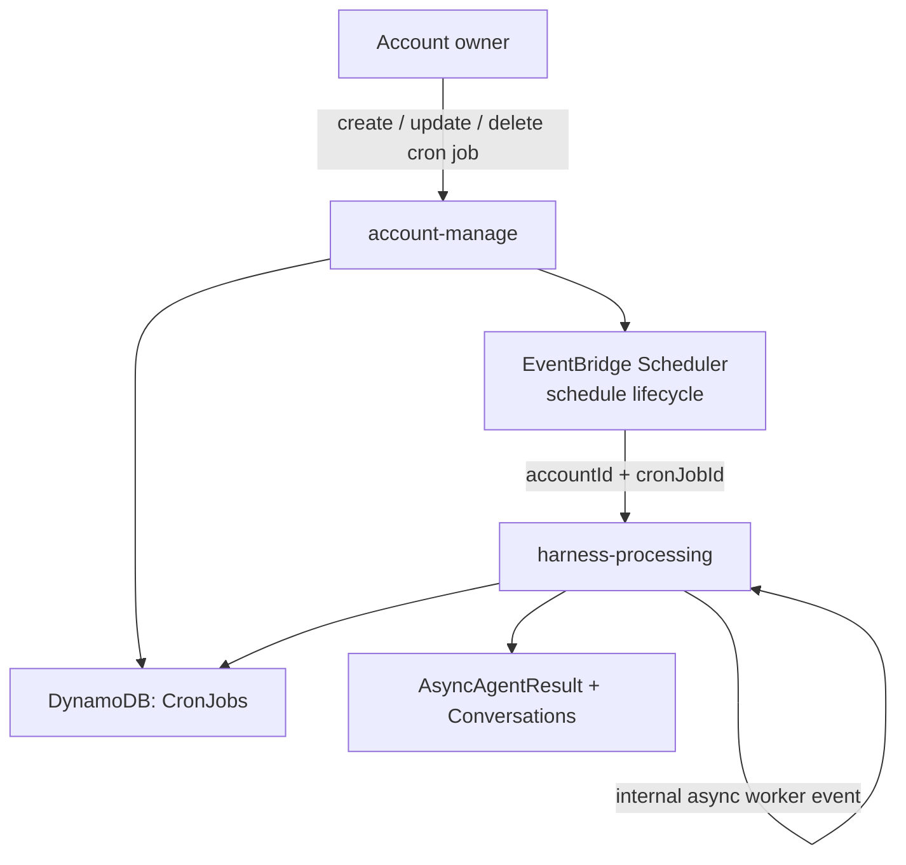

# Cron Jobs

Cron jobs start account agents on a schedule. They are included in the default infrastructure as a small add-on surface on top of the existing account and harness services.



## Model

Cron jobs store the selected agent and prompt directly:

```json
{
  "agentId": "agent_maintainer",
  "conversationKey": "cron:daily-maintenance",
  "prompt": "Run daily maintenance."
}
```

This keeps the add-on small. Developers who need custom workflow code can deploy their own Lambda, worker, or scheduler and call the existing direct/async API.

## Account API

Create:

```bash
curl -X POST "$ACCOUNT_SERVICE_URL/accounts/me/cron-jobs" \
  -H "Authorization: Bearer $ACCOUNT_SECRET" \
  -H "Content-Type: application/json" \
  -d '{
    "name": "Daily maintenance",
    "agentId": "agent_maintainer",
    "conversationKey": "cron:daily-maintenance",
    "prompt": "Run daily maintenance.",
    "scheduleExpression": "cron(0 8 * * ? *)",
    "timezone": "Europe/Amsterdam"
  }'
```

Supported schedule expressions are AWS EventBridge Scheduler expressions: `cron(...)`, `rate(...)`, and `at(...)`.

`timezone` maps to EventBridge Scheduler `ScheduleExpressionTimezone`. When omitted, schedules are evaluated in UTC. Use an IANA timezone such as `Europe/Amsterdam` when account owners expect local wall-clock time.

Pause a job:

```bash
curl -X PATCH "$ACCOUNT_SERVICE_URL/accounts/me/cron-jobs/$CRON_JOB_ID" \
  -H "Authorization: Bearer $ACCOUNT_SECRET" \
  -H "Content-Type: application/json" \
  -d '{ "status": "paused" }'
```

Delete a job:

```bash
curl -X DELETE "$ACCOUNT_SERVICE_URL/accounts/me/cron-jobs/$CRON_JOB_ID" \
  -H "Authorization: Bearer $ACCOUNT_SECRET"
```
