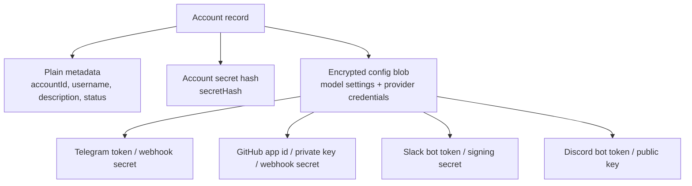
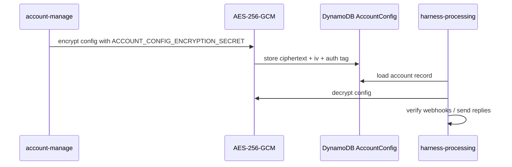

# Data Security

This is an experiment product, so the security model is simple by design. It avoids storing provider secrets as plain JSON in DynamoDB, but it is not a final production-grade secrets system.

## What Is Stored



The account API secret is never stored directly. It is returned once on create or rotation, then only `secretHash` is stored.

Provider credentials must be usable at runtime, so they cannot be hashed. They are stored inside the encrypted account config.

## How Config Encryption Works



Current implementation:

- AES-256-GCM encrypts the config before DynamoDB write.
- `ACCOUNT_CONFIG_ENCRYPTION_SECRET` comes from SST secrets.
- DynamoDB stores encrypted config, not readable provider credentials.
- Lambdas decrypt config only when they need account runtime settings.

## API Responses

Normal account responses redact secret-like fields:

```text
********
```

If a client sends `********` back in a patch, the existing real secret is preserved.

## Why Keep It This Way

This keeps the product easy to run and change:

- No extra Secrets Manager objects per account.
- No KMS decrypt call on every config read.
- Account data stays in one DynamoDB item.
- Good enough for an experiment product.

## Limits

- `ACCOUNT_CONFIG_ENCRYPTION_SECRET` must be protected.
- Lambdas with the encryption secret and table access can decrypt config.
- Key rotation needs a migration.
- This protects against accidental table-read exposure, not compromised application code.
