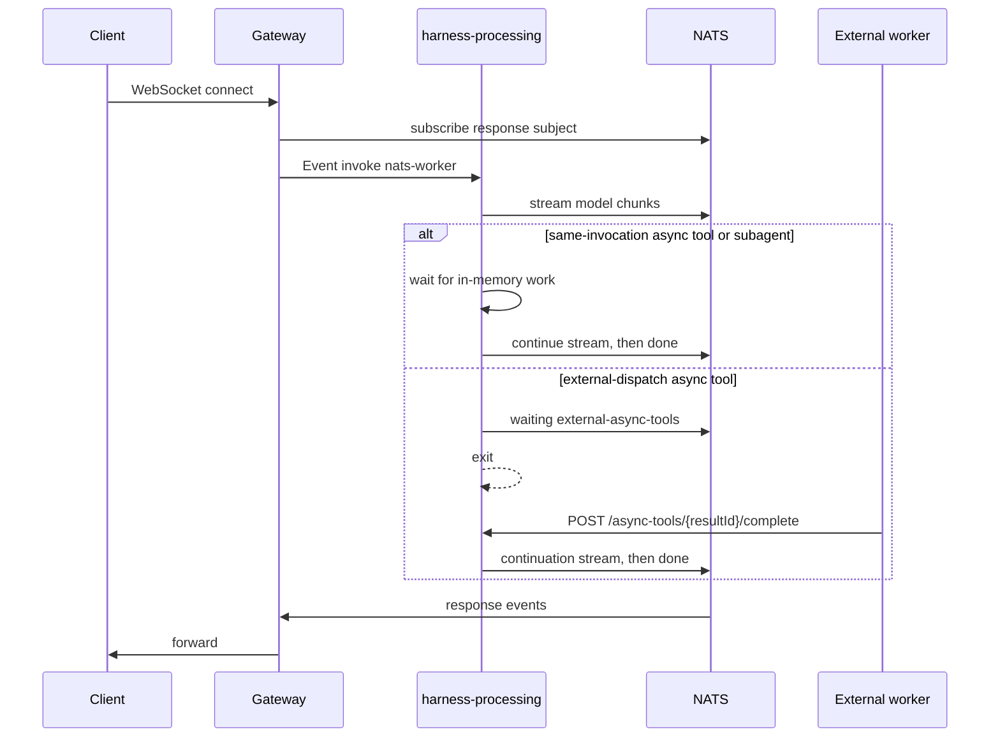
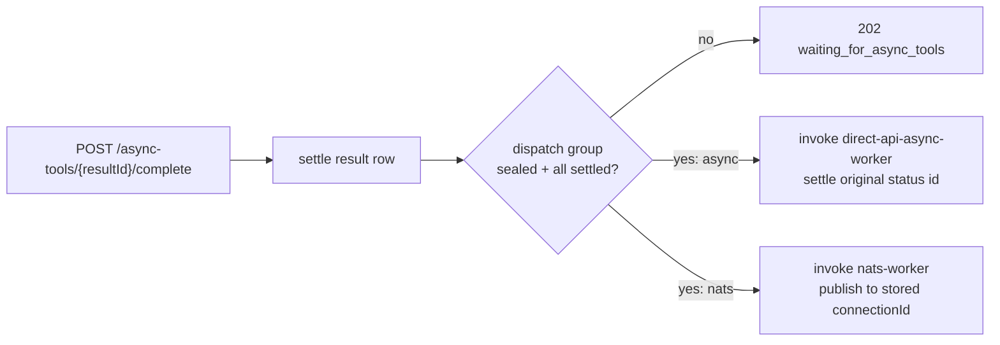

# Direct API

The direct API is the account-authenticated HTTP surface for `harness-processing`. Create an account through `account-manage`, create an agent, then send:

```http
Authorization: Bearer <accountSecret>
```

Direct API state is internally scoped as `acct:<accountId>:agent:<agentId>:api:<key>`, so different accounts and agents can reuse the same public `eventId` or `conversationKey` without colliding.

Direct sync and async POST access is controlled by the service-level `ENABLE_DIRECT_API` environment variable. It defaults to `true`; when set to `false`, `POST /` and `POST /async` return 404 while channel webhooks and internal worker invocations remain available.

Model behavior and tool access come from the selected agent's encrypted config. Workspace tools come from `config.workspace.enabled`; subagent dispatch comes from `config.subagent.enabled`; search/research tools come from `config.tools`; skills are optional and load only when `config.skills.enabled` is true and `config.skills.allowed` has paths. See [`examples/account.config.example.json`](../examples/account.config.example.json) for the supported agent config shape.

> **Notice:** Every model invocation receives a runtime environment system prompt before the selected agent's configured system prompt. It includes the current runtime time as an ISO timestamp and the runtime timezone. Do not add generic current-time context when creating or invoking an agent unless the request needs a user-specific locale, timezone, or business-time rule.

## Endpoint Summary

| Method | Path | Auth | Response | Purpose |
| --- | --- | --- | --- | --- |
| `GET` | `/` | none | JSON | Health probe |
| `POST` | `/` | account bearer | SSE | Run a sync direct agent turn |
| `POST` | `/async` | account bearer | JSON | Queue an async direct agent turn |
| `GET` | `/status/{eventId}?agentId={agentId}` | account bearer | JSON | Poll async status |
| `POST` | `/async-tools/{resultId}/complete` | account bearer | JSON | Complete an externally dispatched async tool |
| `POST` | `/webhooks/{accountId}/{agentId}/{channel}` | provider-native | provider-specific | Channel webhooks, documented in [Channels](channels.md) |

All direct API request bodies use public `eventId` and `conversationKey` values. The service scopes them internally by account and agent.

## WebSocket Gateway

The service supports WebSocket connections through a separate gateway when `ENABLE_WEBSOCKET=true`. With WebSocket enabled, `NATS_URL` is required and the Lambda publishes streaming events to NATS during the agent loop, allowing the gateway to forward real-time responses to connected clients.



The gateway invokes the Lambda asynchronously (Event mode), so no HTTP connection is held open during streaming. After the async invoke is accepted, the gateway can acknowledge the client while the Lambda publishes directly to NATS and returns 204 when complete.

Key rules:

- Subscribe to `v1.{accountId}.{agentId}.ws.response.{connectionId}` before invoking Lambda.
- `finish` is one model pass. `data.type === "done"` is the logical request-complete signal.
- `waiting/in-process-async-work` means the Lambda is still alive for subagents or same-invocation async tools.
- `waiting/external-async-tools` means the Lambda can exit; completion later re-invokes `nats-worker`.
- Core NATS does not replay missed chunks. Continuation only reaches a still-subscribed gateway/client.
- Future: when this path uses JetStream, missed WebSocket stream chunks can be replayed from persisted stream/consumer state.
- If one WebSocket allows overlapping turns, demultiplex by `headers.eventId` and `sequence`.

### NATS Event Format

Each event wraps a Vercel AI SDK stream chunk with routing headers:

```json
{
  "type": "stream",
  "headers": {
    "accountId": "acct_...",
    "agentId": "agent_...",
    "conversationKey": "conversation-identifier",
    "eventId": "unique-id-for-dedup",
    "connectionId": "ws-connection-id"
  },
  "data": { "type": "text", "text": "Hello" },
  "sequence": 1
}
```

Most `data` values contain raw Vercel AI SDK stream events: `step-start`, `step-finish`, `text`, `tool-call`, `tool-result`, `finish`, `error`, etc. NATS also emits harness lifecycle events:

```json
{ "type": "waiting", "reason": "in-process-async-work", "pendingCount": 2 }
```

```json
{ "type": "waiting", "reason": "external-async-tools" }
```

```json
{ "type": "structured-output", "output": { "answer": "done" } }
```

```json
{ "type": "done" }
```

The gateway should forward raw model/tool chunks to the WebSocket client and use `done` to close or mark the request complete. `structured-output` is emitted only when the selected agent config has `model.output`; it carries the parsed final JSON value.

### NATS Delivery Model

> Warning: Core NATS `publish()` does not return per-message persistence acknowledgement and does not replay missed WebSocket chunks. The publisher drains the NATS connection at invocation end so queued outbound messages are sent before exit.

Future JetStream work should handle publish acknowledgements, durable consumers, replay, duplicate windows, persistence failures, and backpressure explicitly.

WebSocket enablement is infrastructure config, not an agent config field. `ENABLE_WEBSOCKET=true` requires `NATS_URL`.

## Health Probe: `GET /`

Unauthenticated `GET /` is a lightweight probe for the deployed `harness-processing` Function URL. It returns JSON and points callers at the write method:

```json
{
  "status": "ok",
  "method": "POST"
}
```

## Sync API: `POST /`

POST to the deployed `harness-processing` Function URL with Vercel AI SDK-style messages. This path returns an SSE stream:

```json
{
  "agentId": "agent_...",
  "eventId": "unique-id-for-dedup",
  "conversationKey": "conversation-identifier",
  "events": [
    {
      "role": "user",
      "content": [
        { "type": "text", "text": "Hello" }
      ]
    }
  ]
}
```

- `eventId` is used for account-scoped deduplication.
- `conversationKey` selects the account-scoped persisted direct conversation.
- `agentId` selects the account-owned agent config to run.
- `events` may contain `user` messages, one-off `system` messages, and AI SDK `tool-approval-response` tool messages.

When the selected agent config has `model.output`, the SSE stream still includes raw AI SDK chunks and then emits a final parsed structured event:

```json
{ "type": "structured-output", "output": { "answer": "done" } }
```

Direct API callers can inject ephemeral `system` events:

```json
{
  "agentId": "agent_...",
  "eventId": "unique-id-for-dedup",
  "conversationKey": "conversation-identifier",
  "events": [
    {
      "role": "system",
      "content": "The next answer should be terse.",
      "persist": false
    },
    {
      "role": "user",
      "content": [
        { "type": "text", "text": "What is the capital of France?" }
      ]
    }
  ]
}
```

`system` events are supported only on the direct API path and must use `persist: false`. They are request-local: the runtime includes them in the current model run's system prompt, keeps them through any system-prompt refreshes during that run, and does not store them in DynamoDB. Send the same ephemeral system event again on the next request when the instruction should apply again. The direct API rejects caller-supplied `assistant`, `tool-result`, arbitrary `tool` content, and persisted `system` events.

Use ephemeral `system` events for request-local time overrides, for example when the end user is in a different timezone than the Lambda runtime or when a workflow should interpret "today" against a customer-specific calendar.

## Tool Approval

Agents can require user approval before executing selected tools. Enable this in the selected agent config. External tool behavior is covered in [External Tools](tools.md).

```json
{
  "workspace": {
    "enabled": true,
    "needsApproval": true,
    "memory": {
      "enabled": true,
      "namespace": "support"
    },
    "tasks": { "enabled": true }
  },
  "tools": {
    "tavilySearch": { "enabled": true, "needsApproval": true }
  }
}
```

When a tool needs approval, the SSE stream includes the AI SDK `tool-approval-request` event and the assistant approval request is persisted in the conversation. Send a follow-up request with a fresh `eventId`, the same `conversationKey`, and a native AI SDK tool message:

```json
{
  "agentId": "agent_...",
  "eventId": "fresh-id-for-approval-response",
  "conversationKey": "conversation-identifier",
  "events": [
    {
      "role": "tool",
      "content": [
        {
          "type": "tool-approval-response",
          "approvalId": "approval-id-from-stream",
          "approved": true,
          "reason": "User confirmed"
        }
      ]
    }
  ]
}
```

The `approvalId` is required so the AI SDK can match the decision to the pending tool call. Set `approved` to `false` to deny the tool execution, and include `reason` when the model should explain or adjust its next response.

## Async Tool Completion

External-dispatch tools finish through:

```http
POST /async-tools/{resultId}/complete
Authorization: Bearer <accountSecret>
```

Use `{"status":"completed","response":...}` or `{"status":"failed","error":"..."}`. Completion settles one `AsyncToolResult` row through the handler; external workers do not write DynamoDB directly. A sealed dispatch-group item in the same `AsyncToolResult` table waits for every sibling result before continuing the parent.



Minimal `curl` request:

```bash
curl "$AGENT_SERVICE_URL/async-tools/async_tool_.../complete" \
  -H "Authorization: Bearer $ACCOUNT_SECRET" \
  -H "Content-Type: application/json" \
  -d '{
    "status": "completed",
    "response": { "answer": "done" }
  }'
```

## Async API: `POST /async`

POST the same request shape to `/async` when the caller should not hold an SSE connection open. The request returns after the pending status is stored and the background Lambda self-invocation is accepted:

```json
{
  "statusUrl": "https://your-function-url.lambda-url.../status/unique-id-for-dedup?agentId=agent_..."
}
```

The async worker runs the same account-scoped harness code in the background. Poll the returned status URL for completion, failure, or tool approval state. Per-request callback webhooks are not supported; configure agent lifecycle webhooks with `config.hooks.webhook` when external systems need runtime event delivery.

## Status API: `GET /status/{eventId}?agentId={agentId}`

Status requests require the same account bearer header. Responses are backed by the account-scoped `AsyncAgentResult` DynamoDB record.

Processing response:

```json
{
  "eventId": "unique-id-for-dedup",
  "conversationKey": "conversation-identifier",
  "status": "processing"
}
```

Awaiting approval response:

```json
{
  "eventId": "unique-id-for-dedup",
  "conversationKey": "conversation-identifier",
  "status": "awaiting_approval",
  "approvals": [
    {
      "approvalId": "approval-id-from-stream",
      "toolCallId": "tool-call-id",
      "toolName": "filesystem",
      "input": { "shell": "rm file.txt" }
    }
  ]
}
```

Completed response:

```json
{
  "eventId": "unique-id-for-dedup",
  "conversationKey": "conversation-identifier",
  "status": "completed",
  "response": { "answer": "done" }
}
```

Failed response:

```json
{
  "eventId": "unique-id-for-dedup",
  "conversationKey": "conversation-identifier",
  "status": "failed",
  "error": "failure details"
}
```

Unknown event response (`404`):

```json
{
  "eventId": "unique-id-for-dedup",
  "status": "not_found"
}
```

## Error Responses

Non-streaming routing and validation failures return JSON:

```json
{
  "error": "Unauthorized"
}
```

Unsupported methods return:

```json
{
  "error": "Method not allowed",
  "method": "PUT",
  "allowedMethods": ["GET", "POST"]
}
```

## Example Scripts

Live probes use `AGENT_SERVICE_URL` and `ACCOUNT_SERVICE_URL` environment variables. Set the matching provider API key, for example `ACCOUNT_GOOGLE_API_KEY` when using the default Google provider. Each script creates a temporary account, runs the probe with that account secret, then deletes the test account:

```bash
# Account management (Create, Update, Delete)
bun examples/account.ts

# Stream SSE with tools
bun examples/stream.ts

# Async endpoint with polling
bun examples/async.ts

# External-dispatch async tool over NATS
bun examples/external-async.ts

# Tool approval flow
bun examples/tool-approval.ts

# Subagent dispatch and SSE continuation
bun examples/subagent.ts
```
