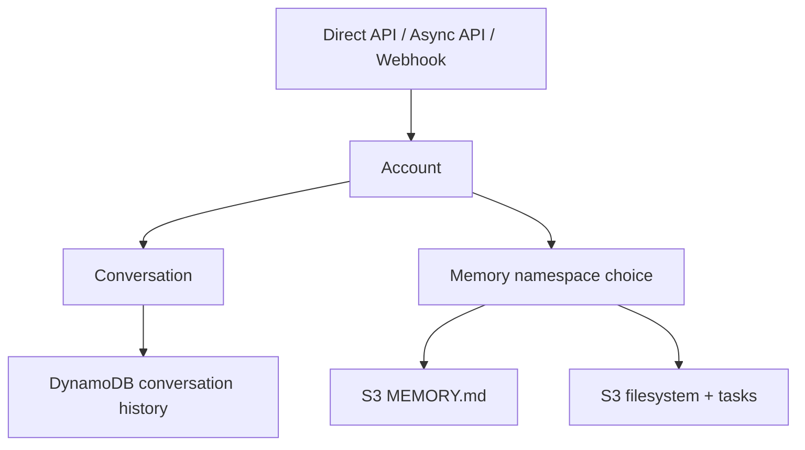
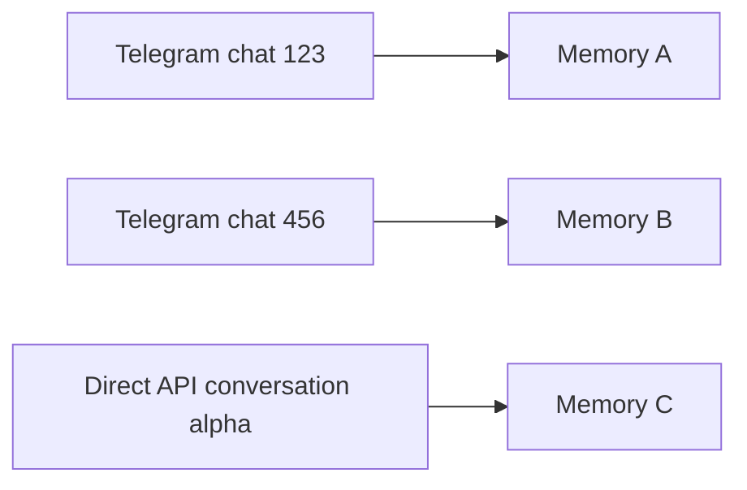
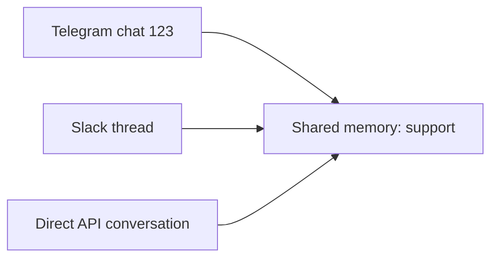
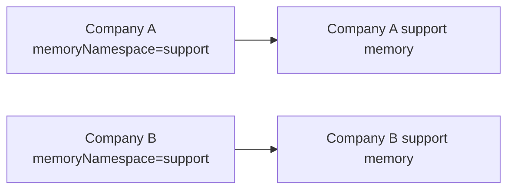
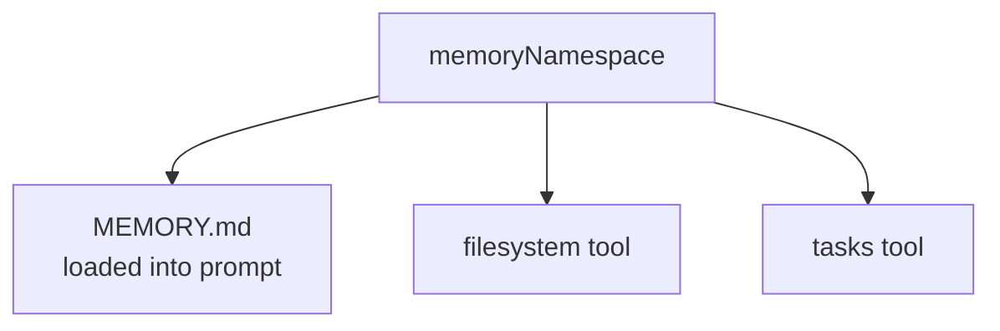
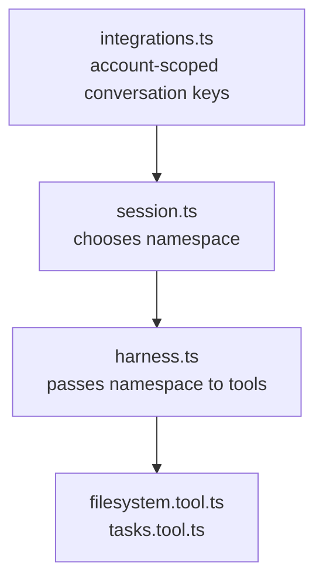

# Memory and Session

This page explains where conversation history, `MEMORY.md`, and filesystem tool files live.

## Mental Model



There are two separate things:

- Conversation history: the chat messages for one conversation.
- Memory/filesystem: `MEMORY.md`, task files, and files written by the filesystem tool.

## Default: One Memory Per Conversation

If the account does not set `memoryNamespace`, every conversation gets its own memory and filesystem.



Use this when each chat, issue, thread, or direct API conversation should remember different things.

## Shared: One Memory For Many Conversations

Set `config.memoryNamespace` when multiple conversations should share the same memory and files.

```json
{
  "config": {
    "memoryNamespace": "support"
  }
}
```



Use this when one account should have a shared knowledge/workspace across channels.

## Account Isolation

The namespace is always scoped by account.



So two accounts can both use `"support"` without sharing data.

## What Uses `memoryNamespace`



It applies to every runtime path:

- Direct API: `POST /`
- Async API: `POST /async`
- Telegram webhooks
- GitHub webhooks
- Slack webhooks
- Discord webhooks

## Configure It

Set or update it through account service.

```bash
curl -X PATCH "$ACCOUNT_SERVICE_URL/accounts/me" \
  -H "Authorization: Bearer $ACCOUNT_SECRET" \
  -H "Content-Type: application/json" \
  -d '{
    "config": {
      "memoryNamespace": "support"
    }
  }'
```

Set it to `null` when you want memory to go back to per-conversation behavior.

```bash
curl -X PATCH "$ACCOUNT_SERVICE_URL/accounts/me" \
  -H "Authorization: Bearer $ACCOUNT_SECRET" \
  -H "Content-Type: application/json" \
  -d '{
    "config": {
      "memoryNamespace": null
    }
  }'
```

## Code Path



Key files:

- [`integrations.ts`](../functions/harness-processing/integrations.ts): builds account-scoped conversation keys.
- [`session.ts`](../functions/harness-processing/session.ts): chooses per-conversation or shared memory namespace.
- [`filesystem.tool.ts`](../functions/harness-processing/tools/filesystem.tool.ts): stores files under that namespace.
- [`tasks.tool.ts`](../functions/harness-processing/tools/tasks.tool.ts): stores task files under that namespace.
