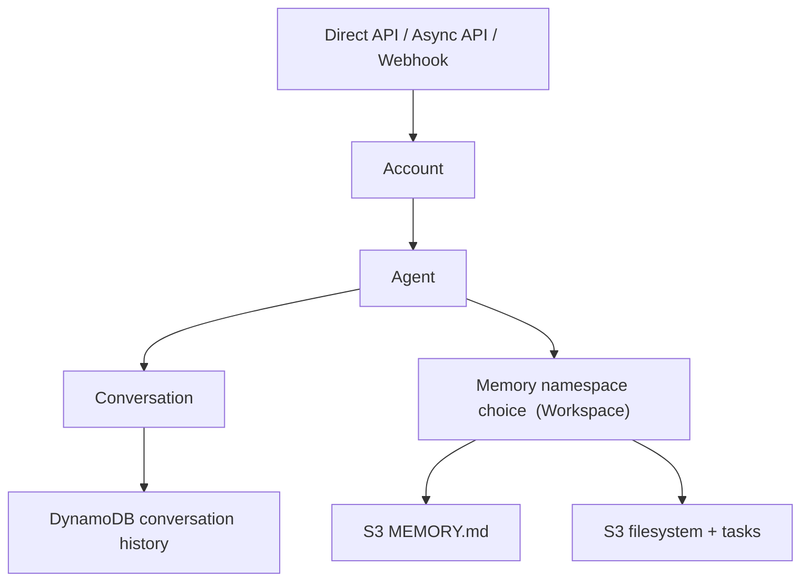
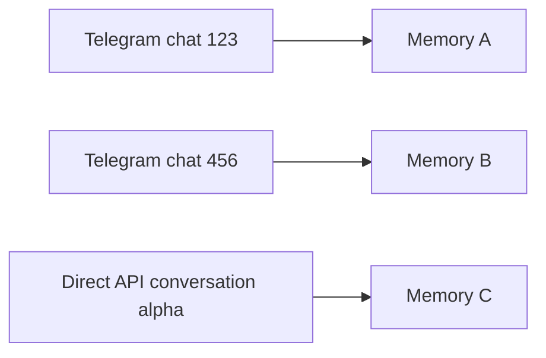
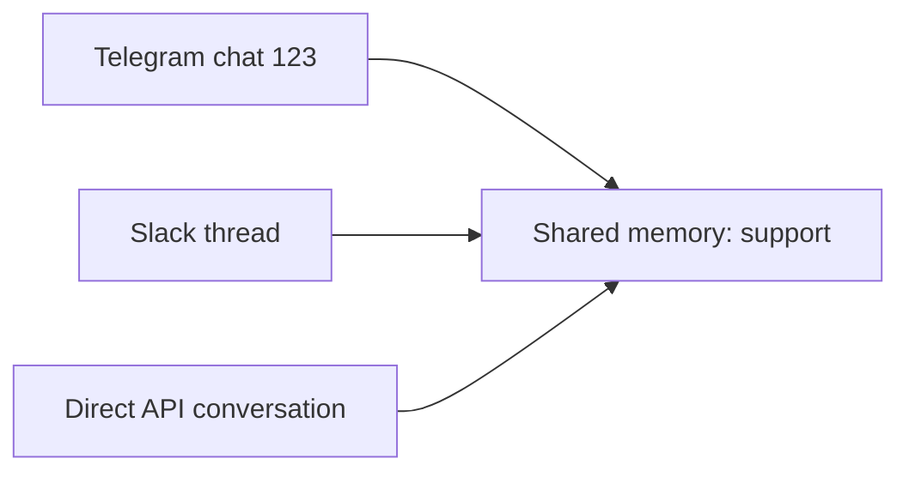
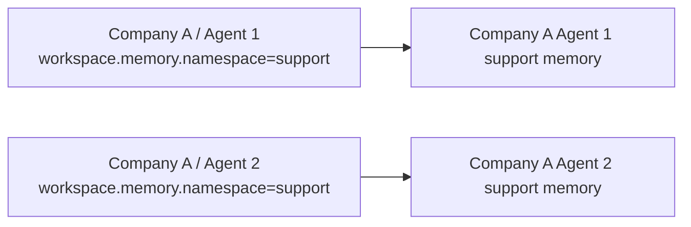
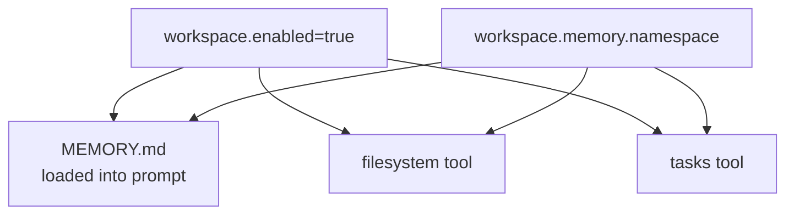
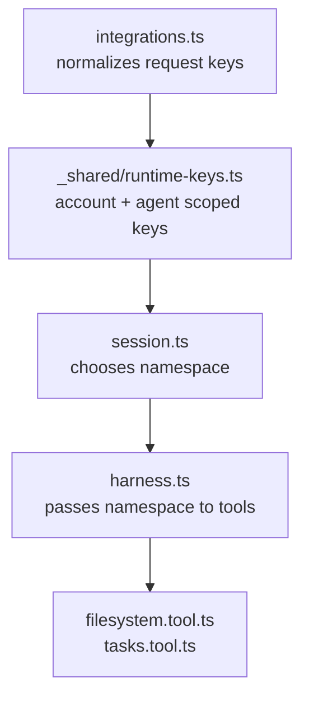

# Memory and Session

This page explains where conversation history, `MEMORY.md`, task files, and filesystem tool files live.

## Mental Model



There are two separate things:

- Conversation history: the chat messages for one conversation.
- Workspace state: `MEMORY.md`, task files, and files written by the filesystem tool. Workspace state exists only when the selected agent has `config.workspace.enabled` true.

## Default: One Memory Per Conversation

If the selected agent has `config.workspace.enabled` true and does not set `workspace.memory.namespace`, every conversation gets its own memory, tasks, and filesystem.



Use this when each chat, issue, thread, or direct API conversation should remember different things.

## Shared: One Memory For Many Conversations

Set `config.workspace.memory.namespace` on the agent when multiple conversations should share the same memory, tasks, and files.

```json
{
  "config": {
    "workspace": {
      "enabled": true,
      "memory": {
        "namespace": "support"
      }
    }
  }
}
```



Use this when one account should have a shared knowledge/workspace across channels.

## Account Isolation

The namespace is always scoped by account and agent.



So two accounts can both use `"support"` without sharing data.

## What Uses Workspace



The filesystem and tasks tools do not use top-level `tools` entries. They are available when `workspace.enabled` is true, unless disabled with `workspace.filesystem.enabled: false` or `workspace.tasks.enabled: false`. Set `workspace.needsApproval` to require approval for every enabled workspace tool.

## Session Context Management

Session history is managed before each model turn:

- Pruning is enabled by default through `session.pruning.enabled`; it removes older reasoning/tool-call clutter from the model-visible context without changing persisted history.
- Compaction is disabled by default through `session.compaction.enabled`; when enabled, it uses the selected agent's configured model to summarize older history once the serialized context character count exceeds `session.compaction.maxContextLength`.
- Compaction persists a system summary, keeps the latest user message active, and includes prior compaction summaries when compacting again.

## Configure It

Set or update workspace/session config on the agent, not the account.

```bash
curl -X PATCH "$ACCOUNT_SERVICE_URL/accounts/me/agents/$AGENT_ID" \
  -H "Authorization: Bearer $ACCOUNT_SECRET" \
  -H "Content-Type: application/json" \
  -d '{
    "config": {
      "workspace": {
        "enabled": true,
        "memory": {
          "namespace": "support"
        }
      }
    }
  }'
```

Set the namespace to `null` when you want memory to go back to per-conversation behavior. Set `workspace.enabled` to `false` to disable memory, filesystem, and tasks.

```bash
curl -X PATCH "$ACCOUNT_SERVICE_URL/accounts/me/agents/$AGENT_ID" \
  -H "Authorization: Bearer $ACCOUNT_SECRET" \
  -H "Content-Type: application/json" \
  -d '{
    "config": {
      "workspace": {
        "memory": {
          "namespace": null
        }
      }
    }
  }'
```

## Code Path



Key files:

- [`integrations.ts`](../functions/harness-processing/integrations.ts): builds account + agent scoped conversation keys.
- [`runtime-keys.ts`](../functions/_shared/runtime-keys.ts): validates direct API public keys and derives account-scoped runtime keys and filesystem namespaces.
- [`session.ts`](../functions/harness-processing/session.ts): chooses per-conversation or shared memory namespace from the selected agent config.
- [`filesystem.tool.ts`](../functions/harness-processing/tools/filesystem.tool.ts): stores files under that namespace.
- [`tasks.tool.ts`](../functions/harness-processing/tools/tasks.tool.ts): stores task files under that namespace.
