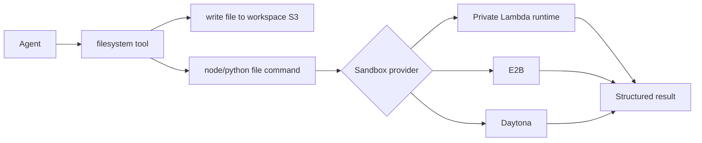

# Sandbox

The workspace sandbox lets an agent execute code that it has already written into the workspace filesystem. It extends the existing `filesystem` tool; there is no separate model-facing sandbox tool.



## Enable It

Sandbox execution is available only when workspace and sandbox are enabled for the agent.

```json
{
  "workspace": {
    "enabled": true,
    "needsApproval": false,
    "filesystem": { "enabled": true },
    "sandbox": {
      "enabled": true,
      "provider": "lambda",
      "timeout": 30,
      "memoryLimit": 128,
      "outputLimitBytes": 65536
    }
  }
}
```

`provider` can be:

| Provider | Purpose |
| --- | --- |
| `lambda` | Default AWS runtime sandbox. Runs private Node and Python Lambda workers. |
| `e2b` | Uses the E2B SDK adapter. Configure API key/template in `workspace.sandbox.options`. |
| `daytona` | Uses the Daytona SDK adapter. Configure API key/image/target in `workspace.sandbox.options`. |

## How Agents Use It

The agent must write a file first, then execute that file.

```bash
cat <<'EOF' > /main.js
console.log(JSON.stringify({ ok: true, runtime: "node" }));
EOF

node /main.js
```

```bash
cat <<'EOF' > /main.py
print({"ok": True, "runtime": "python"})
EOF

python3 /main.py
```

Supported execution commands:

| Runtime | Command |
| --- | --- |
| Node | `node <file.js>` |
| TypeScript | `node <file.ts>`; the harness transpiles it to JavaScript before execution |
| Python | `python <file.py>` or `python3 <file.py>` |

Inline execution is intentionally rejected. Commands such as `node -e "..."` and `python -c "..."` are not allowed.

## Result Shape

Sandbox runs return JSON through the filesystem tool:

```json
{
  "output": {
    "stdout": "hello\n",
    "stderr": "",
    "artifacts": []
  },
  "status": {
    "ok": true,
    "runtime": "node",
    "provider": "lambda",
    "exitCode": 0,
    "durationMs": 42,
    "timedOut": false,
    "truncated": false
  }
}
```

`artifacts` is reserved for provider outputs such as charts, images, or files when a provider can return them.

## Lambda Runtime

SST deploys two private runtime Lambdas:

| Function | Runtime | Executes |
| --- | --- | --- |
| `SandboxNode` | `nodejs22.x` | `.js` files generated from `.js` or transpiled `.ts` workspace files |
| `SandboxPython` | `python3.12` | `.py` files |

Each runtime Lambda executes files with its own interpreter binary (`process.execPath` for Node and `sys.executable` for Python), so execution does not depend on `node` or `python3` being present on the sanitized `PATH`.

The main `harness-processing` Lambda invokes those functions with:

- `SANDBOX_NODE_FUNCTION_NAME`
- `SANDBOX_PYTHON_FUNCTION_NAME`

You can override those names per agent:

```json
{
  "workspace": {
    "sandbox": {
      "options": {
        "nodeFunctionName": "my-node-sandbox",
        "pythonFunctionName": "my-python-sandbox"
      }
    }
  }
}
```

## Dependency Strategy

Dependencies are not an account config field.

Use provider images/templates for packages:

- Lambda: bundle packages into the runtime artifact or attach a Lambda layer.
- E2B: use a template with packages installed during template build.
- Daytona: use an image or image builder with packages installed before runtime.

Runtime package installation requires network egress and has a larger security surface. If Lambda runtime installs are needed later, add a separate opt-in sandbox provider mode with:

- no application secrets in environment variables
- minimal IAM permissions, ideally only CloudWatch Logs
- no permission to access account tables, S3 buckets, or model/provider secrets
- explicit egress controls
- clear timeout and output limits

## Security Boundaries

The sandbox path is designed around small, file-based runs:

- only allowlisted runtimes are exposed
- execution requires an existing workspace file
- inline code flags are rejected
- stdout/stderr are truncated
- Lambda provider runs in private runtime functions
- sandbox runtime Lambdas do not need account-management permissions

Workspace write/read commands still use the normal `filesystem` tool. Use `workspace.needsApproval` if file writes and code runs should require human approval.
