# Skills

Skills are account-owned instruction bundles that an agent can load only when a user request needs them. They are useful for domain playbooks, workflow rules, formatting standards, customer support procedures, or tool-specific operating notes that should not live permanently in every system prompt.

```mermaid
flowchart LR
  Owner["Account owner"] -->|"POST /accounts/me/skills"| Manage["account-manage"]
  Manage -->|"validate bundle"| SkillStore["S3 skills bucket<br/>&lt;accountId&gt;/&lt;skill-name&gt;"]
  Owner -->|"agent config<br/>skills.allowed"| AgentConfig["DynamoDB AgentConfig"]
  AgentConfig --> Session["session.ts"]
  SkillStore -->|"metadata only"| Session
  Session --> Prompt["available skills panel<br/>path + name + description"]
  Prompt --> Model["model"]
  Model -->|"load_skill(path)"| Loader["load-skill.tool.ts"]
  Loader -->|"SKILL.md + resources"| SkillStore
  Loader --> Loaded["loaded skill system context"]
  Loader -->|"stage changed files when workspace enabled"| Workspace["S3 workspace bucket<br/>.claude/skills/&lt;name&gt; (+ .agents/skills mirror)"]
  Workspace --> Sandbox["sandbox runtime"]
  Sandbox -->|"edit staged copy"| Workspace
  Workspace -->|"publish_skill_changes<br/>validate + conflict check"| SkillStore
```

Skills are stored by `account-manage` in the S3 skills bucket under `<accountId>/<skill-name>`. Runtime traffic goes through `harness-processing`: `session.ts` lists the configured skill metadata, `tools/index.ts` exposes `load_skill`, and `functions/harness-processing/skills.ts` loads the selected bundle into refreshed system context.



## Skill Panel

When skills are enabled, the model sees a compact skill panel in system context. The panel lists only configured skill metadata and tells the model to load the detailed instructions before using them:

| Panel field | Source | Purpose |
| --- | --- | --- |
| `path` | `config.skills.allowed[]` | Exact value the model must pass to `load_skill` |
| `name` | `SKILL.md` frontmatter | Human-readable skill identifier |
| `description` | `SKILL.md` frontmatter | Routing hint for when to load the skill |

The detailed `SKILL.md` content is not injected up front. The agent calls `load_skill` with an allowed path, and may request extra resource files from the same bundle only when `SKILL.md` references them. This S3 API path works even when Workspace is disabled; in that mode skills are read-only model context and bundled scripts cannot be executed by the agent.

When Workspace is enabled, `load_skill` checks the skill out git-style: the account skill bucket is the source of truth ("origin"), and the loader clones a working copy into the current workspace namespace at `/.claude/skills/<skill-name>` (the canonical, editable copy) and mirrors the same bundle to `/.agents/skills/<skill-name>` so tools that expect that industry-standard location find it too. Staging writes a `.stage.json` manifest (the checkout's base revision) with source object metadata under the canonical copy. When skill publishing is enabled, later loads compare that manifest with the skills bucket and skip unchanged files so staged edits can continue across turns before publishing. When publishing is disabled, later loads refresh from the account-level skill. Changed files are copied with S3 server-side copy instead of streaming every byte through `harness-processing`. The `.agents/skills` mirror always tracks the published source bundle; it is a read/exec convenience, not the publish source.

This makes `.sh`, `.py`, `.js`, `.ts`, and other uploaded text resources available to the sandbox without mounting the skills bucket into the Lambda sandbox. Script files (`.sh`, `.bash`, `.zsh`, `.py`, `.js`, `.mjs`, `.ts`) are staged with executable POSIX metadata so scripts with shebangs can run directly; other text resources are staged as regular, non-executable files. Agents can also invoke scripts explicitly with `bash`, `python3`, or `node`.

Edits apply first to the canonical staged copy under `.claude/skills/<skill-name>`. By default those edits are temporary workspace changes: the next load refreshes the staged copy from the account-level skill bundle. To let the agent promote (push) edits back to the account-owned skill bundle, enable `skills.publish.enabled` (Workspace must also be enabled, since publishing reads from the staged checkout). That exposes `publish_skill_changes`, which reads the `.claude/skills` working copy, validates the bundle with the same rules as account-management uploads, checks that the source skill did not change since checkout (a git-style non-fast-forward guard — pass `force` to override), then writes the validated files back to the skills bucket and removes any source files dropped from the bundle. The new bundle is written before stale files are deleted, so a failed publish never leaves the source skill empty. `skills.publish.needApproval` controls whether that publish action requires tool approval; when omitted, publish approval is required.

## Create Skills

BeeBlast skill bundles follow the open [Agent Skills format](https://agentskills.io/home): a skill is a folder with a required `SKILL.md` file, metadata for discovery, and optional supporting resources. For authoring guidance, start with the external [Agent Skills quickstart](https://agentskills.io/skill-creation/quickstart) and check the [Agent Skills specification](https://agentskills.io/specification) before uploading a bundle.

### Bundle Shape

Every skill bundle must include a root `SKILL.md` file with YAML frontmatter:

```md
---
name: support-flow
description: Handles support triage and escalation decisions.
---

# Support Flow

Use this skill when a customer asks for help with a product issue.

## Steps

1. Classify urgency.
2. Identify the product area.
3. Recommend the next action.
```

Skill names must be lowercase letters, numbers, and hyphens only. The stored path is generated from the `SKILL.md` name as `<accountId>/<skill-name>`, not from the local folder name used during upload.

Bundle limits:

- Each file can be up to 5 MB.
- The full bundle can be up to 30 MB.
- Files must be supported text files: `.css`, `.csv`, `.html`, `.js`, `.json`, `.md`, `.mjs`, `.py`, `.sh`, `.sql`, `.svg`, `.toml`, `.ts`, `.tsx`, `.txt`, `.xml`, `.yaml`, or `.yml`.
- Uploaded file paths must be relative to the skill root. Use `SKILL.md`, not `support-flow/SKILL.md`.

Bundles can also include supporting text files. When the model needs one, it calls:

```json
{
  "path": "acct_abc123/support-flow",
  "resources": ["examples/escalation-policy.md"]
}
```

For executable helpers, keep scripts inside the bundle and reference them from `SKILL.md`, for example `scripts/analyze.py` or `scripts/run.sh`. After `load_skill`, those files are staged under `/.claude/skills/<skill-name>/scripts/` (and mirrored under `/.agents/skills/<skill-name>/scripts/`) in the workspace sandbox. The staged files are normal workspace files, so the agent can edit them before running. Publishing those edits back to the source bundle requires `publish_skill_changes`.

Enable publishing only for agents that should update account-level skills:

```json
{
  "skills": {
    "enabled": true,
    "allowed": ["acct_abc123/support-flow"],
    "publish": {
      "enabled": true,
      "needApproval": true
    }
  }
}
```

The account API accepts three sources:

| Source | Use when | Required fields |
| --- | --- | --- |
| `json` | Creating a single-file skill from API input | `name`, `description`, `content` |
| `files` | Uploading a bundle with `SKILL.md` and support files | `files[].path`, `files[].contentBase64` |
| `github` | Importing a skill directory from GitHub | `url` |

Single-file example:

```http
POST /accounts/me/skills
Authorization: Bearer <account-secret>
Content-Type: application/json
```

```json
{
  "source": "json",
  "name": "support-flow",
  "description": "Handles support triage and escalation decisions.",
  "content": "# Support Flow\n\nUse this skill when a customer asks for help with a product issue."
}
```

:::warning GitHub imports

GitHub imports download a skill directory from a public GitHub tree URL. Use this only for repositories and refs you trust, and pin the URL to the intended branch, tag, or commit path:

`https://github.com/{owner}/{repo}/tree/{ref}/{path}`

:::

See [`examples/skills.ts`](../examples/skills.ts) for create, list, get, and delete calls.

## Enable Skills For An Agent

Creating a skill only stores the bundle. Add the generated skill paths to the agent config before the runtime exposes them:

```json
{
  "skills": {
    "enabled": true,
    "allowed": [
      "acct_abc123/support-flow",
      "acct_abc123/knowledge-base"
    ]
  }
}
```

Runtime behavior:

1. `config.skills.enabled` must be `true`.
2. `config.skills.allowed` must contain at least one account-owned skill path.
3. Agent create/update validates that each allowed path belongs to the same account and exists.
4. `load_skill` is registered only for skill-enabled agents with a request session.
5. The loader rejects paths that are not in `config.skills.allowed`.

Use [`examples/skill-loads.ts`](../examples/skill-loads.ts) for an end-to-end streaming request that creates a temporary skill, attaches it to an agent, and asks the agent to load it. See [`examples/skill-edit.ts`](../examples/skill-edit.ts) for the staged-edit workflow: one agent builds a script inside the staged bundle and publishes it with `publish_skill_changes`, then a second agent loads the published skill and runs the script from the sandbox.

## Design Rules

- Keep skill CRUD in `functions/account-manage/skills.ts`.
- Keep shared validation and S3 path rules in `functions/_shared/skills.ts`.
- Keep runtime prompt loading in `functions/harness-processing/skills.ts`.
- Keep the model-facing `load_skill` schema in `functions/harness-processing/tools/load-skill.tool.ts`.
- Do not put tool credentials or channel secrets inside skill bundles.
- Use skill descriptions as routing hints; keep detailed instructions inside `SKILL.md`.
- Prefer resource files for large examples or reference tables so the model can load them only when needed.
