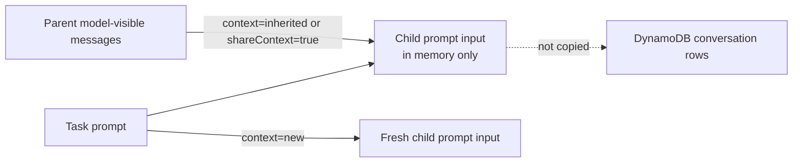
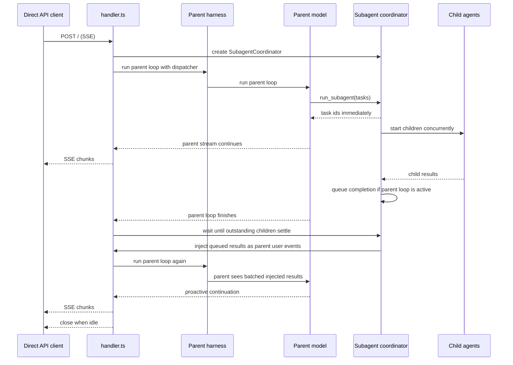

# Sub Agents

Subagents let one parent agent dispatch independent work, keep going, and then continue again when the child results arrive. The feature is opt-in per agent.

## Configuration

```json
{
  "subagent": {
    "enabled": true,
    "allowed": ["agent_..."],
    "context": "new"
  }
}
```

Defaults:

- omit `subagent` or set `enabled: false` to disable `run_subagent`
- omit `context` to use `"new"`
- use `allowed: []` to allow only virtual one-shot subagents
- add predefined agent ids to `allowed` when the parent should be able to choose specific account-owned agents

When predefined agents are allowed, the parent prompt includes their metadata:

```text
agentId, name, description
```

Descriptions matter because the parent uses them to decide which predefined subagent should receive a task.
When a predefined subagent is suitable, the parent prompt tells the model to include that exact `agentId`. Omitting `agentId` is reserved for virtual one-shot subagents.

## Tool Input

`run_subagent` is model-facing; direct API callers do not call it directly. A single tool call can dispatch multiple tasks:

```json
{
  "tasks": [
    {
      "prompt": "Research the provider docs."
    },
    {
      "agentId": "agent_...",
      "prompt": "Review the implementation risk.",
      "shareContext": true
    }
  ]
}
```

- `agentId` is optional for virtual one-shot subagents. When a configured predefined subagent is suitable, the model should include that exact `agentId`.
- If `agentId` is present, it must be active, same-account, and listed in `subagent.allowed`.
- Virtual subagents use the parent agent model/tool config. The tool input does not accept a task-specific child system prompt yet; that is reserved for a future extension.
- Child conversation keys are generated by the runtime and are not accepted in tool input. Each subagent gets its own conversation context.
- `shareContext` overrides `subagent.context` for that task.
- Sub agent will right now when inherited the parent config will also inherited the tool approval behaviour, this currently will break so please, if your parent agent tools had tool approval things, it will need to be turn off or else, it will not work. We will figure it out, but we want to keep this for you so that, it has more freedom to use.

## Context Modes



Inherited context is passed directly to the child model call. It is not copied into the child conversation in DynamoDB. This keeps subagents cheap and avoids storing fake child history for one-shot work.

Reasoning cleanup happens at completed-turn boundaries internally. If a subagent inherits parent context, the dispatcher strips parent `reasoning` parts before passing that context to the child. When a child result is injected and the parent runs again, the next parent turn is rebuilt from persisted conversation state and completed-turn reasoning is stripped. A pending tool-approval resume is different: that step has not finished, so its assistant tool-call/approval request and reasoning are preserved for the approval response.

## SSE Continuation



For sync SSE, `handler.ts` creates one `SubagentCoordinator` for the request and passes its dispatcher into `harness.ts`. `harness.ts` exposes that dispatcher through the `run_subagent` tool. The tool dispatches child runs and returns task ids immediately.

Child runs are Promise-concurrent inside the same Lambda invocation. They are not separate Lambda workers. The active parent model stream continues after the tool result, so the parent can keep answering, call other tools, or finish its current pass.

If a child finishes while the parent model is still streaming, the result is queued in memory by the coordinator. It is not injected into the active model call because AI SDK model context cannot be changed mid-generation. After the parent stream ends, `runParentContinuationLoop()` waits for all outstanding child work from the current batch to finish, injects the queued child results into the parent conversation together, and starts one parent model pass on the same SSE response.

If the parent finishes before child work completes, the same SSE response remains open. During quiet waits the runtime sends SSE comment heartbeats such as:

```text
: waiting for subagents pending=2

```

SSE clients ignore comments, but the bytes keep long idle streams alive. As each child finishes, the runtime queues a parent `user` event containing the task id, child metadata, child conversation key, and result or error. When the outstanding child batch is idle, it injects all queued events and runs the parent model again on the same SSE stream so the parent can react once to the full batch.

The subagent handoff is the bridge between parent passes:

- drain queued completions immediately when no children are still pending
- return `0` when no subagents are pending, allowing the SSE response to close
- wait for all outstanding child work when children are still running
- emit heartbeat comments during SSE waits
- inject completed results and timeout notices together near the Lambda deadline so the parent can produce a partial continuation

## Async And Channels

`/async` and channel/webhook requests use the same coordinator loop without SSE heartbeats. They wait for batched child-result parent continuation within the Lambda timeout budget before settling the async result or sending the channel reply.

`AsyncAgentResult` still stores subagent task status for polling, but the SSE continuation path does not need separate child Lambda processors.
