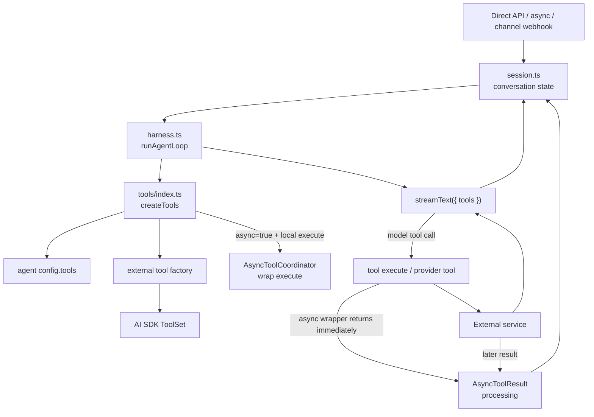

# External Tools

This guide covers account-configured external tools: tools that let the agent call outside services such as Tavily or provider-native Google Search. It does not cover internal workspace tools like `filesystem`, `tasks`, `load_skill`, memory, or `run_subagent`.

External tools are enabled per agent through `config.tools`. The harness creates them for each model run and passes them to the Vercel AI SDK `streamText()` call. By default they execute inline inside `harness-processing`; local `execute` tools can opt into same-invocation async execution with `async: true`.



## Current Tools

| Tool | File | External dependency | Config key |
| --- | --- | --- | --- |
| `tavilySearch` | [`functions/harness-processing/tools/tavily.tool.ts`](../functions/harness-processing/tools/tavily.tool.ts) | Tavily AI SDK search | `config.tools.tavilySearch` |
| `tavilyExtract` | [`functions/harness-processing/tools/tavily.tool.ts`](../functions/harness-processing/tools/tavily.tool.ts) | Tavily AI SDK extract | `config.tools.tavilyExtract` |
| `googleSearch` | [`functions/harness-processing/tools/google-search.tool.ts`](../functions/harness-processing/tools/google-search.tool.ts) | Google provider-defined tool | `config.tools.googleSearch` |
| `test_async` | [`functions/harness-processing/tools/test.async.tool.ts`](../functions/harness-processing/tools/test.async.tool.ts) | Local async example tool | `config.tools.test_async` |

Workspace tools are configured separately under `config.workspace`. Skills use `config.skills`. Subagents use `config.subagent`.

## Runtime Behavior

`functions/harness-processing/harness.ts` resolves the configured model and calls `createTools()` from [`functions/harness-processing/tools/index.ts`](../functions/harness-processing/tools/index.ts). The registry:

- rejects unknown `config.tools` names
- creates workspace tools only from `config.workspace`
- creates `run_subagent` only from `config.subagent`
- creates `load_skill` only from `config.skills`
- creates external tools only from the static `toolFactories` map
- applies `needsApproval` to configured tools before passing them to `streamText()`

Synchronous tool execution is not queued and does not run in a separate Lambda. If the model calls an enabled external tool, the AI SDK invokes that tool during the current `harness-processing` request. Tool start, finish, duration, and failures are logged from `harness.ts`.

When `config.tools.<name>.async` is `true`, the registry asks `AsyncToolCoordinator` to wrap that tool. If the tool has a local `execute`, the wrapper stores a `processing` row in the `AsyncToolResult` table, returns a pending result to the model immediately, and lets the original `execute` continue concurrently in the same Lambda invocation. After the parent model pass ends, the handler waits for pending async tools with the same timeout budget used for subagents, injects completed or failed results into the parent conversation, and runs the parent model again when anything was injected.

Provider-defined tools without local `execute`, such as Google Search, cannot be detached by this wrapper. If `async: true` is configured for one of those tools, the runtime logs a warning and leaves the tool in its normal provider-defined behavior.

For sync direct API callers, approval requests are streamed as SSE and persisted in the conversation. The caller resumes the turn by sending a direct API `tool-approval-response`. Channel webhooks cannot complete approval; the handler denies channel approval requests with a channel-visible error.

## Account Config

Use `config.tools` for external tools:

```json
{
  "tools": {
    "tavilySearch": {
      "enabled": true,
      "async": true,
      "needsApproval": true,
      "apiKey": "...",
      "maxResults": 5
    },
    "tavilyExtract": {
      "enabled": true,
      "apiKey": "..."
    },
    "googleSearch": {
      "enabled": true
    }
  }
}
```

Omitting a tool disables it. Setting `enabled: false` also disables it. Set `needsApproval: true` when the tool should require the AI SDK approval flow before execution.
Set `async: true` when a local `execute` tool may take long enough that the parent agent should keep working while the result is produced.

See [`examples/tool-async.ts`](../examples/tool-async.ts) for a runnable direct SSE example that enables `config.tools.test_async.async` and asks the agent to call the `test_async` tool.

The full config field reference lives in [Account Management](account-management.md#tools-config).

## Add an External Tool

1. Create `functions/harness-processing/tools/<name>.tool.ts`.
2. Add the standard file header docstring.
3. Export a default tool factory, or named factories when one provider module exposes several tools.
4. Keep the model-facing schema and external service call in that tool file.
5. Import the factory in [`functions/harness-processing/tools/index.ts`](../functions/harness-processing/tools/index.ts).
6. Add the factory to the static `toolFactories` map with the exact model-facing tool name.
7. Add config validation in [`functions/_shared/accounts.ts`](../functions/_shared/accounts.ts) only for options the account can set.
8. Optionally set `config.tools.<name>.async: true` for slow local `execute` tools. Do not add a worker Lambda or queue for this v1 path.
9. Update [Account Management](account-management.md#tools-config), [`examples/account.config.example.json`](../examples/account.config.example.json), and focused tests/examples when the public config shape changes.

Keep the factory small. It should read `context.config`, resolve any API key, return a `ToolSet`, and leave unrelated orchestration to `harness.ts`.

```ts
/**
 * Example external service tool for the harness agent.
 * Keep Example API access and model-facing schema here.
 */

import { tool, type ToolSet } from "ai";
import { z } from "zod";
import type { ToolContext } from "./index.ts";

export default function exampleLookupTool(context: ToolContext): ToolSet {
  const { enabled: _enabled, apiKey, ...options } = context.config;

  if (typeof apiKey !== "string") {
    throw new Error("config.tools.exampleLookup.apiKey is required.");
  }

  return {
    exampleLookup: tool({
      description: "Look up external Example records.",
      inputSchema: z.object({
        query: z.string().min(1),
      }),
      execute: async ({ query }) => {
        const response = await fetch("https://api.example.com/search", {
          method: "POST",
          headers: {
            "Authorization": `Bearer ${apiKey}`,
            "Content-Type": "application/json",
          },
          body: JSON.stringify({ query, ...options }),
        });

        if (!response.ok) {
          throw new Error(`Example lookup failed: ${response.status}`);
        }

        return response.json();
      },
    }),
  };
}
```

## Design Rules

- Keep external tool logic in `functions/harness-processing/tools/<name>.tool.ts`.
- Do not add a new Lambda, queue, or worker for ordinary external tools.
- Use `async: true` for same-invocation async execution when the tool has a local `execute`; provider-defined tools without `execute` remain synchronous/provider-managed.
- Do not put external tool config under `workspace`, `skills`, or `subagent`.
- Prefer provider or service SDK types over new custom interfaces when they already model the same options.
- Keep account-specific credentials in encrypted agent config when the account owns them.
- Use SST secrets only for service-wide fallback credentials, such as `TAVILY_API_KEY`.
- Return structured data from `execute` instead of pre-formatting prose for the model, use the `ToolSet` interface from vercel-ai sdk.
- Add approval support through `needsApproval`, not by asking inside the tool implementation. [Implement from vercel=ai sdk](https://ai-sdk.dev/docs/ai-sdk-core/tools-and-tool-calling#tool-execution-approval)
