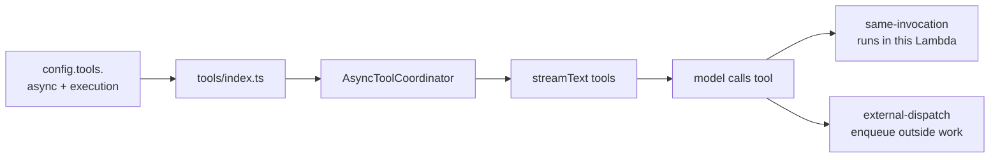
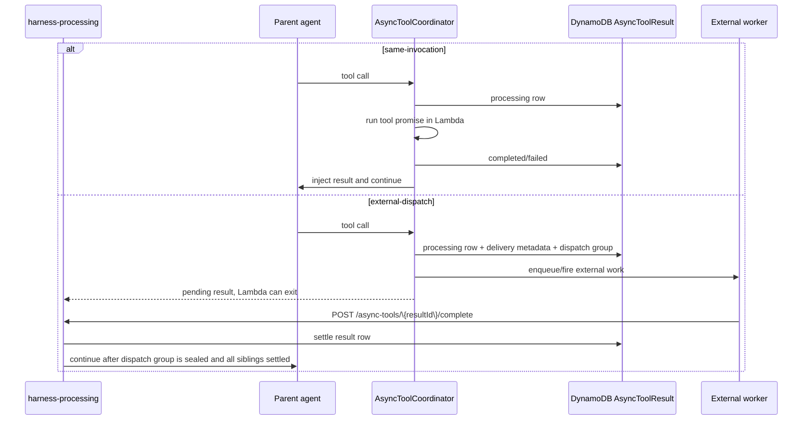

# External Tools

This guide covers agent-configured external tools: tools that let the agent call outside services such as Tavily or provider-native Google Search. It does not cover the sandbox tools (`bash`, `read`, `write`, `edit`, `glob`, `grep` — see [Workspace & Sandbox](workspace/index.md)), `load_skill`, or `run_subagent`.

External tools are enabled per agent through `config.tools`. The harness creates them for each model run and passes them to the Vercel AI SDK `streamText()` call. By default they execute inline inside `harness-processing`; local `execute` tools can opt into async wrapping with `async: true`.



## Current Tools

| Tool | File | External dependency | Config key |
| --- | --- | --- | --- |
| `tavilySearch` | [`functions/harness-processing/tools/tavily.tool.ts`](../functions/harness-processing/tools/tavily.tool.ts) | Tavily AI SDK search | `config.tools.tavilySearch` |
| `tavilyExtract` | [`functions/harness-processing/tools/tavily.tool.ts`](../functions/harness-processing/tools/tavily.tool.ts) | Tavily AI SDK extract | `config.tools.tavilyExtract` |
| `googleSearch` | [`functions/harness-processing/tools/google-search.tool.ts`](../functions/harness-processing/tools/google-search.tool.ts) | Google provider-defined tool | `config.tools.googleSearch` |
| `test_async` | [`functions/harness-processing/tools/test.async.tool.ts`](../functions/harness-processing/tools/test.async.tool.ts) | Local async example tool | `config.tools.test_async` |

Sandbox tools come from a referenced `sandbox` (+ `workspaces`) — see [Workspace & Sandbox](workspace/index.md). Skills use `config.skills`; see [Skills](skills.md). Subagents use `config.subagent`.

## Runtime Behavior

`functions/harness-processing/harness.ts` resolves the configured model and calls `createTools()` from [`functions/harness-processing/tools/index.ts`](../functions/harness-processing/tools/index.ts).

Tool registry path:

1. `createTools()` rejects unknown `config.tools` names.
2. The sandbox tools come from a referenced `sandbox`: `bash` (stateless) when there is no workspace; per workspace, the full `read`/`write`/`edit`/`glob`/`grep`/`bash` set when it has an effective sandbox, or read-only `read`/`glob` (served from S3) when it has none. Approvals follow that workspace's `permissionMode`.
3. `run_subagent` comes only from `config.subagent`.
4. `load_skill` comes from `config.skills` (skill publishing is temporarily disabled).
5. External tools come only from the static `toolFactories` map.
6. `needsApproval` is applied before tools are passed to `streamText()`.
7. Local `execute` tools with `async: true` are wrapped by `AsyncToolCoordinator`.

Synchronous tool execution is not queued and does not run in a separate Lambda. If the model calls an enabled external tool, the AI SDK invokes that tool during the current `harness-processing` request. Tool start, finish, duration, and failures are logged from `harness.ts`.

When `config.tools.<name>.async` is `true`, `execution` controls the lifecycle:

- `same-invocation` is the default. The tool runs inside the active Lambda; the parent waits after the model pass, injects the result, and can run again. SSE, NATS WebSocket, `/async`, and channel requests all support this mode.
- `external-dispatch` means the tool `execute` only enqueues external work and returns quickly. NATS WebSocket, `/async`, and channel requests also support this mode. The wrapper stores an `AsyncToolResult` row with delivery metadata for non-SSE paths and passes `options.asyncTool.resultId` so the external worker can correlate the later result.

> Warning: SSE rejects `external-dispatch` because the original open SSE connection cannot be held after the Lambda exits. Use `same-invocation` for SSE async tools.



External workers complete a dispatched tool by calling:

```http
POST /async-tools/{resultId}/complete
Authorization: Bearer <account-secret>
```

```json
{
  "status": "completed",
  "response": { "answer": "done" }
}
```

or:

```json
{
  "status": "failed",
  "error": "External job failed"
}
```

The worker needs the absolute `AGENT_SERVICE_URL` plus the relative `options.asyncTool.completePath`; calling the mock worker's own Function URL with that path will only recurse into the mock and leave the DynamoDB row processing. The fixture in [`examples/external-async.ts`](../examples/external-async.ts) passes `completionBaseUrl` and `completionBearerToken` into `config.tools.test_external_async` so the mock can call the real harness completion endpoint.

External-dispatch completion path:

1. The wrapper creates one `AsyncToolResult` row for each async tool call.
2. For `external-dispatch`, the wrapper also registers the `resultId` in a dispatch-group item in the same `AsyncToolResult` table.
3. The tool `execute` enqueues outside work and returns the pending result to the model.
4. The external worker calls `POST /async-tools/{resultId}/complete` when it finishes. It does not write DynamoDB directly.
5. The completion handler settles that `AsyncToolResult` row.
6. When the parent model pass has registered all external calls, the group is sealed.
7. The parent continues only after the sealed group has every sibling row completed or failed.
8. Direct async completions re-drive the async worker. NATS completions invoke `nats-worker` with stored connection metadata.

Notes:

- The continuation loop always waits for in-memory pending work. `same-invocation` adds pending promises; `external-dispatch` does not.
- The original `/async` status row is settled through `asyncResultEventId`; the internal continuation uses a separate event id for dedupe.
- Current fan-in is DynamoDB, but it is not a separate table. The dispatch group is an item in the existing `AsyncToolResult` table.
- Future: when NATS uses JetStream, missed WebSocket stream chunks can be replayed from persisted stream/consumer state. Until then, NATS continuation reaches the client only while the gateway/client remains subscribed.

> Warning: Provider-defined tools without local `execute`, such as Google Search, cannot use this wrapper. If `async: true` is configured for one of those tools, the runtime logs a warning and leaves the tool in its normal provider-defined behavior.

For sync direct API callers, approval requests are streamed as SSE and persisted in the conversation. The caller resumes the turn by sending a direct API `tool-approval-response`. Channel webhooks cannot complete approval; the handler denies channel approval requests with a channel-visible error.

> TODO: Add channel webhook support for completing tool approval requests when channel-safe approval UX is available.

## Agent Config

Use `config.tools` for external tools:

```json
{
  "tools": {
    "tavilySearch": {
      "enabled": true,
      "async": true,
      "execution": "same-invocation",
      "needsApproval": true,
      "apiKey": "...",
      "maxResults": 5
    },
    "tavilyExtract": {
      "enabled": true,
      "apiKey": "..."
    },
    "googleSearch": {
      "enabled": true
    }
  }
}
```

Omitting a tool disables it. Setting `enabled: false` also disables it. Set `needsApproval: true` when the tool should require the AI SDK approval flow before execution.
Set `async: true` when a local `execute` tool may take long enough that the parent agent should keep working while the result is produced.
Set `execution: "external-dispatch"` only for tools whose `execute` enqueues outside work and returns without doing the long-running work in the current Lambda.

See [`examples/tool-async.ts`](../examples/tool-async.ts) for a runnable direct SSE example that enables `config.tools.test_async.async` and asks the agent to call the `test_async` tool.

The full config field reference lives in the [API Reference](/api-reference) under `AgentConfig.tools`.

## Add an External Tool

1. Create `functions/harness-processing/tools/<name>.tool.ts`.
2. Add the standard file header docstring.
3. Export a default tool factory, or named factories when one provider module exposes several tools.
4. Keep the model-facing schema and external service call in that tool file.
5. Import the factory in [`functions/harness-processing/tools/index.ts`](../functions/harness-processing/tools/index.ts).
6. Add the factory to the static `toolFactories` map with the exact model-facing tool name.
7. Add config validation in [`functions/_shared/storage/agent-config.ts`](../functions/_shared/storage/agent-config.ts) only for options the account can set.
8. Optionally set `config.tools.<name>.async: true` for slow local `execute` tools. Use `execution: "same-invocation"` for SSE continuation or `execution: "external-dispatch"` only when `execute` starts external work and returns quickly.
9. Update the [API Reference](/api-reference) `AgentConfig.tools` schema, [`examples/account.config.example.json`](../examples/account.config.example.json), and focused tests/examples when the public config shape changes.

Keep the factory small. It should read `context.config`, resolve any API key, return a `ToolSet`, and leave unrelated orchestration to `harness.ts`.

```ts
/**
 * Example external service tool for the harness agent.
 * Keep Example API access and model-facing schema here.
 */

import { tool, type ToolSet } from "ai";
import { z } from "zod";
import type { ToolContext } from "./index.ts";

export default function exampleLookupTool(context: ToolContext): ToolSet {
  const { enabled: _enabled, apiKey, ...options } = context.config;

  if (typeof apiKey !== "string") {
    throw new Error("config.tools.exampleLookup.apiKey is required.");
  }

  return {
    exampleLookup: tool({
      description: "Look up external Example records.",
      inputSchema: z.object({
        query: z.string().min(1),
      }),
      execute: async ({ query }) => {
        const response = await fetch("https://api.example.com/search", {
          method: "POST",
          headers: {
            "Authorization": `Bearer ${apiKey}`,
            "Content-Type": "application/json",
          },
          body: JSON.stringify({ query, ...options }),
        });

        if (!response.ok) {
          throw new Error(`Example lookup failed: ${response.status}`);
        }

        return response.json();
      },
    }),
  };
}
```

## Design Rules

- Keep external tool logic in `functions/harness-processing/tools/<name>.tool.ts`.
- Do not add a new Lambda, queue, or worker for ordinary external tools.
- Use `async: true` only when the tool has a local `execute`; provider-defined tools without `execute` remain provider-managed.
- Use `execution: "external-dispatch"` only when `execute` starts work in an external system that will later call the completion endpoint.
- Do not put external tool config under `workspace`, `skills`, or `subagent`.
- Prefer provider or service SDK types over new custom interfaces when they already model the same options.
- Keep account-specific credentials in encrypted agent config when the account owns them.
- Use SST secrets only for service-wide fallback credentials, such as `TAVILY_API_KEY`.
- Return structured data from `execute` instead of pre-formatting prose for the model, use the `ToolSet` interface from vercel-ai sdk.
- Add approval support through `needsApproval`, not by asking inside the tool implementation. [Implement from vercel=ai sdk](https://ai-sdk.dev/docs/ai-sdk-core/tools-and-tool-calling#tool-execution-approval)
