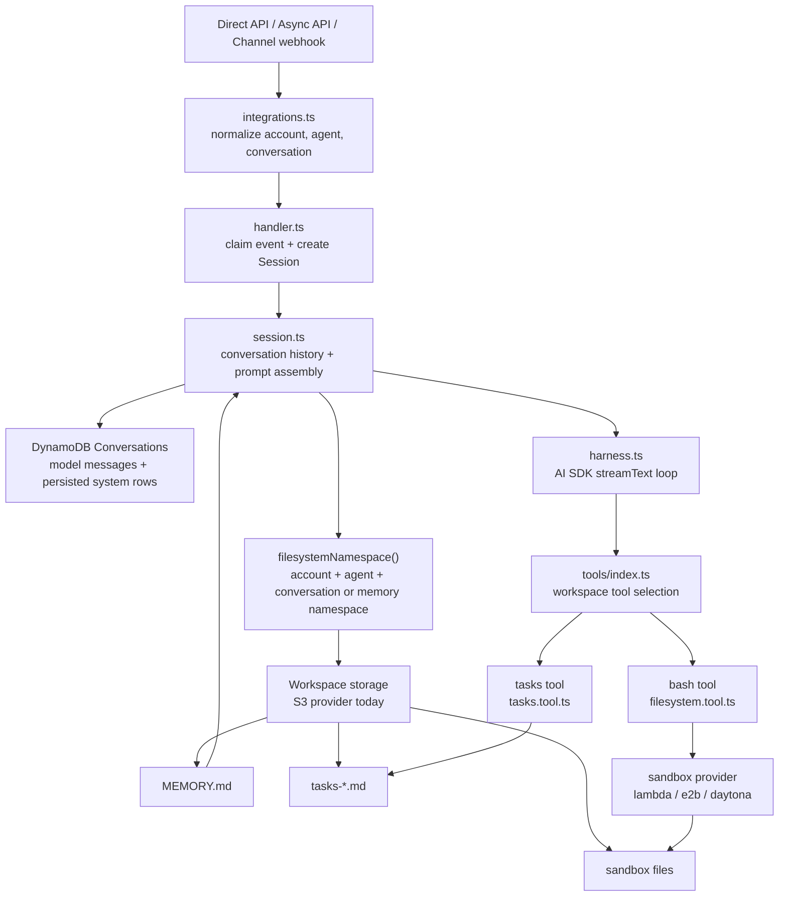

# Workspace

Workspace is the parent feature for agent-owned working state. It is enabled per agent with `config.workspace.enabled` and contains four child concerns:

- [Memory and Session](memory-and-session.md) — persisted conversation history, optional long-term `MEMORY.md`, pruning, and compaction.
- [Tasks](tasks.md) — lightweight markdown task lists for long-running or complex work.
- [Sandbox](sandbox/index.md) — the model-facing `bash` tool and sandbox providers.
- [Storage](storage.md) — the mounted workspace filesystem backing memory, tasks, and sandbox files.

The shape mirrors agent configuration:

```json
{
  "config": {
    "workspace": {
      "enabled": true,
      "needsApproval": false,
      "memory": {
        "enabled": true,
        "namespace": "support"
      },
      "tasks": {
        "enabled": true
      },
      "storage": {
        "provider": "s3"
      },
      "sandbox": {
        "provider": "lambda"
      }
    },
    "session": {
      "pruning": {
        "enabled": true
      },
      "compaction": {
        "enabled": false
      }
    }
  }
}
```

## Runtime Model



## How the Pieces Connect

`Session` is the owner of conversation state and prompt assembly. It loads model-visible history from DynamoDB, optionally loads `MEMORY.md` from workspace storage, and applies session pruning or compaction before each model turn.

`harness.ts` passes `session.filesystemNamespace()` into `createTools()`. When `workspace.enabled` is true, `tools/index.ts` adds the `bash` tool and, unless disabled, the `tasks` tool. Both tools use the same filesystem namespace as memory.

The namespace defaults to the conversation key, so every chat, issue, thread, or direct API conversation gets separate workspace files. Setting `workspace.memory.namespace` makes `MEMORY.md`, tasks, and sandbox files shared across conversations for the same account and agent.

## Design Intent

The feature exists to support long tasks without losing continuity:

- `MEMORY.md` follows the durable memory pattern used by ChatGPT, Claude, and Gemini-style assistants: stable facts and working context can live outside the short model window.
- `tasks-*.md` follows the `TODO.md` and task-list pattern used by Codex and Claude Code: explicit progress tracking reduces drift during complex requests.
- Session pruning and compaction follow long-agent design guidance from Anthropic-style agent architecture: reduce irrelevant context while keeping the durable state available.

## Code Map

| Concern | Code |
| --- | --- |
| Config schema and validation | [`functions/_shared/storage/agent-config.ts`](https://github.com/beeblastco/filthy-panty/blob/main/functions/_shared/storage/agent-config.ts) |
| Runtime namespace helpers | [`functions/_shared/runtime-keys.ts`](https://github.com/beeblastco/filthy-panty/blob/main/functions/_shared/runtime-keys.ts) |
| Conversation state, memory loading, session pruning/compaction | [`functions/harness-processing/session.ts`](https://github.com/beeblastco/filthy-panty/blob/main/functions/harness-processing/session.ts) |
| Workspace tool enablement | [`functions/harness-processing/tools/index.ts`](https://github.com/beeblastco/filthy-panty/blob/main/functions/harness-processing/tools/index.ts) |
| Bash workspace tool | [`functions/harness-processing/tools/filesystem.tool.ts`](https://github.com/beeblastco/filthy-panty/blob/main/functions/harness-processing/tools/filesystem.tool.ts) |
| Task-list tool | [`functions/harness-processing/tools/tasks.tool.ts`](https://github.com/beeblastco/filthy-panty/blob/main/functions/harness-processing/tools/tasks.tool.ts) |
