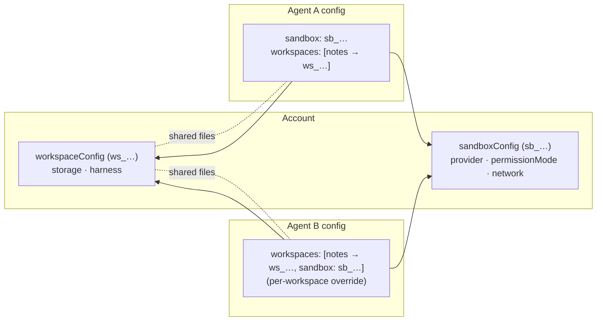
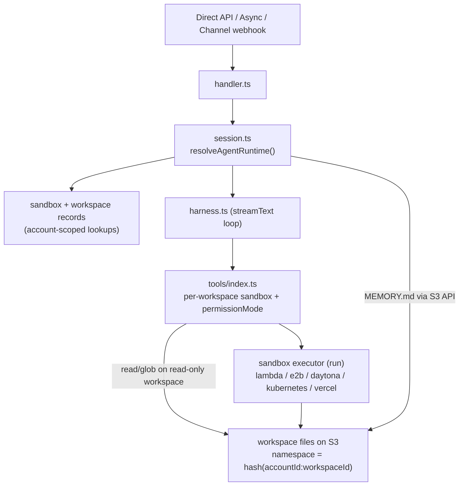

# Workspace & Sandbox

**Sandbox** (compute) and **workspace** (persistent files) are account-scoped resources. You define each once and reference it from any agent by id.

- A **sandbox** is the compute backend plus a collection of bash and filesystem tools
  (`bash`, `read`, `write`, `edit`, `glob`, `grep`) and a `permissionMode`.
- A **workspace** is the persistent S3-backed filesystem that gets mounted into a sandbox.
  Agents that reference the **same** `workspaceId` read and write the **same files**.

A sandbox can be attached **agent-wide** (`config.sandbox`) or **per workspace**
(`workspaces[].sandbox`). A workspace's **effective sandbox** follows a simple cascade:

```text
workspaces[].sandbox === null   → read-only, S3-direct reads (opt out of compute entirely)
workspaces[].sandbox === "sb_…" → that sandbox (override)
workspaces[].sandbox omitted    → inherit config.sandbox (read-only via mount if there is none)
```

This is what lets one agent give different workspaces different sandboxes and
`permissionMode`s, lets two agents that share a workspace access it through their own
sandboxes, and lets a single workspace be **read-only**. A read-only workspace reads through
a service-managed read-only mount by default (so it sees committed writes immediately);
`sandbox: null` opts out of that mount and reads straight from S3 (no Lambda, cheapest, but
reads lag mount writes — see [Lambda](sandbox/lambda.md)). `config.sandbox` also powers
stateless `bash` when there is no workspace at all.



## Config

Create the records via the account API, then reference them from the agent:

```jsonc
// POST /accounts/me/sandboxes
{ "name": "default", "config": { "provider": "lambda", "network": { "mode": "allow-all" }, "permissionMode": "ask" } }

// POST /accounts/me/workspaces
// storage.provider: "s3" (default) | "vercel" — roadmap: s3-compatible endpoints,
// Cloudflare R2, Google Cloud Storage, Azure Blob
{ "name": "notes", "config": { "storage": { "provider": "s3" }, "harness": { "enabled": true } } }

// agent config
{
  "sandbox": "sb_xxx",                                 // optional agent-level sandbox id
  "workspaces": [                                      // optional; name = mount label
    { "name": "notes", "workspaceId": "ws_aaa" },                     // inherits the agent-level sandbox
    { "name": "team",  "workspaceId": "ws_bbb", "sandbox": "sb_yyy" }, // per-workspace override
    { "name": "docs",  "workspaceId": "ws_ccc", "sandbox": null }      // read-only, S3-direct (opt out of the mount)
  ]
}
```

## Tool surface

Tool availability is decided **per workspace**, from that workspace's *effective* sandbox
(`workspaces[].sandbox` → else `config.sandbox` → else none). The agent's tool set is the
union across its workspaces:

| Workspace's effective sandbox | Tools for that workspace |
| --- | --- |
| present (mounted) | `read`, `write`, `edit`, `glob`, `grep`, `bash` (+ MEMORY/TASKS harness) |
| **none** (read-only, default) | `read`, `glob` — via a read-only mount (fresh reads) |
| **none**, `sandbox: null` | `read`, `glob` — straight from S3 (no mount/cold start, lagged) |

Plus the agent-level cases:

| Agent references | Tools exposed |
| --- | --- |
| sandbox, **no** workspace | `bash` only — **stateless** (each call is a fresh container; nothing persists) |
| neither sandbox nor workspace | none |

For mounted workspaces, every provider should expose the same model-facing filesystem:
`bash` starts in the selected workspace directory and the file tools take paths relative to
that directory. Ordinary prompts should use relative paths; provider mount paths are
implementation details for logs and debugging.

> When workspaces have different sandboxes, the model picks one with the `workspace`
> argument; each call routes to that workspace's sandbox and inherits its `permissionMode`.
> Every file tool lists **all** workspaces (so an omitted `workspace` always resolves to
> the configured default, never a silent substitute). Selecting a read-only workspace for
> `write`/`edit`/`grep` returns a clean "workspace is read-only" error, and `bash` reports
> "no sandbox available for this command" — in both cases with **no approval prompt**,
> because a workspace with no sandbox has no `permissionMode` to ask against.

## permissionMode

`permissionMode` lives on the sandbox and replaces the old `needsApproval` boolean:

| Mode | `read`/`glob`/`grep` | `write`/`edit` | `bash` |
| --- | --- | --- | --- |
| `ask` | auto | **ask** | **ask** |
| `edit` | auto | auto | **ask** |
| `bypass` | auto | auto | auto |

## Runtime model



The workspace **namespace** is derived from `accountId:workspaceId` (not the
conversation), which is what makes a workspace shared across agents and conversations.
Set `workspace.harness.enabled: false` to suppress the MEMORY/TASKS guidance while still
loading an existing `MEMORY.md`.
