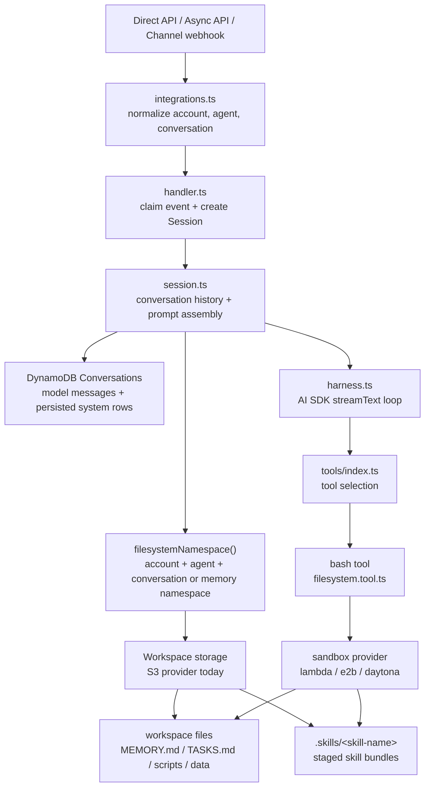

# Workspace

Workspace is the parent feature for agent-owned working files. It is enabled per agent with `config.workspace.enabled`.

When Workspace is enabled, the runtime:

- exposes the model-facing [bash sandbox tool](sandbox/index.md)
- loads `MEMORY.md` into the system prompt when that file exists
- adds optional workspace harness instructions for `MEMORY.md` and `TASKS.md` by default
- uses one account/agent-scoped filesystem namespace for ordinary files, `MEMORY.md`, task markdown, and staged skill bundles

`MEMORY.md` and task files are not special model tools. `MEMORY.md` is automatically read into the model context when present; both files are normal markdown files the agent can inspect and update through `bash` when that is useful for long-running work.

```json
{
  "config": {
    "workspace": {
      "enabled": true,
      "needsApproval": false,
      "harness": {
        "enabled": true
      },
      "memory": {
        "namespace": "support"
      },
      "storage": {
        "provider": "s3"
      },
      "sandbox": {
        "provider": "lambda"
      }
    },
    "session": {
      "pruning": {
        "enabled": true
      },
      "compaction": {
        "enabled": false
      }
    }
  }
}
```

Set `workspace.harness.enabled` to `false` when you want to provide your own MEMORY/TASKS workflow instructions in `agent.system`. Existing `MEMORY.md` files are still loaded into the system prompt.

## Runtime Model



## How the Pieces Connect

`Session` owns conversation state and prompt assembly. It loads model-visible history from DynamoDB, loads an existing `MEMORY.md` when workspace is enabled, adds the optional workspace harness instructions when configured, and applies session pruning or compaction before each model turn.

`harness.ts` passes `session.filesystemNamespace()` into `createTools()`. When `workspace.enabled` is true, `tools/index.ts` adds the `bash` tool. The agent uses that tool to create, read, edit, delete, and execute workspace files.

The namespace defaults to the conversation key, so every chat, issue, thread, or direct API conversation gets separate workspace files. Setting `workspace.memory.namespace` makes the workspace namespace shared across conversations for the same account and agent.

## Design Intent

The feature exists to support long tasks without turning planning and memory into separate tool APIs:

- `MEMORY.md` can hold stable facts, decisions, conventions, and working context.
- `TASKS.md` or focused task files can hold plans and progress checklists.
- Both are ordinary files, so developers can replace the conventions with their own system prompt or skill.
- Session pruning and compaction remain separate runtime features for controlling model-visible history.

## Code Map

| Concern | Code |
| --- | --- |
| Config schema and validation | [`functions/_shared/storage/agent-config.ts`](https://github.com/beeblastco/filthy-panty/blob/main/functions/_shared/storage/agent-config.ts) |
| Runtime namespace helpers | [`functions/_shared/runtime-keys.ts`](https://github.com/beeblastco/filthy-panty/blob/main/functions/_shared/runtime-keys.ts) |
| Conversation state and prompt assembly | [`functions/harness-processing/session.ts`](https://github.com/beeblastco/filthy-panty/blob/main/functions/harness-processing/session.ts) |
| Tool enablement | [`functions/harness-processing/tools/index.ts`](https://github.com/beeblastco/filthy-panty/blob/main/functions/harness-processing/tools/index.ts) |
| Bash workspace tool | [`functions/harness-processing/tools/filesystem.tool.ts`](https://github.com/beeblastco/filthy-panty/blob/main/functions/harness-processing/tools/filesystem.tool.ts) |
