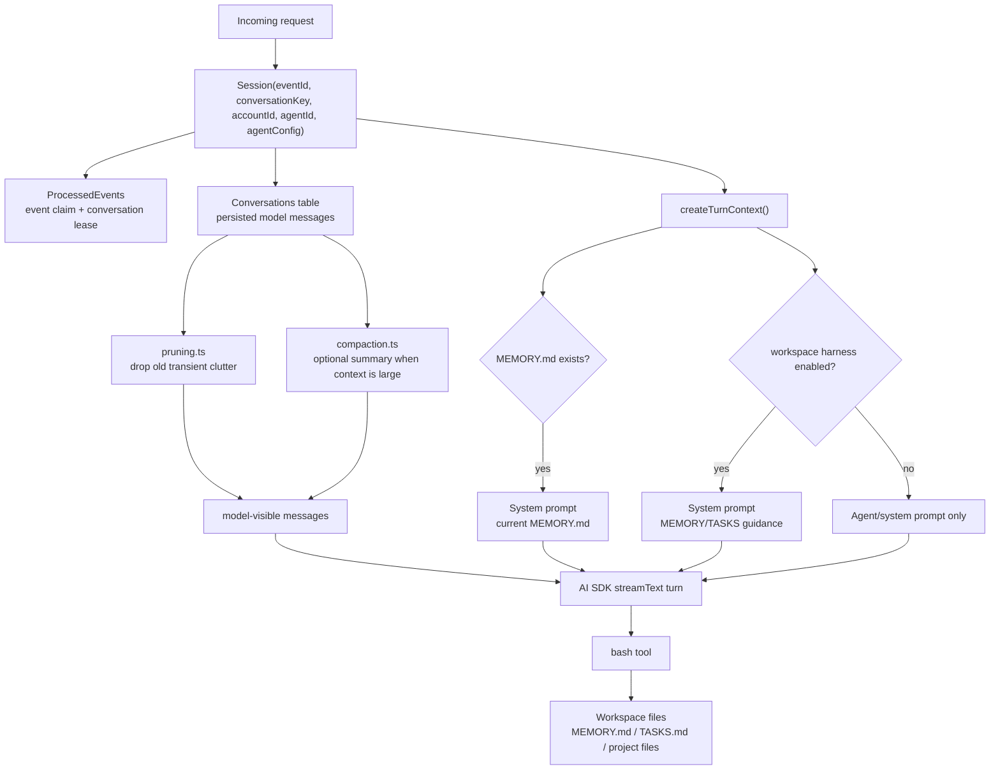
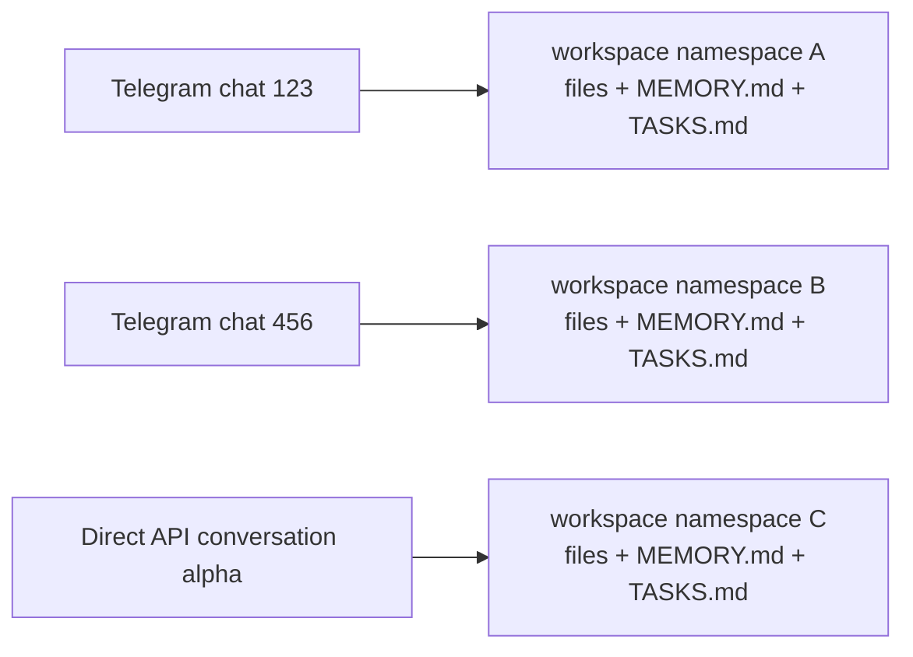
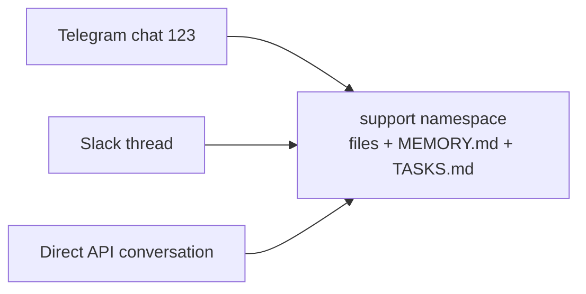

# Memory and Session

Session history and workspace memory are related but separate:

- Session is persisted conversation history and the model-visible context projection for a single conversation.
- Workspace memory is a developer convention: files like `MEMORY.md`, `TASKS.md`, or `notes/*.md` that the agent reads and updates through the `bash` tool.

The harness still loads `MEMORY.md` into the system prompt when the file exists. It no longer exposes separate memory or task-list tools. When Workspace is enabled, the harness also adds short MEMORY/TASKS workflow instructions by default; the agent then manages memory and task files as ordinary markdown files in the mounted workspace.

## Mental Model



## Namespace Behavior

By default, workspace files are scoped to the conversation:



Set `config.workspace.memory.namespace` when multiple conversations should share the same workspace state:

```json
{
  "config": {
    "workspace": {
      "enabled": true,
      "memory": {
        "namespace": "support"
      }
    }
  }
}
```



The namespace is still account- and agent-scoped before it is hashed into the filesystem prefix, so two accounts can both use `"support"` without sharing files.

## Runtime Behavior

[`Session`](https://github.com/beeblastco/filthy-panty/blob/main/functions/harness-processing/session.ts) owns the runtime path:

- `claim()` deduplicates an inbound event in `ProcessedEvents`.
- `acquireConversationLease()` serializes work per conversation.
- `appendIngressEvents()` persists incoming user, assistant, tool, and persisted system messages.
- `createTurnContext()` loads conversation entries, builds system prompt parts, runs compaction when configured, and prunes model-visible messages.
- `filesystemNamespace()` chooses either `workspace.memory.namespace` or the conversation key, scopes it by account and agent, then hashes it with `normalizeFilesystemNamespace()`.

The namespace helper is in [`functions/_shared/runtime-keys.ts`](https://github.com/beeblastco/filthy-panty/blob/main/functions/_shared/runtime-keys.ts). The config interface and validation live in [`functions/_shared/storage/agent-config.ts`](https://github.com/beeblastco/filthy-panty/blob/main/functions/_shared/storage/agent-config.ts).

## Configure It

Enable Workspace with automatic `MEMORY.md` loading and the default MEMORY/TASKS harness instructions:

```json
{
  "config": {
    "workspace": {
      "enabled": true
    }
  }
}
```

Disable only the MEMORY/TASKS harness instructions while keeping `bash` available and still loading existing `MEMORY.md`:

```json
{
  "config": {
    "workspace": {
      "enabled": true,
      "harness": {
        "enabled": false
      }
    }
  }
}
```

Share workspace files across conversations for one account agent:

```json
{
  "config": {
    "workspace": {
      "enabled": true,
      "memory": {
        "namespace": "support"
      }
    }
  }
}
```

Set `workspace.memory.namespace` to `null` in a patch when you want workspace files to return to per-conversation behavior. Set `workspace.enabled` to false to disable the mounted workspace, automatic `MEMORY.md` loading, harness instructions, and `bash` tool together.

## Session Context Management

Session history is managed before each model turn:

- Pruning is enabled by default unless `session.pruning.enabled` is false. It removes older reasoning/tool-call clutter from the model-visible context without changing persisted history.
- Compaction is disabled by default unless `session.compaction.enabled` is true. When enabled, it uses the selected agent model to summarize older history once the serialized context exceeds `session.compaction.maxContextLength`.
- Compaction persists a system summary, keeps the latest user message active, and includes prior compaction summaries when compacting again.
