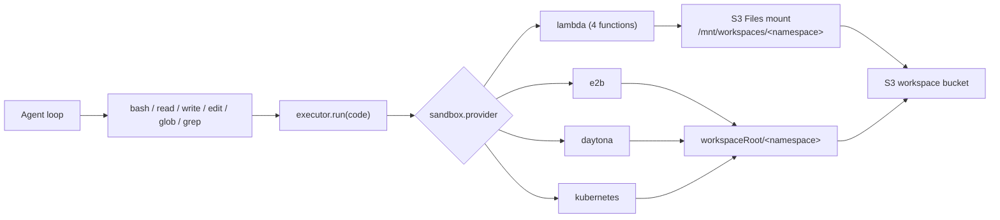

# Sandbox

The sandbox is a uniform Linux compute backend (real `bash` + `python3` + `node` on
PATH). It backs the Claude-Code-style tool set (`bash`, `read`, `write`, `edit`, `glob`,
`grep`). Every tool compiles down to a single `run` against the selected provider — there
is no per-runtime routing anymore.



## Config

A sandbox is a standalone, account-scoped record referenced from agent config by id
(see [Workspace & Sandbox](../index.md)).

```jsonc
// POST /accounts/me/sandboxes
{
  "name": "default",
  "config": {
    "provider": "lambda",          // lambda | e2b | daytona | kubernetes
    "internet": true,              // selects the internet-on/off lambda function
    "permissionMode": "ask",       // edit | ask | bypass
    "runtimes": ["bash", "python", "node"], // advisory allow-list (best-effort)
    "timeout": 120,                // per-call seconds (max: lambda 300, others 600)
    "memoryLimit": 512,            // MB; bounded for lambda only, operator-sized otherwise
    "outputLimitBytes": 65536,
    "envVars": { "FOO": "bar" }    // injected into every run (encrypted at rest)
  }
}
```

> **Per-call limits are provider-aware.** `lambda` runs are hard-bounded by the deployed
> function (timeout ≤ 300 s, memory ≤ 1024 MB). Persistent providers (`e2b`/`daytona`/
> `kubernetes`) are long-lived and operator-sized, so a single blocking call is only capped
> at the harness request budget (600 s) and memory is left to the operator. Output is always
> truncated harness-side regardless of provider.

| Provider | Documentation |
| --- | --- |
| `lambda` | [Lambda Details](lambda.md) |
| `e2b` | [E2B Details](e2b.md) |
| `daytona` | [Daytona Details](daytona.md) |
| `kubernetes` | [Kubernetes Details](kubernetes.md) |

## Lambda: 4-function topology

The lambda provider deploys the **same image** as four functions across two axes, and the
harness auto-selects one per run. The mount axis comes from whether the run has a workspace
namespace; the internet axis comes from `sandbox.internet`.

| | internet **on** | internet **off** |
| --- | --- | --- |
| **workspace mounted** | VPC + NAT + S3 mount | VPC, no NAT, S3 mount |
| **no workspace** | plain Lambda (fastest) | VPC, no NAT, no mount |

Function names are wired by SST into four env vars
(`SANDBOX_FN_{MOUNT,NOMOUNT}_{NET,NONET}`). Cost note: the topology uses fck-nat on
non-prod (≈10× cheaper than a NAT Gateway) and runs the no-mount + internet-on function
with no VPC for free managed egress.

## How agents use it

With a workspace attached, the file tools operate on the mount:

```text
write  notes/a.txt          # base64-piped, creates parent dirs
read   notes/a.txt          # numbered lines
edit   notes/a.txt          # exact unique string replacement
glob   **/*.py              # mtime-sorted matches
grep   TODO                 # ripgrep
bash   python3 notes/run.py # run programs directly
```

With no workspace, only `bash` is available and each call is a fresh container, so
write-and-run in one command:

```bash
cat <<'EOF' > /tmp/run.py
print("ok")
EOF
python3 /tmp/run.py
```

## Result shape

`bash` returns combined stdout+stderr as text. The lambda response carries
`{ ok, runtime, exit_code, timed_out, duration_ms, stdout, stderr }`; stdout/stderr are
truncated at 256 KB by the image and again at `outputLimitBytes` harness-side.

## Security boundaries

- child processes run with `env_clear()` first — no AWS credentials leak into runs
- workspace and skills buckets block public access
- the workspace mount is rooted at the `sandbox/` access-point prefix (load-bearing; keep
  in sync with `WORKSPACE_MOUNT_PREFIX`)
- `runtimes` is a **best-effort** allow-list on a general VM: the bash tool rejects
  obvious disallowed runtime invocations and surfaces the allowed list in its description
- approvals are governed by the sandbox `permissionMode` (see [Workspace & Sandbox](../index.md))

## Skill files

Skills load from the skills S3 bucket. With a workspace attached, `load_skill` stages the
bundle into the workspace namespace at `/.claude/skills/<name>` so the agent can read and
run it with `bash`. **Skill publishing is temporarily removed** and will return as a
skills-as-workspace model — see [Skills](../../skills.md).

## Related code

| Concern | Code |
| --- | --- |
| Tool registration + permissionMode | `functions/harness-processing/tools/index.ts` |
| Tool set | `functions/harness-processing/tools/{bash,read,write,edit,glob,grep}.tool.ts` |
| Provider selection | `functions/harness-processing/sandbox/index.ts` |
| Run contract | `functions/harness-processing/sandbox/types.ts` |
