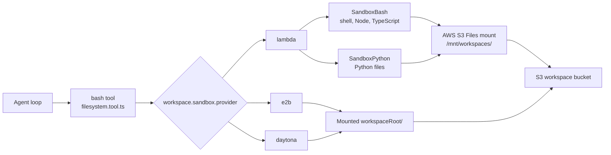

# Sandbox

The Workspace sandbox lets an agent execute code that it has already written into the workspace filesystem. It extends the model-facing `bash` tool; there is no separate sandbox tool.



## Enable It

Sandbox execution is available only when Workspace is enabled. The `bash` tool is registered whenever `config.workspace.enabled` is true and receives `config.workspace.sandbox` as its runtime config.

```json
{
  "config": {
    "workspace": {
      "enabled": true,
      "needsApproval": false,
      "storage": {
        "provider": "s3"
      },
      "sandbox": {
        "provider": "lambda",
        "timeout": 30,
        "outputLimitBytes": 65536,
        "options": {
          "networkAccess": "disabled"
        }
      }
    }
  }
}
```

| Provider | Documentation |
| --- | --- |
| `lambda` | [Lambda Details](lambda.md) |
| `e2b` | [E2B Details](e2b.md) |
| `daytona` | [Daytona Details](daytona.md) |

## How Agents Use It

The bash tool accepts bash-like shell scripts:

```bash
mkdir -p notes
cat <<'EOF' > notes/a.txt
hello
EOF
find notes -maxdepth 2 -type f
```

Node and TypeScript execute from workspace files:

```bash
cat <<'EOF' > main.js
console.log(JSON.stringify({ ok: true, runtime: "node" }));
EOF

node main.js
```

Python also executes from workspace files:

```bash
cat <<'EOF' > main.py
print({"ok": True, "runtime": "python"})
EOF

python3 main.py
```

Inline execution is intentionally rejected across providers. Commands such as `node -e "..."` and `python -c "..."` are not allowed.

## Supported Execution

| Runtime | Command | File extension |
| --- | --- | --- |
| Shell | bash-like scripts | interpreted by `just-bash` in `SandboxBash` |
| Node | `node <file>` | `.js` |
| TypeScript | `node <file>` | `.ts` — transpiled before execution in `SandboxBash` |
| Python | `python <file>` or `python3 <file>` | `.py` — routed to `SandboxPython` for Lambda |

## Result Shape

File execution can return structured JSON through the bash tool:

```json
{
  "output": {
    "stdout": "hello\n",
    "stderr": "",
    "artifacts": []
  },
  "status": {
    "ok": true,
    "runtime": "node",
    "provider": "lambda",
    "exitCode": 0,
    "durationMs": 42,
    "timedOut": false,
    "truncated": false
  }
}
```

## Mounted Workspace

The Lambda provider uses AWS S3 Files mounted at `/mnt/workspaces`. Shell and Node writes happen directly inside the mounted namespace, so S3 Files syncs those changes to the workspace bucket. Third-party providers must make that same namespace visible under `options.workspaceRoot`; otherwise the command can start but the file the agent just wrote will not exist inside the provider sandbox.

## Output Truncation

Sandbox stdout and stderr are truncated at `outputLimitBytes` (default 65536). This prevents runaway output from blowing the Lambda invocation payload or flooding the model context.

```json
{
  "config": {
    "workspace": {
      "sandbox": {
        "outputLimitBytes": 65536
      }
    }
  }
}
```

When the limit is exceeded, output is sliced at the cap and `[output truncated]` is appended.

## Security Boundaries

- only allowlisted runtimes are exposed
- Python execution requires an existing workspace file
- inline code flags are rejected
- stdout and stderr output is capped
- workspace and skills buckets block public access
- child processes run without AWS credentials in their environment
- `curl` is disabled unless `options.networkAccess` is `"public"` and still blocks private, loopback, and internal ranges

Workspace write/read commands still use the normal `bash` tool. Use `workspace.needsApproval` if file writes and code runs should require human approval.

## Related Code

| Concern | Code |
| --- | --- |
| Tool registration | [`functions/harness-processing/tools/index.ts`](https://github.com/beeblastco/filthy-panty/blob/main/functions/harness-processing/tools/index.ts) |
| Model-facing bash tool | [`functions/harness-processing/tools/filesystem.tool.ts`](https://github.com/beeblastco/filthy-panty/blob/main/functions/harness-processing/tools/filesystem.tool.ts) |
| Sandbox provider selection | [`functions/harness-processing/sandbox/index.ts`](https://github.com/beeblastco/filthy-panty/blob/main/functions/harness-processing/sandbox/index.ts) |
| Sandbox config contracts | [`functions/harness-processing/sandbox/types.ts`](https://github.com/beeblastco/filthy-panty/blob/main/functions/harness-processing/sandbox/types.ts) |
