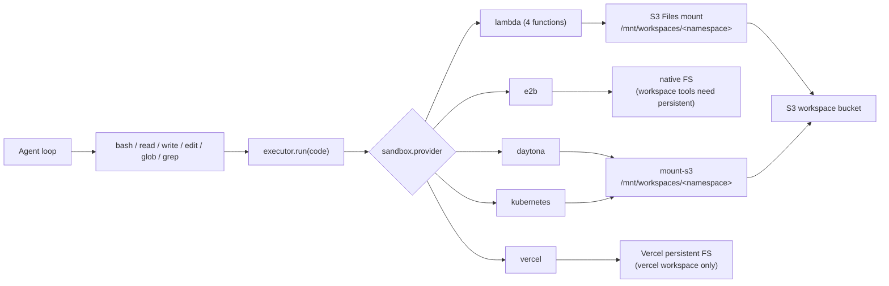
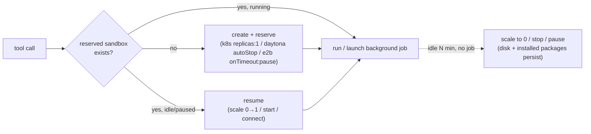
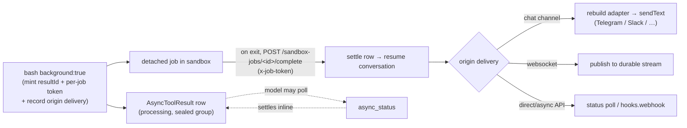

# Sandbox

The sandbox is a uniform Linux compute backend (real `bash` + `python3` + `node` on
PATH). It backs the Claude-Code-style tool set (`bash`, `read`, `write`, `edit`, `glob`,
`grep`). Every tool compiles down to a single `run` against the selected provider — there
is no per-runtime routing anymore.



## Config

A sandbox is a standalone, account-scoped record referenced from agent config by id
(see [Workspace & Sandbox](../index.md)).

```jsonc
// POST /accounts/me/sandboxes
{
  "name": "default",
  "config": {
    "provider": "lambda",          // lambda | e2b | daytona | kubernetes | vercel
    "network": { "mode": "allow-all" }, // allow-all | deny-all | restricted
    "permissionMode": "ask",       // edit | ask | bypass
    "runtimes": ["bash", "python", "node"], // advisory allow-list (best-effort)
    "timeout": 120,                // per-call seconds (default 30; max: lambda 300, others 600)
    "memoryLimit": 512,            // MB; validated (≤1024 for lambda) but informational — executors do not resize
    "outputLimitBytes": 65536,
    "envVars": { "FOO": "bar" }    // injected into every run (encrypted at rest)
  }
}
```

`onCreate` / `onResume` command hooks are also available, but only on persistent
configs — see [Reserved (persistent) sandboxes](#reserved-persistent-sandboxes).

> **Per-call limits are provider-aware.** `lambda` runs are hard-bounded by the deployed
> functions (timeout ≤ 300 s, 512 MB memory). Persistent providers (`e2b`/`daytona`/
> `kubernetes`/`vercel`) are long-lived and operator-sized, so a single blocking call is only
> capped at the harness request budget (600 s) and memory is left to the operator. Output is
> always truncated harness-side regardless of provider.

| Provider | Documentation |
| --- | --- |
| `lambda` | [Lambda Details](lambda.md) |
| `e2b` | [E2B Details](e2b.md) |
| `daytona` | [Daytona Details](daytona.md) |
| `kubernetes` | [Kubernetes Details](kubernetes.md) |
| `vercel` | [Vercel Details](vercel.md) |

## Network policy

`network` replaces the old Lambda-only `internet` boolean. If omitted, the config
normalizes to `deny-all`.

| Mode | Meaning |
| --- | --- |
| `allow-all` | outbound internet allowed |
| `deny-all` | outbound internet denied |
| `restricted` | allow only listed domains/CIDRs where the provider can enforce them |

Provider enforcement:

| Provider | `allow-all` | `deny-all` | `restricted` |
| --- | --- | --- | --- |
| `lambda` | internet-on function slot | no-internet function slot | no-internet slot (fail closed; allowlists are logged as unsupported) |
| `vercel` | native `networkPolicy: "allow-all"` | native `networkPolicy: "deny-all"` | native domain + CIDR allowlists |
| `daytona` | `networkBlockAll: false` | `networkBlockAll: true` | CIDR allowlist only; domain allowlists are ignored with a warning |
| `kubernetes` | no NetworkPolicy | empty-egress NetworkPolicy | CIDR egress NetworkPolicy with DNS (port 53) kept open; domains require an FQDN-aware CNI/proxy |
| `e2b` | allowed | rejected by validation | rejected by validation |

## Reserved (persistent) sandboxes

By default every provider is **ephemeral per call** (create → run → destroy); only
workspace *files* persist (via the S3 mount). Set `persistent: true` to instead **reserve a
long-lived sandbox per workspace** — a cloud dev box where `pip`/`npm`/`uv` installs, code,
and running jobs survive across calls, scaling down on idle like Fargate. Not valid for
`lambda`.

```jsonc
{
  "config": {
    "provider": "kubernetes",   // kubernetes | daytona | e2b | vercel
    "network": { "mode": "allow-all" },
    "persistent": true,
    "permissionMode": "bypass",
    "lifecycle": {
      "idleTimeoutSeconds": 1800,   // scale down after 30 min idle (default 900)
      "maxLifetimeSeconds": 86400   // hard expiry backstop (optional)
    },
    "options": {                   // kubernetes PVC for the coding env (optional)
      "mountAwsS3Buckets": true,   // S3 = shared workspace files
      "persistentDiskGb": 20,      // home PVC (packages/venvs/caches)
      "persistentHome": "/home/node"
    },
    "onCreate": ["python3 -m venv $HOME/.venv"],
    "onResume": ["test -x $HOME/.venv/bin/python"]
  }
}
```



> **Cold-start note (kubernetes).** Three stacked optimizations take the uploaded-tool
> first-call cold-start from ~22s to ~1s:
>
> 1. **`ephemeralHome: true`** — skip the durable home PVC. The Hetzner block-volume
>    create+attach was ~16s of the ~22s; the pod still outlives the request and just uses
>    the image's own `/home/node`. Uploaded tools never need durable disk (results return
>    via HTTP callback).
> 2. **Inline bundle** — for bundles ≤64 KB the harness reads the source in-region and
>    embeds it in the exec payload, so the pod skips the cross-cloud S3 fetch (~1.5s).
>    Larger (npm-bundled) tools fall back to the signed URL.
> 3. **Pre-warm** — when a request's toolset includes an async uploaded tool, the harness
>    creates/resumes its sandbox pod in the background, in parallel with the model's first
>    response, so the call lands on a ready pod. The ~1s residual is the per-call floor
>    (node spawn + exec round-trips).

How idle scale-down happens differs per provider: **kubernetes** uses an infra reaper
CronJob (scales `replicas` 0↔1; home PVC + S3 persist); **daytona** uses native
`autoStopInterval` (filesystem persists); **e2b** uses native `lifecycle.onTimeout: "pause"`
(filesystem + memory snapshot persist); **vercel** uses named persistent sandboxes and native
`onCreate`/`onResume` callbacks. A reserved sandbox is reconnected by id on the next call
(kubernetes derives a deterministic Sandbox name from the workspace namespace; daytona/e2b/
vercel store the id/name in a `persistentSandboxInstance` table). Instance rows carry a
30-day TTL refreshed on every use, and a concurrent first-create race is resolved by a
conditional claim — the loser discards its duplicate sandbox and reconnects to the winner's.

**Clean delete (no leaks).** Deleting a workspace or account releases its reserved sandboxes:
daytona/e2b/vercel are torn down explicitly (and their instance rows dropped); kubernetes is reclaimed
cluster-side — every reserved Sandbox carries a `shutdownTime` (`shutdownPolicy: Delete`) the
harness refreshes on each use, so an abandoned Sandbox self-deletes, and the reaper sweeps any
orphaned home PVC. There is also a hard-lifetime backstop (`lifecycle.maxLifetimeSeconds`,
default 7 days) so nothing lingers indefinitely.

### Background jobs + `async_status`

Reserved sandboxes can run **detached background jobs** that outlive the request. `bash`
gains a `background: true` flag; it starts the work as a detached session in the sandbox and
returns a `statusId` immediately (the model-facing name for the internal `resultId`):

```text
bash  { command: "uv run train.py", background: true }   → statusId
async_status  { statusId }                  → running | completed (with logs) | failed
async_status  { statusId, action: "logs" }  → tail the job output
async_status  { statusId, action: "stop" }  → terminate the job
```

The `logs`/`stop` actions exist **only when the agent can launch background jobs** — a plain
async tool call has no live process to tail or kill, so for an async-tools-only agent the tool
is registered with `status` as its single action. The description and action enum are built
from that capability to keep the prompt accurate.



**Auto-delivery.** When the job finishes it POSTs its result to the harness
`/sandbox-jobs/<resultId>/complete` endpoint, authenticated by a per-job token (not the
account key — no account secret ever enters the sandbox). The harness settles the row and
**resumes the conversation** with the result injected, so the model does not have to poll.
The follow-up is then delivered back to wherever the turn came from:

| Origin | Delivery |
| --- | --- |
| Chat channel (Telegram/Slack/Discord/Zalo/Pancake/GitHub) | pushed into the chat via the channel's `sendText` (rebuilt from the stored routing) |
| WebSocket | republished to the durable conversation stream (replays on reconnect) |
| Direct/async API | settled for `/status` polling; `config.hooks.webhook` also fires `agent.finished` |

Polling with `async_status` is still available to check progress or fetch a result sooner.
Discord delivers a delayed reply with the bot token (its interaction token expires ~15 min);
the bot must have **Send Messages** permission in the channel.

`async_status` is auto-registered whenever the agent has a workspace whose effective
sandbox is persistent, or any `config.tools` entry marked `async: true`, and only resolves
a `statusId` for its own conversation. An agent-level persistent sandbox without a
workspace runs ephemerally and does not register it. Jobs are tracked in the `AsyncToolResult` table.

**Ownership & limits.** Each sandbox caps concurrent background jobs (10), and a job that is
killed when the sandbox is recreated/scaled-to-0 reports as `failed` (it stamps the launching
boot id, so a stale `.running` marker is never read as "running forever"). The idle reaper
never pauses a sandbox while a job is still running.

> **Network note:** auto-delivery requires the sandbox to reach the harness Function URL.
> Set `network.mode: "allow-all"` or include the Function URL in provider-supported allowlists.
> Without egress the job still
> runs and `async_status` polling still works — only the automatic push-back is skipped.
>
> **WebSocket delivery** additionally requires the cluster's NATS to expose a WebSocket
> listener/gateway (infra repo, applied via CI/CD); the durable stream persists regardless, so
> a client replays on reconnect. See [Architecture → WebSocket Gateway](../../architecture.md).

## Model-facing workspace contract

All workspace-backed sandbox providers should feel like a normal Linux project checkout:

```bash
pwd                 # current workspace directory
ls                  # files in this workspace
python3 script.py   # run files directly
node app.js
```

The model should not need provider-specific paths. For `bash`, the harness starts each
command in the selected workspace directory, so examples should use relative paths
(`analysis.json`, `src/index.ts`). The dedicated file tools also take workspace-relative paths.

Provider implementation paths are still useful for debugging:

| Provider | Workspace-backed bash cwd | Underlying mount path |
| --- | --- | --- |
| `lambda` | `/mnt/workspaces/<namespace>` | AWS S3 Files at `/mnt/workspaces/<namespace>` |
| `daytona` | `/mnt/workspaces/<namespace>` by default | `mount-s3` at `options.workspaceRoot/<namespace>` |
| `kubernetes` | `/mnt/workspaces/<namespace>` by default | `mount-s3` at `options.workspaceRoot/<namespace>` |
| `e2b` | `/mnt/workspaces/<namespace>` when `persistent` | native sandbox FS (persists via pause); workspace tools require `persistent: true` |
| `vercel` | `/mnt/workspaces/<namespace>` when `persistent` | Vercel persistent FS; not shared with S3-backed providers |

Keep prompt text small: tell the model "use relative paths." Put provider-specific mount
paths in docs and logs, not ordinary task prompts.

## Lambda: 4-function topology

The lambda provider deploys the **same image** as four functions across two axes, and the
harness auto-selects one per run. The mount axis comes from whether the run has a workspace
namespace; the network axis comes from `sandbox.network.mode`.

| | network `allow-all` | network `deny-all` / `restricted` |
| --- | --- | --- |
| **workspace mounted** | VPC + NAT + S3 mount | VPC, no NAT, S3 mount |
| **no workspace** | plain Lambda (fastest) | VPC, no NAT, no mount |

Function names are wired by SST into four env vars
(`SANDBOX_FN_{MOUNT,NOMOUNT}_{NET,NONET}`). Cost note: the topology uses fck-nat on
non-prod (≈10× cheaper than a NAT Gateway) and runs the no-mount + allow-all function
with no VPC for free managed egress.

## How agents use it

With a workspace attached, the file tools operate on the mount:

```text
write  notes/a.txt          # base64-piped, creates parent dirs
read   notes/a.txt          # numbered lines
edit   notes/a.txt          # exact unique string replacement
glob   **/*.py              # mtime-sorted matches
grep   TODO                 # ripgrep
bash   python3 notes/run.py # run programs directly
```

With no workspace, only `bash` is available and each call is a fresh container, so
write-and-run in one command:

```bash
cat <<'EOF' > /tmp/run.py
print("ok")
EOF
python3 /tmp/run.py
```

## Result shape

`bash` returns combined stdout+stderr as text. The lambda response carries
`{ ok, runtime, exit_code, timed_out, duration_ms, stdout, stderr }`; stdout/stderr are
truncated at 256 KB by the image and again at `outputLimitBytes` harness-side.

## Security boundaries

- child processes run with `env_clear()` first — no AWS credentials leak into runs
- workspace and skills buckets block public access
- the workspace mount is rooted at the `sandbox/` access-point prefix (load-bearing; keep
  in sync with `WORKSPACE_MOUNT_PREFIX`)
- file tools normalize paths to the workspace and reject directory traversal
- workspace-backed `bash` rejects obvious attempts to use absolute paths, parent traversal,
  or whole-filesystem scans before the command reaches a provider
- `runtimes` is a **best-effort** allow-list on a general VM: the bash tool rejects
  obvious disallowed runtime invocations and surfaces the allowed list in its description
- approvals are governed by the sandbox `permissionMode` (see [Workspace & Sandbox](../index.md))

## Skill files

Skills load from the skills S3 bucket. With a workspace attached, `load_skill` stages the
bundle into the workspace namespace at `/.claude/skills/<name>` so the agent can read and
run it with `bash`. See [Skills](../../skills.md).

## Related code

| Concern | Code |
| --- | --- |
| Tool registration + permissionMode | `functions/harness-processing/tools/index.ts` |
| Tool set | `functions/harness-processing/tools/{bash,read,write,edit,glob,grep}.tool.ts` |
| Provider selection | `functions/harness-processing/sandbox/index.ts` |
| Run contract | `functions/harness-processing/sandbox/types.ts` |
